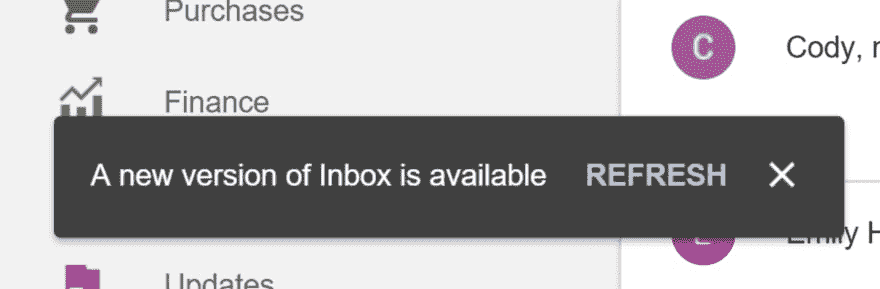
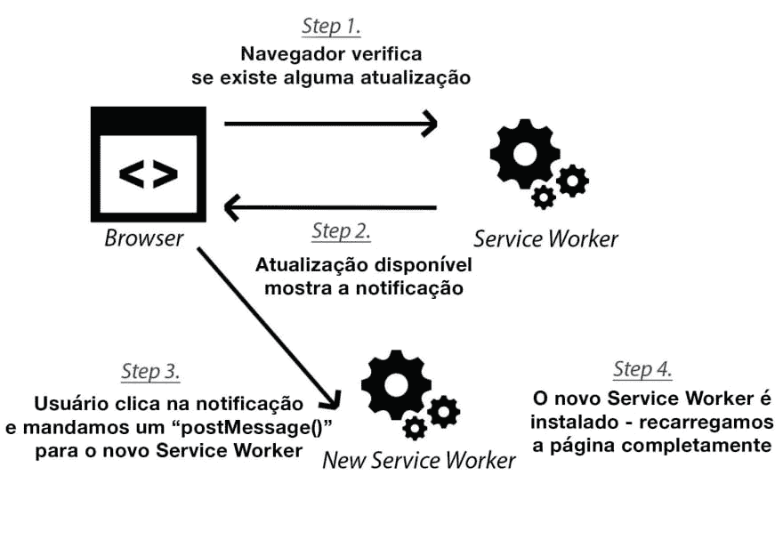
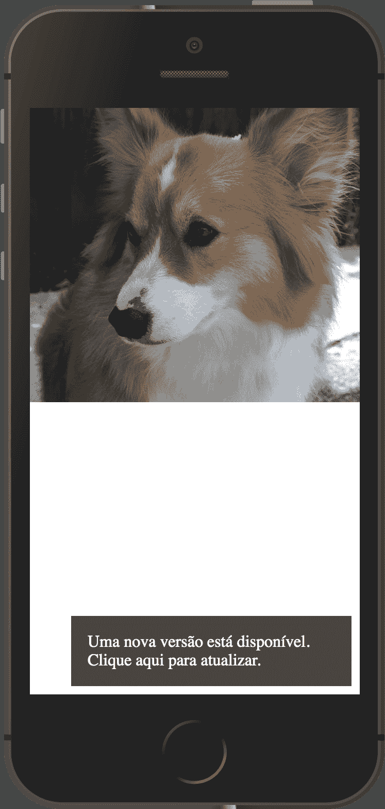
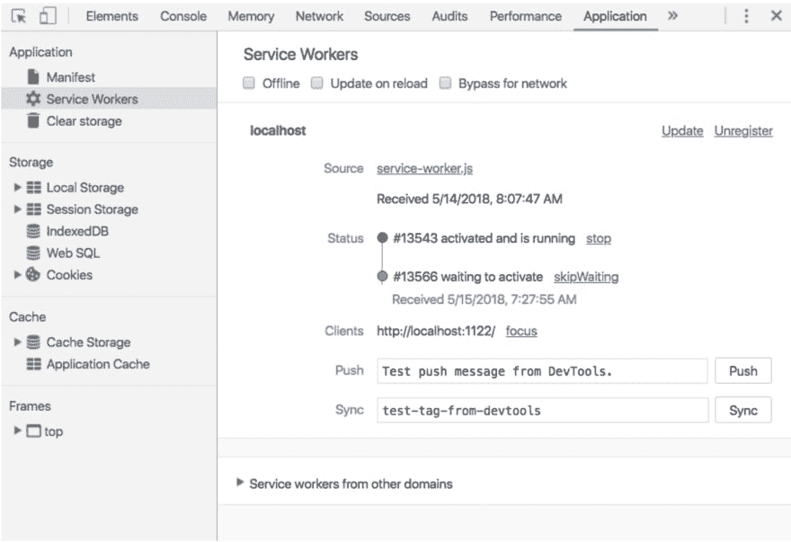
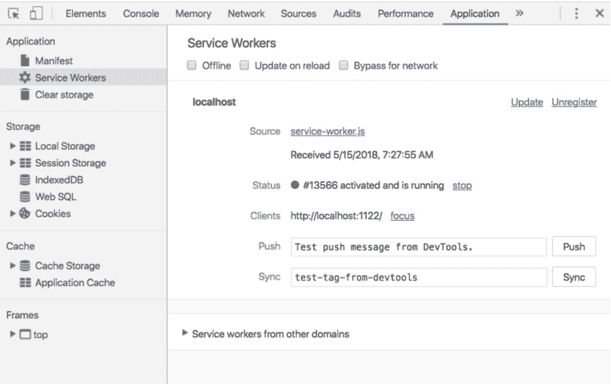

# PWA:创建“有新版本可用”通知

> [https://dev . to/oieduardorebelo/pwa-create-notification-from-one-new-versa-this-level-1945](https://dev.to/oieduardorabelo/pwa-criar-notificacao-de-uma-nova-versao-esta-disponivel-1945)的通知

您是否曾访问过某个站点，并注意到一则通知，指出该站点有新版本可用？最近，我访问了 Google 收件箱，注意到一则通知有点像下图:

[](https://res.cloudinary.com/practicaldev/image/fetch/s--5vsynT9W--/c_limit%2Cf_auto%2Cfl_progressive%2Cq_auto%2Cw_880/https://thepracticaldev.s3.amazonaws.com/i/9scdvn1xprs5k9ftjcns.png)

我已经创建了几个**渐进式 Web 应用程序**，这些程序只是在后台为用户无声地更新服务工作人员，但是，我非常喜欢这种方法—特别是对于计划在离线状态下工作的应用程序**。如果您已经尝试完全创建 web 应用程序**【offline-first】**，您知道在网站更新和用户连接时更改用户缓存会有多困难。在此处，弹出通知(如 Google 收件箱)为用户提供了一种始终拥有最新版本缓存功能的方法。这让我想到怎么才能造出类似的东西，原来比看起来复杂一点，但也不是不可能！**

 **在本文中，我将演示如何向您的站点添加通知，并在您的**服务工作器**有新版本可用时显示通知。您还将学习如何刷新页面，以使用户能够更新到任何缓存文件的最新版本。这篇文章有点长，所以系好安全带，舒服些！

# 项目实例

在此示例中，我将使用一个包含三个资源的非常基本的网页:

*   `index.html`
*   `dog.jpg`
*   `service-worker.js`

```
$ mkdir exemplo-service-worker
$ cd $_
$ touch index.html
$ touch service-worker.js 
```

[下载**dog.jpg**T3】](https://images.dog.ceo/breeds/pembroke/n02113023_14262.jpg)

首先，我的网页 HTML 看起来有点像下面的代码:

```
<!DOCTYPE html>
<html>
  <head>
    <meta charset="UTF-8" />
    PWA - Novo Service Worker disponível
    <meta name="viewport" content="width=device-width, initial-scale=1.0" />
    <style>
      body {
        margin: 0;
      }
      img {
        display: block;
        max-width: 100%;
      }
      #notification {
        background: #444;
        bottom: 8px;
        color: #fff;
        display: none;
        padding: 16px;
        position: absolute;
        right: 8px;
        width: 240px;
      }
      #notification.show {
        display: block;
      }
    </style>
  </head>

  <body>
    
    <!-- A notificação que iremos mostrar -->
    <div id="notification">
      Uma nova versão está disponível. Clique <a id="reload">aqui</a> para
      atualizar.
    </div>
  </body>
  <script>
    if ("serviceWorker" in navigator) {
      navigator.serviceWorker
        .register("./service-worker.js")
        .then(function(registration) {
          // SUCESSO - ServiceWorker Registrado
          console.log(
            "ServiceWorker registrado com sucesso no escopo: ",
            registration.scope
          );
        })
        .catch(function(err) {
          // ERRO - Falha ao registrar o ServiceWorker
          console.log("Falha ao registrar o ServiceWorker: ", err);
        });
    }
  </script>
</html> 
```

在上面的网页上，你可以看到我添加了一个标准的 HTML 代码和一个**服务工作人员**的注册。我们现在就加一点魔法吧！在文件`service-worker.js`中添加以下代码:

```
const cacheName = "firstVersion";

self.addEventListener("install", event => {
  event.waitUntil(
    caches.open(cacheName).then(cache => cache.addAll(["./dog.jpg"]))
  );
});

self.addEventListener("fetch", function(event) {
  event.respondWith(
    caches.match(event.request).then(function(response) {
      if (response) {
        return response;
      }
      return fetch(event.request);
    })
  );
}); 
```

在上面的代码中，我们将基本缓存功能添加到了我们的服务工作人员中。安装后，每当用户请求图像 **dog.jpg** 时，服务工作人员就会从缓存中检索并立即向用户显示。如果您不熟悉上面的代码，我建议您查看一下这篇文章[以了解更多信息](https://developers.google.com/web/ilt/pwa/caching-files-with-service-worker)。它将引导您完成基本原理，并帮助您了解服务工作人员缓存的工作原理。

此时，如果打开网页，它会看起来有点像下图:

[](https://res.cloudinary.com/practicaldev/image/fetch/s--RWwWznVb--/c_limit%2Cf_auto%2Cfl_progressive%2Cq_auto%2Cw_880/https://thepracticaldev.s3.amazonaws.com/i/arpd4c0zqtoi1hcje037.png)

到目前为止一切都很好，但我们有一个网站真的没什么用！为了完成拼图的各个部分，我们需要更新我们的代码，以便在**服务工作者**自身发生变化时通知用户。在我们深入了解之前，让我们来看一下需要发生的基本流:

[](https://res.cloudinary.com/practicaldev/image/fetch/s--w9Hd0ayH--/c_limit%2Cf_auto%2Cfl_progressive%2Cq_auto%2Cw_880/https://thepracticaldev.s3.amazonaws.com/i/fj2q5df03iye3jk2i4zw.jpg)

在上图中，您可以看到在升级产品之前需要执行几个步骤。首先，浏览器会检查 service worker 文件是否已更新。如果有可用的更新，我们会在屏幕上显示通知，否则我们不会做任何事情。当用户单击通知时，我们会向服务工作进程发送一条消息，通知他们跳过等待并成为活动服务工作进程。安装完成后，我们将重新加载页面，并且我们的新服务工作人员处于控制之下！

乌法！终于完成了。🎉😆

虽然看起来可能有些混乱，但在本文的结尾，上面的流会稍微有意义一点。让我们从上面的流中吸取经验教训，并将代码更改应用到我们的网页上。下面我们将对我们的文件
:

```
...
<script>
let newWorker;

// O evento de clique na notificação
document.getElementById("reload").addEventListener("click", function() {
  newWorker.postMessage({ action: "skipWaiting" });
});

if ("serviceWorker" in navigator) {
  navigator.serviceWorker
    .register("./service-worker.js") // [A]
    .then(function(registration) {
      registration.addEventListener("updatefound", () => { // [B]
        // Uma atualização no Service Worker foi encontrada, instalando...
        newWorker = registration.installing; // [C]

        newWorker.addEventListener("statechange", () => {
          // O estado do Service Worker mudou?
          switch (newWorker.state) {
            case "installed": {
              // Existe um novo Service Worker disponível, mostra a notificação
              if (navigator.serviceWorker.controller) {
                let notification = document.getElementById("notification");
                notification.className = "show";
                break;
              }
            }
          }
        });
      });

      // SUCESSO - ServiceWorker Registrado
      console.log(
        "ServiceWorker registrado com sucesso no escopo: ",
        registration.scope
      );
    })
    .catch(function(err) {
      // ERRO - Falha ao registrar o ServiceWorker
      console.log("Falha ao registrar o ServiceWorker: ", err);
    });
}
</script>
... 
```

哇哦！`index.html`页上的代码增长了不少！让我们一步一步地分割它，以便更好地了解流。

注册服务工作人员(**)后，在`.updateFound`(**事件中加入了事件侦听程式。每当属性**服务工作激励时，就会触发此事件。安装**(**)获取新的服务工作人员。这将决定**是否对服务工作人员档案**有任何变更，并在使用者重新载入或返回网页时发生。浏览器有一种验证文件“`service-worker.js`”内容的实用方法，即使只更改了一个字节，也会将其视为新版本。******

 ****如果发现新版本，将触发事件**【b】**。如果触发此事件，我们将需要验证是否已购买新的服务工作人员，并将其分配给新变量(“T3”[c]【T4])，因为我们将在稍后使用该变量。

现在，我们确定有一个新的服务工作进程正在等待安装，我们可以在页面底部显示通知，通知您有一个新版本可用:

[](https://res.cloudinary.com/practicaldev/image/fetch/s--JBWGnoGb--/c_limit%2Cf_auto%2Cfl_progressive%2Cq_auto%2Cw_880/https://thepracticaldev.s3.amazonaws.com/i/ipo2yx4flg9rny5zosg8.png)

如果您记得本文开头的图表，您会记得我们还需要完成步骤 3 和步骤 4，新的服务工作人员才能开始控制页面。对于步骤 3，我们需要在通知中添加功能，以便当用户单击“刷新”时，我们会向我们的服务工作人员发送一个“`.postMessage()`”以跳过等待阶段。请记住，您不能直接与客户的服务工作人员通信，我们需要使用`.postMessage()`方法向其发送消息(无论是`Window`、`Worker`还是`SharedWorker`。在`navigator.serviceWorker`的`"message"`活动中收到消息。

service-worker.js 文件中的代码必须更新以响应消息事件:

```
self.addEventListener("message", function(event) {
  if (event.data.action === "skipWaiting") {
    self.skipWaiting();
  }
}); 
```

我们快到了！在我们的第四步也是最后一步，我们需要我们的网页重新加载和激活新的服务工作人员。为此，我们需要刷新页面`index.html`并在事件`controllerchange`触发后重新加载页面:

```
...
<script>
...
let refreshing;

// Esse evento será chamado quando o Service Worker for atualizado
// Aqui estamos recarregando a página
navigator.serviceWorker.addEventListener("controllerchange", function() {
  if (refreshing) {
    return;
  }
  window.location.reload();
  refreshing = true;
});
</script>
... 
```

就是这样！现在你有了一个全功能的例子！👏😎

# O Resultado

要在操作中测试这一点，请在本地主机上启动项目，然后导航到“`index.html`”页面。使用 Google Chrome 和 DevTools，测试我们的服务工作人员非常容易。打开 DevTools，我们可以转到“**应用程序”(**application)选项卡，并选择菜单选项“**服务工作人员”**，您应该注意到我们的服务工作人员已安装在当前页面上。

这是我们期望的结果，服务工作人员已安装并控制页面。每次刷新页面时，我们都会从缓存中检索狗的图像，而不是从网络中检索。

为了模拟对我们服务工作人员的更新，我将对文件`service-worker.js` :

```
const cacheName = "secondVersion"; 
```

在上面的代码中，我只是将缓存名称更新为“`secondVersion`”。这个小小的改动将使浏览器知道我们有了一个新的‘t1’【rock and roll】的服务工作人员。重新整理页面时，您会看到有更新版本可用的通知。使用 chrome devtools，我可以看到新的服务工作人员正在等待激活；请注意，**status**部分现在有两个版本，每个版本具有不同的状态:

[](https://res.cloudinary.com/practicaldev/image/fetch/s--TH2Q7KIY--/c_limit%2Cf_auto%2Cfl_progressive%2Cq_auto%2Cw_880/https://thepracticaldev.s3.amazonaws.com/i/5drb6ta7sdz2iffgx7as.png)

如果单击我们网页上通知栏中的更新链接，将安装新的服务工作器并控制该页面。您可以在 DevTools 中检查这一点，然后转到指南 **Application** 。您可能会注意到新的服务工作器已安装并正在控制页面。从下图中可以看出，在**状态**部分中的版本号:

[](https://res.cloudinary.com/practicaldev/image/fetch/s--IP_V7QW5--/c_limit%2Cf_auto%2Cfl_progressive%2Cq_auto%2Cw_880/https://thepracticaldev.s3.amazonaws.com/i/w3vuulv99a2kppdbldwd.png)

# 结论

使用这样的技术(显示通知)是一种很好的方法，可以确保您的‘t0’渐进式 Web 应用程序、‘t1’级 web 应用程序保持最新，并具有所有缓存的魔力，同时保持服务工作人员的最新版本！

如果您要查看此示例的完整代码，请转到位于“[github . com/deanhumi/pwa-update-available”](https://github.com/deanhume/pwa-update-available)的存储库。

我不得不承认，我花了一段时间才弄清楚这一切，如果没有下面的文章，我是不可能做到这一点的。如果你想了解更多，我推荐阅读:

*   [Ciclo de vida do 服务人员](https://developers.google.com/web/fundamentals/primers/service-workers/lifecycle#skip_waiting)
*   [pwa 更新通知](https://medium.com/progressive-web-apps/pwa-create-a-new-update-available-notification-using-service-workers-18be9168d717)
*   [堆栈溢出](https://stackoverflow.com/questions/40100922/activate-updated-service-worker-on-refresh)

# [t1【学分】](#cr%C3%A9ditos-%EF%B8%8F)

*   [如何为一个进步的网络应用](https://deanhume.com/displaying-a-new-version-available-progressive-web-app/)显示一个“可用的新版本”，escrito origination e por[Dean Hume](https://deanhume.com/about/)******