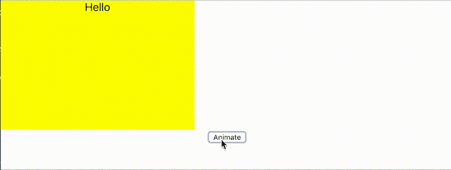

# 样式组件+反应转换组=非常简单的转换

> 原文：<https://dev.to/terrierscript/styled-component--react-transition-group--very-simple-transition-jja>

如果我们需要动画 react 组件，我们可以使用像 [react-pose](https://popmotion.io/pose/) 或 [react-spring](https://www.react-spring.io/) 这样的库。那些库很酷，但是如果我们只需要很小的过渡，就显得太重了。

另一方面， [react-transition-group](https://github.com/reactjs/react-transition-group) 就是这么简单。

如果我们用`styled-componets`，`<Transition>`的分量可能比`<CSSTransition>`好

# 举例

首先，我创建转换包装的组件。在这个例子中，我使用了 React 钩子，但是如果你需要的话，你也可以使用类组件。

```
import { Transition } from "react-transition-group"
import { Animation } from "./Animation"

export const AnimateItem = () => {
  const [animate, setAnimate] = useState(false)

  // Animate on click button and revert after 3000ms.
  const doAnimate = useCallback(() => {
    setAnimate(true)
    setTimeout(() => {
      setAnimate(false)
    }, 3000)
  }, [])

  return (
    <div>
      {/* Transition change state with `in` props */}
      <Transition in={animate} timeout={500}>
        {(state) => (
          // state change: exited -> entering -> entered -> exiting -> exited
          <Animation state={state}>Hello</Animation>
        )}
      </Transition>
      <button onClick={doAnimate}>Animate</button>
    </div>
  )
} 
```

接下来，创建基于样式化组件的组件。

```
// Animation.js
import styled from "styled-components"

export const Animation = styled.div`
  transition: 0.5s;
  width: 300px;
  height: 200px;
  /* example for move item */
  transform: translateX( ${({ state }) => (state === "entering" || state === "entered" ? 400 : 0)}px
  );
  /* change color*/
  background: ${({ state }) => {
    switch (state) {
      case "entering":
        return "red"
      case "entered":
        return "blue"
      case "exiting":
        return "green"
      case "exited":
        return "yellow"
    }
  }};
` 
```

你也可以把`Item`和`Animation`分开。

```
const BaseItem = styled.div`
  width: 300px;
  height: 200px;
`

export const Animation = styled(BaseItem)`
  transition: 0.5s;
  transform: translateX( ${({ state }) => (state === "entering" || state === "entered" ? 400 : 0)}px
  );
` 
```

# 预览

[](https://res.cloudinary.com/practicaldev/image/fetch/s--TgYDwbnd--/c_limit%2Cf_auto%2Cfl_progressive%2Cq_66%2Cw_880/https://thepracticaldev.s3.amazonaws.com/i/g6wm4fpwsvenaj24euji.gif)

# 淡化举例

你可以用同样的方法创建渐强/渐弱动画。

```
export const Fade = styled.div`
  transition: 0.5s;
  opacity: ${({ state }) => (state === "entered" ? 1 : 0)};
  display: ${({ state }) => (state === "exited" ? "none" : "block")};
` 
```

也可以和`unmountOnExit`和`mountOnEnter`一起用。

```
 export const Fade2 = styled.div`
  transition: 5s;
  opacity: ${({ state }) => (state === "entered" ? 1 : 0)};
`

const Item = () => {
  // ...
  return <Transition in={animate} timeout={500} unmountOnExit mountOnEnter>
    {(state) => <Fade2 state={state}>Fade In</Fade2>}
  </Transition>
} 
```