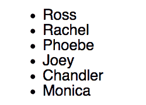
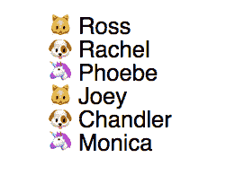
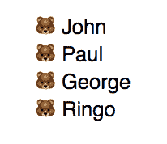
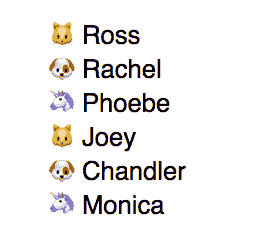

# 用表情符号设计列表项目符号

> 原文：<https://dev.to/clairecodes/styling-list-bullets-with-emoji-1733>

HTML 无序列表`<ul>`的可用项目符号样式是有限的。使用 CSS，它们可以变成更令人兴奋的东西，比如表情符号！🎉👯‍♂️✨

在这篇文章中，我将向您展示两种替换它们的方法:`@counter-style`，它简洁而灵活(但您的浏览器可能不支持它)，以及使用`::before`伪元素的更久经考验的技术。

我们将转换一个带有非样式计数器的无序列表，如下所示:

[](https://res.cloudinary.com/practicaldev/image/fetch/s--aNi349-q--/c_limit%2Cf_auto%2Cfl_progressive%2Cq_auto%2Cw_880/https://thepracticaldev.s3.amazonaws.com/i/bx1tggf4d6k3c1ls4jtx.png)

对此:

[](https://res.cloudinary.com/practicaldev/image/fetch/s--T2ra1rs---/c_limit%2Cf_auto%2Cfl_progressive%2Cq_auto%2Cw_880/https://thepracticaldev.s3.amazonaws.com/i/clc8rolsp30bi86ahkdd.png)

**注意**:为了保持简短，下面的代码示例是用 Sass 编写的，以利用嵌套。

## 方法一:`@counter-style` at-rule

CSS [at-rules](https://developer.mozilla.org/en-US/docs/Web/CSS/At-rule) 是指导 CSS 如何行为的语句，例如`@import`、`@font-face`或`@media`。

提出 [`@counter-style` at-rule](https://developer.mozilla.org/en-US/docs/Web/CSS/@counter-style) 是为了给 HTML 列表中现有的一组项目符号样式提供更多的选项和功能。

[`@counter-style`是第三级提案](https://drafts.csswg.org/css-counter-styles-3/)，处于候选推荐阶段，这意味着该规范足够稳定，可以被浏览器实现。然而，截至 2019 年 4 月，它仅受 Firefox 支持([可以使用`@counter-style`](https://caniuse.com/#feat=css-at-counter-style) 的统计数据)。本文中的示例输出以图像形式提供，尽管所有示例的代码都可以在页面底部的[代码栏中找到。](#codepen)

### 反式规则示例

要使用计数器样式，编写一个规则，然后将 is 声明为一个`<ul>`或`<ol>`标签上的 [`list-style-type` CSS 属性](https://developer.mozilla.org/en-US/docs/Web/CSS/list-style-type)的值。计数器样式规则的语法有几个可选的描述符，如 [MDN 文档页面](https://developer.mozilla.org/en-US/docs/Web/CSS/@counter-style#Syntax)中所列。MDN 还提供了不同计数器样式变体的[交互式演示](https://mdn.github.io/css-examples/counter-style-demo/)(最好在 Firefox 等受支持的浏览器中查看)。

为了用表情符号替换要点，我们需要给“系统”、“符号”和“后缀”描述符提供选项。选择“循环”系统，并提供所需表情符号的 unicode 代码点。请注意，您需要使用 unicode 码位来表示表情符号，而不仅仅是字符，例如“1F431”而不是🐱。在 unicode 网站上找到完整的列表[。将“后缀”设置为“”意味着计数器后面不会出现像句点这样的其他字符。](https://unicode.org/emoji/charts/full-emoji-list.html)

“符号”描述符可以接受一组用空格分隔的符号。结合“循环”系统选项，这意味着我们的最终项目符号设计将在所有提供的符号中循环。

```
@counter-style repeating-emoji {
  system: cyclic;
  symbols: "\1F431" "\1F436" "\1F984"; // unicode code point
  suffix: " ";
}

// Add this class to the ul or ol element
.repeating-counter-rule {
  list-style-type: repeating-emoji;
} 
```

Enter fullscreen mode Exit fullscreen mode

[](https://res.cloudinary.com/practicaldev/image/fetch/s--T2ra1rs---/c_limit%2Cf_auto%2Cfl_progressive%2Cq_auto%2Cw_880/https://thepracticaldev.s3.amazonaws.com/i/clc8rolsp30bi86ahkdd.png)

## 方法二:`::before`伪元素

这种方法可以用来取代图像标准光盘，而不仅仅是表情符号。缺点是它没有提供`@counter-style`的灵活性。

首先在父列表元素`<ul>`或`<ol>`上设置`list-style: none`，然后调整列表项元素`<li>`的填充和边距。用于项目符号的图标是使用`::before`伪元素添加的。

要用相同的表情符号替换默认的光盘，可以使用下面的代码，其中将`single-before`类添加到`<ul>`元素:

```
.single-before {
  list-style: none;
  padding: 0;
  margin: 0;

  li {
    padding-left: 1rem;
    text-indent: -0.7rem;
  }

  li::before {
    content: "🐻 ";
  }
} 
```

Enter fullscreen mode Exit fullscreen mode

[](https://res.cloudinary.com/practicaldev/image/fetch/s--AVGCNCsZ--/c_limit%2Cf_auto%2Cfl_progressive%2Cq_auto%2Cw_880/https://thepracticaldev.s3.amazonaws.com/i/9appmtgfo9shk5zxfetf.png)

为了从上面的计数器样式示例中复制三个表情符号的重复模式，我们需要使用`:nth-child`伪类。例如，将下面的`.repeating-before`类添加到一个`<ul>` :

```
.repeating-before {
  list-style: none;
  padding: 0;
  margin: 0;

  li {
    padding-left: 1rem;
    text-indent: -0.7rem;
  }

  li:nth-child(3n+1)::before {
    content: "🐱 ";
  }

  li:nth-child(3n+2)::before {
    content: "🐶 ";
  }

  li:nth-child(3n)::before {
    content: "🦄 ";
  }
} 
```

Enter fullscreen mode Exit fullscreen mode

[](https://res.cloudinary.com/practicaldev/image/fetch/s--cUhDPrmd--/c_limit%2Cf_auto%2Cfl_progressive%2Cq_auto%2Cw_880/https://thepracticaldev.s3.amazonaws.com/i/7zk5ozn4ko4n24cfcirm.png)

虽然最初很简单，但根据要实现的表情符号的模式，这种方法可能会变得更加复杂。然而，这种技术有一个好处，那就是跨浏览器的良好支持。

## 结论

在样式化列表计数器时，`@counter-style` at-rule 提供了很大的灵活性，但是它有限的浏览器支持使它不适合大多数生产站点。使用伪元素是可靠的，但是对于更复杂的布局来说很麻烦。然而，如果列表项目符号的样式是一个可选的设计特征，而不是页面设计的一个关键部分，那么考虑将`@counter-style`与 [`@supports` at-rule](https://developer.mozilla.org/en-US/docs/Web/CSS/@supports) 结合起来，并提供一个可接受的后备设计，也许使用伪元素。

## 表情符号要点码笔示例

[https://codepen.io/clairecodes/embed/moNmXp?height=600&default-tab=result&embed-version=2](https://codepen.io/clairecodes/embed/moNmXp?height=600&default-tab=result&embed-version=2)