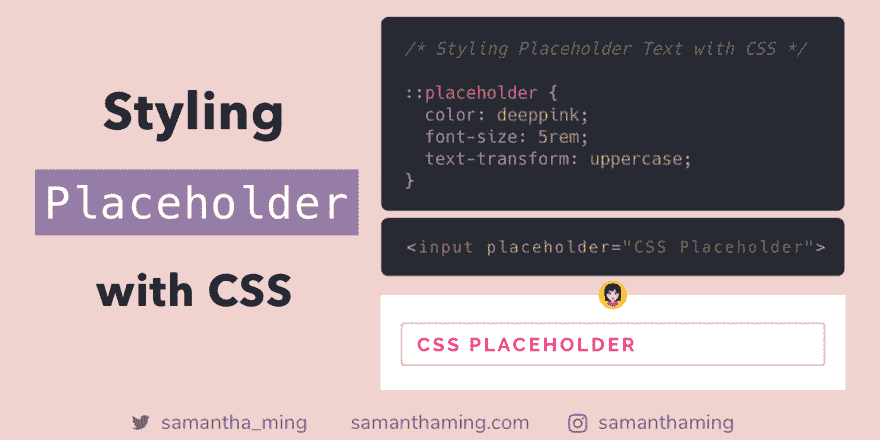

# 用 CSS 样式化占位符文本

> 原文：<https://dev.to/samanthaming/styling-placeholder-text-with-css-2he0>

[](https://res.cloudinary.com/practicaldev/image/fetch/s--K8nG9idH--/c_limit%2Cf_auto%2Cfl_progressive%2Cq_auto%2Cw_880/https://thepracticaldev.s3.amazonaws.com/i/tw4xmdref245fm9q79k5.png)

使用`::placeholder`伪元素为`<input>`或`<textarea>`表单元素中的占位符文本设置样式。大多数现代浏览器都支持这一点，但对于较老的浏览器，将需要供应商前缀。

```
::placeholder { 
  color: deeppink;
  font-size: 5rem;
  text-transform: uppercase;
} 
```

HTML

```
<input placeholder="CSS Placeholder"> 
```

* * *

## 厂商前缀

所以我使用的语法是大多数现代浏览器都支持的:

```
/* MODERN BROWSER */
::placeholder { 
  color: deeppink;
} 
```

但是对于一些浏览器或旧的浏览器，您需要使用供应商前缀。

```
/* WebKit, Edge */
::-webkit-input-placeholder {
  color: deeppink;
}
/* Firefox 4-18 */
:-moz-placeholder { 
  color: deeppink;
  opacity: 1;
}
/* Firefox 19+ */
::-moz-placeholder { 
  color: deeppink;
  opacity: 1;
}
/* IE 10-11 */
:-ms-input-placeholder { 
  color: deeppink;
}
/* Edge */
::-ms-input-placeholder { 
  color: deeppink;
}
/* MODERN BROWSER */
::placeholder { 
  color: deeppink;
} 
```

哇哦。我知道，这是一个很大的名单。您可能会注意到许多不同的实现方式。所以让我们来分解这些差异，了解这里发生了什么。

### 伪元素 vs 伪类

你可能注意到我使用了一个双冒号`::`。这被称为伪元素，它是在 CSS3 中引入的。如果我们使用单个冒号`:`，这将被称为伪类。

因为伪元素`::`是在 CSS3 中引入的，而不是在早期的 CSS 版本中引入的，所以一些较老的浏览器如 Internet Explorer 根本不支持它。而伪类`:`在前面已经介绍过了(在 CSS1 和 CSS2 中)。这就是为什么越来越多的浏览器，包括 Internet Explorer 支持它。

因此，在我们的`::placeholder`厂商前缀中，您将混合使用伪类和伪元素。

### Firefox 占位符默认不透明度

好吧，Firefox 的`opacity: 1`是怎么回事？这是因为，默认情况下，Firefox 的占位符应用了不透明度值。所以要覆盖它，我们需要设置它。这样，我们的占位符文本将会显示出来，而不会从默认的 Firefox 设置中淡出。

```
opacity: 1; 
```

### CSS 处理无效选择器

所以你可能会想，为什么我们不像这样把所有的厂商前缀组合在一起:

```
::-moz-placeholder, /* Firefox 19+ */
:-moz-placeholder /* Firefox 4-18 */
{ 
  color: deeppink;
  opacity: 1;
} 
```

这是因为 CSS3 中有一条规则规定:

> 包含无效选择器的选择器组是无效的。

让我们看一个例子，看看这是什么意思。这里有一个有效的 CSS 选择器

```
h1 {
  color: blue;
} 
```

所以在我们的 HTML 中，这将如预期的那样出现

```
<h1>Hello</h1> 
<!-- This text will have a blue color--> 
```

但是如果我们添加一个无效的 CSS 选择器
会发生什么呢

```
h1, /* valid */
h2::poop /* invalid */
{
  color: blue;
} 
```

因为组中有一个无效的 CSS 选择器。整个组将被视为无效，并且不会应用任何样式。

```
<h1>Hello</h1> 
<!-- No blue color will be applied --> 
```

这就是为什么我们需要为每个浏览器制定不同的规则。否则，整个组将被所有浏览器忽略。

⭐️ **但是！**看起来这可能会在 CSS4 中改变。

> 通常，如果在一个选择器链或一组选择器中有一个无效的伪元素或伪类，那么整个选择器列表都是无效的。如果一个伪元素(而不是伪类)有一个-webkit-前缀，从 Firefox 63 开始，Blink、webkit 和 Gecko 浏览器会假设它是有效的，不会使选择器列表无效。

请阅读 Chris Coyier 的文章[“一个无效的伪选择器等于整个被忽略的选择器”](https://css-tricks.com/one-invalid-pseudo-selector-equals-an-entire-ignored-selector/)

## 支持的样式

以下是您可以应用到占位符文本的所有样式的列表:

*   `background`属性
*   `color`
*   `font`属性
*   `letter-spacing`
*   `line-height`
*   `opacity`
*   `text-decoration`
*   `text-indent`
*   `text-transform`
*   `vertical-align`
*   `word-spacing`

```
::placeholder { 
  /* styles */
} 
```

## 无障碍关注

能够设计占位符的样式真是太棒了。但是我需要指出非常重要的一点——占位符文本并不能代替标签元素，`<label>`！！当我第一次涉足 web 编程时，我对此感到内疚🙁。当你的表单完全依赖于没有标签的占位符说明时，这对可访问性是非常有害的。可访问性不仅对让每个人都能访问你的网站很重要，而且对创造更好的用户体验也很有帮助。最终创建一个更好的网站或网络应用💪

这里有一篇非常棒的文章,关于只使用占位符而不使用任何标签的问题。以下是最重要的 3 点:

1.  因为占位符文本正在消失，它会影响用户的短期记忆
2.  如果没有标签，用户就无法在提交表单之前检查他们的工作。
3.  当错误信息出现时，人们不知道如何解决问题。

## 自动添加厂商前缀

如果你不想处理所有的厂商前缀，你可以使用 [PostCSS](https://github.com/postcss/postcss) 和 [Autoprefixer](https://github.com/postcss/autoprefixer) 插件。这个插件将解析你的 CSS 并添加厂商前缀。

* * *

## 资源

*   [MDN Web 文档:占位符](https://developer.mozilla.org/en-US/docs/Web/CSS/::placeholder)
*   [w3schools:占位符](https://www.w3schools.com/howto/howto_css_placeholder.asp)
*   CSS-Tricks:占位符
*   [CSS-Tricks:一个无效的伪选择器等于整个被忽略的选择器](https://css-tricks.com/one-invalid-pseudo-selector-equals-an-entire-ignored-selector/)
*   [堆栈溢出:用 CSS 改变 HTML5 输入的占位符颜色](https://stackoverflow.com/questions/2610497/change-an-html5-inputs-placeholder-color-with-css)
*   [表单域中的占位符有害](https://www.nngroup.com/articles/form-design-placeholders/)

* * *

**感谢阅读❤**
问好！[insta gram](https://www.instagram.com/samanthaming/)|[Twitter](https://twitter.com/samantha_ming)|[脸书](https://www.facebook.com/hisamanthaming) | [媒体](https://medium.com/@samanthaming) | [博客](https://www.samanthaming.com/blog)