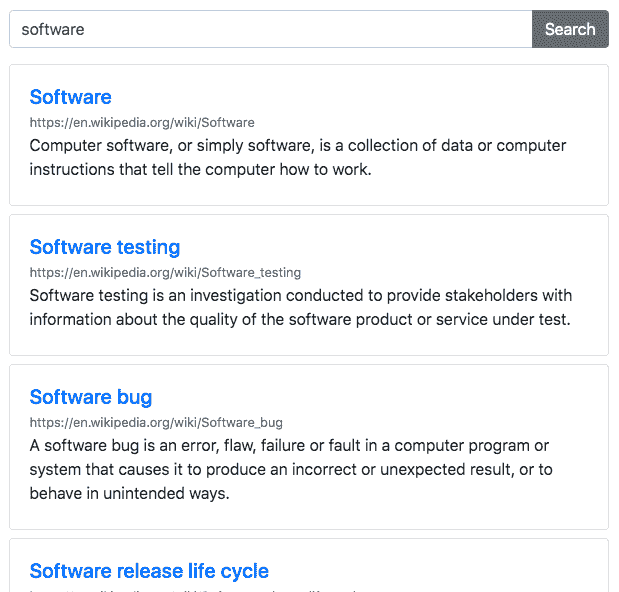

# 微妙的缩放，维基百科搜索，预加载图像|模块星期一 36

> 原文：<https://dev.to/tyrw/subtle-zoom-wikipedia-search-pre-load-images-module-monday-36-69n>

## 你可以在任何地方使用的开源网络模块

下面所有的 mod 都是开源的，可以在你选择的任何项目中免费使用。Anymod 可让您快速向任何网站或网络应用添加功能。

单击一个 mod 来查看它的运行及其源代码。

## 维基百科搜索

用于从任何页面搜索维基百科 API 的模块。
[查看 mod](https://anymod.com/mod/bamlln)
  

## 细微缩放图库

受 Katherine Kato 的启发，可在任何地方添加美丽、响应迅速的画廊。
[查看 mod](https://anymod.com/mod/bamlrn?v=20)
  

## 预加载图像

添加要在流程中的下一页之前预加载的图像 URL。
[查看 mod](https://anymod.com/mod/dkrnlk/readme)
  

## Sidenav menu

可靠的快速链接侧导航。
[查看 mod](https://anymod.com/mod/aladob)
  

## 简单页脚

一个彩色的基本页脚。
[查看 mod](https://anymod.com/mod/dkrnok)
  

* * *

我每周一都会在这里发布新的模块，希望你会觉得有用！

快乐编码✌️