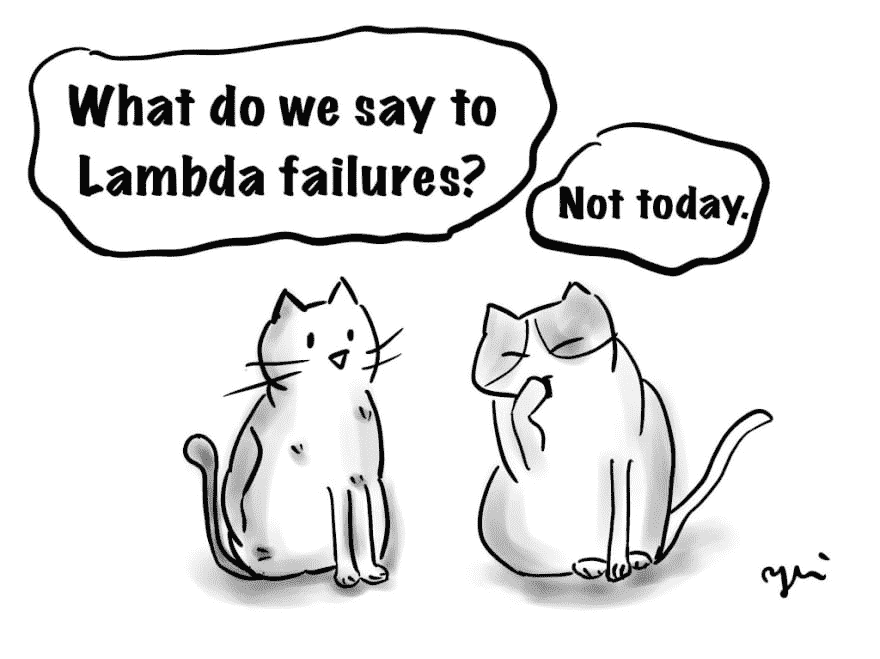
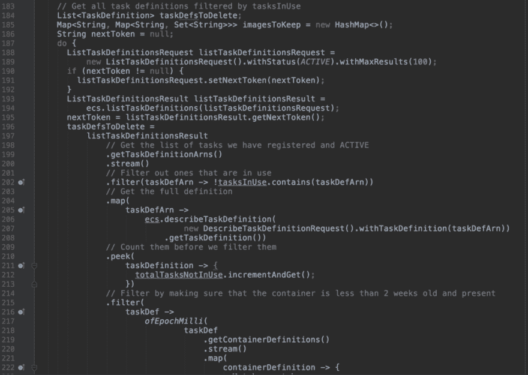
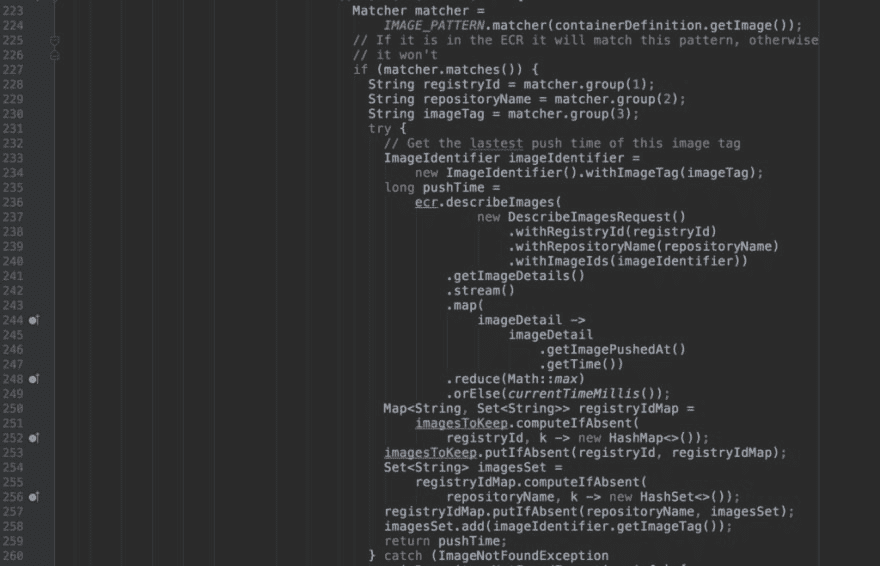
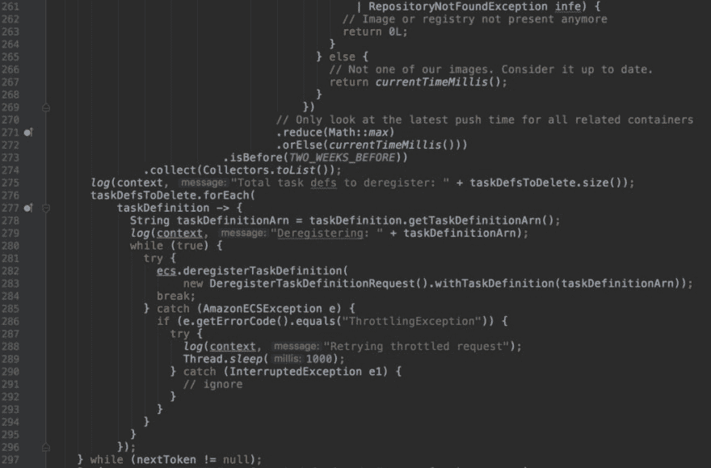
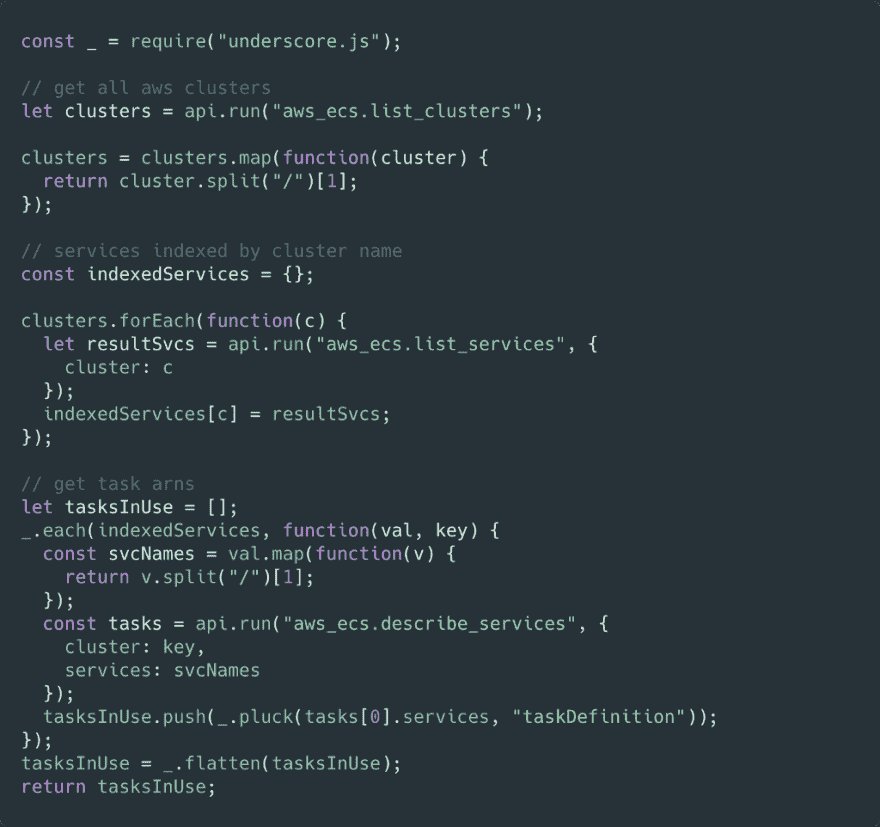
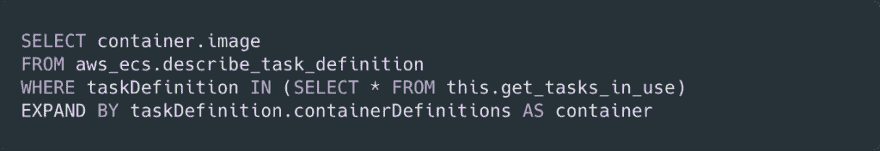
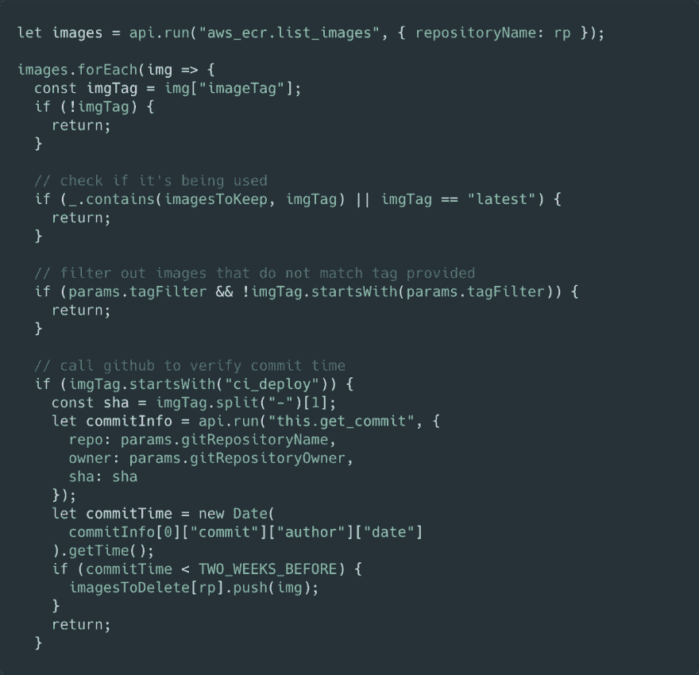
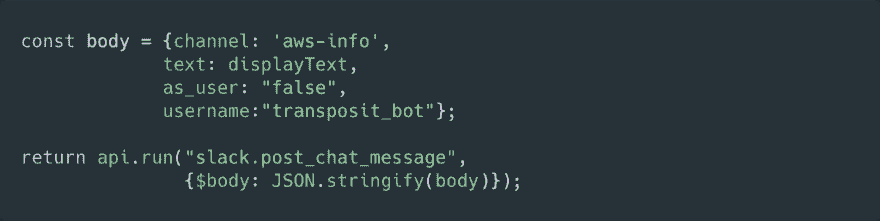
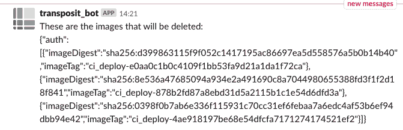

# AWS 基础设施缺口的强力胶——使用 SQL 和 Javascript 的自动化脚本

> 原文：<https://dev.to/transposit/superglue-for-gaps-in-your-aws-infrastructure-automation-scripts-using-sql-and-javascript-5fjd>

作者:李阳子

### AWS 基础设施缺口的强力胶——使用 SQL 和 Javascript 的自动化脚本

#### 简介

我是 AWS 的忠实粉丝，但我希望在 AWS 系统内部，以及 AWS 与 Slack 和 GitHub 等服务之间有更多的“粘合剂”。我正在寻找的这种粘合剂的一个例子:一种定义更复杂的生命周期策略的机制，在这里我可以编写一些代码来控制我想在 AWS 上删除的资源。

为了解决这个问题，我们构建了一个 Transposit 应用程序，它清除 ECR 和 ECS 上未使用的资源，然后将结果发布到 Slack 上，这样整个团队都会得到通知。这使我们能够抛弃之前构建的难以调试和迭代的 lambda 函数。

在开始之前，先介绍一下背景。我们的部署是这样工作的:在我们部署到测试环境的每一次构建成功时，在幕后会发生以下事情:

*   基于最新代码构建新的映像，并将该映像放入 ECR 中
*   在 ECS 中创建一个新任务，并告诉该任务使用我们刚刚创建的映像

这个系统的问题是，因为每个构建都创建 ECR 映像和 ECS 任务，并且 ECR 和 ECS 都提供有限的存储量，所以我们最终需要清理旧的资源，这样我们的构建就不会因为空间不足而失败。

#### 旧世界与λ

为了清理旧的任务和图像，我们早期的解决方案是编写一个 lambda 函数。lambda 函数允许我们使用自定义逻辑来检查 ECS 任务当前正在使用什么，并删除不使用的图像和任务。当函数在我们不知道的情况下失败时，问题就出现了；我们没有内置主动通知，所以没有意识到它失败了。这导致未使用的资源堆积起来，有一天，导致我们的构建失败。构建一直失败，直到我们在 ECR 中释放一些空间。

它不仅失败了，而且实际上没有做到我们想要的一切:它没有考虑到我们的 ECR 存储库的帐户间依赖性，并且删除了比它应该删除的更多的图像。此外，根据上面的失败，如果有通知就好了！

在我们的 lambda 中，判断哪些图像正在使用的代码很复杂。它需要使用分页标记来获取 ECS 任务的完整列表，遍历这些任务，并找出哪些任务和映像是旧的，当前没有使用。不得不手动进行分页并查找如何使用每个 AWS API 是一件痛苦的事情。我不会用它如何工作的细节来烦你，但是如果你想看所有的代码，你可以点击屏幕截图。

我们没有在这个复杂的 lambda 函数上投入更多，而是在 Transposit 应用程序中重建了这个功能。基于我们在 lambda 上的构建经验，我们使用 SQL 和 Javascript on Transposit 构建了一个名为 **cleanup_task** 的应用。

#### 新世界与换位

为了确保我们不会删除任何正在使用的图像，我们必须首先找出哪些图像当前正在被使用。以下是我如何在 Transposit 中构建它的:

下面的代码通过遍历集群中的所有活动服务并查看任务定义来获取当前正在使用的所有 ECS 任务。

然后我们可以使用上面的操作(我们称之为 **get_tasks_in_use** )来获取那些 ECS 任务所附加的图像。

一旦我们有了想要保留的所有图像，我们就遍历 ECR 存储库中的所有图像，并删除那些旧的和不再使用的图像。我们调用 GitHub 来验证映像提交时间，因为每个映像都是通过一次提交构建的:

#### 得到通知！

我前面提到过，在这个项目的基础上构建 Slack notification 会很有帮助，它会在 Slack 频道上发布关于 AWS 资源已经做了什么的消息。试图将它构建到 lambda 函数中是一件困难的事情:我需要从头开始设置 OAuth，并弄清楚如何使用 Slack APIs。有了 Transposit，我可以用很少的代码来构建它:

输出有点原始，但它告诉了我需要知道的东西。当它失败时，它也告诉我。

对于我们的老 lambda，我会担心我们的构建是否会失败而失眠。我会痴迷地查看 Cloudwatch 日志，以确保一切正常。新的 Transposit 版本更容易理解，更容易编写，更容易扩展，并在事情失败时告诉我。我仍然获得了使用计划任务来运行它的好处，并且不需要担心底层基础设施。我现在有信心，如果某件事失败了，我能够在它变成问题之前解决它。每一项新功能——Slack 通知、GitHub 集成、通过 AWS Dynamo 的事件排队——添加起来都变得更快了。

如果你想看看它是如何工作的，并在你自己的基础设施上进行测试，你可以在这里获得这个应用的完整版本。我们还做了一个清除存储在 S3 的对象的示例应用程序，你可以在这里找到。

对于需要将 AWS 基础设施结合在一起的下一个粘合剂，请尝试 Transposit。

在这里注册换位

* * *