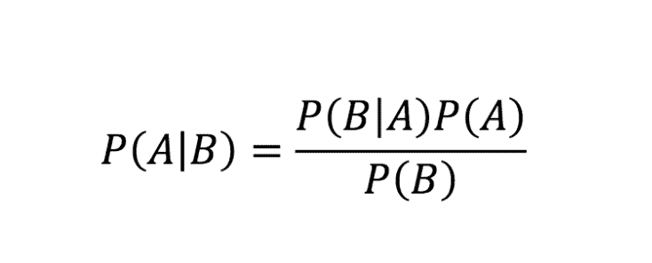
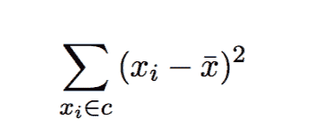
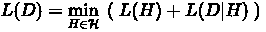

# 监督学习:贝叶斯学习

> 原文：<https://dev.to/swyx/supervised-learning-bayesian-learning-403l>

*这是我学习[佐治亚理工学院/优达城机器学习课程](https://www.udacity.com/course/machine-learning--ud262)的一系列课堂笔记中的第十篇。课堂教材是汤姆·米切尔的[机器学习。](https://www.cs.ubbcluj.ro/~gabis/ml/ml-books/McGrawHill%20-%20Machine%20Learning%20-Tom%20Mitchell.pdf)*

> 这一章没有 VC 维度那么理论化，但仍然更侧重于我们在监督学习中所做事情的理论基础。

## 核心问题

我们一直在努力做的是:在给定一些数据和领域知识的情况下，尽可能学习最好的假设。

我们将从假设空间中提炼出“最佳”的概念是“最有可能”的假设。

## 贝叶斯法则

我假设你知道这个([更多信息](https://en.wikipedia.org/wiki/Bayes%27_theorem)，精彩的[反直觉应用在这里](https://www.youtube.com/watch?v=77jH-M2StRM)):

应用于 ML:

*   a 是我们的假设
*   b 是我们的数据
*   我们假设给定的数据是`P(A|B)`，我们想要最大化的数据
*   我们的数据采样是`P(B)`
*   我们的先验领域知识由`P(A)`表示
*   我们的更新(算法的运行)是`P(B|A)`，也考虑到了准确性

由于`P(B)`在假设中是常数，我们只关心最大化`P(A|B)`，我们可以有效地忽略它。

到目前为止，我们已经有了很多表示领域知识的方法——SVM 核，选择使用 kNN(越接近越相似)——`P(A)`是这种方法的更一般的形式。

**最大似然**:事实上，如果我们进一步假设我们没有先验知识(也就是假设`P(A)`是均匀分布的)，那么`P(A)`实际上可以被忽略。这意味着如果我们没有强先验，最大化`P(A|B)`(给定数据时我们最可能的假设)与最大化`P(B|A)`(给定假设时我们看到的最可能的数据标签)是一样的。这是基于数据进行预测的哲学依据，但是正如你所看到的，即使一点点领域知识也会极大地扭曲/改进我们的结论。

然而，像这样迭代所有假设并机械地更新先验是不切实际的。我们对贝叶斯的目标更多的是对我们可以利用的杠杆的直觉，而不是实际适用的公式。

## 贝叶斯和版本空间的关系

**无噪声** : [这个证明](https://www.youtube.com/watch?v=ycjPR-C07yM)太平凡了，写不出来，但基本上没有先验，给定数据(`P(h|D)`)的任何特定假设的概率恰好等于`1/|VS|` (VS 代表版本空间)，这是不言而喻的。也就是说，如果所有的假设都同样有可能为真，那么任何一个假设为真的概率是 1 /假设的数量。不是很令人兴奋的东西，但它来自贝叶斯。

**带噪声**:如果我们假设噪声具有正态分布，那么我们使用[这个证明](https://www.youtube.com/watch?v=F1wRTC9vcDU)来得出平方和最佳拟合公式:

## 最小描述目标

通过添加对数(一个单调函数，因此它不会改变最终结果)，我们可以将上面定义的最大化目标转换、分解和翻转为具有权衡的最小化目标:

这里`L`代表长度，例如决策树的长度，表示模型/假设的复杂程度。`L(h)`是我们选择的模型的复杂度，而`L(D|h)`是不符合我们选择的模型的数据，也就是误差。我们想要最小化这个总的“描述长度”，也就是寻求最小描述长度[。这是](https://en.wikipedia.org/wiki/Minimum_description_length)[奥卡姆剃刀](https://en.wikipedia.org/wiki/Occam%27s_razor)的一个非常好的数学表达式，但过于简化会受到惩罚。

应用这一点有实际问题，例如，误差与模型复杂性的单位可比性，但是您可以决定一个规则来权衡它们。

## 大误导

尽管我们在这里和前面的章节中已经列出了所有的东西，但是我们并不真的关心找到一个最好的或者最有可能的假设。我们关心的是找到最有可能的**标签**。一个正确的假设将帮助我们每次都到达那里，当然，但是如果我们的版本空间中的每个剩余的假设都指向一个特定的标签，那么那就是我们实际上想要的那个。

因此，贝叶斯学习仅仅是通向贝叶斯分类的垫脚石，并且构建[贝叶斯最优分类器](https://svivek.com/teaching/machine-learning/fall2018/slides/prob-learning/bayes-optimal-classifier.pdf)。

我们将在下一章贝叶斯推理中探讨这一点。

## 我们系列的下一个

关于此主题的更多说明:

*   [关于贝叶斯学习的详细介绍](https://wso2.com/blog/research/part-one-introduction-to-bayesian-learning)
*   [应用于神经网络，又名贝叶斯网络](http://www.cs.cmu.edu/afs/cs/project/theo-20/www/mlbook/ch6.pdf)
*   [贝叶斯非参数学习大讨论](http://fastml.com/bayesian-machine-learning/)

希望这是对贝叶斯学习的一个很好的介绍。我正在计划更多的初级读本，希望您能就以下方面提供反馈和问题:

*   [概述](https://dev.to/swyx/machine-learning-an-overview-216n)
*   监督学习
    *   [决策树](https://dev.to/swyx/machine-learning-classification-learning--decision-trees-1mbh)
    *   [回归](https://dev.to/swyx/supervised-learning-regression-4d17)
    *   [神经网络](https://dev.to/swyx/supervised-learning-neural-networks-mpo)
    *   [基于实例的学习(K 最近邻)](https://dev.to/swyx/supervised-learning-instance-based-learning-and-k-nearest-neighbors-kge)
    *   [集成学习(AdaBoost)](https://dev.to/swyx/supervised-learning-ensemble-learning-lim)
    *   [内核方法&支持向量机](https://dev.to/swyx/supervised-learning-support-vector-machines-3mgk)
    *   [计算学习理论](https://dev.to/swyx/supervised-learning-computational-learning-theory-160h)
    *   [VC 尺寸](https://dev.to/swyx/supervised-learning-vc-dimensions-10b)
    *   [贝叶斯学习](https://dev.to/swyx/supervised-learning-bayesian-learning-403l)
    *   [贝叶斯推理](https://dev.to/swyx/supervised-learning-bayesian-inference-4l72)
*   无监督学习
    *   [随机优化](https://dev.to/swyx/unsupervised-learning-randomized-optimization-4c1i)
    *   [信息论](https://dev.to/swyx/unsupervised-learning-information-theory-recap-4iem)
    *   聚类-2 月 25 日这一周
    *   功能选择-3 月 4 日开始的一周
    *   功能转变-3 月 11 日开始的一周
*   强化学习
    *   马尔可夫决策过程-3 月 25 日的一周
    *   “真实”RL-4 月 1 日开始的一周
    *   博弈论-4 月 15 日的一周