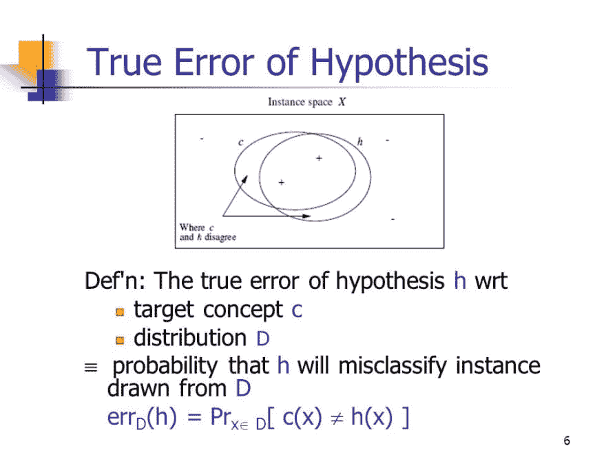

# 监督学习:计算学习理论

> 原文：<https://dev.to/swyx/supervised-learning-computational-learning-theory-160h>

*这是我学习[佐治亚理工学院/优达城机器学习课程](https://www.udacity.com/course/machine-learning--ud262)的一系列课堂笔记中的第八篇。课堂教材是汤姆·米切尔的[机器学习。](https://www.cs.ubbcluj.ro/~gabis/ml/ml-books/McGrawHill%20-%20Machine%20Learning%20-Tom%20Mitchell.pdf)*

> ⚠️:这一章比其他章节理论性更强，但为机器学习奠定了理论基础——跳过或坚持，你自己选择，但要小心

我们已经了解了各种机器学习算法——但是我们对评估算法和学习本身的理论了解多少呢？在这里，我们想:

*   定义学习问题
*   显示特定算法对于问题是否有效
*   显示一些问题从根本上来说是困难的(也就是无法解决的)

## 核心问题

**机器学习的大 O 是什么？**

我们从复杂性理论中了解到大量的常规算法，用于估计资源消耗如何随问题规模(例如空间和时间)而扩展。对于 ML，那些约束也是真实的，但是新的有限资源是数据。

## 资源使用量单位为毫升

很像常规算法有一个大(O)，ML 算法也有时间和空间的大(O)，但也有数据消耗。

当我们评估算法时，我们可能想知道这样的事情:

1.  训练成功的概率(`1 - delta`)
2.  用于训练的示例数量(`m`或`n`)
3.  假设类的复杂度(`complexity of H`)
4.  精度我们正在逼近目标概念(`Epsilon`)
5.  展示培训示例(大批量，或增量/迭代)
6.  选择培训示例(如下所述)

## 训练例子并不总是随机的

控制被提问的问题(以及要训练的例子)可以极大地改变数据消耗。例如:

*   如果知道答案的人控制了问题(因此也控制了例子)，他们可以问非常具体的问题，让你在有限的例子的基础上得到正确的概念
*   如果学习者控制了问题，那么他们可以设计问题(以及例子)来每次尽可能多地消除假设空间(就像在[决策树](https://dev.to/swyx/machine-learning-classification-learning--decision-trees-1mbh)中一样)
*   然而，如果数据是由自然控制的(又名随机性，或抽样)，那么更多的例子(有多少？)来推断正确的概念
*   你也可以考虑一个敌对的老师，故意给你看真实但不具有代表性的例子来误导你。在这种情况下，需要更多的数据。

实际上，大多数训练示例都是随机分布的。但是值得考虑的是，我们可以如何有效地从其他发行版中学习。

一个额外的考虑是平衡。我们从正面的例子中学到的最多(“没有证据不等于没有证据”)，所以如果这些例子很少，那么我们将需要大量的例子来学习正确的概念(也就是证伪错误的假设)。

## 错误出界

与其问我们的学习对“真正的”潜在概念有多准确，我们可以翻转脚本，试着为我们学习时犯的错误设定一个上限。对于没有噪声的线性二元分类模型来说，这是一个令人着迷的想法。

例如，假设我们有一个 K 位的可能性空间(`1`或`0`)。所以 10 位有 1024 ( `2 ^10`)种可能性。我们从极度过度拟合我们看到的第一个例子开始(所以我们看到的第一个例子是我们当前假设的唯一可能结果)。然后，随着我们遇到更多的例子，我们不断放宽条件(扩大假设)。因为每一位只有三种可能的状态(正、负和不存在)，与我们的假设*相冲突的新例子对于答案*来说一定无关紧要，因此我们可以将它们切换到`absent`。

通过这种方式，我们保证我们的学习永远不会犯超过`K+1`个错误，对于`2^K`个可能性空间。一个可爱的技巧，但它并没有为我们还需要多少个示例设置上限，这是最初的问题。

## 问题重提

我们现在已经充实了“机器学习的大 O”的一些竞争措施:

*   **计算复杂度**:一个学习者需要多大的计算量才能收敛？(最接近古典的“大 O”)
*   **样本复杂度**:一个学习者要创建一个成功的假设，一批需要多少训练样本？
*   错误界限:一个学习者在一次无限的奔跑中可以犯多少错误？

出于实际目的，我们最终将只关注样本复杂度，但是考虑这些其他形式也是值得的。

## 版本空格

一些定义:

*   假设空间`H`是我们愿意考虑的所有可能假设的集合
*   真正的假设`c`是“真正的”假设(也称为“目标概念”)
*   候选假设`h`是我们目前正在考虑的
*   训练集`S`是示例数据(例如从人群中均匀随机抽取)
*   一个**一致的学习者**是一个产生一个与目前所见数据一致的假设的人
*   **版本空间**是与数据一致的所有假设的集合。

基本上，它是“我们还没有排除的东西”。很难定义，但值得有一个术语。

## PAC 学习

更多定义:

*   **训练误差**是被`h`误分类的**训练样本**的分数。真实假设的训练误差为 0。
*   **真实误差**是在样本数据上**会被**错误分类的样本的分数。

[](https://res.cloudinary.com/practicaldev/image/fetch/s--no-DTOxQ--/c_limit%2Cf_auto%2Cfl_progressive%2Cq_auto%2Cw_880/https://slideplayer.com/slide/4983569/img/5/Protocol%2BGiven%253A%2BLearner%2Bobserves%2Bsample%2BS%2B%253D%2B%257B%2B%25EF%2583%25A1%2Bxi%252C%2Bc%2528xi%2529%2B%25EF%2583%25B1%2B%257D.jpg)

*   `C`:概念类
*   `L`:学习者
*   `H`:假设空间
*   `n`:假设空间的大小`|H|`
*   `D`:输入分配
*   `episilon`:误差目标(小于等于 0.5)
*   `delta`:确定性目标(概率`1-delta`，算法将产生小于等于`epsilon`的真误差)

因为我们总是从样本中学习，我们永远无法将我们的不确定性或我们的误差降低到零，因此我们的目标最好表述为寻找一个**可能近似正确的**假设。

> 形式上:`L`使用`H`称`C`为`PAC-learnable`当且仅当`L`将以概率`1-delta`从`H`输出一个`h`，使得`error(h) < epsilon`及时采样`1/epsilon, 1/delta, and n`中的多项式。

## ε衰竭

一个版本空间是ε耗尽的当且仅当所有剩余的假设具有低误差。然后你可以选择任何一个假设，根据你选择的错误率，你可以接受。

换句话说，就是**大概近似正确**。

## 豪斯勒定理

这是一个限制**真实误差**的定理，该误差是所抽取的示例数量的函数。如果你感兴趣，我们将把推导过程留给一个视频:

[https://www.youtube.com/embed/TpQoiUQSPB0](https://www.youtube.com/embed/TpQoiUQSPB0)

[https://www.youtube.com/embed/KtZTIvuRdss](https://www.youtube.com/embed/KtZTIvuRdss)

TL；博士的结论是，在`m`个样本之后，版本空间*不*被ε耗尽的上界是:

```
m >= 1/epsilon * (ln n + ln (1/delta)) 
```

因此，我们可以计算出，例如，对于 10 位(1024 种可能性)的输入空间，目标ε为 0.1，δ为 0.2，我们将至少需要`m = 1/10 * (ln 10 + ln (1/0.2)) ~= 40`个训练示例，或者少于 4%的可能空间。

该定理还显示了拉什么杠杆以及这些杠杆的后果。例如，为了将ε降低到 1%，我们需要 400 个例子，或者总空间的 40%。

我们现在能够用这个等式为 PAC 学习设置**样本复杂度界限。**

## 我们系列的下一个

关于此主题的更多说明:

*   [维基百科](https://en.wikipedia.org/wiki/Computational_learning_theory)
*   [CLT 一位教授的调查文章](http://eliassi.org/COLTSurveyArticle.pdf)

希望这是对计算学习理论的一个很好的介绍。我正在计划更多的初级读本，希望您能就以下方面提供反馈和问题:

*   [概述](https://dev.to/swyx/machine-learning-an-overview-216n)
*   监督学习
    *   [决策树](https://dev.to/swyx/machine-learning-classification-learning--decision-trees-1mbh)
    *   [回归](https://dev.to/swyx/supervised-learning-regression-4d17)
    *   [神经网络](https://dev.to/swyx/supervised-learning-neural-networks-mpo)
    *   [基于实例的学习(K 最近邻)](https://dev.to/swyx/supervised-learning-instance-based-learning-and-k-nearest-neighbors-kge)
    *   [集成学习(AdaBoost)](https://dev.to/swyx/supervised-learning-ensemble-learning-lim)
    *   [内核方法&支持向量机](https://dev.to/swyx/supervised-learning-support-vector-machines-3mgk)
    *   [计算学习理论](https://dev.to/swyx/supervised-learning-computational-learning-theory-160h)
    *   [VC 尺寸](https://dev.to/swyx/supervised-learning-vc-dimensions-10b)
    *   [贝叶斯学习](https://dev.to/swyx/supervised-learning-bayesian-learning-403l)
    *   [贝叶斯推理](https://dev.to/swyx/supervised-learning-bayesian-inference-4l72)
*   无监督学习
    *   [随机优化](https://dev.to/swyx/unsupervised-learning-randomized-optimization-4c1i)
    *   [信息论](https://dev.to/swyx/unsupervised-learning-information-theory-recap-4iem)
    *   聚类-2 月 25 日这一周
    *   功能选择-3 月 4 日开始的一周
    *   功能转变-3 月 11 日开始的一周
*   强化学习
    *   马尔可夫决策过程-3 月 25 日的一周
    *   “真实”RL-4 月 1 日开始的一周
    *   博弈论-4 月 15 日的一周