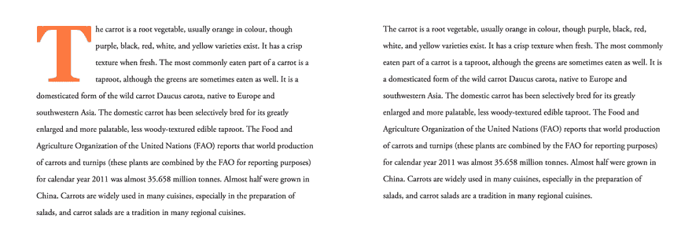
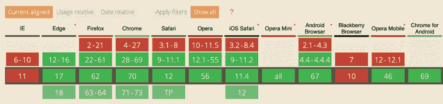

# 支持旧浏览器—第 2 部分:CSS

> 原文：<https://dev.to/zellwk/supporting-older-browserspart-2-css-3hio>

有两种方法可以为 CSS 功能提供后备:

1.  房地产回落
2.  功能查询

## 本系列其他文章

1.  第 1 部分:[支持旧浏览器](https://zellwk.com/blog/older-browsers-css)
2.  第 2 部分:本文
3.  第 3 部分:支持旧浏览器—第 3 部分:JS(即将发布！)

## 属性回落

如果浏览器无法识别某个属性或其对应的值，浏览器将完全忽略该属性。

发生这种情况时，浏览器使用(或退回到)它找到的前一个值。

这是提供后备的最简单的方法。

这里有一个例子:

```
.layout {
  display: block; 
  display: grid; 
} 
```

在这个例子中，支持 CSS Grid 的浏览器将使用`display: grid`。浏览器不支持 CSS 网格会退到`display: block`。

### 省略默认值

如果您使用的元素默认为`display: block`，您可以省略`display: block`声明。这意味着您可以用一行代码支持 CSS Grid:

```
.layout {
  display: grid; 
} 
```

支持 CSS Grid 的浏览器将能够像`grid-template-columns`一样读取其他 CSS 属性。不支持 CSS 网格的浏览器不行。

这意味着您可以编写额外的 CSS 网格属性，而不必担心回退值。

```
.layout {
  display: grid; 
  grid-template-columns: 1fr 1fr 1fr 1fr;
  grid-gap: 1em; 
} 
```

## 功能查询

特性查询，或`@supports`，告诉你一个 CSS 属性或其对应的值是否被浏览器支持。

**你可以把 CSS 特性查询想象成 JavaScript 中的`if/else`语句。**看起来是这样的:

```
@supports (property: value) {
  /* Code when property or value is supported*/
} 

@supports not (property: value) {
  /* Code when property or value is not supported */
} 
```

如果您希望浏览器仅在支持特定属性的情况下才读取 CSS，那么`@supports`会很有帮助。

对于上面的 CSS 网格示例，您可以这样做:

```
@supports (display: grid) {
  .layout {
    display: grid; 
    grid-template-columns: 1fr 1fr 1fr 1fr;
    grid-gap: 1em; 
    padding-left: 1em;
    padding-right: 1em;
  }
} 
```

在这个例子中，`padding-left`和`padding-right`只能被同时支持`@supports`和 CSS 网格的浏览器读取。

珍·西蒙斯在工作中有一个更好的例子。她使用特征查询来检测浏览器是否支持类似于`-webkit-initial-letter`的属性。

```
@supports (initial-letter: 4) or (-webkit-initial-letter: 4) {
  p::first-letter {
     -webkit-initial-letter: 4;
     initial-letter: 4;
     color: #FE742F;
     font-weight: bold;
     margin-right: 0.5em;
  }
} 
```

[](https://res.cloudinary.com/practicaldev/image/fetch/s--svgI-Ene--/c_limit%2Cf_auto%2Cfl_progressive%2Cq_66%2Cw_880/https://zellwk.cimg/2018/older-browsers/initial-letter.gif) 

<figcaption>左:Safari 9 起。右图:其他</figcaption>

Jen 的例子给我们带来了一个问题:不同浏览器的网站应该看起来一样吗？我们稍后再看这个。但是首先，更多关于特征查询。

### 支持功能查询

特色查询获得了[巨大的支持](https://caniuse.com/#search=feature%20queries)。目前所有(主流)浏览器都支持特征查询。

[](https://res.cloudinary.com/practicaldev/image/fetch/s--L2e7cM12--/c_limit%2Cf_auto%2Cfl_progressive%2Cq_auto%2Cw_880/https://zellwk.cimg/2018/older-browsers/feature-queries-support.png) 

<figcaption>各大浏览器都支持特色查询</figcaption>

### 支持某个功能，但不支持功能查询怎么办

这曾经是棘手的部分。珍·西蒙斯和其他专家已经警告过我们这种可能性。你可以在这篇文章中阅读如何处理[。](https://hacks.mozilla.org/2016/08/using-feature-queries-in-css/)

以下是我的看法:我不再支持 IE 11 了，所以我按照上面提到的方式使用特性查询。

## 同时使用属性-回退和特征查询

看看下面的代码。浏览器将应用什么填充值？

```
@supports (display: grid) {
  .layout {
    display: grid; 
    grid-template-columns: 1fr 1fr 1fr 1fr;
    grid-gap: 1em; 
    padding-left: 1em;
    padding-right: 1em;
  }
}

.layout {  
  padding-left: 2em; 
  padding-right: 2em; 
} 
```

答案是:所有浏览器都会应用左右填充的`2em`。

为什么？

这是因为`padding-left: 2em`和`padding-right: 2em`后来在 CSS 文件中声明。后来声明的属性会覆盖先前声明的属性。

如果你想让`padding-left: 2em`和`padding-right: 2em`只应用于不支持 CSS 网格的浏览器，你可以交换属性顺序。

```
.layout {  
  padding-left: 2em; 
  padding-right: 2em; 
}

@supports (display: grid) {
  .layout {
    display: grid; 
    grid-template-columns: 1fr 1fr 1fr 1fr;
    grid-gap: 1em; 
    padding-left: 1em;
    padding-right: 1em;
  }
} 
```

注意:由于其级联性质，在 CSS 中首先声明回退代码总是一个好的做法。

这也意味着，如果你同时使用了`@supports`和`@supports not`，你应该先声明`@supports not`。它使你的代码一致。

```
/* Always write "@supports not" first if you use it */
@supports not (display: grid) {
  .layout {  
    padding-left: 2em; 
    padding-right: 2em; 
  }
}

@supports (display: grid) {
  .layout {
    display: grid; 
    grid-template-columns: 1fr 1fr 1fr 1fr;
    grid-gap: 1em; 
    padding-left: 1em;
    padding-right: 1em;
  }
} 
```

现在让我们来讨论一下网站是否应该在不同的浏览器上看起来一样。

## 网站应该在不同浏览器间看起来一样吗？

一些人认为网站应该在不同的浏览器上看起来一样。他们认为品牌是重要的，并强调网站应该保持一致，以维护品牌。

其他人说不。他们认为他们应该接受逐步提高的精神。他们可以给拥有更好浏览器的用户更多的爱。

两种观点都是对的，只是角度不同。

**最重要的观点来自用户。**你的网站能够为用户提供他们想要的东西吗？

如果有，就不必对一致性要求太严格。继续前进，用更好的浏览器提供更好的体验！

## 包装完毕

要提供对 CSS 功能的支持，您可以使用:

1.  房地产回落
2.  功能查询

当你写 CSS 的时候，确保你先声明回退代码，然后再声明对浏览器有更好支持的另一组代码。

* * *

感谢阅读。这篇文章最初发表在我的博客上。如果你想要更多的文章来帮助你成为一个更好的前端开发者，请注册[我的时事通讯](https://zellwk.com)。