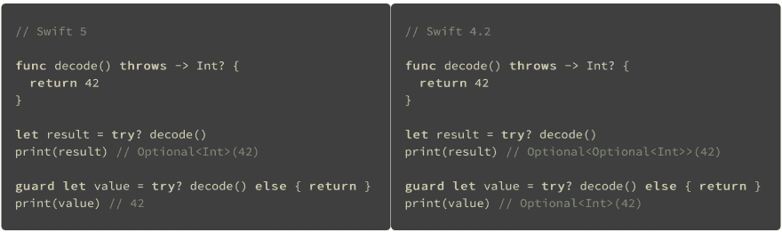
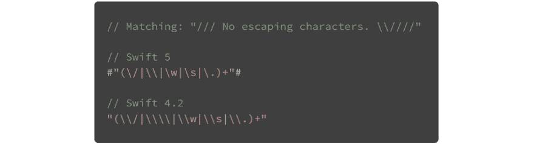
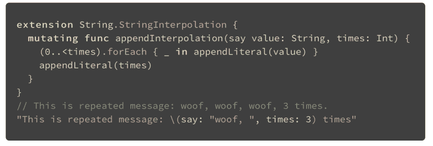

# 雨燕 5。什么是新的？

> 原文：<https://dev.to/dimpiax/swift-5-what-is-new-2a94>

Swift 5 是 ABI 稳定的，它提供了与操作系统的直接兼容性，而无需额外的层，并且从 5.0 版本开始，提供了不同版本 Swift 之间的向后兼容性。

新版本也有很多改进:

1.  **削平`try?`与可选类型**
    不再有`double guard`。
    [T8】](https://res.cloudinary.com/practicaldev/image/fetch/s--9ijYaIxd--/c_limit%2Cf_auto%2Cfl_progressive%2Cq_auto%2Cw_880/https://thepracticaldev.s3.amazonaws.com/i/lbtmunzltsocnujwnz91.png)

2.  **Raw strings**
    给出了编写一个字符串而不转义里面字符的可能性之一。以一种简洁的方式编写原始的正则表达式是非常有用的。

    

    如果需要在原始字符串中嵌入变量，必须在反斜杠后添加散列符号:`#"(\\|\#(variable))"#`

3.  **字符串插值**
    声明可以灵活自行处理。
    为此，用自己的函数:
     扩展协议`StringInterpolation`

4.  **计算属性内无递归**
    避免额外的计算层，将其放在闭包内。

* * *

这是所描述的功能的一部分，还有更多:[https://developer . apple . com/documentation/xcode _ release _ notes/xcode _ 10 _ 2 _ beta _ release _ notes/swift _ 5 _ release _ notes _ for _ xcode _ 10 _ 2 _ beta](https://developer.apple.com/documentation/xcode_release_notes/xcode_10_2_beta_release_notes/swift_5_release_notes_for_xcode_10_2_beta)

媒体上的文章:[https://Medium . com/@ dimpiax/swift-5-what-is-new-examples-fbb 64d 525486](https://medium.com/@dimpiax/swift-5-what-is-new-examples-fbb64d525486)