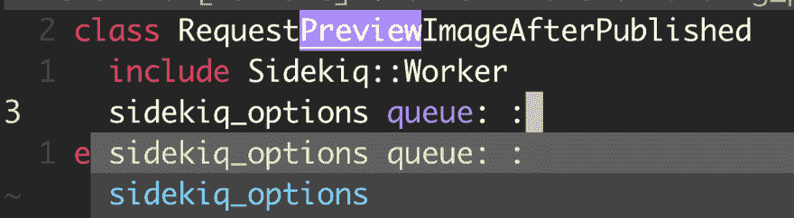

# 你在 Sidekiq Options 骗到我了

> 原文：<https://dev.to/scottw/tabnine-you-had-me-at-sidekiq-options-276j>

Tabnine 是一个为各种编辑器(如 Vim 和 Atom)设计的漂亮的新制表符补全插件。

它可以在小型项目上免费使用，而对于大型项目则需要升级。它运行得非常好，我已经非常确定我要升级了…然后它提供了这个作为补充:

这可能看起来微不足道，但在近 20 年的 tab 竞争/智能感知(在微软世界)中，这是我第一次真正看到智能应用于建议。`sidekiq_options`是一个后台工作者的配置 API。猜测我输入`side`时的完成是意料之中的。我足够聪明，意识到我总是跟进两个特定队列中的一个，这让我做得更好。

我马上就买了。99 美元太便宜了。