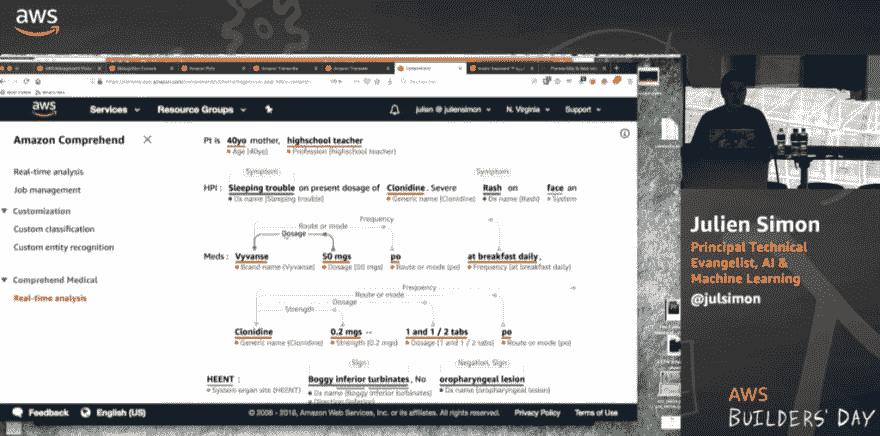

# Talk:机器学习应用服务概述

> 原文：<https://dev.to/juliensimon/talk-an-overview-of-machine-learning-application-services-1963>

这是我刚刚在都柏林的 AWS 建设者日做的一个演示。这是应用服务(Rekognition，Polly 等)的概述。)，包括 re:Invent 2018 的所有新功能以及现场演示:)

乐意回答问题。请在 [Twitter](https://twitter.com/julsimon) 上关注我，了解更多内容。

#### 幻灯片

[https://medium . com/media/a 3846 CB 3a 7 e 4890 cf 310 a 30 b 360201 e 9/href](https://medium.com/media/a3846cb3a7e4890cf310a30b360201e9/href)

#### 视频

[https://www.youtube.com/embed/8XKSrI5l39k](https://www.youtube.com/embed/8XKSrI5l39k)