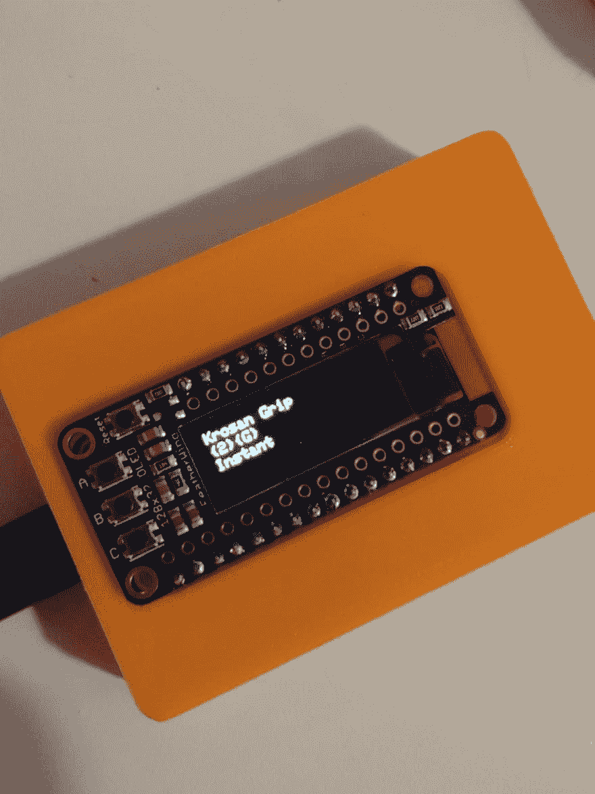

# 用 ESP32 羽毛与互联网对话

> 原文：<https://dev.to/jvarness/talking-to-the-internet-with-the-esp32-feather-35a6>

我离开了一点点，但我回来讨论我线下一直在做的事情！

几个月前，我超级棒的妻子为我购买了一些超级棒的小型开发板作为圣诞礼物！几周前我在推特上写了这个:

> Jake Varness@ Jake _ Varness我最后用我的 [@adafruit](https://twitter.com/adafruit) ESP32 羽毛和有机发光二极管翅膀做的小项目:连接到 [@scryfall](https://twitter.com/scryfall) 并在显示屏上显示关于 MTG 牌的随机信息。
> 
> 还摇了一个 3D 打印的 Featjer 表壳，由 Adafruit 设计！
> 
> 稍后会博客讲述！2019 年 2 月 19 日下午 14:40

该项目目前显示随机魔术的随机信息:收集卡，但我最终会把它变成我桌子上的一个小气象站。我想我应该到我最喜欢的网络小角落来炫耀一下。

## 先说硬件

让我们从我使用的电路板和其他技术开始。所有这些组件都来自于 [Adafruit](https://www.adafruit.com/) ，这是一家电子公司，生产和销售各种有趣的小组件，用于修补和制作任何你想要的东西！

具体来说，该项目使用:

*   [ESP32 羽毛](https://www.adafruit.com/product/3405)
    *   一个集成了 WiFi 和蓝牙功能的微控制器，以及无数其他功能，使该板非常适合物联网项目。
    *   我的是带堆叠头的那个。
*   [有机发光二极管羽翼](https://www.adafruit.com/product/2900)
    *   附带 128x32 有机发光二极管屏幕的分线板。
*   为 Adafruit 羽毛设计的 3D 打印表壳([链接到 thingiverse](https://www.thingiverse.com/thing:2209964) )

Adafruit 羽毛系列最简洁的一点是你可以选择购买的羽毛翅膀。在推文中，你看到的是使用堆叠头销将*附在*ESP32 羽毛上的有机发光二极管羽毛。

3D 打印的外壳就是酷酷的:D

我为什么选择羽毛做这个项目？出于多种原因。首先，Feather 系列有许多分线板选项，这些分线板遵循与主板本身相同的外形规格。所有这些都是可堆叠的，并且可以通过简单地切换它们来改变您的板的功能！

另一个原因是规模。我有很多不同的主板:Arduino Uno、Arduino Micro、Raspberry Pi Zero 和几个 Raspberry Pi 2s。如果您需要在狭小的空间内使用 Linux 操作系统的全部功能，Raspberry Pi 是一个很好的选择，而且较新的主板甚至配有内置无线接收器。不过，我并不真的需要 Linux，我认为 Feather 提供的功能比我的 Arduinos 多一点，但尺寸更小或相当。

第三个主要原因与涉及的软件有关。

## 软件怎么样？

羽毛板可以用 Arduino IDE 编程，你可以使用许多现成的流行 Arduino 库。编写 Arduino 代码感觉很像为 Pebble watch 编写代码:你可以编写一个做很多事情的小 C 程序！

这里有一个[代码](https://github.com/jvarness/arduino/blob/master/esp32/esp32_demo.ino)的链接。(请不要真的使用`SSID`作为你的 SSID 或者`password123`作为任何密码。)

在我使用的库中，最著名的有:

*   ArduinoJson
    *   一个神奇的库，允许您在 Arduino 平台上优雅地解析 JSON 对象。
*   WifiClientSecure
    *   允许您连接到 WiFi 并拨打 HTTPS 电话。
*   阿达果有机发光二极管司机
    *   使得向有机发光二极管写文本变得非常容易。
*   [Scryfall](https://scryfall.com)
    *   魔法在线参考:有 REST API 的收集卡片。

老实说，编写代码最困难的部分就是让电路板连接到 WiFi 并拨打 HTTPS 电话！

在许多编程语言中，与互联网相关的任务被抽象到这样一种程度，即您通常不必考虑创建到互联网的连接和手写一个 HTTP 包。

ArduinoJson 使得在 Arduino 中解析 Json 主体变得非常容易，所以这一部分并没有那么糟糕。

代码仍然相当粗糙，我还没有对它进行评论，它实际上有一个缺陷需要我来修复:

过了一会儿，`client`变得不可用，并停止进行 HTTP 调用。我想，如果客户端变得不可用，我可能必须找出如何重新连接客户端。起初，我可能认为 Scryfall 由于速率限制而断开了我的连接，但我不认为*T2 是这样，因为我每 1/3 秒才打一次。如果你知道我做错了什么，让我知道！*

## 最终产品

我认为这个结果很酷:一个显示来自互联网的随机信息的小板子。

虽然这只是一个很小的例子，但对我来说，这是一个很好的起点，它会让我想起我对该板的目标是什么！

伙计们，我现在就知道这么多了。如果你们有任何问题，或者如果你们知道我在代码中做错了什么，或者如果你们喜欢这个帖子，请发表评论，让我知道你们的想法！