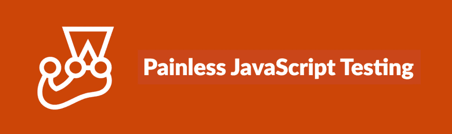
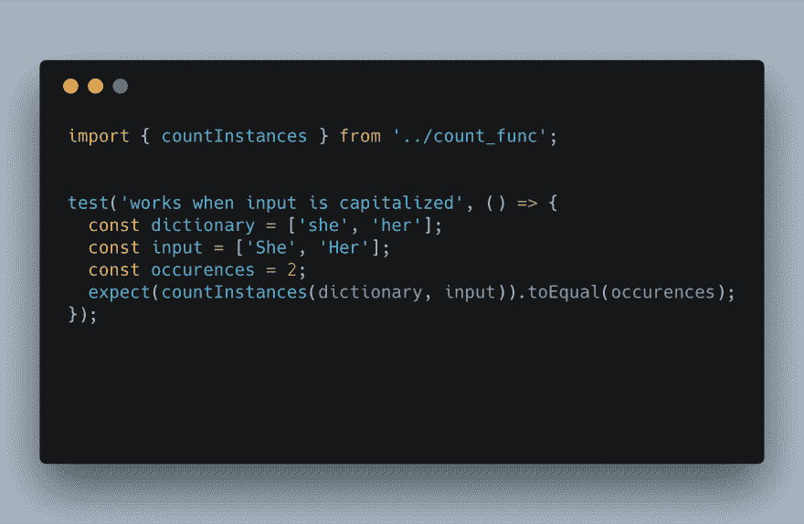
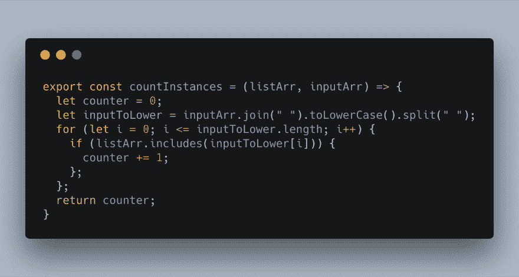
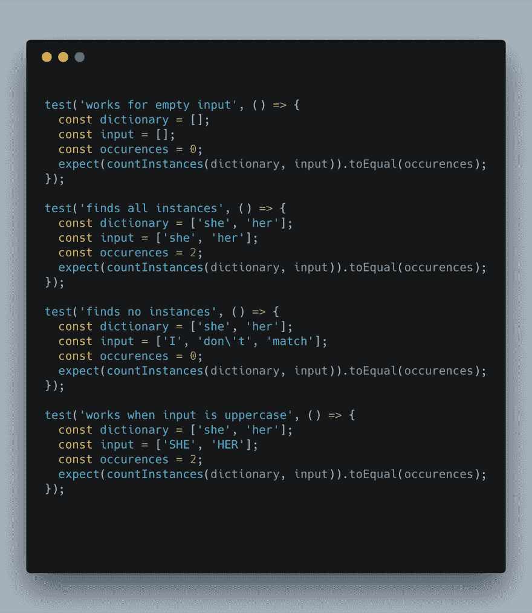

# TDD:测试您的代码！

> 原文：<https://dev.to/vblaha/tdd-test-drive-your-code-15p>

 
在过去的一周里，我们花了一些时间在课堂上使用[摩卡](https://mochajs.org/)和[柴](https://www.chaijs.com/)编写单元测试和功能测试，然后与 [Sinon](https://sinonjs.org/) 配对来模拟一个服务器。在这篇文章中，我将引用我在 Github 上参与的一个开源项目，使用 [Jest](https://jestjs.io/) 与 React 配对。要了解测试驱动开发是什么意思，让我们仔细看看。

测试驱动开发(TDD)通过首先编写测试来开始编码过程。在编写相应的代码之前编写测试有助于定义参数和函数的使用，从而产生更加模块化、可重用的代码片段。做得好的话，好的单元测试可以作为文档提供给其他编码人员，为他们提供你希望你的功能如何运行的设计。好的单元测试可以让你更容易地重构代码，并客观地看待每一步。

在下面的例子中，这个单元测试有一个目的:看看大写的单词是否会像未大写的匹配一样在计数器上被计数:
 
测试开始时给我们一个简短的描述，如果我们的情况得到满足，函数应该做什么。然后，它定义要测试的参数以及应该找到这些参数的次数。

上述测试有助于定义。toLowerCase()方法在下面的计数器函数中找到:

您可以用类似的方式构建一套测试来隔离函数中的实例，如下所示:

这只是编写测试的一个简短介绍。更多即将推出！一如既往，欢迎提出问题、意见和改进建议。感谢您的阅读。