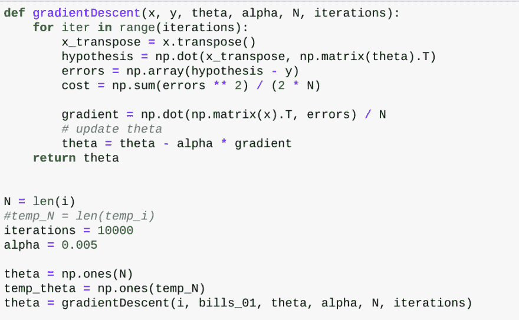
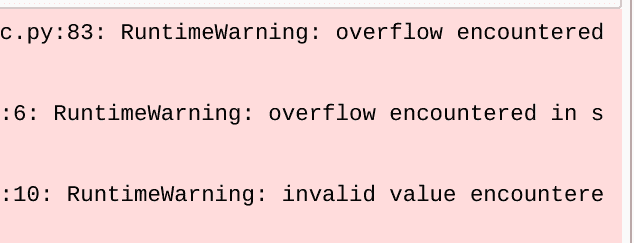
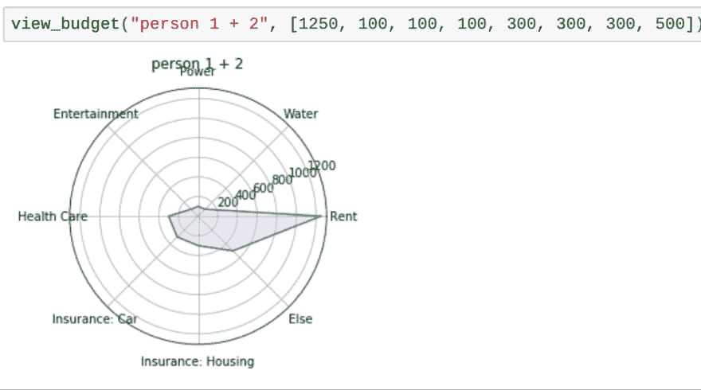
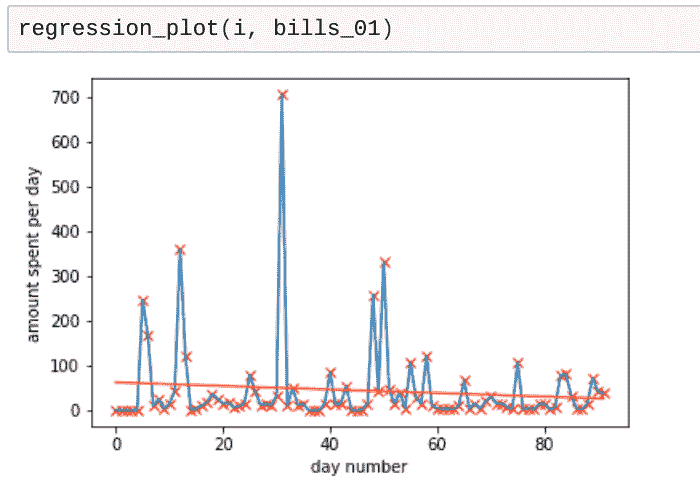

# 自学编码(四)

> 原文：<https://dev.to/iheartbenzene_20/teaching-yourself-to-code-iv-76m>

今天我学到了非常宝贵的一课；在套件中阅读测试通常会避免很多心痛。我这么说有几个原因。虽然我的主要(也是实际上更喜欢的)编程语言是 Matlab(完全应该理解为“Octave”)，但我经常告诉人们它是 Python。我为什么要这么做？这是因为，正如我在以前的帖子中提到的，理解这种语言的人很少，我不想处理听到这种语言时出现的略微尴尬的表达。为什么后面的表情很尴尬？我其实不知道。我可以猜测，但是因为我不太可能得到一个真实的答案，那么“猜测”充其量也就是一个“猜测”而已。换句话说，不把某人放入一个环境中并评估他们的情绪状态(具体怎么做呢？)当他们使用这种语言时，除了“我理解它”或“我不理解它”之外，几乎不可能对收到的答案进行验证或定位任何有效性。也就是说，选择两害相权取其轻，选择一种观众至少有些熟悉的语言往往更容易。

这对我意味着什么？这意味着，对于我用 Octave/Matlab 编写的所有东西(由于它们的代码非常相似，我将在此后互换使用这些名字)，我将用 Python 重写一个版本。这是否意味着我了解 Python，并认为自己是专家？然而，一点也不，因为 Python 似乎是科学的官方语言，并且它被我一直最喜欢的实体之一 CERN 所使用，所以我确信 Python 可以处理几乎任何我妨碍它的事情。缺点是，这也意味着大量的重新格式化，并且在此过程中可能会有一些计算错误。可能是由数据结构本身引起的，但我实际上不知道 Matlab 如何存储矩阵，更不知道它如何为这些东西分配内存。我的意思是，我知道它有[数据结构](https://www.mathworks.com/help/symbolic/structures.html)，但我很确定它在处理上是独一无二的，因为它非常好地处理了[数学计算](https://octave-online.net/bucket~2u96ehrJcrJfW64NPCwtfv)。

相反，老实说，我很难让同样的函数在 Python 中很好地工作。  
就像，它最终是一个小得多的代码量，但这些  表明，如果我想在这种情况下保持功能，就必须以不同的方式处理某些东西。诚然，Python 版本没有编码表面图，甚至没有等高线图，但如果它确实在下降的初始部分有问题，那么我可能还不应该担心这些事情。

然而，我再次为我的预算被改写和使用一些样本数据的小小成就感到自豪。  
在这种情况下，线性回归图  也可以，但我最终不得不使用 numpy 的 polyfit 功能，而不是像我希望的那样使用渐变下降。要么这样，要么严重限制了分析中使用的范围...但老实说，这似乎有点矛盾，因为梯度下降被誉为一种旨在找到局部(或全局)最优的机器学习算法，我觉得如果范围变得太小，那么它的能力将被严重抑制。

我想，这就是挑战所在；找到满意的中间点，满足足够的范围和不会持续一生的运行时间。要么这样做，要么找其他能完成相同任务的东西。尽管如此，我仍然对这一点点进步感到高兴。