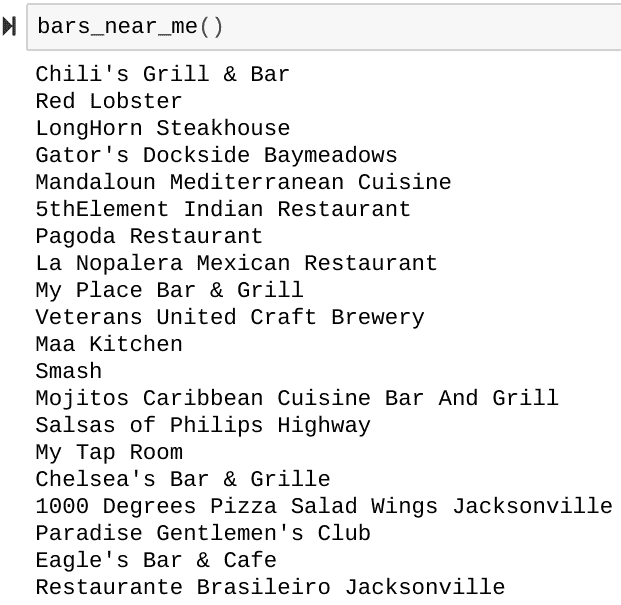
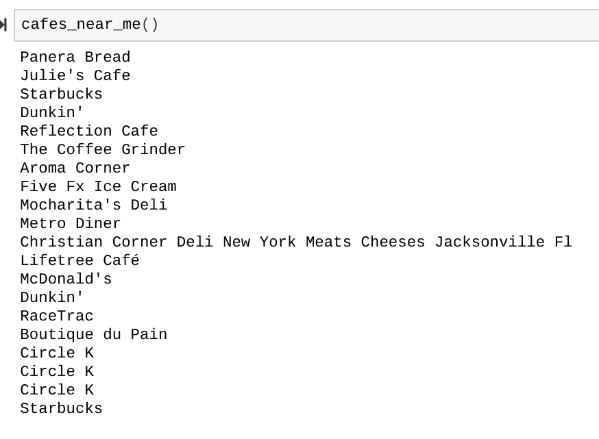
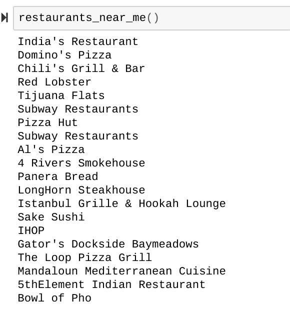
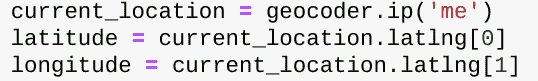
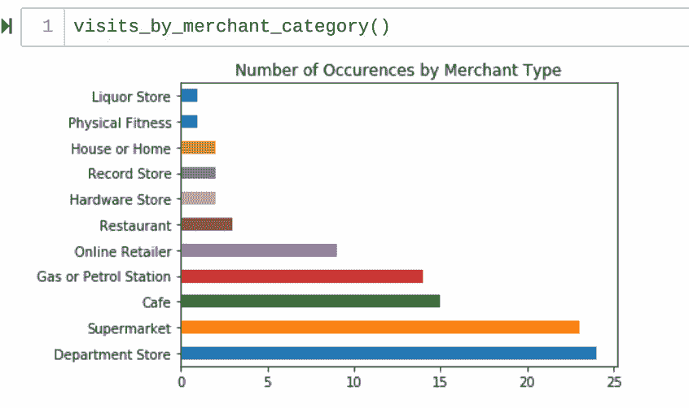

# 自学编码(六)

> 原文：<https://dev.to/iheartbenzene_20/teaching-yourself-to-code-iv-kpc>

U pdate。

只是一个快速更新，主要是跟踪我在这方面的进展，并感受一下其他方面可能有用。

增加了一个部分，让用户可以获得他们周围 3.4 公里(~ 2.1 英里)半径内的商店信息。

[T11】](https://res.cloudinary.com/practicaldev/image/fetch/s--GNdbkGE0--/c_limit%2Cf_auto%2Cfl_progressive%2Cq_auto%2Cw_880/https://thepracticaldev.s3.amazonaws.com/i/23xc51ailq74zue2eq6i.png)

原来，有一个名为 geocoder 的包，它似乎可以定位用户的 IP 地址，并返回他们的地理坐标。通过传递每个坐标值
 ，这对于上述函数来说非常方便

这里有两个主要缺点:在商场里似乎不太管用。也就是说，它所在的大多数商店都在我测试它的商场外面。这可能与商场内的商店设置有关，可能在一个特定的目录中，所以不会立即被列为商店，而是商场本身，或者这可能只是一个 bug，我将不得不稍后修复。

此外，正如我最近发现的那样，如果其中一个认证服务器宕机，整个分析系统都会宕机；这实际上并不是刷新我的 API 键的委婉说法。相反，这意味着我必须要么找到一个比谷歌更可靠的解决方案，以保持应用程序正常运行，从而让用户满意，要么找到一些独立托管东西的方法。

独立托管东西和不使用像谷歌那样的开源软件的主要缺点是，我的代码可能会变成私有的，我将无法分享任何重大的更新。

现在，我仍然没有回答的真正问题是:这对于在用户已经花了最多钱并因此可能再次消费的地区周围找到商店有什么用？

沿着这些思路，横条比竖条好看吗？
 
对比
