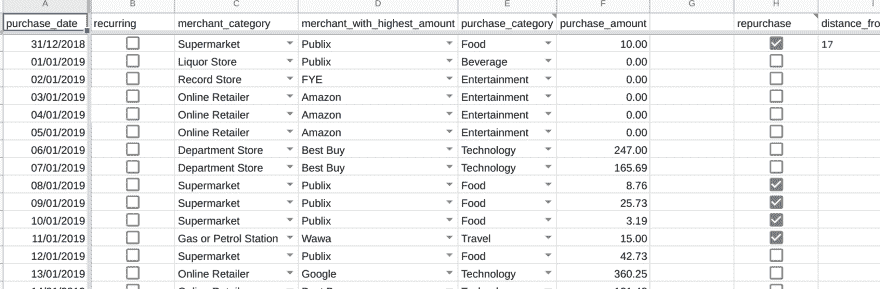
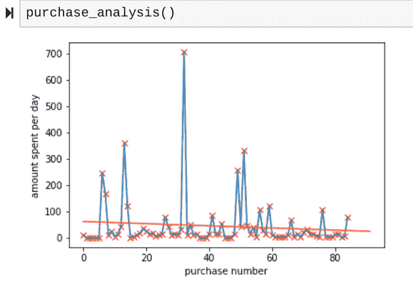
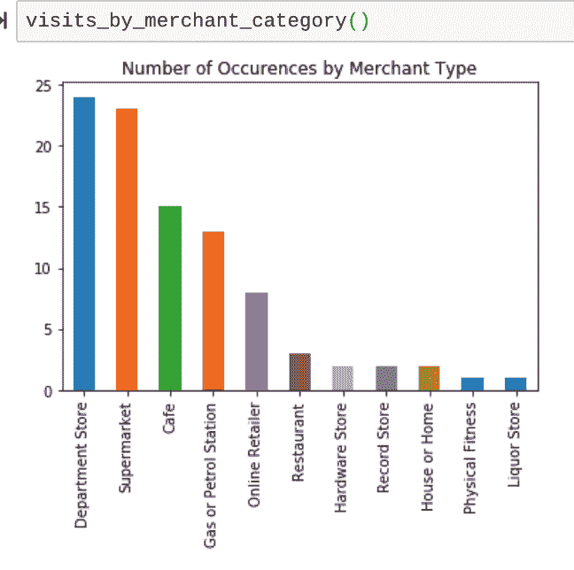
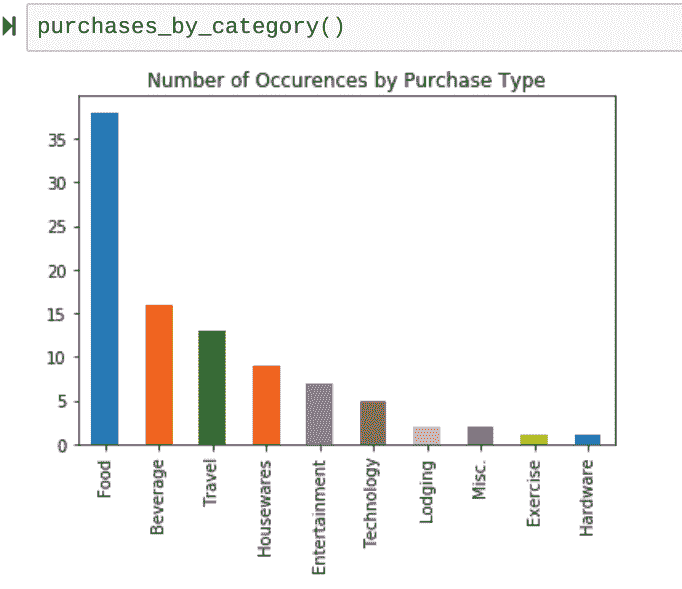
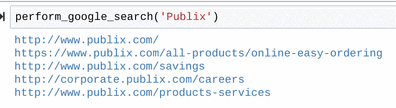
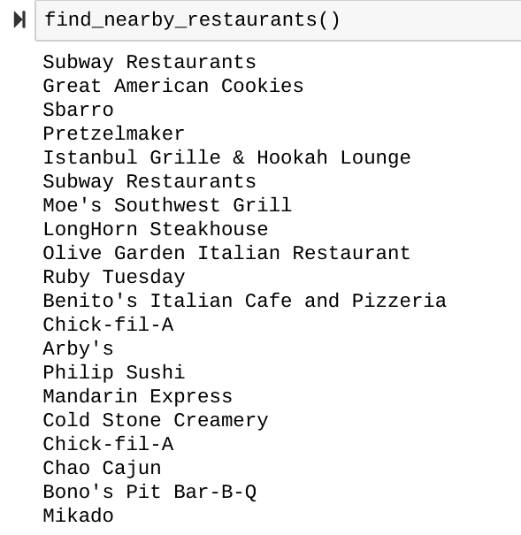
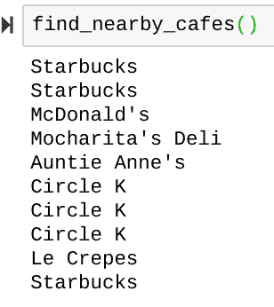

# 自学编码(五)

> 原文：<https://dev.to/iheartbenzene_20/teaching-yourself-to-code-v-55m1>

个人项目更新:对于那些还不知道或不关注我的 GitHub 项目的人，我正在制作一个预算程序，它直接采用特定的方法来确定你的总体预算和可能的支出增加或减少。或者，如果你更喜欢流行语，我在使用机器学习算法。

然而，由于现有的 API 及其惊人的功能，我可以在程序本身之外执行大量的实际计算和进展，并将结果数据导入分析。在我看来，这比在运行时执行计算和分析要方便得多。

从一个电子表格中随便取一些数据，

然后通过采购导入和分析这些信息，以形成一条移动回归线。

也就是说，范围和回归都会随着每个新的非零数据点自动更新。当然，如果你在几天内没有花费任何东西，这可能会变得有趣，然而，这也意味着你的花费至少在这几天内不会增加。

除此之外，还可以根据所逛商店的类别对支出进行分组，
 
根据所购物品的类别，
 
或根据商店本身的名称。 

当然，以上都没有揭示在每个商家花了多少钱作为一个单一的美元值；只是确定花费金额的比较。显然，有些商店不在这个清单上。原因可能是因为我还不知道这些地方，或者我从来没有去过这些地方。

然而，这绝不意味着任何人都应该因为我缺乏信息而感到被忽视。只需在谷歌上快速搜索
 ，查看前 5 名结果，即可看到感兴趣的商家网站。

到目前为止，所有这些项目都是使用谷歌通过[开发者控制台](https://console.developers.google.com)提供的免费 API 制作的。

还有其他可用的功能，例如使用 GooglePlaces 加载地图并定位默认 3.2 公里半径内的地方，这可以更改为 0 到 5 公里之间的任何地方，然而，我目前已经超过了测试期间的配额。一旦重置，我会更新这篇文章。

更新:
返回附近餐馆列表

并返回附近咖啡馆的列表。
[T3】](https://res.cloudinary.com/practicaldev/image/fetch/s--KnPs6wwz--/c_limit%2Cf_auto%2Cfl_progressive%2Cq_auto%2Cw_880/https://thepracticaldev.s3.amazonaws.com/i/609onmi80jx0a6gsw1c6.png)

包括具有多个位置的地点的副本。