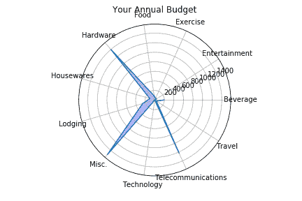
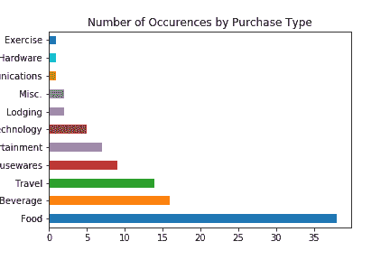
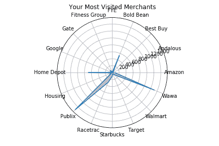
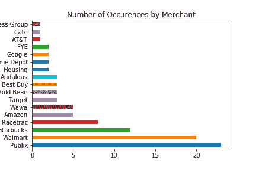
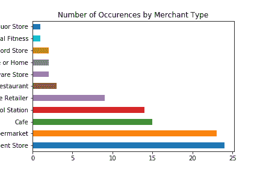
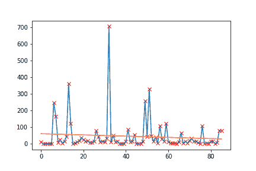
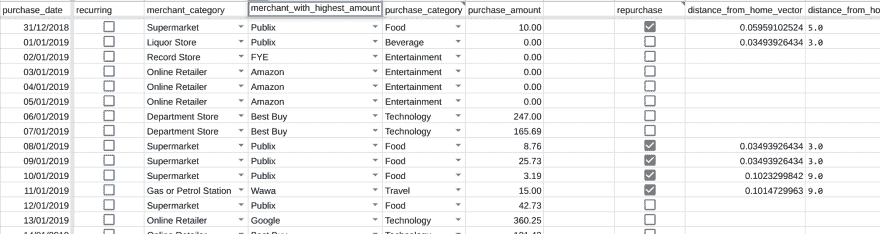

# 自学编码(七)

> 原文：<https://dev.to/iheartbenzene_20/teaching-yourself-to-code-vii-2e6p>

andas 是相当出色的！经过大约 18 个小时的努力，年度预算图表现在将自动更新任何新的金额。关于购买类型的花费
 
或购买类型的数量。
 
以及关于在该商户的消费情况
 
或者某商户举办了多少次最高消费的数据点
 
甚至是该类型商户的

同时允许通过线性回归
 分析支出金额

现在剩下的就是整理一些零散的东西，比如添加地理坐标向量，这样地理定位就不仅仅是一个浮动的附件，然后我就可以继续打包了。

所有这些都是从电子表格中的数据开始的。
[T3】](https://res.cloudinary.com/practicaldev/image/fetch/s--MQU3XU9w--/c_limit%2Cf_auto%2Cfl_progressive%2Cq_auto%2Cw_880/https://thepracticaldev.s3.amazonaws.com/i/rymeeb8jkvpvx4ue85be.png)

在谷歌的 API、文档和一个奇妙的 slack 社区的帮助下。