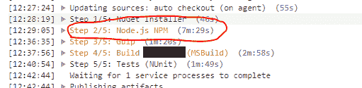
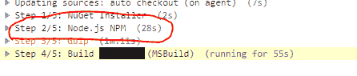

# 团队城市建设时间和 npm

> 原文：<https://dev.to/simonreynolds/teamcity-build-times-and-npm-45j9>

最近，我注意到项目的构建时间越来越长，构建和单元测试一个内部网解决方案需要 15 分钟。当您有许多项目，有多个分支和无限数量的可用构建代理时，这很快变得不可行。

检查构建日志很快发现了瓶颈...

<figure> 

<figcaption>npm 安装</figcaption>

</figure>

运行`npm install`花了 7 分多钟才完成！

一些搜索揭示了`npm ci`命令的存在，这里记录了[和](https://docs.npmjs.com/cli/ci.html)。

专为测试、持续集成和持续部署环境而设计，它通常会忽略 **package.json** ，只检查它是否与 **package-lock.json** (或 **package-shrinkwrap.json** )中的内容匹配。

如果存在不匹配，它将失败并显示一个错误，而不是尝试创建一个新的锁文件。如果一切都匹配，那么它将从锁文件中恢复，而不必进行任何依赖性解析。

它将删除任何现有的 **node_modules** 文件夹，以确保所有依赖关系的一致恢复，并保证永远不会写入 **package.json** 或任何锁文件。

那么这对我们的构建时间有什么影响呢？

<figure>

<figcaption>NPM ci</figcaption>

</figure>

npm 包恢复从 7 分 29 秒下降到 28 秒！时间减少了 94%,让沮丧的 IT 部门恢复了一些理智和平静。