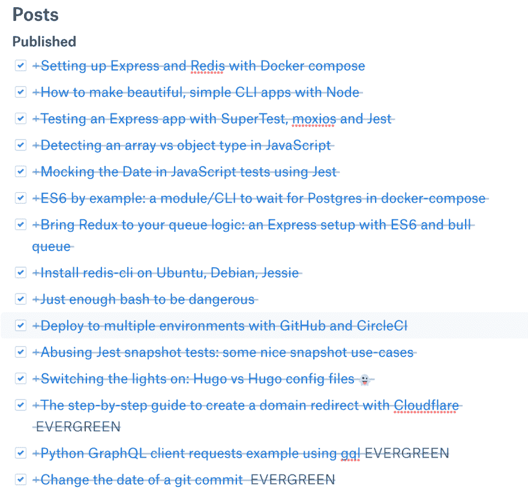

# “Hugo 代码”的技术内容工作流程:静态站点、纸张、媒体、开发和按钮

> 原文：<https://dev.to/hugo__df/technical-content-workflow-for-code-with-hugo-static-site-paper-medium-dev-and-buttondown-3hci>

**TL；博士**:这是用来给 codewithhugo.com[供电、构建和发布的工具](https://codewithhugo.com):

*   [Dropbox Paper](https://www.dropbox.com/paper) 因为它同步桌面/移动并输出到 markdown
*   封面图像的[去飞溅](http://unsplash.com)
*   编辑过的降价+图片→ [Hugo](https://gohugo.io) 静态站点生成器
*   卡斯珀 2([https://ghost.org](https://ghost.org)默认主题)为[雨果](http://gohugo.io)
*   时间表:
    *   时事通讯:每两周英国周一下午 5 点
    *   每周 1 个以上的帖子
*   交叉发布到中(文章→导入文章)
*   使用 RSS 源交叉发布到[开发人员到](https://dev.tohttps://)
*   社交媒体/推广
*   简讯由[https://button down . email](https://buttondown.email)提供
*   分析:谷歌分析+简单分析

这篇文章包含了大约 7 个月的学习内容，所以请看下面的目录:

*   如果你对内容感兴趣，就不要建立自己的网站
*   流程:从想法到出版
*   社交媒体/推广
*   邮件和简讯时间表
*   时事通讯:为什么按钮式？
*   分析堆栈

## 如果你对内容感兴趣，就不要建立自己的网站

我可以编写 UI 代码，但是我使用了主题，这里的目标不是编写代码。

我想要一些我不太熟悉的东西，所以我不会一开始就弄乱它，它还必须看起来很好，而且“只是 work"™️.”

这就是我如何用 [Hugo 静态站点生成器](http://gohugo.io)，Casper 2(移植自 ghost.org 默认主题[)结束的。我的初始设置记录在](http://ghost.org)[“开灯:雨果 vs 雨果配置文件”](https://codewithhugo.com/switching-the-lights-on-hugo-vs-hugo-config-files/)。我在 GitHub 页面上运行，但最近在 GitHub 发生严重故障时更新为使用 Netlify，你可以在[“一个关于在 GitHub 发生灾难时迁移到 Netlify 的小案例研究，以 Cloudflare 为特色”](https://dev.to/hugo__df/a-tiny-case-study-about-migrating-to-netlify-when-disaster-strikes-at-github-featuring-cloudflare-4gof)中了解更多关于该交换机的信息

能够修改一些模板显然是有用的，例如:

*   添加规范链接
*   将 buttondown 订阅表单(CSS 已经在那里了👍)
*   指南页面+付费墙(参见[“使用 checkoutpage.co 和普通 JavaScript 添加客户端付费墙”](https://dev.to/hugo__df/add-a-client-side-paywall-using-checkoutpageco-and-vanilla-javascript-7p4))

## 流程:从构思到发表

草稿和想法存在于[纸](https://www.dropbox.com/paper)中，它有一个像样的文件夹结构和一个中等大小的文本编辑器。与中型移动应用程序不同，它支持离线。纸张导出到 Markdown，因此内容只需稍加修改。

我有一个主要的“内容计划”,里面有一个清单，上面列有我在不同州收到的所有帖子。它看起来像这样，但有一些未选中的复选框。

对于图片来说，给网站增加一点活力和色彩，或者如果代码截图更合适的话，使用 [https://carbon.now.sh](https://carbon.now.sh) 。我通过一个优化器来调整和运行图像(见开灯)。

DEV 有一个很棒的社区，它仍在增长，所以比其他地方有更多的眼球和更少的内容。在 [dev.to](http://dev.to) 上发帖的人似乎也对欺骗监管算法和传播病毒不太感兴趣，而是乐于分享他们的工作/知识。

大型媒体出版物可以为你获得一些流量，让你的文章能够顺利发表。

运行你自己的网站给你灵活性和持久力，你不会被一个平台所束缚。

我认为我的设置就像这篇文章的作者描述的那样，Medium 和 DEV 只是我的内容交付网络的边缘。

我正在建立域名权威等。随着你的权威的增长，一些在谷歌上排名不佳的内容将有机会大放异彩。

## 社交媒体/推广<有机流量

Hugo 代码的角度是搜索引擎优化(即有机搜索流量，结帐/打开页面)。

当我开始时，我会向聚合器发帖，事实证明，让别人在 Reddit 或 HackerNews 上转发你的内容比你在那里发垃圾邮件更有力量，这些观点不值得努力，特别是一旦你开始获得有机流量。

我在 SyntaxFM 播客上听到的一个建议是，当你在社交媒体上发帖时，使用适合媒体的格式。例如，在 Twitter 上，我不只是发送我的帖子的链接，我还会发布一个片段或创建一个帖子，其中包含帖子的一些关键点。

请记住，您希望您的写作复合。在你成功的帖子里放一个你想增加流量的帖子的链接，Hugo 和 Casper 有一个相关的帖子部分，这意味着我甚至不需要考虑它。

我在 Reddit 上有几个帖子做得很好，还被一些时事通讯报道过。这总是有助于交通，但它是一个高峰，然后就消失了。

我现在已经有了正常的有机流量，这很好。

## 帖子和简讯日程

Hugo 时事通讯的代码(通常)每两周在英国周一下午 5 点发布。

最初，我为时事通讯创建内容，并每周发送出去(见时事通讯档案中最老的帖子[https://buttondown.email/hugo/archive](https://buttondown.email/hugo/archive))。然后我会在博客上重新发布时事通讯中的任何内容。“每周一，内容发布”帮助我进入了事情的流程。

我以为更早获得内容会刺激人们订阅…事实并非如此。“每周一期的长篇时事通讯”有很多工作要做，但没有做时事通讯可以/应该为你做的几件事:更新旧内容，增加你网站的流量。

简讯 2.0 是链接多，文字少。前几个有点太沉重和罗嗦。我想我已经找到了我最新的“小更新段落+一堆链接”格式的最佳点😄。

我每周至少在 codewithhugo.com 的上发表一次参见 https://accountableblogging.com/post-frequency/?的[URL = https % 3A % 2F % 2 fcodewithhugo . com](https://accountableblogging.com/post-frequency/?url=https%3A%2F%2Fcodewithhugo.com)，这种可视化有点不对劲，因为我很确定我没有错过那周，它告诉我我错过了。

有很多内容告诉你最好的出版时间。我喜欢星期一和周末，但这很不稳定。任何一天都可以，只要拿出来，以后继续推广🙂。

你应该根据平台算法重新发布，例如，Medium 喜欢新鲜的内容，所以尽快交叉发布，DEV.to 不太喜欢，所以你可以稍后发布。在 Twitter 上，你应该针对不同的时区进行几次推广，以尽可能多地抓住你的受众。这就是时事通讯大放异彩的地方，你发出去一次，人们就会在大约一周的时间里源源不断地进来。

你的电子邮件列表是你与你的受众保持直接联系的方式，它允许你避开聚合器、社交媒体和其他专有平台。

## 简讯:为什么要 Buttondown？

Buttondown (buttondown.email)很新，所以我设法得到了`hugo`URL:[https://buttondown.email/hugo](https://buttondown.email/hugo)。贾斯汀👨‍💻谁建立按钮，总是超级有用的。

使其可行的基本特性是降价支持和调度支持(你知道的日常工作)。它还有一些很酷的功能，比如 Tweet 嵌入和链接 URL 检查。

它的价格很合理(如果有人问我的话，我没有近 1000 个订户),贾斯汀已经多次帮我了(在他的晚上和周末，野蛮人💪 ).

## 分析堆栈

我使用 3 种不同的工具来找出哪些内容做得好，为什么。

我使用 Google Analytics 来跟踪我的流量来自哪里，以及它最终出现在哪些页面上。它跟踪用户/会话，如果你想知道你将从广告中赚多少钱或你的信息产品如何转换，这很重要。

谷歌搜索控制台让我深入了解哪些查询我做得很好。你也可以在 Alexa 网站上查看你的 Alexa 排名，它代表了你相对于其他网站的流量。

简单分析是未来的趋势，它允许我在公开的[simpleanalytics.io/codewithhugo.com](https://simpleanalytics.io/codewithhugo.com)获得实时数据。他们最近增加了一个“在线访问者”功能，这比谷歌分析的“活跃用户”更准确。这是因为 GA 显示的是过去 X 秒的点击量，而简单分析显示的是谁在网上*。*

 *克里斯汀·休姆*