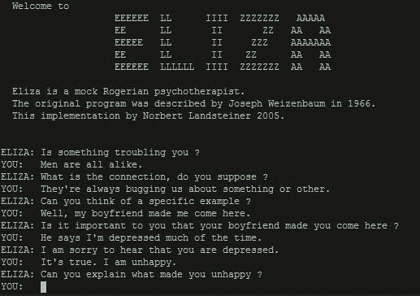

# 告诉我你的秘密

> 原文：<https://dev.to/andreanasuto/tell-me-your-secret-3g9k>

> 我分享一个秘密，你告诉我你的

“告诉我你的秘密”是一个 ROR (Ruby on Rails)应用程序，灵感来自“秘密的未来”艺术展，该艺术展由来自哈佛大学金属实验室的莎拉·纽曼、杰西卡·尤尔科夫斯基和雷切尔·卡尔玛举办，隶属于伯克曼·克莱恩互联网中心&协会。

[真人版](https://tell-me-your-secrets.herokuapp.com/secrets/new)

一个简单的形式要求匿名分享一个秘密。该应用程序会自动存储插入密码的用户的 IP 地址。一旦秘密被写下，另一个秘密连同该秘密的地理位置一起被共享回来。

## 想法

### 背景

这个项目背后的想法是受 1966 年人工智能之父之一麻省理工学院教授 T2 的实验启发的。这个节目展示了机器和人类关系中一个有趣的悖论。

> 虽然伊莱扎能够参与谈话，但她不能真正理解地交谈。然而，许多早期用户相信伊莱扎的智慧和理解，尽管韦岑鲍姆坚持相反。

伊莱扎的用户与它分享了深刻的秘密，并告诉了电脑极其相关的信息。Weizenbaum 很早就发现，与机器交谈是一种解放行为，而不是幽闭恐惧症。

### 机师亲昵

随着互联网和社交媒体平台的普及，这种模式变得越来越重要。数据中心现在是世界上最相关的个人秘密来源之一，主要是因为我们*给*这些信息，就像在伊莱扎实验中一样。
“告诉我你的秘密”是一个通过机器分享秘密的行为是人与人之间的双边互动，而不是单方面和单独的体验。
与此同时，它让人们意识到我们在网上分享了多少私人信息，以及这些信息在数据中心存储了多长时间。