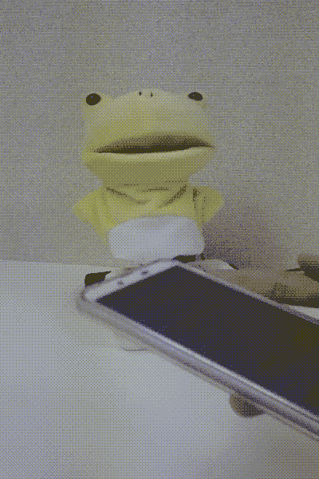
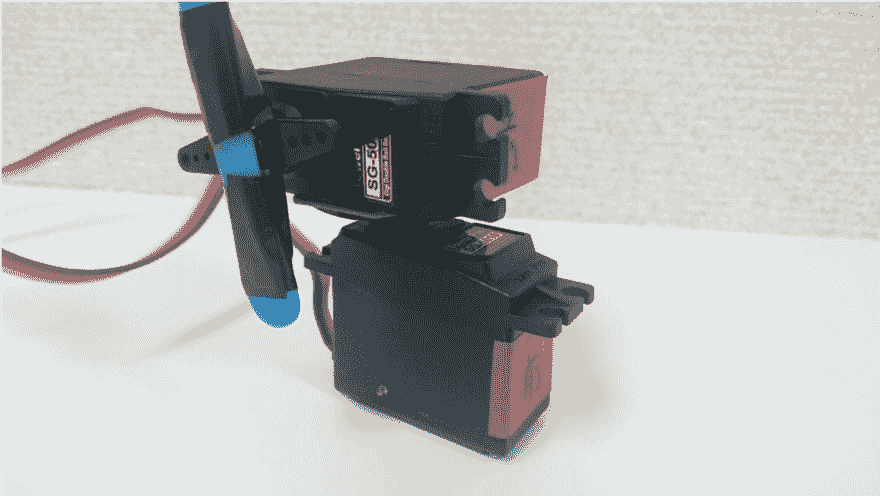

# Tensorflow.js 和 Puppet with PoseNet

> 原文：<https://dev.to/obniz_io/tensorflowjs-and-puppet-with-posenet-50ng>

在这个节目中，木偶娃娃

模仿智能手机的姿势。(使用智能手机内置惯性传感器)
模仿你的脸部姿势。(网络摄像头+ PoseNet 用)
盯着你。
你可以在这三种模式之间切换。

使用了两个伺服电机，在每种模式下，娃娃都可以上下左右变换姿态。

## 材料

*   奥布尼斯
*   微伺服 SG-5010 x 2 件[https://obniz.io/sdk/parts/ServoMotor/README.md?iframe=false](https://obniz.io/sdk/parts/ServoMotor/README.md?iframe=false)
*   销头(两端长)1x 6[http://akizukidenshi.com/catalog/g/gC-09055/](http://akizukidenshi.com/catalog/g/gC-09055/)
*   个人电脑/智能手机(可使用 PoseNet)
*   强力双面胶带
*   木偶娃娃
*   用于固定木偶玩偶和伺服电机的机构。(条形物体、L 形支架等。)
*   基数和重量

## 操作确认

由于智能手机的惯性传感器在模式 1 中使用，而网络摄像头和 PoseNet 在模式 2 或 3 中使用，因此该程序可能无法工作，具体取决于设备。(如果您只想进行以下操作确认，则无需连接 obniz。)

## 惯性传感器的操作确认

执行程序，选择模式 1 并按下设置按钮，然后偏航、俯仰和滚转值显示在屏幕底部“状态”视图中标有“原始:”的行上。
将智能手机保持水平并在水平面上像指南针一样旋转时，如果最左边的值(偏航)在 0 到 360 度之间变化，则工作正常。
我们确认了在这些环境下的操作。

*   Xperia Z3(安卓 6.0) + Chrome
*   AQUOS 手机(安卓 8.0) + Chrome

## pose net 的操作确认

执行程序(需要 HTTPS 连接)，选择模式 2 或 3，等待一段时间，如果摄像头的图像出现，眼睛和鼻子的位置被识别，则工作正常。我们确认了在这些环境下的操作。

*   AQUOS 手机(安卓 8.0) + Chrome
*   MacBook Pro 2017 + Chrome 在智能手机的情况下，在使用相机的模式下，在低速模式下约为 1 fps，在 MacBook Pro 中，约为 10 fps。

## 如何使用

连接 obniz 后，选择模式并按下设置按钮开始运行。在模式 1 下，只有按下启动按钮才能开始操作，以便将智能手机的方向与娃娃对齐。停止按钮按原样停止伺服电机。重置按钮将伺服电机返回到初始位置并停止。
此外，为了防止伺服电机移动不平稳，最大速度和 LPF 可以用杆来调节。LPF 是低通滤波器的系数。右边的滤镜更强，停在最右边。最大速度越小，LPF 越大，伺服电机移动越慢，但反应越慢。如果反过来，反应早了，反而变得粗暴。

## 如何制造(硬件)

电路只是连接两个伺服电机到 obniz。他们可以连接到任何地方，但我连接如下。

偏航方向伺服电机
io0:信号线(黄色)
io1: VCC(红色)
io2: GND(棕色)

俯仰方向伺服电机
io3:信号线(黄色)
io4: VCC(红色)
io5: GND(棕色)

两个伺服电机固定在如图所示的方向，下伺服电机用于偏航轴，上伺服电机用于俯仰轴。
关于伺服电机的固定，必须牢固地连接伺服电机，因为当伺服电机快速移动时，玩偶的惯性产生的力会对伺服电机之间的触点施加很大的力。这次我用的是伺服电机附带的最大的底座，我用的是 3M 的“超强双面胶”，带坐垫。
还有一根蓝色的棍子向上延伸，上面盖着一个娃娃。有必要想办法防止洋娃娃空转。

## 如何制作(软件)

## 模式选择

其类别被指定为“视图-内容-1，2，3”的元素仅在每种模式下显示。您可以使用选择元件从 1 到 3 选择模式。当使用 PoseNet 和开始姿势估计时，按下 SET 按钮根据当时选择的模式值切换显示，并执行 bindPage()。

## 获取惯性传感器值

在模式 1 中，使用设备的惯性传感器值。$(文档)。当 HTML 加载完成时，执行 ready，这里

每次获得设备的姿态时，从 eventData 计算偏航和俯仰，并使其能够在任何时候引用 smp.yaw 和 smp.pitch。由于伺服电机从 0 度旋转到 180 度，因此使用“约束”功能调整该值。

## 用 PoseNet 进行姿态估计

在模式 2 和 3 中，使用网络摄像机和 PoseNet 的姿态估计。我是用这个网站作为参考。
[http://developers.gnavi.co.jp/entry/posenet/hasegawa](http://developers.gnavi.co.jp/entry/posenet/hasegawa)

PoseNet 和网络摄像头的设置是在 bindPage()中完成的；并且用 detectPoseInRealTime(视频，网络)开始姿态估计；
net . estimatessinglepose(video，imageScaleFactor，flipHorizontal，output stride)；实际上是估计姿态的部分。
在绘制点(poses，CTX)；，从姿态估计结果中获取眼睛、鼻子等部位的坐标，并在画布中，在每个部位的位置绘制点及其部位名称。
另外，对于模式 2，简单的用三角函数计算出你脸部方位的偏航和俯仰值，这些值存储在对象“mypose”中。对于模式 3，玩偶应该面对的偏航和俯仰值简单地根据鼻子在屏幕中的位置来计算，并且这些值存储在对象“myposition”中。

## 伺服电机的驱动

伺服电机的角度通过使用 startServo 函数中的 setInterval 函数进行更新。
启动各自模式时，
模式 1...startServo (smp，50)
模式 2...startServo (mypose，100)；
模式 3...分别执行 startServo (myposition，100)
，例如在模式 1 中，参考变量“smp”，每隔 50 毫秒调用一次“更新伺服”功能，根据“smp”的偏航和俯仰值更新伺服电机的角度

伺服电机的角度在此函数中计算并更新:
move servo forward(src . yaw，src.pitch，max_deg，min _ deg)；
在该功能中，一个简单的低通滤波器作为一个程序实现，以平滑伺服电机的运动。lpf_a 是低通滤波器的系数，s_yaw，s_pitch 是伺服电机更新前的偏航和俯仰值。setServo 中有一个直接更新伺服电机角度的函数，同时将该角度赋给 s_yaw 和 s_pitch。

程序
[https://obniz.io/explore/36](https://obniz.io/explore/36)