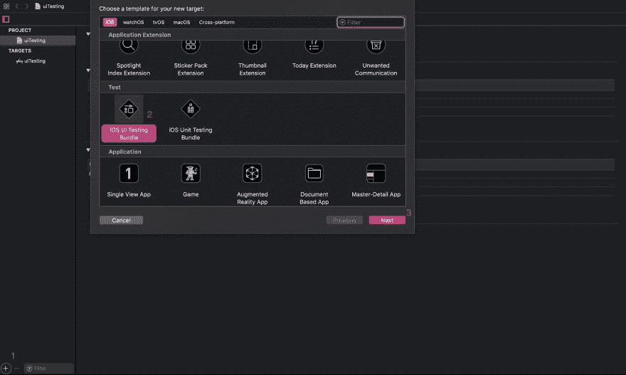
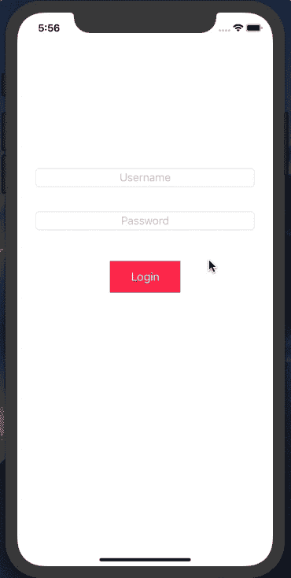
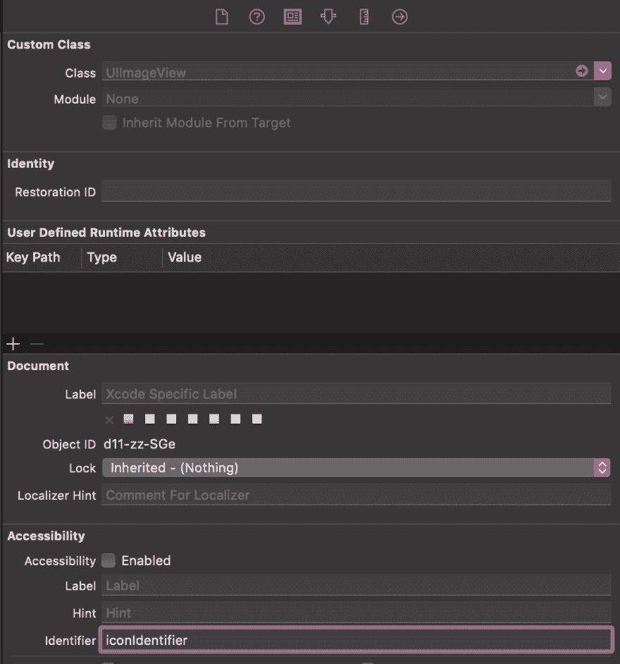
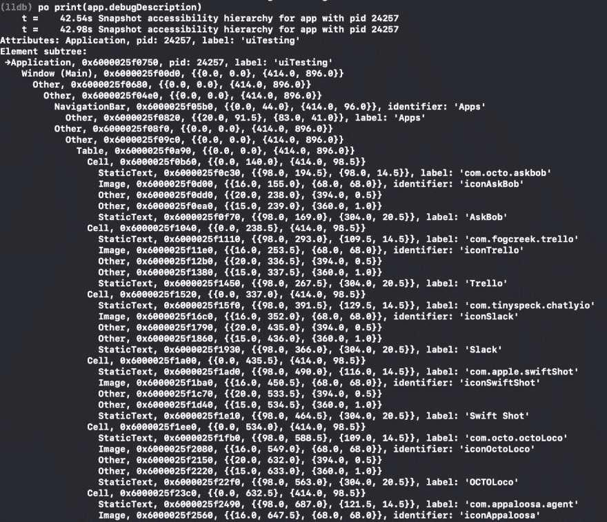

# 测试您的 iOS 应用程序 UI

> 原文：<https://dev.to/appaloosastore/test-your-ios-application-ui-je5>

## [t1【导言】](#introduction)

在本文中，我们将首先解释如何使用 Xcode 编写 UI 测试，然后我们如何添加 visual diff，最后我们如何在 Bitrise 中配置。

### 为什么测试用户界面(UI)？

对于产品发布，测试每一个用例并确保没有回归是很痛苦的。您可能会忘记测试一个流程，或者认为您的更改不会影响代码的其他部分……但有时会😣。这就是我们的 iOS 应用程序在 Appaloosa 发生的情况，有些错误被忽略了。例如，当 iOS 11 发布时，我们在导航栏中添加了约束，但该功能在以前的版本中不可用，并且该应用在 iOS 10 中崩溃。

它很快被发现并修复，但这一警告鼓励我们建立更强有力的流程来防止此类问题。

### UI 测试和单元测试

使用单元测试，您可以独立地测试每一小段代码，并关注代码的逻辑方面。

通过 UI 测试，您可以模拟用户交互和用户流。让我们以一个用户试图登录您的应用程序为例。它将测试用户在整个过程中与我们的应用程序的不同交互。

## 设置📚

在 Xcode 上转到您的项目，点击“+”按钮(见下图)并添加一个 iOS UI 测试包。还将创建一个新的目标。

您也可以在 Xcode 上创建项目时添加它。

## 样本项目

这是一个示例项目。我们希望测试多个用户流，并确保它们都按预期工作。

你可以在 [github](https://github.com/eelbeze/uiTesting) 上找到完整的代码。

目标是确保我们的登录页面在不同的步骤中显示正确的视图。所以我们需要访问页面的不同视图来评估它们在测试中的行为。

有多种方法可以检索应用程序的元素:

*   您可以使用 Xcode 中的录音按钮，它会自动生成您的代码。

*   您可以在视图上添加一个可访问性标识符，以便更容易地访问它。

*   您可以手动编写代码，在这种情况下，您需要知道如何访问元素。您可以在 LLDB 中使用以下命令打印可视屏幕的详细视图层次结构:

*(lldb)采购订单打印(app.debugDescription)*

我更喜欢最后一种方法，代码可读性更强。

## 编写你的第一个 UI 测试

### 使用无效凭证登录:

如果用户输入无效的凭证，我们希望应用程序显示一条错误消息:

让我们看看这在代码中是如何翻译的。