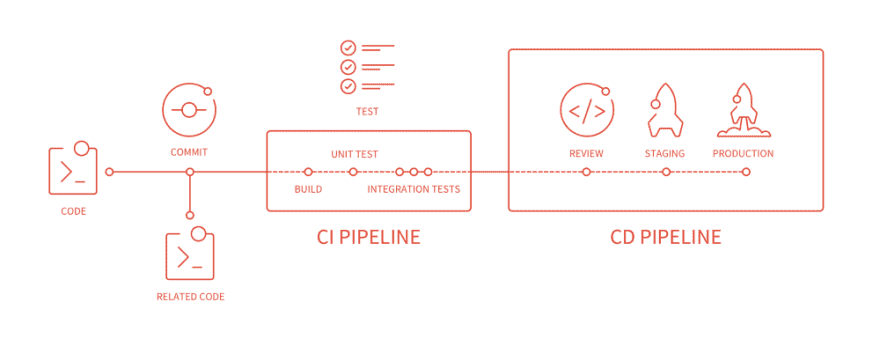

# 在 Hyperledger 结构上测试链码

> 原文：<https://dev.to/wealize/testing-chaincode-on-hyperledger-fabric-2j8k>

[Hyperledger](https://www.hyperledger.org/) 是用于许可网络的区块链工具和框架家族。[我们已经](https://theneonproject.org)使用用 [Hyperledger Fabric](https://www.hyperledger.org/projects/fabric) 构建的解决方案工作了一段时间。

Hyperledger Fabric 是一个复杂的部署系统，在我们配置证书、打开端口或分配角色等时，一定要小心谨慎。幸运的是，如果你有兴趣，你可以阅读 Hyperledger 上的一些好的文档文章来扩展你的知识，比如[如何建立你的第一个网络](https://hyperledger-fabric.readthedocs.io/en/latest/build_network.html)或者[编写你的第一个应用](https://hyperledger-fabric.readthedocs.io/en/latest/write_first_app.html)。

我们的工作流在我们的管道中集成了不同的平台:它从 Github 开始，到 Gitlab CI，最后在 IBM Blockchain 平台上部署智能合约。

今天我们想谈谈使我们开发更快的第一部分，链码的单元、集成和验收测试。

## 测试所有的东西！

我们的核心是自动化测试。[我们在所有项目中应用持续集成和持续交付](https://en.wikipedia.org/wiki/CI/CD)，
所以为我们的链代码创建一个更健壮的测试套件是有意义的。

我们决定使用 go、静态类型、Go 结构和 Hyperledger Fabric 官方存储库中的[示例，使测试变得简单明了。](https://github.com/hyperledger/fabric-test)

为了使 Hyperledger Fabric chaincode 更容易测试，开发人员创建了一个 [MockStub](https://godoc.org/github.com/hyperledger/fabric/core/chaincode/shim#NewMockStub) 结构。mock 是一种模拟功能的服务，因此在测试时不会调用真正的服务。例如，如果我们使用一个服务来发送 SMS，我们不希望我们的测试在每次运行时都发送 SMS，这就是为什么我们通常使用 mock 来模拟我们调用的方法及其响应。仍然有几个命令[没有在一些 MockStub](https://github.com/hyperledger/fabric/blob/release-1.4/core/chaincode/shim/mockstub.go#L282-L293) 所需的 mock 中实现。

## 运行测试

为了在本地运行测试，我们使用一个 *Dockerfile* 来构建我们的环境。 **Dockerfile** 大概是这样的: