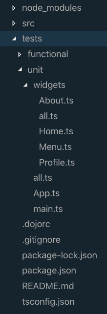
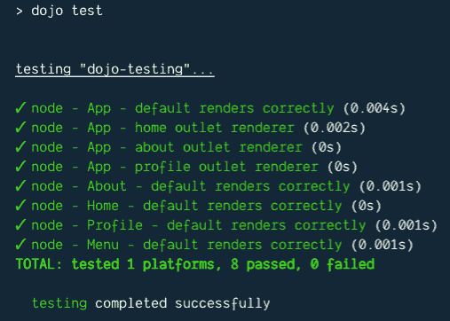

# 使用 Dojo 进行测试

> 原文：<https://dev.to/odoenet/testing-with-dojo-4b0>

当您使用 [Dojo cli](https://github.com/dojo/cli) 创建应用程序时，它附带了一个完整的测试框架供您使用。如果像我一样，你在测试中不够勤奋，没关系，没有测试警察会给你一张传票，*当你试图追查你是如何在你做了一些更新后破坏了一些功能时，只有你自己感到羞耻。我开玩笑，我开玩笑。但是，编写一些测试来确保在编写新代码时不会破坏应用程序的核心功能是一个好主意。*

当您第一次创建 Dojo 应用程序时，它已经为您提供了一些单元测试，您可以将其作为指南。

<figure>

[](https://res.cloudinary.com/practicaldev/image/fetch/s--K6PpC89G--/c_limit%2Cf_auto%2Cfl_progressive%2Cq_auto%2Cw_880/https://thepracticaldev.s3.amazonaws.com/i/a797t0ru930dl3s3dgcd.png)

<figcaption>Default Dojo Installation</figcaption>

</figure>

你可以在 github 上找到这个样本报告[。](https://github.com/odoe/dojo-testing)

让我们看看单元测试是什么样子的。

## 运行测试

您可以使用`npm test`运行这些测试，您应该会得到如下结果。

<figure>

[](https://res.cloudinary.com/practicaldev/image/fetch/s--_aMXQaGR--/c_limit%2Cf_auto%2Cfl_progressive%2Cq_auto%2Cw_880/https://thepracticaldev.s3.amazonaws.com/i/uyf1jcpqtd60p7qyu9h7.png)

<figcaption>Dojo testing results</figcaption>

</figure>

那么这些测试看起来像什么呢？

```
// tests/unit/widgets/Profile.ts
const { describe, it } = intern.getInterface("bdd");
import harness from "@dojo/framework/testing/harness";
import { w, v } from "@dojo/framework/widget-core/d";

import Profile from "../../../src/widgets/Profile";
import * as css from "../../../src/widgets/styles/Profile.m.css";

describe("Profile", () => {
  it("default renders correctly", () => {
    const h = harness(() => w(Profile, { username: "Dojo User" }));
    h.expect(() => v("h1", { classes: [css.root] }, ["Welcome Dojo User!"]));
  });
}); 
```

Enter fullscreen mode Exit fullscreen mode

在测试小部件时，您基本上是在测试小部件的输出是否是您所期望的，尤其是在给定一组属性的情况下。理想情况下，呈现一个小部件应该是 *[纯函数](https://github.com/MostlyAdequate/mostly-adequate-guide/blob/master/ch03.md#chapter-03-pure-happiness-with-pure-functions)* ，这意味着在相同的输入下，它们应该很容易测试。

Dojo 框架附带了一个 [harness](https://github.com/dojo/framework/tree/master/src/testing#harness) 助手，可以用来测试您的小部件。您可以给它一个小部件，并检查虚拟 DOM 输出是否是您所期望的。

*   它是否如预期的那样渲染？
*   子窗口小部件或元素是否按预期呈现？
*   事件处理程序是否按预期工作？

## 断言模板

我们上面测试的 Profile 小部件有一个属性 username，我们可以在输出中测试它。我们可以为每个测试重写整个预期的虚拟 DOM 输出(这需要大量的输入)，或者我们可以创建一个断言来测试，这将允许我们在每次运行时更改预期的属性。

让我们看看这将如何工作。

首先，我需要稍微更新一下 Profile 小部件，因为需要`username`属性。我们可以让它可选，并在小部件中提供一个默认值。

```
// src/widgets/Profile.ts
export interface ProfileProperties {
  username?: string;
}

export default class Profile extends WidgetBase<ProfileProperties> {
  protected render() {
    const { username } = this.properties;
    return v("h1", { classes: [css.root] }, [
      `Welcome ${username || "Stranger"}!`
    ]);
  }
} 
```

Enter fullscreen mode Exit fullscreen mode

反正这样安全一点。现在在我的测试中，我可以创建我的断言模板。

```
// tests/unit/widgets/Profile.ts
// Add the assertionTemplate module
import assertionTemplate from "@dojo/framework/testing/assertionTemplate";
...

// Create my assertion
const profileAssertion = assertionTemplate(() =>
  v("h1", { classes: [css.root], "~key": "welcome" }, ["Welcome Stranger!"])
);

describe("Profile", () => {
  it("default renders correctly", () => {
    const h = harness(() => w(Profile, {}));
    // Test against my base assertion
    h.expect(profileAssertion);
  });
}); 
```

Enter fullscreen mode Exit fullscreen mode

我们可以像以前一样测试我们的基本断言。在我们的断言模板中，我们向节点添加了一个`~key`属性，这样我们就可以更新它的预期输出。在 tsx 文件中，这被称为`assertion-key`。

如果我们给小部件提供一个给定的属性，我们现在可以测试输出。

```
// src/tests/unit/widgets/Profile.ts
describe("Profile", () => {
  it("default renders correctly", () => {
    const h = harness(() => w(Profile, {}));
    h.expect(profileAssertion);
  });

  it("renders given username correctly", () => {
    // update the expected result with a given username
    const namedAssertion = profileAssertion.setChildren("~welcome", [
      "Welcome Kel Varnsen!"
    ]);
    const h = harness(() => w(Profile, { username: "Kel Varnsen" }));
    h.expect(namedAssertion);
  });
}); 
```

Enter fullscreen mode Exit fullscreen mode

`~key`允许我们更新断言模板的预期部分。因此，如果我提供一个`username`，我应该期待一个不同的欢迎消息。`assertionTemplate.setChildren()`返回一个新的断言模板，你可以引用它，这样你就不需要在每次单元测试后重置它，这非常有用，我认为这是对库的一个很好的触动。

您可以在[文档](https://github.com/dojo/framework/tree/master/src/testing#assertion-templates)中阅读更多关于断言模板和其他一些有用方法的内容。

## 总结

这只是对 Dojo 测试的一个快速浏览，但是我认为它突出了所提供的工具对于您测试您的小部件是多么有用！Dojo 测试默认使用 [intern](https://theintern.io/) ，因此您也可以查看关于如何测试应用程序业务逻辑的文档。这里一个额外的好处是，intern 提供了[功能测试](https://theintern.io/docs.html#Intern/4/docs/docs%2Fwriting_tests.md/functional-tests)，所以你可以测试你的应用程序的行为，就像用户与它交互一样。这需要一篇自己的博文，但是你可以看看 [Dojo todo-mvc 示例](https://github.com/dojo/examples/tree/master/todo-mvc)来了解它是如何使用功能测试的。

现在我知道每个人都要出去为他们所有的代码编写单元测试！

请务必[订阅时事通讯](https://learn-dojo.com/sign-up/)，了解最新内容！