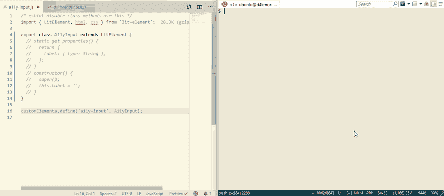
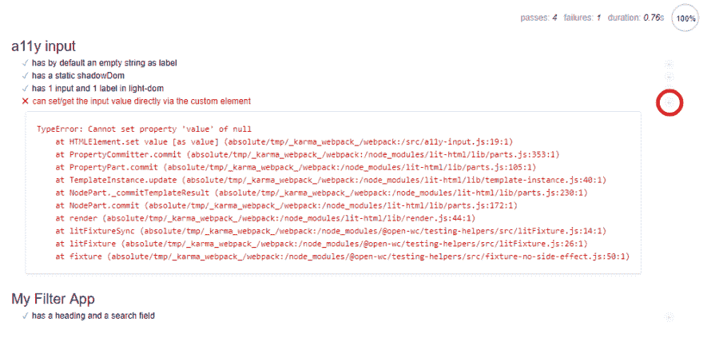
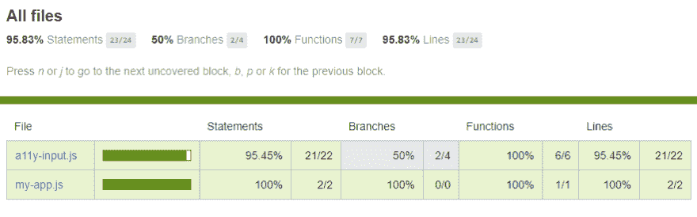
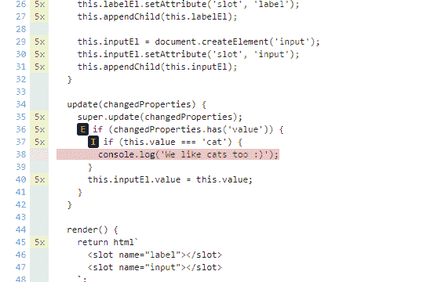
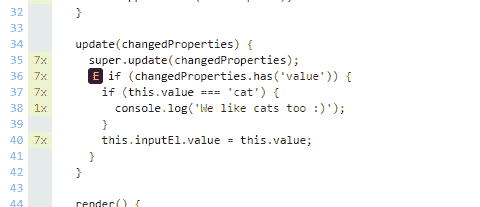

# Web 组件的测试工作流

> 原文：<https://dev.to/open-wc/testing-workflow-for-web-components-g73>

每当你发布一些东西供他人使用时，你就承担了交付安全稳定代码的责任。解决这个问题的一个方法是测试您的代码。

不管你的项目有多小——不管它有多简单，理想情况下总是应该有测试。

> 是的，我知道现实打击很大，会有很多情况下不会发生这种情况——但是你应该一直努力去做测试

### 免责声明

在本教程中，我们将制作一个简单版本的输入元素。在课程结束时，你将获得将开放厕所测试工具付诸实践的技能和知识；并构建一个可靠的、可访问的、经过良好测试的输入组件。

### 警告

这是一个深入的教程，展示了使用 web 组件时的一些陷阱和棘手情况。这个绝对是给更高级的用户用的。你应该对 [LitElement](https://lit-element.polymer-project.org/) 和 [JSDoc 类型](https://dev.to/dakmor/type-safe-web-components-with-jsdoc-4icf)有一个基本的了解。了解一下什么是[摩卡](https://mochajs.org/)、[柴 BDD](https://www.chaijs.com/api/bdd/) 、[因缘](https://karma-runner.github.io/latest/index.html)可能也会有所帮助。

> 我们正在考虑发布一个更容易理解的版本，所以如果你想看的话，请在评论中告诉我们。

如果你想一起玩——所有的代码都在 [github](https://github.com/daKmoR/testing-workflow-for-web-components) 上。

## 我们开始吧！

在您的控制台中运行

```
$ npm init @open-wc

# Results in this flow
✔ What would you like to do today? › Scaffold a new project
✔ What would you like to scaffold? › Web Component
# Select with space! "Testing" => just enter will move one with no selection
✔ What would you like to add? › Testing
✔ Would you like to scaffold examples files for? › Testing
✔ What is the tag name of your application/web component? … a11y-input
✔ Do you want to write this file structure to disk? › Yes
Writing..... done
✔ Do you want to install dependencies? › No 
```

更多详情请见[https://open-wc.org/testing/](https://open-wc.org/testing/)。

删除`src/A11yInput.js`

将`src/a11y-input.js`修改为:

```
import { LitElement, html, css } from 'lit-element';

export class A11yInput extends LitElement {}

customElements.define('a11y-input', A11yInput); 
```

和`test/a11y-input.test.js`到

```
/* eslint-disable no-unused-expressions */
import { html, fixture, expect } from '@open-wc/testing';

import '../src/a11y-input.js';

/**
 * @typedef {import('../src/a11y-input.js').A11yInput} A11yInput
 */

describe('a11y input', () => {
  it('has by default an empty string as label', async () => {
    const el = /** @type {A11yInput} */ (await fixture('<a11y-input></a11y-input>'));
    expect(el.label).to.equal('');
  });
}); 
```

到目前为止，我们的测试由单个特性(`label`属性)和单个断言(`expect`)组成。我们使用 karma 和 chai 的 <abbr title="behaviour/business-driven-development">BDD</abbr> 语法，所以我们将测试集(`it`)分组到它们相关的特性或 API 之下(`describe`)。

让我们通过运行:`npm run test`来看看一切是否正常。

```
SUMMARY:
✔ 0 tests completed
✖ 1 test failed

FAILED TESTS:
  a11y input
    ✖ has by default an empty string as label
      HeadlessChrome 73.0.3683 (Windows 10.0.0)
    AssertionError: expected undefined to equal ''

      + expected - actual

      -[undefined]
      +"" 
```

太棒了-正如所料(🥁)，我们有一个失败的测试:)

让我们切换到监视模式，每当您对代码进行更改时，它都会连续运行测试。

`npm run test:watch`

[](https://res.cloudinary.com/practicaldev/image/fetch/s--aypF8HSr--/c_limit%2Cf_auto%2Cfl_progressive%2Cq_66%2Cw_880/https://github.com/daKmoR/testing-workflow-for-web-components/raw/mastimg/01-watch-mode-intro.gif)

在上面的视频中，以下代码被添加到`src/a11y-input.js` :

```
static get properties() {
  return {
    label: { type: String },
  };
}

constructor() {
  super();
  this.label = '';
} 
```

到目前为止，一切顺利吗？还和我们在一起吗？太好了！让我们把游戏升级一点...

### 为阴影 DOM 添加测试

让我们添加一个断言来测试元素的影子根的内容。

如果我们想确保我们的元素行为/外观相同，我们应该确保它的 dom 结构保持不变。所以让我们比较一下实际的阴影 dom 和我们想要的。

```
it('has a static shadowDom', async () => {
  const el = /** @type {A11yInput} */ (await fixture(html`
    <a11y-input></a11y-input>
  `));
  expect(el.shadowRoot.innerHTML).to.equal(`
    <slot name="label"></slot>
    <slot name="input"></slot>
  `);
}); 
```

不出所料，我们得到:

```
✖ has a static shadowDom
AssertionError: expected '' to equal '\n      <slot name="label"></slot>\n      <slot name="input"></slot>\n    '

  + expected - actual

  +
  +      <slot name="label"></slot>
  +      <slot name="input"></slot>
  + 
```

让我们在元素中实现它。

```
render() {
  return html`
    <slot name="label"></slot>
    <slot name="input"></slot>
  `;
} 
```

有意思，测试应该是绿色的...但事实并非如此🤔让我们来看看。

```
✖ has a static shadowDom
AssertionError: expected '<!---->\n      <slot name="label"></slot>\n      <slot name="input"></slot>\n    <!---->' to equal '\n        <slot name="label"></slot>\n        <slot name="input"></slot>\n    '

  + expected - actual

  -<!---->
  -      <slot name="label"></slot>
  -      <slot name="input"></slot>
  -    <!---->
  +
  +        <slot name="label"></slot>
  +        <slot name="input"></slot>
  + 
```

你可能已经注意到了那些奇怪的空评论`<!---->`标签。它们是标记符，`lit-html`用它们来记住动态部分在哪里，所以它可以被有效地更新。然而，对于测试来说，这可能有点令人讨厌。

如果我们使用`innerHTML`来比较 DOM，我们将不得不依赖简单的字符串等式。在这种情况下，我们必须精确匹配生成的 DOM 的空白、注释等；换句话说:它需要是一个完美的匹配。实际上，我们需要测试的只是我们想要呈现的元素被呈现了。我们想要测试影子根的语义内容。

幸运的是，我们已经帮你搞定了。如果你使用的是`@open-wc/testing`，那么它会自动加载`@open-wc/semantic-dom-diff` chai 插件供我们使用。

所以让我们来试试吧💪

```
// old:
expect(el.shadowRoot.innerHTML).to.equal(`...`);

// new:
expect(el).shadowDom.to.equal(`
  <slot name="label"></slot>
  <slot name="input"></slot>
`); 
```

嘣🎉

```
a11y input
  ✔ has by default an empty string as a label
  ✔ has a static shadowDom 
```

### shadowdom . to . equal()是如何工作的？

1.  它获取影子根的`innerHTML`
2.  解析它(实际上，浏览器解析它——不需要库)
3.  规范化它(可能每个标签/属性都在自己的行上)
4.  解析并规范化预期的 HTML 字符串
5.  将两个规范化的 DOM 字符串传递给 chai 的默认比较函数
6.  如果失败，以清晰的方式分组并显示任何差异

如果你想了解更多，请查阅 [semantic-dom-diff](https://open-wc.org/testing/semantic-dom-diff.html) 的文档。

### 测试“光”DOM

我们可以用光 DOM 做完全相同的事情。(DOM 将由我们的用户或我们的默认值提供，即元素的`children`)。

```
it('has 1 input and 1 label in light-dom', async () => {
  const el = /** @type {A11yInput} */ (await fixture(html`
    <a11y-input .label=${'foo'}></a11y-input>
  `));
  expect(el).lightDom.to.equal(`
    <label slot="label">foo</label>
    <input slot="input">
  `);
}); 
```

让我们来实现它。

```
connectedCallback() {
  super.connectedCallback();
  this.labelEl = document.createElement('label');
  this.labelEl.innerText = this.label;
  this.labelEl.setAttribute('slot', 'label');
  this.appendChild(this.labelEl);

  this.inputEl = document.createElement('input');
  this.inputEl.setAttribute('slot', 'input');
  this.appendChild(this.inputEl);
} 
```

所以我们测试了我们的光影 dom💪我们的测试没有问题🎉

> 注意:在 lit-element 的生命周期中使用 DOM API 是一种反模式，但是考虑到 <abbr title="accessibility">a11y</abbr> 这可能是一个真实的用例——无论如何，这对于演示来说是很好的

### 在应用程序中使用我们的元素

现在我们有了一个基本的 a11y 输入，让我们在我们的应用程序中使用并测试它。

我们再次从骨架`src/my-app.js`
开始

```
/* eslint-disable class-methods-use-this */
import { LitElement, html, css } from 'lit-element';

export class MyApp extends LitElement {}

customElements.define('my-app', MyApp); 
```

还有我们在`test/my-app.test.js`的测试；

```
/* eslint-disable no-unused-expressions */
import { html, fixture, expect } from '@open-wc/testing';

import '../src/my-app.js';

/**
 * @typedef {import('../src/my-app.js').MyApp} MyApp
 */

describe('My Filter App', () => {
  it('has a heading and a search field', async () => {
    const el = /** @type {MyApp} */ (await fixture(html`
      <my-app .label=${'foo'}></my-app>
    `));
    expect(el).shadowDom.to.equal(`
      <h1>My Filter App</h1>
      <a11y-input></a11y-input>
    `);
  });
}); 
```

运行测试= >失败，然后我们将实现添加到`src/a11y-input.js`

```
render() {
  return html`
    <h1>My Filter App</h1>
    <a11y-input></a11y-input>
  `;
} 
```

但是哦不！现在应该是绿色的了...

```
SUMMARY:
✔ 3 tests completed
✖ 1 test failed

FAILED TESTS:
  My Filter App
    ✖ has a heading and a search field
    AssertionError: expected '<h1>\n  My Filter App\n</h1>\n<a11y-input>\n  <label slot="label">\n  </label>\n  <input slot="input">\n</a11y-input>\n' to equal '<h1>\n  My Filter App\n</h1>\n<a11y-input>\n</a11y-input>\n'

      + expected - actual

       <h1>
         My Filter App
       </h1>
       <a11y-input>
      -  <label slot="label">
      -  </label>
      -  <input slot="input">
       </a11y-input> 
```

发生了什么事？
您还记得我们进行了一项特定的测试来确保 a11y 输入的亮度吗？
所以即使用户只把`<a11y-input></a11y-input>`放在他的代码中——实际出来的是

```
<a11y-input>
  <label slot="label"></label>
  <input slot="input">
</a11y-input> 
```

例如，`a11y-input`实际上是在你的`my-app`影子 dom 中创建节点。荒谬！对于我们的例子，我们说这就是我们想要的。
那我们还怎么测试它呢？

幸运的是`.shadowDom`还有另一张王牌；它允许我们忽略 dom 的某些部分。

```
expect(el).shadowDom.to.equal(`
  <h1>My Filter App</h1>
  <a11y-input></a11y-input>
`, { ignoreChildren: ['a11y-input'] }); 
```

我们甚至还可以指定以下属性:

*   `ignoreChildren`
*   `ignoreTags`
*   `ignoreAttributes`(全局或特定标签)

更多详情请见 [semantic-dom-diff](https://open-wc.org/testing/semantic-dom-diff.html) 。

#### 快照测试

如果你有很多大的 dom 树，那么编写/维护所有这些手工编写的东西将会很困难。为了帮助您，我们提供了半自动快照。

所以如果我们改变代码

```
// from
expect(el).shadowDom.to.equal(`
  <slot name="label"></slot>
  <slot name="input"></slot>
`);

// to
expect(el).shadowDom.to.equalSnapshot(); 
```

如果我们现在执行`npm run test`,它将创建一个文件`__snapshots__/a11y input.md`,并用类似于
的东西填充它

```
# `a11y input`

#### `has a static shadowDom`

``html
<slot name="label">
</slot>
<slot name="input">
</slot>

`` 
```

我们以前手写的东西现在可以在 init 上自动生成或者通过`npm run test:update-snapshots`强制生成。

如果文件`__snapshots__/a11y input.md`已经存在，它将与输出进行比较，如果你的 html 输出改变，你将得到错误。

```
FAILED TESTS:
  a11y input
    ✖ has a static shadowDom
      HeadlessChrome 73.0.3683 (Windows 10.0.0)
    AssertionError: Received value does not match stored snapshot 0

      + expected - actual

      -<slot name="label-wrong">
      +<slot name="label">
       </slot>
       <slot name="input">
      -</slot>
      +</slot> 
```

更多详情请见 [semantic-dom-diff](https://open-wc.org/testing/semantic-dom-diff.html) 。

我认为现在关于 dom 树的比较已经足够了...是改变的时候了🤗

### 代码覆盖率

当使用 open-wc 设置进行测试时，我们得到的另一个有用的度量是代码覆盖率。
那么这意味着什么，我们如何才能得到它呢？[代码覆盖率](https://www.wikiwand.com/en/Code_coverage)是对*多少*代码被测试检查的度量。如果有一行、语句、函数或分支(例如`if` / `else`语句)我们的测试没有覆盖我们的覆盖率，那么它将会受到影响。
一个简单的`npm run test`是我们所需要的，你会得到以下:

```
=============================== Coverage summary ===============================
Statements   : 100% ( 15/15 )
Branches     : 100% ( 0/0 )
Functions    : 100% ( 5/5 )
Lines        : 100% ( 15/15 )
================================================================================ 
```

这意味着 100%的代码语句、分支、函数和代码行都被测试覆盖。相当整洁！

所以让我们走另一条路，在添加测试之前向`src/a11y-input.js`添加代码。假设我们想通过自定义元素直接访问输入的值，当它的值为“cat”时，我们想记录一些东西。

```
get value() {
  return this.inputEl.value;
}

set value(newValue) {
  if (newValue === 'cat') {
    console.log('We like cats too :)');
  }
  this.inputEl.value = newValue;
} 
```

这是一个非常不同的结果

```
SUMMARY:
✔ 4 tests completed
TOTAL: 4 SUCCESS

=============================== Coverage summary ===============================
Statements   : 81.82% ( 18/22 )
Branches     : 0% ( 0/2 )
Functions    : 75% ( 6/8 )
Lines        : 81.82% ( 18/22 )
================================================================================
06 04 2019 10:40:45.380:ERROR [reporter.coverage-istanbul]: Coverage for statements (81.82%) does not meet global threshold (90%)
06 04 2019 10:40:45.381:ERROR [reporter.coverage-istanbul]: Coverage for lines (81.82%) does not meet global threshold (90%)
06 04 2019 10:40:45.381:ERROR [reporter.coverage-istanbul]: Coverage for branches (0%) does not meet global threshold (90%)
06 04 2019 10:40:45.381:ERROR [reporter.coverage-istanbul]: Coverage for functions (75%) does not meet global threshold (90%) 
```

我们的覆盖率比以前低多了。我们的测试命令甚至会失败，尽管所有的测试都成功运行了。这是因为默认情况下，open-wc 的配置为代码覆盖率设置了 90%的阈值。

如果我们想提高覆盖率，我们需要增加测试——让我们开始吧

```
it('can set/get the input value directly via the custom element', async () => {
  const el = /** @type {A11yInput} */ (await fixture(html`
    <a11y-input .value=${'foo'}></a11y-input>
  `));
  expect(el.value).to.equal('foo');
}); 
```

哦哦😱我们想提高覆盖率，但现在我们需要先修复一个实际的 bug😞

```
FAILED TESTS:
  a11y input
    ✖ can set/get the input value directly via the custom element
    TypeError: Cannot set property 'value' of null        at HTMLElement.set value [as value]
    // ... => long error stack 
```

那是意想不到的...乍一看，我真的不知道那是什么意思...最好检查一些实际的节点，并在浏览器中检查它们。

### 在浏览器中调试

当我们用 watch 运行测试时，karma 设置了一个持久的浏览器环境来运行测试。

*   确保您从`npm run test:watch`开始
*   访问[http://localhost:9876/debug . html](http://localhost:9876/debug.html)

你应该看到类似这样的
[](https://res.cloudinary.com/practicaldev/image/fetch/s--DUjvH0ND--/c_limit%2Cf_auto%2Cfl_progressive%2Cq_auto%2Cw_880/https://github.com/daKmoR/testing-workflow-for-web-components/raw/mastimg/02-debugging-in-browser.png)

您可以单击带圈的播放按钮，只运行一个单独的测试。

因此，让我们打开 Chrome 开发工具(F12)并在测试代码中放置一个调试器。

```
it('can set/get the input value directly via the custom element', async () => {
  const el = /** @type {A11yInput} */ (await fixture(html`
    <a11y-input .value=${'foo'}></a11y-input>
  `));
  debugger;
  expect(el.value).to.equal('foo');
}); 
```

使受地狱之苦..错误甚至发生在这一点之前...像这样的“致命”错误有点棘手，因为它们不是测试失败，而是你的整个组件完全崩溃。

好了，我们直接在`setter`里放点代码吧。

```
set value(newValue) {
  debugger; 
```

好的，这很有效，所以我们的 chrome 控制台我们写`console.log(this)`让我们看看这里有什么

```
<a11y-input>
  #shadow-root (open)
</a11y-input> 
```

啊，我们看到了——当 setter 被调用时，阴影 dom 还没有被渲染。
所以为了安全起见，在
之前加一个检查

```
set value(newValue) {
  if (newValue === 'cat') {
    console.log('We like cats too :)');
  }
  if (this.inputEl) {
    this.inputEl.value = newValue;
  }
} 
```

致命错误消失了🎉但是我们现在有一个失败的测试😭

```
✖ can set/get the input value directly via the custom element
AssertionError: expected '' to equal 'foo' 
```

我们可能需要改变策略🤔
我们可以把它作为一个单独的`value`属性添加进去，需要的时候同步。

```
static get properties() {
  return {
    label: { type: String },
    value: { type: String },
  };
}

constructor() {
  super();
  this.label = '';
  this.value = '';
  // ...
}

update(changedProperties) {
  super.update(changedProperties);
  if (changedProperties.has('value')) {
    if (this.value === 'cat') {
      console.log('We like cats too :)');
    }
    this.inputEl.value = this.value;
  }
} 
```

我们终于重操旧业了！🎉

好的错误修复-我们能回到覆盖范围吗？谢谢你🙏

### 返回覆盖范围

通过这个额外的测试，我们取得了一些进展。

```
=============================== Coverage summary ===============================
Statements   : 95.83% ( 23/24 )
Branches     : 50% ( 2/4 )
Functions    : 100% ( 7/7 )
Lines        : 95.83% ( 23/24 )
================================================================================
06 04 2019 13:18:54.902:ERROR [reporter.coverage-istanbul]: Coverage for branches (50%) does not meet global threshold (90%) 
```

然而，我们还没有完全达到目标——问题是为什么？

在浏览器中打开`coverage/index.html`,找出答案。不需要网络服务器，只需要在你的浏览器中打开文件——在 mac 上，你可以在命令行中使用`open coverage/index.html`来打开文件

你会看到类似这样的东西

[](https://res.cloudinary.com/practicaldev/image/fetch/s--fhMhiSR2--/c_limit%2Cf_auto%2Cfl_progressive%2Cq_auto%2Cw_880/https://github.com/daKmoR/testing-workflow-for-web-components/raw/mastimg/03-coverage-overview.png)

一旦你点击`a11y-input.js`，你会得到一行一行的信息，它们被执行的频率。
因此我们可以立即看到哪些行还没有被我们的测试执行。

[](https://res.cloudinary.com/practicaldev/image/fetch/s--Tw2vahqg--/c_limit%2Cf_auto%2Cfl_progressive%2Cq_auto%2Cw_880/https://github.com/daKmoR/testing-workflow-for-web-components/raw/mastimg/04-coverage-line-by-line.png)

所以让我们为这个
添加一个测试

```
it('logs "We like cats too :)" if the value is "cat"', async () => {
  const el = /** @type {A11yInput} */ (await fixture(html`
    <a11y-input .value=${'cat'}></a11y-input>
  `));
  // somehow check that console.log was called
}); 
```

```
=============================== Coverage summary ===============================
Statements   : 100% ( 24/24 )
Branches     : 75% ( 3/4 )
Functions    : 100% ( 7/7 )
Lines        : 100% ( 24/24 )
================================================================================ 
```

这样，我们回到了 100%的报表上，但是我们在分支上仍然缺少一些东西。
让我们看看为什么？

[](https://res.cloudinary.com/practicaldev/image/fetch/s--O_FH3PqR--/c_limit%2Cf_auto%2Cfl_progressive%2Cq_auto%2Cw_880/https://github.com/daKmoR/testing-workflow-for-web-components/raw/mastimg/05-coverage-line-by-line-else.png)

这个`E`就是`else path not taken`的意思。
所以每当函数`update`被调用时，changedProperties 中总会有一个属性`value`。

我们也有`label`，所以测试一下是个好主意。👍

```
it('can update its label', async () => {
  const el = /** @type {A11yInput} */ (await fixture('<a11y-input label="foo"></a11y-input>'));
  expect(el.label).to.equal('foo');
  el.label = 'bar';
  expect(el.label).to.equal('bar');
}); 
```

吊杆 100%💪我们赢了🥇

```
=============================== Coverage summary ===============================
Statements   : 100% ( 24/24 )
Branches     : 100% ( 4/4 )
Functions    : 100% ( 7/7 )
Lines        : 100% ( 24/24 )
================================================================================ 
```

但是等等我们甚至没有完成上面的测试——代码仍然是

```
 // somehow check that console.log was called 
```

#### 为什么我们有 100%的测试覆盖率？

让我们首先尝试理解代码覆盖是如何工作的🤔
测量代码覆盖率的方法是应用一种形式的`instrumentation`。简而言之，在我们的代码被执行之前，它发生了变化(`instrumented`)，其行为如下:

**注:**这是一个超级简化版本，用于说明目的。

```
if (this.value === 'cat') {
  console.log('We like cats too :)');
}

// becomes something like this (psoido code)
__instrumented['functionUpdate'] += 1;
if (this.value === 'cat') {
  __instrumented['functionUpdateBranch1yes'] += 1;
  console.log('We like cats too :)');
} else {
  __instrumented['functionUpdateBranch1no'] += 1;
} 
```

基本上，你的代码被很多很多的标志弄得乱七八糟。基于哪些标志被触发，统计信息被创建。

所以 100%的测试覆盖率仅仅意味着你代码中的每一行在所有测试完成后都至少被执行了一次。这并不意味着你测试了所有的东西，或者你的测试做出了正确的断言。

所以即使我们已经有了 100%的代码覆盖率，我们仍然要改进我们的日志测试。

因此，您应该将代码覆盖率视为一种工具，它只是在发现一些缺失的测试方面为您提供指导和帮助，而不是代码质量的硬性保证。

### 刺探代码

如果你想检查一个函数被调用的频率或参数，这就是所谓的刺探。open-wc 推荐古老的 [sinon](https://sinonjs.org/) 套装，它提供了许多间谍和其他相关任务的工具。

```
npm i -D sinon 
```

所以你在一个特定的对象上创建一个 spy，然后你可以检查它被调用的频率。

```
import sinon from 'sinon';

it('outputs "We like cats too :)" if the value is set to "cat"', async () => {
  const logSpy = sinon.spy(console, 'log');
  const el = /** @type {A11yInput} */ (await fixture(html`
    <a11y-input></a11y-input>
  `));

  el.value = 'cat';
  expect(logSpy.callCount).to.equal(1);
}); 
```

哦哦...测试失败:

```
AssertionError: expected 0 to equal 1 
```

搞乱像`console`这样的全局对象可能会有[副作用](https://gyandeeps.com/console-stubbing/)，所以让我们使用一个专用的日志函数来更好地重构。

```
update(changedProperties) {
  super.update(changedProperties);
  if (changedProperties.has('value')) {
    if (this.value === 'cat') {
      this.log('We like cats too :)');
    }
    this.inputEl.value = this.value;
  }
}

log(msg) {
  console.log(msg);
} 
```

这导致我们测试代码中没有全局对象——sweet🤗

```
it('logs "We like cats too :)" if the value is set to "cat"', async () => {
  const el = /** @type {A11yInput} */ (await fixture(html`
    <a11y-input></a11y-input>
  `));
  const logSpy = sinon.spy(el, 'log');

  el.value = 'cat';
  expect(logSpy.callCount).to.equal(1);
}); 
```

然而，我们仍然得到同样的错误。让我们调试一下...很明显，boohoo`update`不是同步的——我做了一个错误的假设🙈我经常说*假设是危险的*——但我仍不时地上当😢。

那么我们能做什么呢？遗憾的是，似乎没有公共 api 来完成一些由属性更新触发的同步操作。
让我们为它制造一个问题[https://github.com/Polymer/lit-element/issues/643](https://github.com/Polymer/lit-element/issues/643)。

显然，目前唯一的方法是依靠私有的 T2 API。🙈
此外，我们需要将值 sync 移动到`updated`，以便在每次 dom 渲染后执行。

```
_requestUpdate(name, oldValue) {
  super._requestUpdate(name, oldValue);
  if (name === 'value') {
    if (this.value === 'cat') {
      this.log('We like cats too :)');
    }
  }
}

updated(changedProperties) {
  super.updated(changedProperties);
  if (changedProperties.has('value')) {
    this.inputEl.value = this.value;
  }
} 
```

这是更新后的日志测试

```
it('logs "We like cats too :)" if the value is set to "cat"', async () => {
  const el = /** @type {A11yInput} */ (await fixture(html`
    <a11y-input></a11y-input>
  `));
  const logSpy = sinon.spy(el, 'log');

  el.value = 'cat';
  expect(logSpy.callCount).to.equal(1);
  expect(logSpy.calledWith('We like cats too :)')).to.be.true;

  // different values do NOT log
  el.value = 'foo';
  expect(logSpy.callCount).to.equal(1);

  el.value = 'cat';
  expect(logSpy.callCount).to.equal(2);
}); 
```

哇，这比预期的要难一点，但是我们做到了💪

```
SUMMARY:
✔ 7 tests completed
TOTAL: 7 SUCCESS 
```

### 运行没有 Karma 框架的测试

Karma 框架功能强大，特性丰富，但是有时我们可能想要削减我们的测试团队。到目前为止，我们提出的每件事情的好处是，我们只使用了浏览器标准的 es 模块，不需要编译，[除了裸模块说明符](https://open-wc.org/about/rationales.html#workflows)。
所以只要创建一个`test/index.html`。

```
<!DOCTYPE html>
<html>
<head>
  <meta charset="utf-8">
  <link href="../node_modules/mocha/mocha.css" rel="stylesheet" />
  <script src="../node_modules/mocha/mocha.js"></script>
  <script src="../node_modules/@webcomponents/webcomponentsjs/webcomponents-bundle.js"></script>
</head>
<body>
  <div id="mocha"></div>
  <script>
    mocha.setup('bdd');
  </script>

  <script type="module">
    import './a11y-input.test.js';
    import './my-app.test.js';

    mocha.checkLeaks();
    mocha.run();
  </script>
</body>
</html> 
```

在 chrome 中通过`owc-dev-server`打开它，它会工作得非常好。
没有`webpack`或`karma`，我们的一切都正常运转——太棒了🤗

### 做跨浏览器的事情

我们现在对我们的 web 组件感到非常满意。它经过测试和覆盖；还有一步——我们要确保它能在所有浏览器中运行和测试。

Open WC 推荐 [Browserstack](https://www.browserstack.com/) 进行跨浏览器测试。如果你还没有设置它，你现在可以做了——这是再次链接——【https://open-wc.org/testing/[。](https://open-wc.org/testing/)

所以让我们运行它

```
npm run test:bs

SUMMARY:
✔ 42 tests completed
TOTAL: 42 SUCCESS 
```

是的，这很好！🤗

如果有失败的测试，它将在摘要中输出它们，并显示失败的浏览器。

```
SUMMARY:
✔ 40 tests completed
✖ 2 tests failed

FAILED TESTS:
  a11y input
    ✖ has a static shadowDom
      Firefox 64.0.0 (Windows 10.0.0)
      Safari 12.0.0 (Mac OS X 10.14.0)
    expected '<slot name="label">\n</slot>\n<slot name="input">\n</slot>\n<style>\n</style>\n' to equal '<slot name="label">\n</slot>\n<slot name="input">\n</slot>\n'

      + expected - actual

       <slot name="label">
       </slot>
       <slot name="input">
       </slot>
      -<style>
      -</style> 
```

如果您需要调试特定的浏览器:

*   `npm run test:legacy:watch`
*   使用该浏览器访问[http://localhost:9876/debug . html](http://localhost:9876/debug.html)(本地或通过 browserstack)
*   选择一个特定的测试(或在代码中使用`it.only()`)
*   开始调试

另外，如果你想调整被测试的浏览器，你可以调整你的`karma.bs.config.js`。

例如，如果您想将`Firefox ESR`添加到您的列表中。

```
module.exports = config => {
  config.set(
    merge(bsSettings(config), createBaseConfig(config), {
      browserStack: {
        project: 'testing-workflow-for-web-components',
      },
      browsers: [
        'bs_win10_firefox_ESR',
      ],
      // define browsers
      // https://www.browserstack.com/automate/capabilities
      customLaunchers: {
        bs_win10_firefox_ESR: {
          base: 'BrowserStack',
          browser: 'Firefox',
          browser_version: '60',
          os: 'Windows',
          os_version: '10',
        },
      },
    }),
  );

  return config;
}; 
```

或者您可能只想测试两种特定的浏览器？

```
merge.strategy({
  browsers: 'replace',
})(bsSettings(config), createBaseConfig(config), {
  browserStack: {
    project: 'testing-workflow-for-web-components',
  },
  browsers: [
    'bs_win10_ie_11',
    'bs_win10_firefox_ESR',
  ],
}), 
```

**注意:**这使用了 [webpack 合并策略](https://github.com/survivejs/webpack-merge#merging-with-strategies)替换。

## 快速回顾

*   测试对每个项目都很重要。一定要尽量多写。
*   尽量保持你的代码覆盖率高，但是记住这不是一个神奇的保证，所以不需要总是 100%。
*   通过`npm run test:watch`在浏览器中调试。对于传统浏览器，使用`npm run test:legacy.watch`。

## 接下来是什么？

*   在您的配置项中运行测试(与 browserstack 配合得非常好)。查看我们在[自动化](https://open-wc.org/automating/)的建议。

在[推特](https://twitter.com/openwc)上关注我们，或者在我的个人[推特](https://twitter.com/dakmor)上关注我。
请务必在[open-wc.org](https://open-wc.org)查看我们的其他工具和建议。

感谢[帕斯卡](https://dev.to/thepassle)和[本尼](https://dev.to/bennypowers)的反馈，并帮助把我的涂鸦变成一个后续的故事。