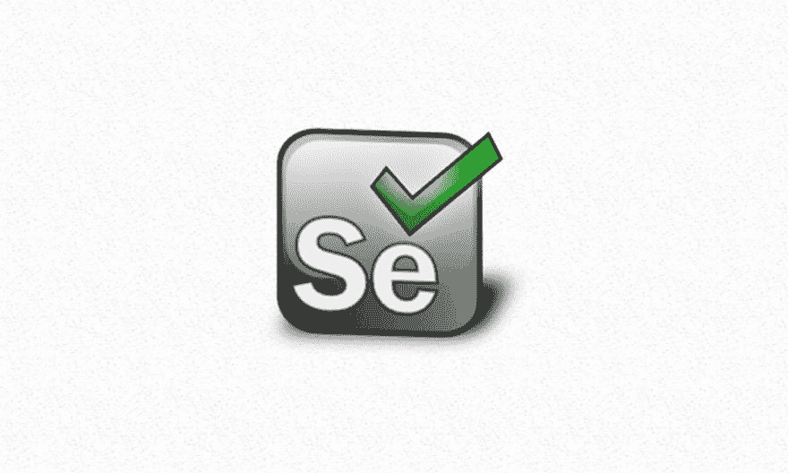

# 使用 Cypress.io 框架测试您的前端

> 原文：<https://dev.to/couellet/testing-your-frontend-with-cypressio-framework-3no4>

> 编者按:这是我们的朋友迈克尔·亚古达耶夫的客座博文，他是 [Nano 3 实验室](http://nano3labs.com/)的创始人。在过去的 7 年里，他作为一名软件工程师、UX 设计师和项目经理，与初创科技公司、大中型企业合作。

现代 JavaScript 框架提供了一种更容易、更有组织的方式来创建 web 应用程序。然而，[它们也增加了复杂性](https://snipcart.com/blog/learn-vanilla-javascript-before-using-js-frameworks),有时会以一种微妙而有影响力的方式打破事物。

为了解决这个问题，并确保我们不会引入比我们修复的更多的错误，我们可以转向自动化前端测试。自动化测试的最佳形式？像真正的用户一样运行界面，点击按钮和填写表格。

今天我将向你介绍用 Cypress.io 进行测试——一个现代的、以前端为中心的测试框架。但首先，有点历史！

## 古老的方式

多年来，我们一直依赖 Selenium 这样的工具对多页面 web 应用程序进行端到端(E2E)测试。他们工作得很好，允许我们用任何语言(Ruby、Python、JavaScript 等)编写测试。)通过特定的语言绑定。他们还有一个强大的社区来提供支持和例子。

然后，我们使用像 [React](https://snipcart.com/blog/node-js-react-strapi-tutorial) 、 [Vue.js](https://snipcart.com/blog/vue-js-seo-prerender-example) 或 [Angular](https://snipcart.com/blog/headless-angular-ecommerce-app) 这样的框架，以及用 Ruby、Python、Go、Node.js 等服务器端语言编写的 API，使用复杂的 JavaScript 代码，转向[单页面应用(SPA)](https://en.wikipedia.org/wiki/Single-page_application) 。现在事情开始出问题了。

→点击阅读全文