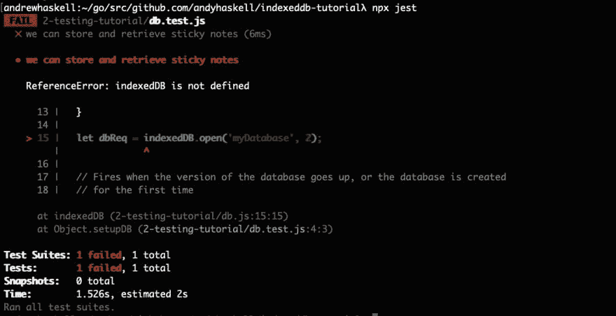
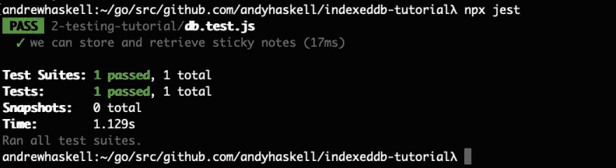
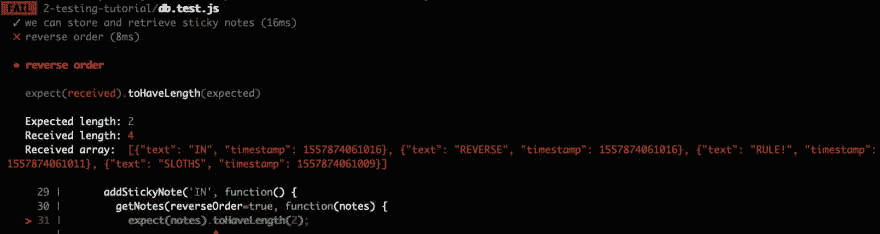
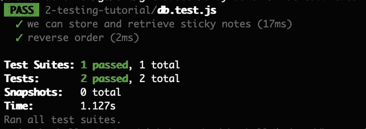

# 用 Jest 测试你的 IndexedDB 代码

> 原文：<https://dev.to/andyhaskell/testing-your-indexeddb-code-with-jest-2o17>

在我的上一个 IndexedDB 教程中，我们看了 IndexedDB 构建一个小型 web 应用的 API 的基础。然而，尽管 IndexedDB 是一个强大的 API，可以为你的 web 应用程序提供一个客户端数据库，但我确实花了一些时间来弄清楚如何对 IndexedDB 应用程序进行自动化测试，以便我们知道它按照我们期望的方式工作。

如果在 IndexedDB 的 API 中一切都是异步的，我们将如何为我们的 IndexedDB 数据库层编写一些测试？当 IndexedDB 是一个浏览器 API 时，我们如何让我们的测试使用它呢？在本教程中，我们将采用两个异步 IndexedDB 函数，看看如何用 Jest.js 测试它们。

本教程假设您了解 IndexedDB 和 JavaScript 自动化测试的基础知识。

## 查看我们的代码:

在我们的`db.js`文件中，你可以看到我们正在运行的代码([提交 1](https://github.com/andyhaskell/indexeddb-tutorial/commit/445df5c44bc8c0c8434d7842d959d037f5be7dc8) )，这是一个基于上一篇教程中的代码的便笺数据库。有些函数直接与 IndexedDB 对话:

*   `setupDB`用于我们的数据库。我们将 IndexedDB 数据库对象存储在一个名为`db`的全局变量中，一旦`setupDB`完成，这个变量就会被初始化。
*   `addStickyNote`接收一个字符串，并将该消息的便笺添加到数据库中。
*   `getNotes`以正向或反向顺序检索数据库中的所有便笺。

因为这些函数是我们与 IndexedDB 对话的方式，所以我们想要在数据库测试中测试的一件事是，如果我们用`addStickyNote`将一些便笺放入数据库，我们可以用`getNotes`将它们以正确的顺序放回。所以我们想要的测试代码可能看起来像这样:

```
setupDB();
addStickyNote("SLOTHS");
addStickyNote("RULE");
let notes = getNotes();
// Run assertions that we got back the sticky notes we wanted 
```

然而，请记住 IndexedDB 是一个异步 API，所以当我们运行这些对`addStickyNote`的调用时，JavaScript 运行时会启动数据库事务，但不会等待它们完成。因此，当我们运行`getNotes`时，对`addStickyNote`的两个调用并不一定要完成。不仅如此，当我们启动`addStickyNote`时`setupDB`并不一定完成，所以有可能`addStickyNote`可以在`db`变量仍未定义时运行！

因此，为了运行我们的 IndexedDB 函数，以便每个函数都按顺序运行，本教程中的代码被设计为让每个 IndexedDB 函数接受一个**回调**函数作为其参数之一。

## 用回调链接我们的 IndexedDB 函数

要查看 IndexedDB 函数的回调，让我们来看看`setupDB` :
的流程

```
function setupDB(callback) {
  // If setupDB has already been run and the database was set up, no need to
  // open the database again; just run our callback and return!
  if (db) {
    callback();
    return;
  }

  let dbReq = indexedDB.open('myDatabase', 2);

  // Fires when the version of the database goes up, or the database is created
  // for the first time
  dbReq.onupgradeneeded = function(event) {
    db = event.target.result;

    // Create an object store named notes, or retrieve it if it already exists.
    // Object stores in databases are where data are stored.
    let notes;
    if (!db.objectStoreNames.contains('notes')) {
      db.createObjectStore('notes', {autoIncrement: true});
    }
  }

  // Fires once the database is opened (and onupgradeneeded completes, if
  // onupgradeneeded was called)
  dbReq.onsuccess = function(event) {
    // Set the db variable to our database so we can use it!
    db = event.target.result;
    callback();
  }

  // Fires when we can't open the database
  dbReq.onerror = function(event) {
    alert('error opening database ' + event.target.errorCode);
  }
} 
```

就像上一个教程一样，这段代码请求打开我们的数据库。如果是第一次创建数据库，那么我们运行请求的`onupgradedneeded`事件处理程序来创建我们的对象存储。然后，根据请求是成功还是失败，我们或者运行请求的`onsuccess`事件处理程序来填充我们的`db`全局变量，或者我们警告打开数据库时出现错误。

不过，需要注意的是我们如何使用`callback`参数。代码中有两个地方运行回调:

```
if (db) {
  callback();
  return;
} 
```

*   如果`db` **没有**未定义，那么这意味着`setupDB`已经被调用过一次，我们已经有了我们的数据库，所以我们不需要做任何事情来建立我们的数据库；我们可以运行传入的回调函数。

```
dbReq.onsuccess = function(event) {
  // Set the db variable to our database so we can use it!
  db = event.target.result;
  callback();
} 
```

*   另一个可以调用`callback`的地方是在我们的数据库请求的`onsuccess`事件处理程序中，当我们的数据库被完全设置好的时候就会调用它。

在这两种情况下，我们只在数据库建立后调用`callback`。这为我们做的是，通过让我们的每个 IndexedDB 函数接受一个回调参数，我们知道当回调运行时，该函数的工作就完成了。然后我们可以在`index.html`中看到这一点，这里我们使用回调参数运行一个又一个 IndexedDB 函数:

```
<script type="text/javascript">
  setupDB(getAndDisplayNotes);
</script> 
```

我们运行`setupDB`，然后因为我们知道我们现在有一个`db`变量集，我们可以运行`getAndDisplayNotes`作为`setupDB`的回调来显示 web 应用程序中任何现有的便笺。

因此，有了这些回调，我们的测试就有了按顺序运行 IndexedDB 函数的策略，运行一个数据库操作作为最后一个操作的回调。所以我们的测试应该是这样的:

```
setupDB(function() {
  addStickyNote("SLOTHS", function() {
    addStickyNote("RULE", function() {
      getNotes(reverseOrder=false, function(notes) {
        //
        // Now that we have retrieved our sticky notes, in here we test that
        // we actually got back the sticky notes we expected
        //
      });
    });
  });
}); 
```

回调金字塔有点难以理解，在后面的教程中，我将展示我们如何重构 IndexedDB 的基于回调的 API，使之成为基于承诺的 API，但是现在，我们有办法保证一个 IndexedDB 动作发生在最后一个动作之后，因此，我们有办法测试我们的 IndexedDB 代码，所以让我们开始测试吧！

## 写作测试

此部分的代码更改在[提交 2](https://github.com/andyhaskell/indexeddb-tutorial/commit/ac83e68db2a96192dc3af42483fe48344dc9489f) 中

对于 IndexedDB 测试，我们需要做的第一件事是安装一个测试框架，作为项目的依赖项之一。在本教程中，我们将使用 [Jest](https://jestjs.io) ，但是您可以使用任何支持测试异步功能的测试框架；例如，[摩卡](https://mochajs.org) + [柴](https://www.chaijs.com)中的 IndexedDB 测试在总体上与 Jest 中的测试具有相似的结构。

```
yarn add --dev jest 
```

现在我们已经有了测试程序，我们可以创建我们的`db.test.js`文件来运行我们的测试，但是我们需要在`db.js`中增加一行代码，以便 db.test.js 可以导入它的函数。

```
module.exports = {setupDB, addStickyNote, getNotes}; 
```

注意:这一行并不意味着`index.html`不能再使用`db.js`了，因为浏览器目前不能识别`module.exports`。因此，为了让这些代码仍然在我们的网页中使用，我们需要一个像 webpack 这样的代码捆绑器。我们不会深入讨论如何设置，但如果你正在学习 webpack 并寻找一个逐步的 webpack 教程，你可以在这里查看我的教程[，你也可以在](https://dev.to/andyhaskell2013/webpack-from-0-to-automated-testing-3n23)[提交#5](https://github.com/andyhaskell/indexeddb-tutorial/commit/045dac8f7321728c1cb2cb986a91df581f958b43) 查看我的代码以准备好这个 webpack。

现在开始。在`db.test.js`中，添加该代码:

```
let {setupDB, addStickyNote, getNotes} = require('./db');

test('we can store and retrieve sticky notes', function(done) {
  setupDB(function() {
    addStickyNote('SLOTHS', function() {
      addStickyNote('RULE!', function() {
        // Now that our sticky notes are both added, we retrieve them from
        // IndexedDB and check that we got them back in the right order.
        getNotes(reverseOrder=false, function(notes) {
          expect(notes).toHaveLength(2);
          expect(notes[0].text).toBe('SLOTHS');
          expect(notes[1].text).toBe('RULE!');
          done();
        });
      });
    });
  });
}); 
```

在代码的开头，我们导入了与 IndexedDB 对话的代码。然后，我们运行我们的测试:

```
test('we can store and retrieve sticky notes', function(done) { 
```

`test`是用于运行我们的测试用例的 Jest 函数，我们传递给`test`的函数是我们运行代码并检查它是否做了我们期望它做的事情的地方。

如你所见，这个匿名函数接受了一个名为`done`的参数，这是因为我们正在测试 IndexedDB，这是一个 [**异步**测试](https://jestjs.io/docs/en/asynchronous)。在常规的 Jest 测试中，匿名函数没有任何参数，所以当该函数返回或到达右花括号时，测试结束，Jest 可以继续下一个文本。但是在异步测试中，当我们到达匿名函数的右括号时，我们仍然在等待我们的 IndexedDB 代码完成，所以当该告诉 Jest 测试结束时，我们调用`done()`。

```
setupDB(function() {
  addStickyNote('SLOTHS', function() {
    addStickyNote('RULE!', function() { 
```

在我们的匿名函数内部，我们运行`setupDB`，然后在它的回调中，我们知道我们的数据库是打开的，所以我们可以用`addStickyNote`将一个写着“SLOTHS”的便笺添加到 IndexedDB 中，然后在它之后添加另一个写着“RULE”的便笺。

由于每个回调只在最后一个 IndexedDB 操作完成后运行，当我们到达`getNotes`时，我们已经知道我们的两个便笺在数据库中，所以我们运行`getNotes`并且在它的回调中，我们检查我们以正确的顺序取回了便笺。

```
getNotes(reverseOrder=false, function(notes) {
  expect(notes).toHaveLength(2);
  expect(notes[0].text).toBe('SLOTHS');
  expect(notes[1].text).toBe('RULE!');
  done();
}); 
```

在`getNotes`的回调中，我们检查得到了两个便笺条，第一个写着“SLOTHS”，第二个写着“RULE！”最后，我们在测试的匿名函数中调用`done()`函数，这样我们就可以告诉 Jest 测试结束了。

用`npx jest`运行测试，并...

[](https://res.cloudinary.com/practicaldev/image/fetch/s--O5SuhyDK--/c_limit%2Cf_auto%2Cfl_progressive%2Cq_auto%2Cw_880/https://thepracticaldev.s3.amazonaws.com/i/1dye3y69cb2do3cyrysf.png)

## 假指数化 db 来救场！

我们的测试失败的原因是因为`indexedDB`在全局名称空间中没有定义；IndexedDB 是一个浏览器 API，因此确实存在于浏览器的`window`对象的全局名称空间中，但是在节点环境中，`global`对象没有 IndexedDB。

幸运的是，有一个 JavaScript 包可以让我们在代码中实现 indexed db:[fake-indexed db](https://github.com/dumbmatter/fake-indexeddb)！

```
yarn add --dev fake-indexeddb 
```

Fake-indexeddb 是完全在内存中实现的 [IndexedDB 规范](https://www.w3.org/TR/IndexedDB-2/)，这意味着我们可以在测试中使用它来使用 indexeddb，就像我们在浏览器中使用它一样。但是，我们如何使用它呢？转到`db.test.js`，添加这个代码([提交 3](https://github.com/andyhaskell/indexeddb-tutorial/commit/98fcfe9feac293067a6a5ada0443753a7c2c309d) ):

```
require("fake-indexeddb/auto"); 
```

然后再次运行`npx jest`并...

[](https://res.cloudinary.com/practicaldev/image/fetch/s--5Ph6uihJ--/c_limit%2Cf_auto%2Cfl_progressive%2Cq_auto%2Cw_880/https://thepracticaldev.s3.amazonaws.com/i/zg5h8urljtowqija6784.png)

只用了一行代码，IndexedDB 就启动并运行了，我们的测试正如预期的那样工作！这个导入`fake-indexeddb/auto`，用一个`indexeddb`变量填充 Node.js 的`global`对象，以及像它的`IDBKeyRange`对象这样的免费类型！🔥

为了测试实际浏览器的 IndexedDB 实现，据我所知，你需要一个浏览器内测试框架，比如 Selenium，但是 fake-indexeddb 实现了相同的 indexeddb 规范，所以这仍然给了我们很好的单元测试机会；真实浏览器测试处于端到端测试级别。

## 命名我们的测试

让我们再添加一个测试用例。`getNotes`有一个逆序参数，用于逆序获取我们的笔记，并测试它具有相同的结构；打开数据库，添加两个便笺条，然后运行`getNotes`，这次`reverseOrder`为真。

```
test('reverse order', function(done) {
  setupDB(function() {
    addStickyNote('REVERSE', function() {
      addStickyNote('IN', function() {
        getNotes(reverseOrder=true, function(notes) {
          expect(notes).toHaveLength(2);
          expect(notes[0].text).toBe('IN');
          expect(notes[1].text).toBe('REVERSE');
          done();
        });
      });
    });
  });
}); 
```

然而，当我们运行我们的测试时，我们得到这个错误:

[](https://res.cloudinary.com/practicaldev/image/fetch/s--uvD1ghVh--/c_limit%2Cf_auto%2Cfl_progressive%2Cq_auto%2Cw_880/https://thepracticaldev.s3.amazonaws.com/i/d5s45v2q83hcabds7xme.png)

我们的第二次测试失败了，因为我们在`myDatabase` IndexedDB 数据库中的`notes`对象存储有来自第一次测试的便笺。那么，我们如何确保对于每个测试，我们只使用来自我们的测试用例的数据库项目呢？

如果我们在每次测试中使用**不同的索引数据库**会怎么样？顺序测试可以使用名为`myDatabase_FORWARD`的数据库的`notes`存储运行代码，而逆序测试将使用`myDatabase_REVERSE`。这种在数据库中用不同的名称运行每个数据库测试的技术被称为**命名空间**，我们只需在`setupDB`中修改几个代码就可以命名我们的测试。

```
let db;
let dbNamespace;

function setupDB(namespace, callback) {
  if (namespace != dbNamespace) {
    db = null;
  }
  dbNamespace = namespace;

  // If setupDB has already been run and the database was set up, no need to
  // open the database again; just run our callback and return!
  if (db) {
    callback();
    return;
  } 
```

我们向`db.js`、`dbNamespace`添加一个新的全局变量，这是我们当前使用的 IndexedDB 数据库的名称空间。然后，在`setupDB`中，我们有了一个新的参数，`namespace`；如果我们使用的名称空间不同于`dbNamespace`已经设置的名称空间，那么我们将`db`设置为 null，这样我们将不得不打开一个新的 IndexedDB 数据库( [commit 4](https://github.com/andyhaskell/indexeddb-tutorial/commit/4235bd7a3734e5faa84ec4cc67626196bb2fa602) )。

```
let dbName = namespace == '' ? 'myDatabase' : 'myDatabase_${namespace}';
let dbReq = indexedDB.open(dbName, 2); 
```

现在，我们根据传递到`namespace`中的内容选择想要打开的数据库的名称；如果我们传入一个非空字符串作为我们的名称空间，比如 REVERSE_TEST，那么我们正在操作数据库 myDatabase_REVERSE_TEST，所以如果每个测试使用不同的名称空间，我们就不必担心上次测试留下的数据库项。

现在，我们的前进 getNotes 测试将像这样开始:

```
test('we can store and retrieve sticky notes', function(done) {
  setupDB('FORWARD_TEST', function() { 
```

我们的反向测试看起来像:

```
test('reverse order', function(done) {
  setupDB('REVERSE_TEST', function() { 
```

最后，在我们的 web 应用程序中，我们通过运行:
来设置没有名称空间的数据库

```
setupDB('', getAndDisplayNotes); 
```

现在我们的两个测试用例都使用不同名称空间的数据库，一个测试用例不会干扰另一个，所以运行`npx jest`你会看到...

[](https://res.cloudinary.com/practicaldev/image/fetch/s--Qa0XvJWm--/c_limit%2Cf_auto%2Cfl_progressive%2Cq_auto%2Cw_880/https://thepracticaldev.s3.amazonaws.com/i/0qqu3hsuhxf0nctojcrz.png)

### 一场及格的考试！

[](https://res.cloudinary.com/practicaldev/image/fetch/s--tQ3ahgiI--/c_limit%2Cf_auto%2Cfl_progressive%2Cq_auto%2Cw_880/https://thepracticaldev.s3.amazonaws.com/i/nuf3kmtuztobm6jgpk1b.jpg)

我们在 Jest 中使用回调给出了几个测试用例的 web 应用程序测试覆盖范围，并且在`setupDB`函数中使用了命名空间，如果我们继续向应用程序添加功能，我们就有了一种可持续的方法来防止我们的测试相互冲突。然而，代码库仍然有一个问题，所有这些回调的金字塔在我们的代码中很难推理。因此，在我的下一篇教程中，我们将研究如何将基于回调的 IndexedDB 代码转换成基于 promise/ `async/await`的 IndexedDB 代码。直到下一次，

[](https://res.cloudinary.com/practicaldev/image/fetch/s--JzBf-HrL--/c_limit%2Cf_auto%2Cfl_progressive%2Cq_auto%2Cw_880/https://thepracticaldev.s3.amazonaws.com/i/h0q0eos1p1wvb0aiut17.jpg)

保持懒惰！