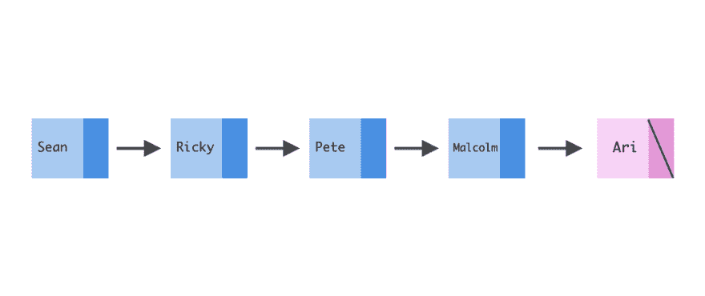
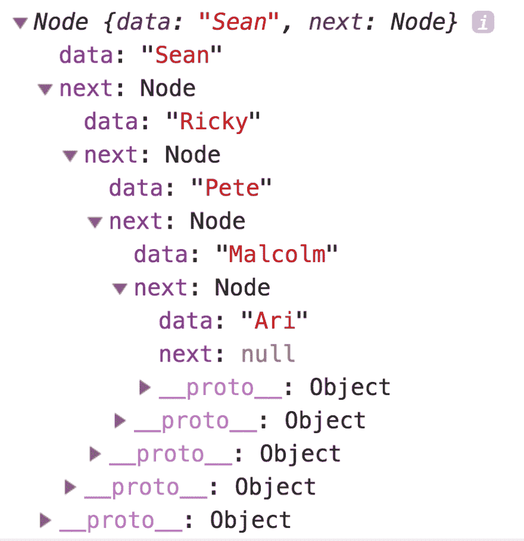
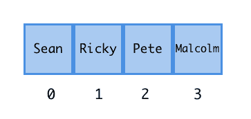
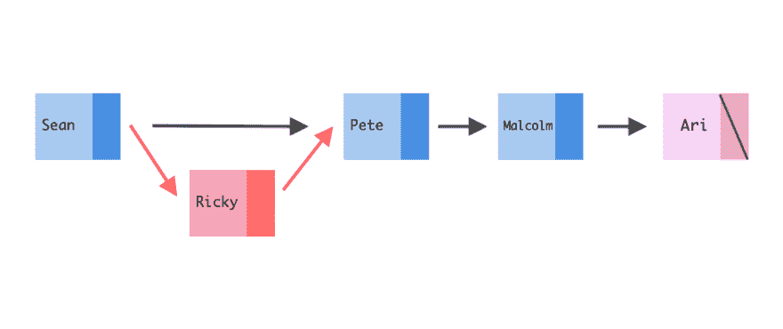

# 谢谢你，下一篇:链表介绍

> 原文：<https://dev.to/aspittel/thank-u-next-an-introduction-to-linked-lists-4pph>

在这篇文章中，我们将会用爱莉安娜·格兰德的“谢谢你，下一个”来谈论链表数据结构。如果你还没有看过这首歌的音乐视频，请在我们开始之前暂停一下。

[https://www.youtube.com/embed/gl1aHhXnN1k](https://www.youtube.com/embed/gl1aHhXnN1k)

链表是数据的线性集合，由带有数据和指针的节点组成。我们将关注单链表，它包含存储节点值的节点和指向下一个节点的指针。还有其他类型的链表，比如双向链表和循环链表，但是我们现在只关注单向链表。

几个快速定义，以确保我们在同一页上:

*   一个**指针**在内存中存储一个值的地址。这些也可以指向虚无。一个**引用**也差不多，虽然不能指向虚无。
*   数据结构是可以用任何编程语言实现的数据集合。

我们将在这篇文章中使用下面的链表:
[](https://res.cloudinary.com/practicaldev/image/fetch/s--2IiQrKI4--/c_limit%2Cf_auto%2Cfl_progressive%2Cq_auto%2Cw_880/https://thepracticaldev.s3.amazonaws.com/i/2cq9rn3vn1z1zrvgvlnq.png)

在上图中，我们看到五个不同的节点，每个节点都有一个数据值。前四个是她列出的前任的顺序:

> 我以为我会和肖恩
> 在一起，但他不匹配
> 写了一些关于里基
> 的歌，现在我听着笑着
> 甚至差点结婚了
> 对于皮特，我非常感激
> 希望我能对马尔科姆
> 说“谢谢你”，因为他是一个天使

最后一个是 Ari 本人:

> 另外，我遇到了另一个人
> 我们有了更好的讨论
> 我知道他们说我进展太快
> ，但这个人会持续
> ，因为她的名字叫阿里
> ，我对此非常擅长(非常擅长)

除了数据之外，每个节点还存储指向下一个节点的指针。她总是以同样的顺序唱她的前任，然后最后唱她自己。当我们遍历一个链表时，同样的顺序也适用。我们将从头节点开始，它是链表中的第一个节点，然后移动到下一个节点，以此类推。对于单链表，我们不会以相反的顺序移动或者随机地从一个节点跳到另一个节点，而是以相同的顺序从头到尾移动。

我们可以通过如下方式创建节点和链接节点来创建一个超级简单的链表:

```
class Node {
    constructor(data, next=null) {
        this.data = data
        this.next = next
    }
}

let ari = new Node('Ari')
let malcolm = new Node('Malcolm', ari)
let pete = new Node('Pete', malcolm)
let ricky = new Node('Ricky', pete)
let sean = new Node('Sean', ricky) 
```

*这个帖子的最终代码也是 Python [这里](https://github.com/aspittel/coding-cheat-sheets/blob/master/data_structures/linked_lists.md)T3】*

如果我们打印出 Sean 节点的样子，我们可以看到它将他的名字存储为数据属性以及对下一个节点 Ricky 的引用。我们可以通过使用`next`属性遍历所有节点！

[](https://res.cloudinary.com/practicaldev/image/fetch/s--uWaPpOtw--/c_limit%2Cf_auto%2Cfl_progressive%2Cq_auto%2Cw_880/https://thepracticaldev.s3.amazonaws.com/i/tr1c2tdcdvxrme60qct1.png)

另外，在链表的末尾，有一个空指针。在这种情况下，由于 Ari 是女王，她独自一人很好，不需要转移到她的下一个重要的人。所以，不用了，谢谢，下一个是她的节点。

与数组相比，链表有一些好处，数组是线性数据结构中的主要选择。传统上，数组存储在内存中的连续块中，这允许我们使用快速索引公式`start_of_array_in_memory + space_allocated_for_each_array_item * index_of_item_we_want`。虽然在索引中获取一个条目非常高效(`O(1)`)，但是在数组中插入或删除条目的效率较低——我们需要将所有内容移动到内存中的不同块。不能保证在数组的前后都有插入新项的空间。如果在中间插入或删除，同样的逻辑也适用——您必须在内存中移动项目来填补漏洞或分配更多的空间。

[](https://res.cloudinary.com/practicaldev/image/fetch/s--ppIe4wJG--/c_limit%2Cf_auto%2Cfl_progressive%2Cq_auto%2Cw_880/https://thepracticaldev.s3.amazonaws.com/i/bmsjr67p4qa2su1c5196.png)

与数组不同，链表不需要存储在一个连续的(或并排的😉)块，这使得在链表的开头插入和删除更容易。指针可以指向内存中的任何位置，因此您不必移动所有数据来添加新节点。

也就是说，如果你试图搜索链表，插入到中间，或者从链表中间删除，这个过程的效率会低很多。我们需要从头遍历到我们试图访问的节点。

链表的另一个缺点是它们比数组占用更多的内存，因为它们存储数据和指向下一个节点的指针，而数组只存储数据。

让我们看看我们将用来实现其中一些操作的代码。我们将在链表的开头插入，并在索引处实现 remove，以显示这样做需要发生什么:

```
class LinkedList {
  constructor() {
    // the head attribute stores a pointer to the first node in our linked list
    this.head = null
    this.length = 0
  }

  insert(data) {
    // inserts to the beginning of the linked list
    // what used to be  the head becomes the second element
    this.head = new Node(data, this.head) 
    this.length++
  }

  remove_value(value) {
    // remove any data value from the linked list

    // we need to store a pointer to a node and it's predecessor
    // so that when we remove the value we can just change the pointer!
    let prevNode = null
    let currentNode = this.head

    while (currentNode) {
      if (currentNode.data === value) {
        if (prevNode) {
          // Set the previous node's next value to the node we're deleting's next attribute
          // effectively removing it from our sequence
          prevNode.next = currentNode.next
        } else {
          this.head = currentNode.next
        }
        currentNode = null
        this.length--
        return true
      }
      // move to the next nodes
      prevNode = currentNode
      currentNode = currentNode.next
    }
  }
}

let thankUNext = new LinkedList()
thankUNext.insert('Ari')
thankUNext.insert('Malcolm')
thankUNext.insert('Pete')
thankUNext.insert('Ricky')
thankUNext.insert('Sean')

thankUNext.remove_value('Ricky') 
```

如果 Ari 对 Ricky 不那么感激的话，从我们的链表中移除 Ricky 会是什么样子呢？

[](https://res.cloudinary.com/practicaldev/image/fetch/s--3U1hlGOF--/c_limit%2Cf_auto%2Cfl_progressive%2Cq_auto%2Cw_880/https://thepracticaldev.s3.amazonaws.com/i/x51h39nccjhldfk9tbk0.png)

所有红色的东西都会被删除。

另外两个有用的方法是`search`和`iterate` :

```
iterate() {
  let node = this.head
  while (node) {
    console.log(node.data)
    node = node.next
  }
}

search(data) {
  let idx = 0
  let node = this.head
  while (node) {
    if (node.data === data) return idx
    node = node.next
    idx += 1
  }
  return -1
} 
```

所以，我们知道在链表中存储爱莉安娜·格兰德的前任是对数据结构的一个很好的利用，因为当我们唱“谢谢你，下一个”时，我们总是以相同的顺序列出他们，但是还有什么其他数据在链表中工作得很好呢？一种用途是任务队列。例如，打印机一次只能打印一件东西，但我们仍然希望加载未来的任务，而不必为每一页都按下 print！当我们创建任务列表时，我们总是将最新的项目添加到队列的末尾，然后打印出队列中第一个项目！一个后退按钮的实现是类似的！或者撤消热键！我们通常会在链表的顶部实现一个堆栈或队列数据结构来实现这些。我还发现它们对许多代码挑战非常有帮助。

希望这篇文章教会了你爱，而不是耐心和痛苦。

[](https://i.giphy.com/media/PO797EfRpeTwNnFdLc/giphy-downsized-large.gif)