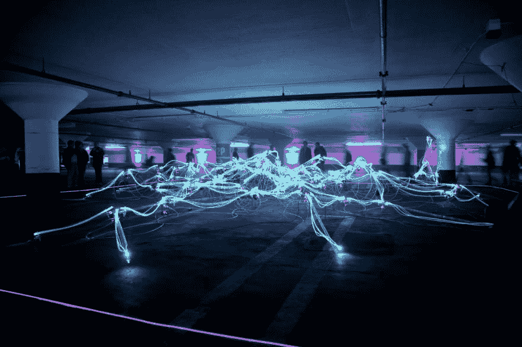

# 黑客马拉松的三大超能力

> 原文：<https://dev.to/lerenah/the-3-superpowers-of-hackathons-236m>

当你试图获得一项新技能时，每个人都会有那种不舒服的感觉。

正是在这些时候，你直面自己知识的深度，开始意识到你有多少不知道，前面的路有多长，你要爬的山有多高。你甚至会对自己说，这段旅程会比你想象的要长。你知道这是一场马拉松，但它到底有多远？

嗯，我在这里告诉你…有希望。是的，如果你允许我放纵你几分钟，我想让你了解一下黑客马拉松的力量。对于所有级别的开发者来说，黑客马拉松都是非常强大的学习工具，如果你刚刚开始，你会发现他们甚至拥有超能力！

在这个周末之前，我从未参加过黑客马拉松。我通常喜欢自学，戴着耳机坚持在咖啡店的日常活动，释放棕色噪音，远离周围环境，通过教程和试错法吸收材料。事实上，我对是否参加持观望态度，不知道参加这个活动的机会成本是多少。

我很高兴我摆脱了自己的想法，尝试了一下。感谢在一个伟大的团队中，灵活，快乐，我们的团队能够在给我们的时间内创造出一些东西…我们赢了！使用 D3 我们创建了一个悬停地图，显示了退伍军人希望重返校园的每月住房补贴，[www.bahmap.com](http://www.bahmap.com)。用最终产品完成黑客马拉松的感觉令人难以置信，真的加快了学习曲线！

Joshua Sortino 在 Unsplash 上拍摄的照片

准备好迎接那些超能力了吗…

时间旅行

黑客马拉松能让你在几天内吸收大量信息。如果你是一个初学者，你很有可能会和比你更有经验的人一起工作。您将有机会在他们编码时深入了解他们的思维过程，吸收他们所有的知识，以及他们解决问题的方式。接近就是力量！与其他拥有更多技能的开发人员在一起，有时会激发出你自己都没有意识到的技能。就像《黑客帝国》里尼奥把自己插到机器里下载柔术程序的那一幕，绕过学习曲线，瞬间理解！我觉得我在过去两天的编程中学到的东西比一个月的教程还多。它就像一个通向未来的时间旅行助推器。

Unsplash 上 rawpixel 的照片

建立工作关系网

从技术上讲，它不是超级大国，但可以说它很接近。在黑客马拉松中，你会遇到各种背景、年龄和种族的人。你很有可能会发现一些有助于你事业发展的信息。你将深入了解科技行业正在发生什么，谁在招聘，申请工作的最佳方式，以及他们在面试中会问什么问题。

关系培养能力。你不可能无时无刻不在任何地方，知道任何事情。黑客马拉松是建立影响力的好方法。当我离开时，我知道了我可以使用的其他程序和我可以采取的途径来达到我的目标。当你将自己暴露在现实世界的技术问题中时，在黑客马拉松上建立关系网给了你这样的优势。

照片由马里乌斯·马萨拉尔在 Unsplash 上拍摄

动力

你有没有去听音乐会，音乐会结束后，你回到家；很晚了，却睡不着；你仍然充满肾上腺素和艺术家的音乐，所以你开始对着镜子表演？黑客马拉松给你同样的感觉。你带着一股活力离开的机会非常高！你会非常有动力去完成你一直在做的任何项目，并且弄清楚如何最终调试代码。

势头迅猛。你将能够扩展你的能力带宽，并以额外的活力完成那些项目！当我回到家的时候，我直到凌晨 2 点才睡觉，我一直在努力修复一个 bug。保持清醒也可能是因为我们去星巴克喝咖啡庆祝胜利。和一个伟大的程序员团队一起工作是我度过周末的好方法。还要特别感谢担任技术负责人的[约瑟夫·惠廷顿](https://twitter.com/the_whittington)和担任项目经理的[阿德里安·卡尔瓦什](https://www.linkedin.com/in/adriancalvache/) ！

长话短说…
如果你还在犹豫是否要为黑客马拉松牺牲你的周末，并且你是一个编程新手，那么接受我的建议，去做吧！这将是非常值得你的时间！