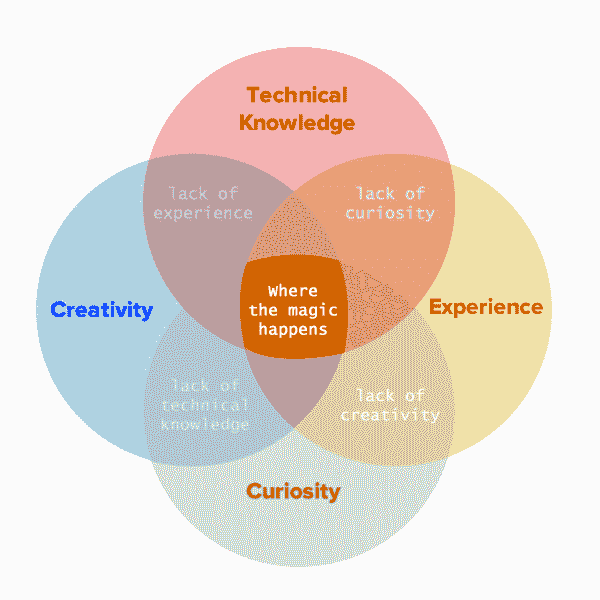

# 编程的艺术

> 原文：<https://dev.to/erikaheidi/the-art-of-programming-21gg>

从早期开始，对编程最常见的误解之一就是认为这种活动纯粹是技术性的，本质上完全精确，就像数学和物理一样。计算是精确的，但编程不是。前者是一个机器操作的结果，后者仍然是一个**人类活动**。

除了我们可能在教室里学到的抽象概念、工具和技术之外，编程需要大量的创造力；所有这些理论只代表了建设一个伟大的开发者所必需的一小部分。

### 并非所有的开发者生来平等

由于人在本质上是不同的，我们的动机、目标和挑战从一开始就总是不同的。我只能谈谈我的个人经历，我的动机与对数学或精确科学的爱好完全无关。

13 岁时，我有了第一次编程的经历——那是学校里一门不寻常的计算机课，在那里我们学习了如何用 Clipper 创建一些基本的东西。老师只是厌倦了教 Word、Excel 之类的东西。看到我们如何用几行代码创建功能性的东西，对我来说是一种令人兴奋的体验。

父母是艺术家和工程师，从小就受到他们的影响，我很快意识到编程结合了两个世界的精华。这是建立在逻辑之上的艺术。

从那以后，我对编程的主要和强烈的动机是能够“无中生有”地创造东西，用代码将想法变为现实。

### 编程如艺术

我把编程看作一种艺术形式，但是你知道:不是所有的艺术家都是一样的。和画家一样，有许多程序员只会复制东西，从来不会想出原创的东西。

真正的艺术家不一样。他们想出新的东西，他们为未来设定新的标准，他们把当前的环境变得更好。他们不怕批评。“复制者”会试图让他们失望，他们会说“如果你能使用 X 或 Y，为什么还要创造新的东西呢”？

因为他们不满足于 X 或 y .因为他们想自己去实验和尝试，作为一种学习工具。因为他们想创作，他们想用代码表达自己。因为他们可以自由地去做，即使不是什么改变世界的大事。

> "最有创造力的人愿意在不确定的阴影下工作。"——来自*创意公司*。作者:艾德·卡姆尔

尊重他人的工作，即使你认为已经有类似目的的东西存在。这是他们的表情。他们没有试图重新发明轮子。他们试图创造一个更好的轮子，或者一个更好地为他们的目的服务的轮子。

神奇的事情就是这样发生的。