# 迄今为止最好的框架 7。v4 中的新增功能

> 原文：<https://dev.to/framework7/the-best-framework7-yet-what-is-new-in-v4-hbg>

大发布的时间到了，就新特性而言，最大的框架 7 更新即将到来。

让我们看看第 4 版中的新特性和突破性变化，以及将现有应用从 v2/v3 迁移到 v4 会带来什么。

### 核心框架 7 文件结构

核心框架有新的文件结构。在之前的版本(v3)中，我们有以下内容:

```
| components/
 | /accordion/
 | /actions/
 | /calendar/
 | ...
| lazy-components/
 | accordion.css
 | accordion.js
 | actions.css
 | actions.js
 | calendar.css
 | calendar.js
 | ...
| js/
 | framework7-lazy.js
 | framework7-lazy.min.js
 | framework7.js
 | framework7.min.js
| css/
 | framework7-lazy.css
 | framework7-lazy.min.css
 | framework7-lazy.rtl.css
 | framework7-lazy.rtl.min.css
 | framework7.css
 | framework7.min.css
 | framework7.rtl.css
 | framework7.rtl.min.css
 | framework7.ios.css
 | framework7.md.css
 | ...
| framework7.esm.bundle.js
| framework7.esm.js
| framework7.less
| framework7.less 
```

在新版本中文件结构更加一致，有点不同:

```
| components/
 | /accordion/
 | accordion.css
 | accordion.js
 | /actions/
 | actions.css
 | actions.js
 | /calendar/
 | calendar.css
 | calendar.js
 | ...
| js/
 | framework7.bundle.js
 | framework7.bundle.min.js
 | framework7.js
 | framework7.min.js
| css/
 | framework7.bundle.css
 | framework7.bundle.min.css
 | framework7.bundle.rtl.css
 | framework7.bundle.rtl.min.css
 | framework7.css
 | framework7.min.css
 | framework7.rtl.css
 | framework7.rtl.min.css
| framework7.esm.bundle.js
| framework7.esm.js
| framework7.bundle.less
| framework7.less 
```

之前:名称中带有-lazy 后缀的文件包含最小(核心)Framework7 版本，具有最少的所需组件集。没有-lazy 后缀的文件包含完整的软件包 Framework7 版本，包含所有组件。

在 v4 中:最小核心版本现在没有任何后缀，只有`framework7.js`和`framework7.css`(之前有-lazy)。完整的捆绑版本现在文件名中有了`bundle`。

位于`lazy-components/`文件夹中的浏览器惰性组件被移动到了`components`文件夹的根目录。

像`framework7.ios.css`这样的特定主题风格已经被移除，不再可用，因为现在已经没有必要了(在下一节解释)。

### CSS 变量(自定义属性)

这是新更新中最重要也是最复杂的部分。所有的 CSS 样式都被修改成使用 [CSS 变量(自定义属性)](https://developer.mozilla.org/docs/Web/CSS/Using_CSS_variables)。那么为什么需要它呢？下面是使用 CSS 变量的一些令人敬畏的优点:

*   它允许我们将整个 Framework7 捆绑包的大小减少 60%！未统一的 CSS 包从大约 1MB(在 v3 中)减少到 400Kb(在 v4 中)！
*   我们也能够减少 JS 代码的数量。由于 CSS 变量的存在，一些新的特性如大导航条变得可用，而不需要大量额外的 JavaScript。
*   我们之前的许多特定主题的差异现在统一了，这将使应用程序品牌化更加简单。
*   添加新的和修改现有的颜色、主题颜色和颜色修饰符是非常容易的。
*   对于一些组件，现在可以混合主题风格。例如，如果您使用 iOS 主题，并希望按钮以 md 主题的风格出现，我们可以只添加 MD 类到这个按钮，它将看起来像在 MD 主题。

有了 CSS 变量，定制样式变得容易多了。令人惊讶的是，如果 CSS 变量可用于组件，我们不需要知道我们想要样式化的组件的确切 HTML 标记。例如，如果我们需要改变列表项标题的字体大小，我们可以添加到 CSS:

```
:root {
 --f7-list-item-title-font-size: 20px;
} 
```

如果我们需要改变导航条的高度:

```
:root {
 --f7-navbar-height: 80px;
} 
```

在这种情况下，所有依赖于 Navbar 大小的样式(依赖于该 CSS 变量的规则)将自动更新(例如，页面内容填充、转换等。).

CSS 变量只是让开发者的生活更容易。

但是转移到 CSS 变量有一些缺点。最引人注目的是它们在浏览器中的支持。就像我们从[这张桌子](https://caniuse.com/#feat=css-variables)上看到的，它支撑在:

*   16+边
*   iOS Safari 10+
*   chrome——意思是 Android 5+
*   火狐浏览器

这意味着什么？这意味着 Framework7 v4 不能在比上面提到的更老的浏览器上工作。这里我们来看框架 7 v4+意识形态。

### 支持的浏览器&设备

由于在 v4 中移除了 CSS 变量和一些其他遗留特性，它将成为现代设备的框架。完全不支持 IE 和 Android <5！支持这样的旧浏览器只会在新功能开发和框架进化方面拖我们的后腿，所以不再有旧浏览器了。

Framework7 v3 将为需要旧设备支持的应用程序维护一段时间(错误修复)。

### 颜色主题

> 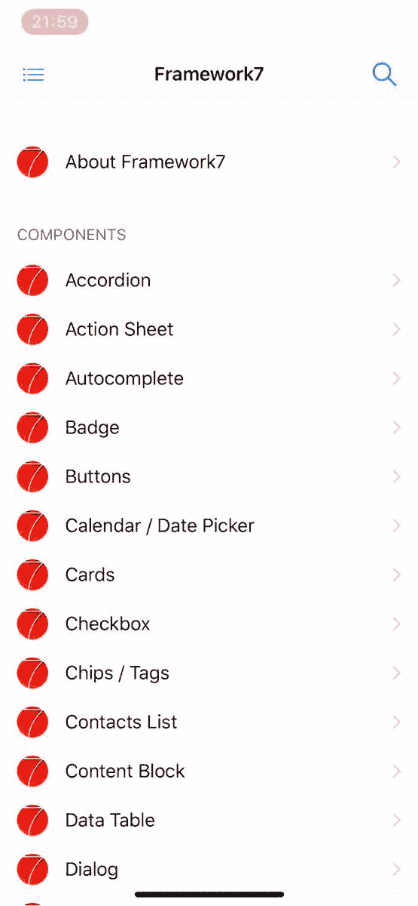<video loop="" controls=""><source src="https://video.twimg.com/ext_tw_video/1058797052493213698/pu/vid/360x778/ia3MIAyF24qKLkrS.mp4?tag=5" type="video/mp4"></video>框架 7@框架 7 io怎么样...在厨房水槽中生成自定义颜色主题。进来了 [@framework7io](https://twitter.com/framework7io) v4🔥2018 年 11 月 03 日下午 19:04[](https://twitter.com/intent/tweet?in_reply_to=1058797173817643010)[](https://twitter.com/intent/retweet?tweet_id=1058797173817643010)3[](https://twitter.com/intent/like?tweet_id=1058797173817643010)19

在 v4 中使用颜色主题就像呼吸新鲜空气一样。现在，如果你需要改变默认颜色主题，你只需要指定几个 CSS 变量，而不是修改/覆盖整个 CSS 文件中的所有默认颜色引用。我们需要 4 个 CSS 变量:

*   `--f7-theme-color` —主题颜色的十六进制值。
*   `--f7-theme-color-shade` — 8%变暗主题颜色。例如，对于按下的按钮状态是必需的。
*   `--f7-theme-color-tint` —主题颜色变浅 8%。例如，对于按下的按钮状态是必需的。
*   `--f7-theme-color-rgb` —主题颜色的 RGB 值。半透明元素需要。

例如，如果我们的品牌颜色是`#f00`(红色)，我们只需要在 CSS 中添加以下变量:

```
:root {
 --f7-theme-color: #f00;
 --f7-theme-color-shade: #d60000;
 --f7-theme-color-tint: #ff2929;
 --f7-theme-color-rgb: 255, 0, 0;
} 
```

这就是我们需要创建自定义颜色主题！💥

还有新的`colorThemeCSSProperties` util，可以生成所需的 CSS 变量:

```
/* Generate CSS variables for red theme color */

app.utils.colorThemeCSSProperties('#f00'); 
```

它将返回以下对象:

```
{
 "--f7-theme-color": "#f00",
 "--f7-theme-color-rgb": "255, 0, 0",
 "--f7-theme-color-shade": "#d60000",
 "--f7-theme-color-tint": "#ff2929"
} 
```

### 统一导航栏

导航栏(navbar、工具栏、Subnavbar 等)也有统一。)外观。在 v3 中，iOS 和 MD 主题的配色方案是不同的。当我们需要定制品牌时，这带来了复杂性和一堆额外的风格。

在 v3 中，它们如下图所示:

[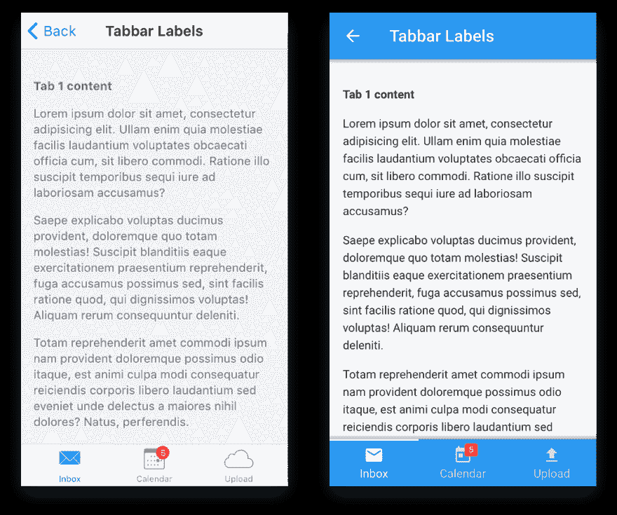](https://res.cloudinary.com/practicaldev/image/fetch/s--cxRd-Sq1--/c_limit%2Cf_auto%2Cfl_progressive%2Cq_auto%2Cw_880/https://cdn-images-1.medium.com/max/1024/1%2AW-hDTsenwdQGmuYeoNVHgg.png)

<figcaption>v3</figcaption>

导航栏

在 v4 中，我们将 iOS 和 MD 主题中导航栏的配色方案统一为:

[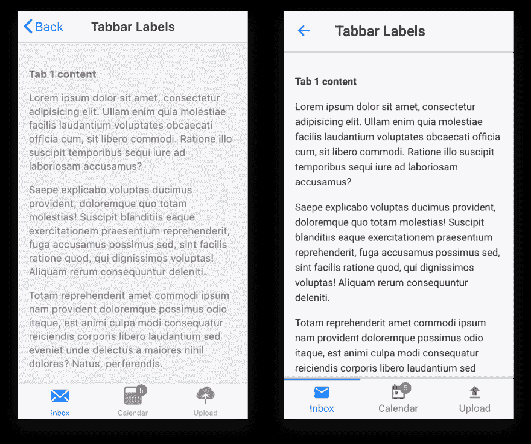](https://res.cloudinary.com/practicaldev/image/fetch/s--NNJ_b79i--/c_limit%2Cf_auto%2Cfl_progressive%2Cq_auto%2Cw_880/https://cdn-images-1.medium.com/max/1024/1%2AVCLIAVqfriplTRdrvLkcEg.png)

<figcaption>v4 中的导航栏</figcaption>

有了这样的方案，为导航条定制品牌就容易多了。

此外，标题居中的导航条(及其动态计算的位置)现在也可以在 MD 主题中使用。

[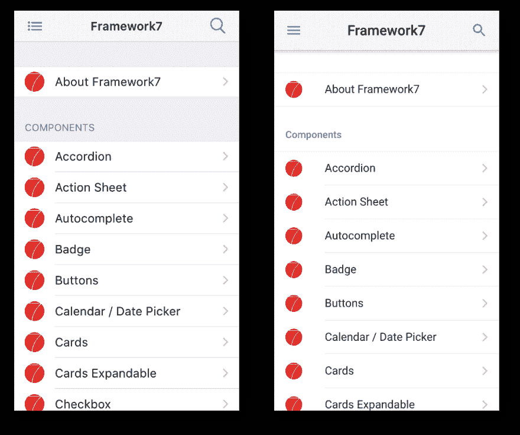](https://res.cloudinary.com/practicaldev/image/fetch/s--Jt3CsfRU--/c_limit%2Cf_auto%2Cfl_progressive%2Cq_auto%2Cw_880/https://cdn-images-1.medium.com/max/1024/1%2Ag3JJnLGSacaplWRn5OiUAg.png)

<figcaption>iOS 中居中导航条标题& MD 主题</figcaption>

### 统一工具栏位置

在 v4 之前，我们对工具栏位置有以下限制:

*   在 iOS 主题中，工具栏总是在底部
*   在 MD 主题中，工具栏默认在顶部，可以通过额外的`toolbar-bottom-md`类定位在底部。

现在这种限制已经没有了，在两个主题中，工具栏/标签栏都可以放在顶部或底部。但是现在总是需要为每个工具栏/标签栏添加特定于位置的类:

*   `toolbar-top`将工具栏放在视图/页面的顶部
*   `toolbar-bottom`将工具栏放在视图/页面的底部

同样，它也应该有助于保持你的定制风格/品牌在 iOS 和 MD 主题上的一致性。

因此，即使在 iOS 上，工具栏也可以很容易地放置在顶部:

[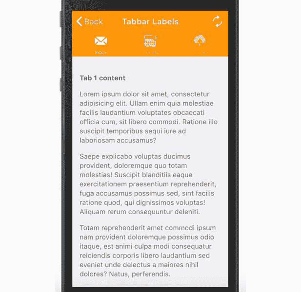](https://res.cloudinary.com/practicaldev/image/fetch/s--gDN-SX3P--/c_limit%2Cf_auto%2Cfl_progressive%2Cq_auto%2Cw_880/https://cdn-images-1.medium.com/max/617/1%2AMzHcZcfrGKS2t20cepdBJw.png)

<figcaption>v4 iOS 主题中的 Top Tabbar</figcaption>

### 统一&返工按钮

随着 CSS 变量的到来，按钮现在也支持 iOS 和 MD 主题的所有修改器。比如现在 iOS 主题支持的“凸起”按钮，MD 主题支持的“轮廓”按钮。

此外，“按钮大”已被重命名为“按钮大”。

[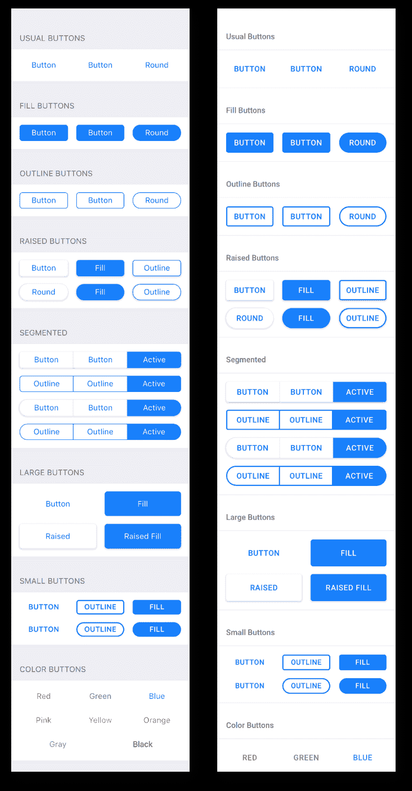](https://res.cloudinary.com/practicaldev/image/fetch/s--tokTLUsD--/c_limit%2Cf_auto%2Cfl_progressive%2Cq_auto%2Cw_880/https://cdn-images-1.medium.com/max/1024/1%2ADt6Z8e8lmh46b7JfEg4O5A.png)

### 统一消息颜色

“信息”组件现在为 iOS 和 MD 主题提供了相似的配色方案:

[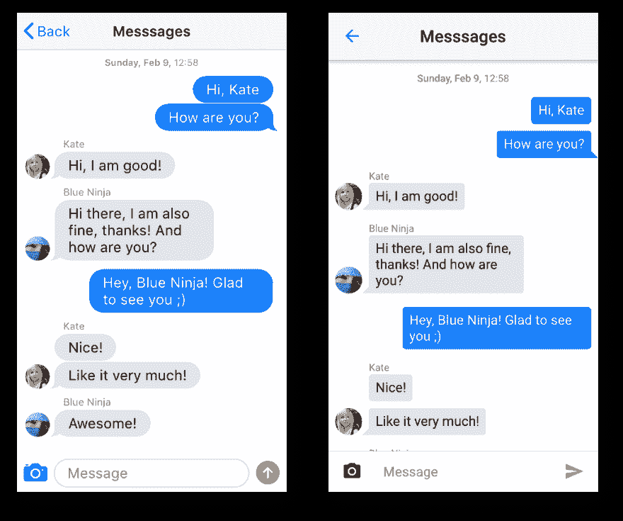](https://res.cloudinary.com/practicaldev/image/fetch/s--hv_gCBr7--/c_limit%2Cf_auto%2Cfl_progressive%2Cq_auto%2Cw_880/https://cdn-images-1.medium.com/max/1024/1%2ACYY394W75z7paHVt8syCqQ.png)

<figcaption>v4 中的消息配色</figcaption>

### 导航栏变大

这是 Framework7 中最受欢迎的特性之一。现在它在 v4 中可以用于 iOS 和 MD 主题。

> 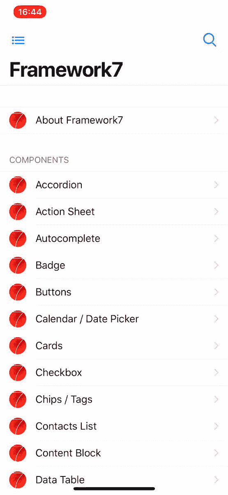<video loop="" controls=""><source src="https://video.twimg.com/ext_tw_video/1065242482714263552/pu/pl/LExlMmeT2PP2t1pz.m3u8?tag=5" type="application/x-mpegURL"></video>framework 7@ framework 7 io你自找的，你会得到的！在 [@framework7io](https://twitter.com/framework7io) v4 中，您将看到所有带有适当过渡的新大型导航条🎊2018 年 11 月 21 日下午 13:56[](https://twitter.com/intent/tweet?in_reply_to=1065242615531139073)[](https://twitter.com/intent/retweet?tweet_id=1065242615531139073)11[](https://twitter.com/intent/like?tweet_id=1065242615531139073)51

大型导航条的 HTML 标记非常简单:

```
<div class="navbar">
  <div class="navbar-inner">
    <div class="left">...</div>

    <!-- Usual title -->
    <div class="title">My App</div>

    <div class="right">...</div>

    <!-- New large title (text can be different) -->
    <div class="title-large">
      <div class="title-large-text">My App</div>
    </div>
  </div>
</div> 
```

对于 Framework7 Vue/React 组件，甚至更简单:

```
<f7-navbar title="My App" large />

<Navbar title="My App" large /> 
```

### 可扩展卡

这是一个真正的挑战，但我们做到了。了解 v4 中所有新的可扩展卡(也称为 AppStore 卡):

> 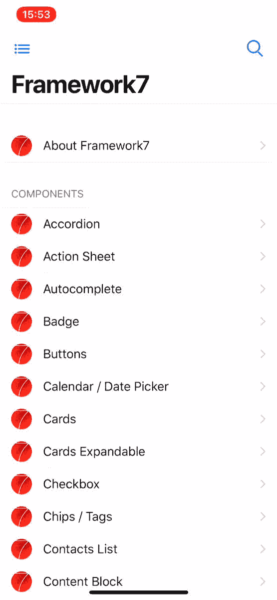<video loop="" controls=""><source src="https://video.twimg.com/ext_tw_video/1067059338324467714/pu/pl/4JAL5mBW_-kJbB42.m3u8?tag=5" type="application/x-mpegURL"></video>framework 7@ framework 7 io这个怎么样？认识所有新的可扩展卡(又名 AppStore 卡)即将进入 [@framework7io](https://twitter.com/framework7io) v4🔥🔥🔥2018 年 11 月 26 日下午 14:16[](https://twitter.com/intent/tweet?in_reply_to=1067059506549534720)[](https://twitter.com/intent/retweet?tweet_id=1067059506549534720)23[](https://twitter.com/intent/like?tweet_id=1067059506549534720)100

他们的 API 非常简单。只是在卡元素上多了一个`card-expandable`类。但是有时，为了看起来正确和感觉自然，可扩展的卡内容可能需要额外的调整。但总的来说只是:

```
<!-- expandable card -->
<div class="card card-expandable">
  <div class="card-content">
    ... any HTML content here ...
  </div>
</div> 
```

### 大块片头

区块标题扩展为中等和大尺寸，以改善开箱即用的排版:

[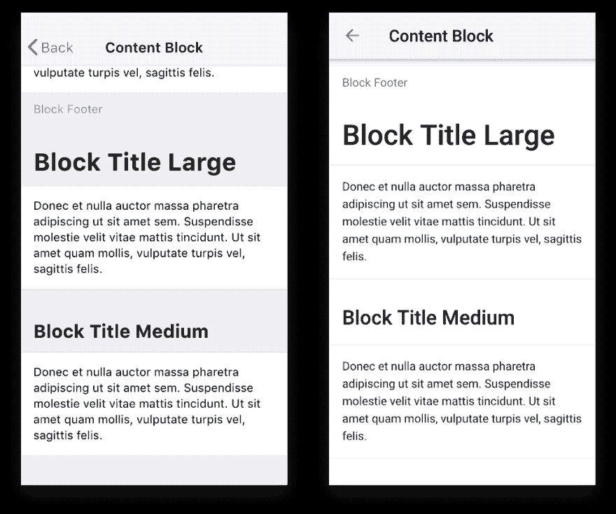](https://res.cloudinary.com/practicaldev/image/fetch/s--mwpjxthq--/c_limit%2Cf_auto%2Cfl_progressive%2Cq_auto%2Cw_880/https://cdn-images-1.medium.com/max/1024/1%2Aml-BlONPgMnQrAUn1n7RJw.png)

它只是在任何块标题上添加了额外的`block-title-large`或`block-title-medium`类，使其成为大或中等大小。

### 从底部拉动刷新

除了通常的拉至刷新，v4 还支持从底部拉至刷新:

[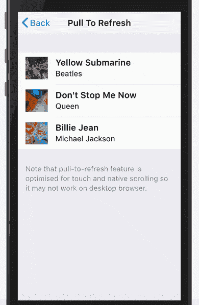](https://res.cloudinary.com/practicaldev/image/fetch/s--yG5bSGlJ--/c_limit%2Cf_auto%2Cfl_progressive%2Cq_66%2Cw_880/https://cdn-images-1.medium.com/max/390/1%2AX9tZc_mGlSRtEYrc_2xSTg.gif)

### 菜单—新建 UI 组件

这个组件的想法和要求来自我们的顾客🙌

移动应用中不常见到的菜单组件。但事实证明，当您需要地图、图像、一些文本/代码编辑器等上面的控件时，它非常有用。

[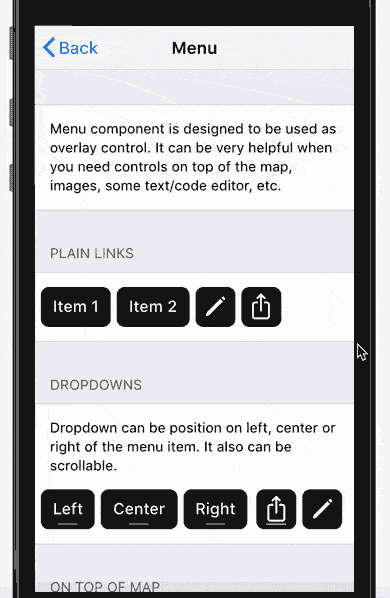](https://res.cloudinary.com/practicaldev/image/fetch/s--OBZ86mKj--/c_limit%2Cf_auto%2Cfl_progressive%2Cq_66%2Cw_880/https://cdn-images-1.medium.com/max/390/1%2AaOme48IHHAhjyYdtvV3wsw.gif)

### 骨架——新 UI 组件

也许你已经听说过这样的概念:UI 骨架，骨架屏幕，骨架元素，甚至幽灵元素？

骨架元素基本上是即将推出的 UI 的“灰盒”表示。它们旨在提高感知性能。

[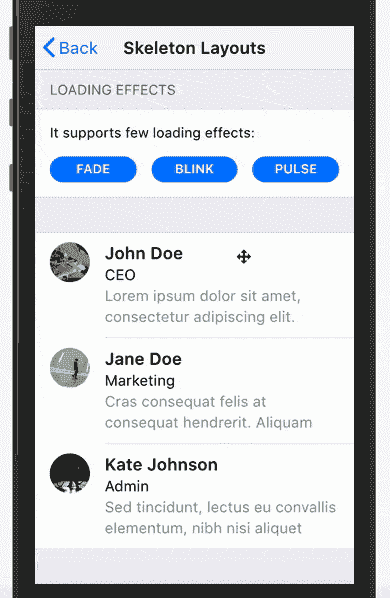](https://res.cloudinary.com/practicaldev/image/fetch/s--QDzp5knq--/c_limit%2Cf_auto%2Cfl_progressive%2Cq_66%2Cw_880/https://cdn-images-1.medium.com/max/390/1%2A-SEuT4csTk0RYSSFafhVww.gif)

Framework7 带有两种框架模式:

*   `skeleton-block`。它只是一个普通的灰色背景的块元素，可以是任何需要的大小
*   `skeleton-text`。这是更有趣的事情。Framework7 带有特殊的内置骨架字体，可以将每个字符显示为小的灰色矩形。当我们将`skeleton-text`类应用于任何元素时，它会将文本转换为灰色块/线。相对于`skeleton-block`的优势在于这种“框架文本”可以完全响应，并且它的大小将反映实际的文本大小。

骨架元素还支持三种动画效果:渐变、闪烁和脉冲。

### 范围滑块变为垂直

v4 中的范围滑块也做了一些修改和改进。现在它支持缩放和垂直方向:

[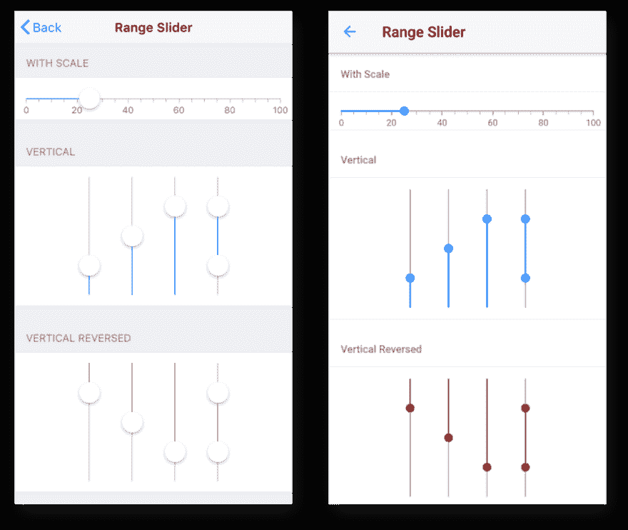](https://res.cloudinary.com/practicaldev/image/fetch/s--7TtXYjFp--/c_limit%2Cf_auto%2Cfl_progressive%2Cq_auto%2Cw_880/https://cdn-images-1.medium.com/max/1024/1%2AQi3A6wBRJ64ibLnk6g6QJg.png)

### 核心图标字体

这里还有一个与 Framework7 核心图标相关的改进，例如“后退”图标、搜索栏“搜索”图标和其他图标。在 v4 之前，它们在主 CSS 包中被实现为内嵌(数据 url) SVG 图像。这非常方便，但是当我们需要改变这种图标的颜色时会带来困难——我们需要用另一个具有所需颜色的内嵌 SVG 图像重新定义它。

在 v4 中，所有核心图标都被修改为内置的带有连字的核心图标字体。它允许节省额外的 KB 的大小和没有更多的困难来改变他们的颜色。现在要改变图标的颜色，我们可以使用 CSS 的`color`规则。

### 服务人员—新模块

这个新模块是使用 Framework7 进行渐进式 Web 应用程序开发的一大步。目前它只允许简化服务人员的注册过程，但很快就会有更多的功能。

例如注册服务人员，我们可以在 app 参数中指定:

```
var app = new Framework7({
  // ...
  serviceWorker: {
    path: 'path/to/service-worker.js',
    scope: '/',
  },
}); 
```

或者在 app 初始化后用 API:

```
app.serviceWorker.register('path/to/service-worker.js', '/')
  .then((registration) => {
    console.log('Service worker registered');
  }) 
```

有了这个模块，与服务人员合作将变得非常简单。

### 请求允诺

内置的请求库可以处理 XHR 的请求，现在可以像承诺一样工作了。

*   `app.request.promise(...)` —与`app.request()`相同，但返回将通过响应数据解决的承诺
*   `app.request.promise.get(...)` —与`app.request.get(...)`相同，但返回将通过响应数据解决的承诺
*   `app.request.promise.post(...)` —与`app.request.post(...)`相同，但返回将通过响应数据解决的承诺
*   `app.request.promise.json(...)` —与`app.request.json(...)`相同，但返回将通过响应数据解决的承诺
*   `app.request.promise.postJSON(...)` —与`app.request.postJSON(...)`相同，但返回将通过响应数据解决的承诺

并且用法是:

```
app.request.promise.get('./something.html')
  .then((data) => {
    // Handle response
    console.log(data);
  })
  .catch((err) => {
    // Error happened
    console.log(err);
  }); 
```

或使用异步/等待:

```
const content = await app.request.promise.get('./something.html');

// Handle content
console.log(content) 
```

### 快速点击禁用

Fast clicks 是一个内置的库，可以消除移动浏览器中链接和表单元素在您单击时的 300 毫秒延迟。自第一个 Framework7 版本发布以来，它就已实现并启用，这是让使用 Framework7 开发的应用程序感觉更自然的特性之一。

但是从那时起已经过去了很长时间。现代浏览器足够聪明，可以在满足某些条件时消除点击延迟，比如正确的`<meta name="viewport"\>` meta 标签。所以在 v4 中，它现在被默认禁用，以避免不必要的问题，特别是对于第三方库。如果你的目标是旧设备，比如 iOS < 10，就必须启用它。

### 在 iOS 主题中触摸涟漪

为什么不呢？MD 主题独有的触摸涟漪效果现在也可以通过`app.touch.iosTouchRipple = true`参数为 iOS 主题启用。

[](https://res.cloudinary.com/practicaldev/image/fetch/s--Q1jjPjV6--/c_limit%2Cf_auto%2Cfl_progressive%2Cq_66%2Cw_880/https://cdn-images-1.medium.com/max/390/1%2Ax2je18FD8fOAqcnK0U9s7Q.gif)

<figcaption>v4 iOS 主题中的触摸涟漪效果</figcaption>

### 事件总线

如你所知，Framework7 有非常灵活的事件系统/模型。Framework7 的类的每个实例(如主`Framework7()`类或任何基于类的组件，如`app.calendar.create()`)都有发出和处理事件的方法(`emit`、`on`、`once`、`off`)。

这种模型对于为应用程序组件之间的通信创建自定义事件也非常有用。

因此，在 v4 中有一个新的助手类，它被设计为仅像事件总线一样使用，而不是淹没主应用程序实例。

```
const myEvents = new Framework7.Events();

// handle event
myEvents.on('some-event', () => {
  // do something when 'some-event' fired
})

// emit event
myEvents.emit('some-event');

// another event bus
const notificationEvents = new Framework7.Events();

notificationEvents.on('notificationReceived', (notification) => {
  // do something
})

// somewhere in the app
notificationEvents.emit('notificationReceived', {
  title: 'New message',
  from: 'John Doe',
}); 
```

### 框架 7 图标 V2

你可能知道，我们最近发布了[Framework7 Icons v2](https://dev.to/framework7/framework7-icons-v2-g9p-temp-slug-6361637)——免费的、令人惊叹的和巨大的一组专门为 framework 7 设计的手工制作的 iOS 图标。

在[这篇博文](https://dev.to/framework7/framework7-icons-v2-g9p-temp-slug-6361637)中，我们写道它们有不同的设计尺寸，所以它们在 framework 7 v1–v3 中的使用可能需要额外的调整。

Framework7 v4 设计用于新的 F7 图标，因此它们将完全适合这里。

### 框架 7 反应& Vue 变化

当然，上面提到的所有新功能，比如大导航条、工具栏位置、统一按钮、可扩展卡片，都将在这里提供，并在相关组件上有新的道具。还有新的 Vue/React 组件用于新的 UI 组件，如菜单和框架。

但这里也有突破性的变化。`f7-label` / `Label`组件已被移除。它与`f7-input` / `Input`组件一起使用，在列表视图中创建输入。现在，我们需要使用最近在 Framework7 v3 的最新版本中引入的新的`f7-list-input` / `ListInput`来代替那些组件。

所以如果你有这样的东西(例如在 Vue 中):

```
<f7-list-item>
  <f7-label>Name</f7-label>
  <f7-input
    type="text"
    :value="userName"
    placeholder="Your name"
    @input="updateUserName"
  />
</f7-list-item> 
```

需要换成新的单个组件:

```
<f7-list-input
  label="Name"
  type="text"
  :value="userName"
  placeholder="Your name"
  @input="updateUserName"
/> 
```

### 框架 7 CLI v2

Framework7 CLI 的第一个版本不久前发布，由于缺乏其功能和实用性，它没有得到维护，也没有在任何地方提及。

但是现在一切都变了。随着 Framework7 v4 版本的发布，我们引入了全新的 Framework7 CLI，这是一个启动 Framework7 应用程序开发的极其强大的工具。对于 Framework7 v4，这将是设置新 Framework7 项目的最推荐方式。

与其维护不同版本的官方模板(*Core/Vue/React * Single View/Tabs/Split View * Web/Cordova/PWA*)，不如用一个工具组合所有版本。

因此，新的 Framework7 CLI 允许:

*   选择模板:单一视图、选项卡、拆分视图
*   选择框架:F7 核心，F7 Vue，F7 反应
*   选择目标:Web app、PWA、Cordova 或它们的组合
*   从一开始就指定自定义颜色主题
*   选择 bundler:无 bundler、Webpack 或 Rollup(稍后提供)
*   生成所需的图标和闪屏

并且使用非常简单。首先，我们需要安装 F7 命令行界面(现在是测试版)和科尔多瓦:

```
$ npm i framework7-cli@beta cordova -g 
```

并在要创建 app 的目录下运行以下命令:

```
$ framework7 create 
```

程序将提示几个关于你想开始的框架和模板的问题:

[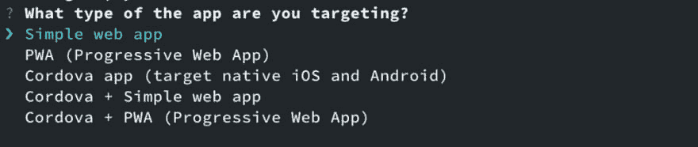](https://res.cloudinary.com/practicaldev/image/fetch/s--1wVsPA5X--/c_limit%2Cf_auto%2Cfl_progressive%2Cq_auto%2Cw_880/https://cdn-images-1.medium.com/max/1024/1%2ARQtTZ99F-Llz3xv5M-0CQA.png)

[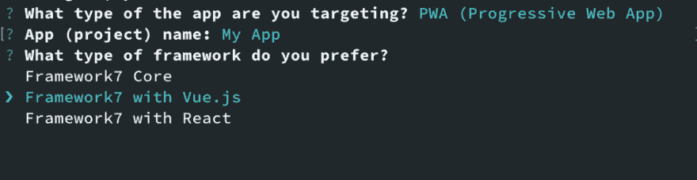](https://res.cloudinary.com/practicaldev/image/fetch/s--pk5djQul--/c_limit%2Cf_auto%2Cfl_progressive%2Cq_auto%2Cw_880/https://cdn-images-1.medium.com/max/1024/1%2ADv0ow2VcaGAy0j8IDkZBOQ.png)

[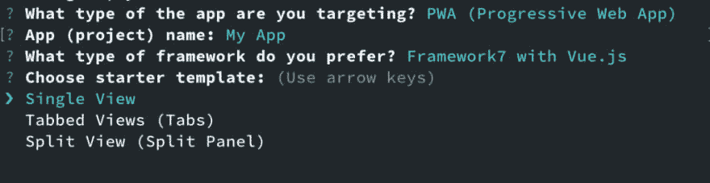](https://res.cloudinary.com/practicaldev/image/fetch/s--eRbs_-iF--/c_limit%2Cf_auto%2Cfl_progressive%2Cq_auto%2Cw_880/https://cdn-images-1.medium.com/max/1024/1%2Arrw40Ha3J2LOZlmnPolMrQ.png)

而且还自带 UI。我们可以运行下面的命令来启动 UI 来创建项目:

```
$ framework7 create --ui 
```

将会打开以下 web 应用程序:

[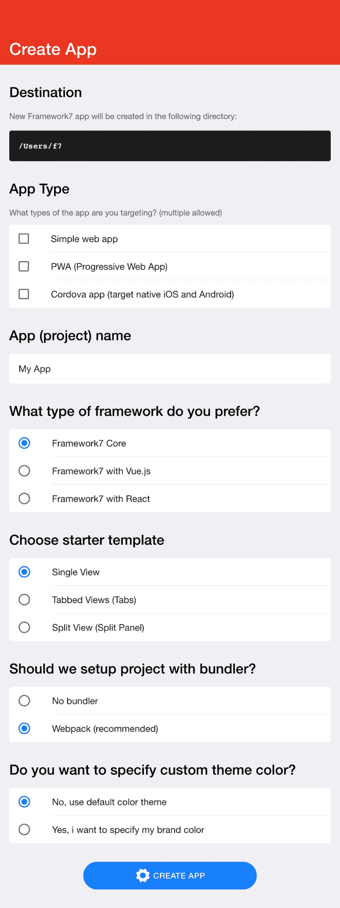](https://res.cloudinary.com/practicaldev/image/fetch/s--0wbS4K4G--/c_limit%2Cf_auto%2Cfl_progressive%2Cq_auto%2Cw_880/https://cdn-images-1.medium.com/max/1024/1%2AE71Zw0ZZ62BcNJiyGUTCFA.png)

### 什么时候？

最终稳定的 4.0.0 版本将于 2019 年 1 月底-2 月初发布🎉

但你已经可以尝试测试版，可以认为是生产准备就绪。

对于已经创建的 v2/v3 应用程序，您可以通过在 GitHub 发布页面下载测试版进行升级，或者通过 NPM:

*   `npm i framework7@beta` —对于核心框架 v4
*   `npm i framework7-react@beta` —对于框架 7-反应 v4
*   `npm i framework7-vue@beta` —对于框架 7-Vue v4

对于新的应用程序，强烈建议使用全新的框架 7 CLI:

```
$ npm i framework7-cli@beta cordova -g
$ framework7 create --ui 
```

### P.S

如果你热爱 Framework7，你可以在 pat reon:[https://www.patreon.com/vladimirkharlampidi](https://www.patreon.com/vladimirkharlampidi)或在 [Framework7 商店](https://teespring.com/stores/framework7)购买一件漂亮的品牌 t 恤来支持这个项目

* * *