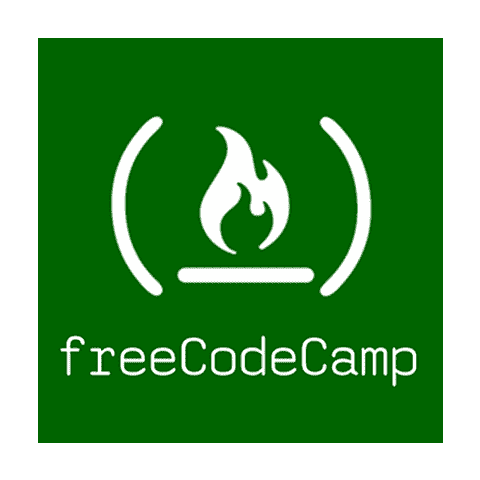
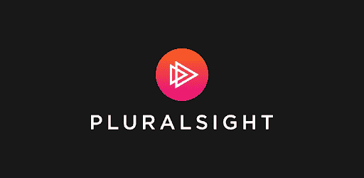
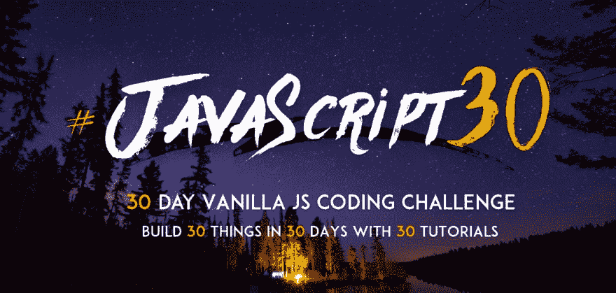
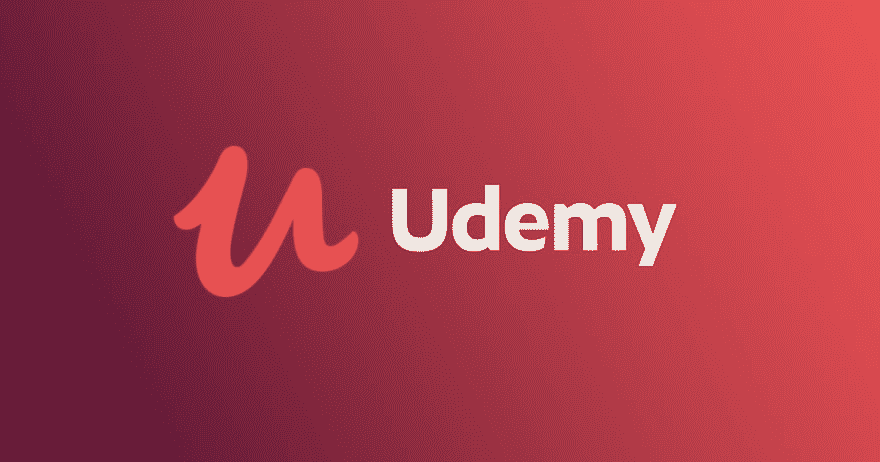

# Web 开发人员的最佳在线学习资源

> 原文：<https://dev.to/dylanesque/the-best-online-learning-resources-for-web-developers-17e5>

**2019 年 3 月 8 日**

注意:这是我博客上一篇文章的略微修改版本，增加了 LevelUpTuts 和其他小改动。

**2019 . 5 . 11 编辑:新增前端主控条目**

欢迎回到自学成才的开发者生存指南！我对本周的条目感到非常兴奋，因为它解决了有抱负的 web 开发人员面临的一个关键问题:哪里是我学习的最好地方？网上有很多选择，从博客到完整的课程再到电子书，由于第一次学习新技能的人面临的最大问题是他们**不知道自己不知道什么**，我将通过概述我认为网上学习开发的最佳位置来简化事情！这里列出的资源在三个方面表现特别好:

*   价格:它们是免费的，或者相对便宜。

*   当前知识: Web 开发比其他职业发展得更快，这些资源已经证明他们至少可以合理地跟上发展。

*   **高质量:**在这些网站上，材料得到了适当详细程度的解释。举个例子，当我最终抽出时间阅读经典软件书籍时，比如罗伯特·c·马丁的 [Clean Code](https://www.amazon.com/Clean-Code-Handbook-Software-Craftsmanship/dp/0132350882/ref=sr_1_2?ie=UTF8&qid=1534454652&sr=8-2&keywords=clean+code) 或者史蒂夫·麦康奈尔的 [Code Complete](https://www.amazon.com/Code-Complete-Practical-Handbook-Construction/dp/0735619670/ref=sr_1_3?s=books&ie=UTF8&qid=1534454673&sr=1-3&keywords=code+complete) ，有很多我已经内化了的最佳实践，因为这是 Treehouse 上的老师们所采用的风格。

在我们开始之前:我在这里区分了积极教授开发的资源和当你作为开发人员学习和积极工作时作为参考的资源，我将在后面的帖子中讨论。

### freeCodeCamp

他们有什么交易？:由[昆西·拉森](https://twitter.com/ossia)、[于 2014 年创立的 freeCodeCamp](https://www.freecodecamp.org/) 正如其广告上所说:一个免费的在线编码训练营。

优势:在最近的网站升级后，学习材料的丰富程度令人尴尬，数百个编码挑战，加上认证标志着学习的里程碑。freeCodeCamp 在其官方论坛和 Twitter 上也有一个高度支持的社区。如果你是新手，不知道从哪里开始，freeCodeCamp 提供了这里列出的所有资源中最有条理的发展途径。

**弱点:**由于该网站的众包性质，个人挑战的质量存在一些差异。挑战有时以一种方式呈现，这种方式不能清楚地传达一种技术有什么用，或者具体如何工作。特别是后端的挑战对一些技术几乎没有提供任何解释，实际上是将学生送到官方文档中。此外，除了屏幕上呈现的任何内容，目前没有关于代码问题的反馈，因此您必须在其他地方调试 JavaScript，这非常令人讨厌。然而，贡献者有一个活跃的社区，所以不要指望任何重大问题会长期存在。

这要花多少钱？:免费！如果你愿意的话，你可以每月捐款来帮助维持照明。

它有多重要？:不要让这里的弱点部分的长度欺骗了你:freeCodeCamp 是新手开发者最不可或缺的学习资源之一。

### 复数

他们有什么交易？: [Pluralsight](https://www.pluralsight.com/) 是一个订阅网站，有数百个全面的视频课程，涉及大量的技术主题。

这要花多少钱？:在撰写本文时，Pluralsight 会员每月 35 美元，年度会员 299 美元。

**长处？:** Pluralsight 拥有令人印象深刻的广泛课程，从设计到开发，再到许多其他 IT 子专业。除了 Pluralsight 之外，本条目中有很多主题没有在其他资源中讨论。有很多课程是由知名老师教授的，比如道格拉斯·克洛克福特、黛博拉·库拉塔和约翰·帕帕。有测验来测试你对特定技术的知识或对某一课程部分材料的记忆。

**弱点？** : Pluralsight 目前落后于我在这里讨论的其他资源，无法跟上时代的步伐，特别是在它的学习道路上。测试你的技术知识的“技能智商”功能可以非常随意，因为它只是一个多项选择测试，你可能会非常幸运或不幸。

它有多重要？:这个很有情景性。如果有什么东西你需要深入研究，但在其他地方没有深入研究，Pluralsight 可以帮助你。但是，尽管 Pluralsight 很好，但它也有一些限制，这迫使我在提到它时提出上述警告。

### Wes Bos

他们有什么交易？:韦斯·博斯(Wes Bos)是一名加拿大开发者，他最出名的是他的 [30 天 Javascript](https://javascript30.com/) 视频课程，他推出了关于 [React](https://reactforbeginners.com/) 、 [Node](https://learnnode.com/) 和其他主题的极高质量的课程。Wes 是开发人员在 Twitter 上必不可少的关注者，因为他有许多见解和热门技巧。他也是优秀的 [Syntax.fm](https://syntax.fm/) 播客背后团队的一员。

这要花多少钱？: Wes 的 [Flexbox](https://flexbox.io/) ， [Grid](https://cssgrid.io/) ， [Redux](https://learnredux.com/) ， [Markdown](https://masteringmarkdown.com/) ，[命令行 Power User](https://commandlinepoweruser.com/) 以及 30 天的 JavaScript 课程全部免费。他的其他课程就不是了，而且价格会根据你住在哪里以及你是否有促销代码而有所不同。每个课程的价格在 60-80 美元左右，促销活动频繁。

**长处？:** Wes 是一位优秀的老师，也是一位经验丰富的自学成才的开发者。他的课程是综合性的项目，如果你记笔记并真正关注他的教学，这些项目会给你在他们教授的技术方面打下坚实的基础。韦斯在一个非常容易理解的层面上解释概念。

**弱点？:**只知道材料就这么多，但拜托，他就一个人！有些课程(Sublime，Redux，命令行)已经相当过时了，但这不是标准；韦斯很擅长让材料保持最新。

它有多重要？:我的立场是，每一个学习 web 开发的人都应该上完 Wes 的 JavaScript 天课程。我个人上过他的 Node，React，Redux， [ES6](https://es6.io/) 课程，都是非常值得花的钱。

### 升级教程

他们有什么交易？: [LevelUp 教程](https://www.leveluptutorials.com/)是 Syntax.fm 团队的另一半 [Scott Tolinski](https://twitter.com/stolinski) 的优秀教程系列。斯科特的平台很像韦斯的，但内容更短、更频繁。

这要花多少钱？: $19.99 为每月专业订阅，略低于购买年度订阅。在 [YouTube](https://www.youtube.com/user/LevelUpTuts) 上也有相当数量的免费内容。

**长处？:** Scott 是一位优秀的老师，他的视频质量水平极高。当你第一次处理像 Redux 这样棘手的概念时，你肯定会从他作为老师的熟练程度中受益。当您处理不一致的 wifi 时，专业用户还可以下载视频进行移动学习！

**弱点？:**同样，像 Wes 一样，内容也只有这么多，这是一个人操作的结果。

它有多重要？:如果您正在学习 React 及其相关技术，LevelUp 教程是一个很好的选择，可以让您更快地上手。

### 树屋

他们有什么交易？:由[瑞安·卡森](https://twitter.com/ryancarson)于 2011 年创立的[树屋](https://teamtreehouse.com/)是一个在线学习平台，其使命是让学习变得负担得起和容易获得。他们有大量的课程，包括视频讲座、测验和编码练习。该课程涵盖了与 web 开发相关的主题，但也涉及商业、设计和其他相关主题。

这要花多少钱？在我写这篇文章的时候，每月 25 美元。

**长处？:**非常高的产值，一个温暖诱人的场地。Treehouse 有很多关于语言的资料，包括 JavaScript、C#、Go、Ruby、PHP、Java 等等。在这里列出的资源中，Treehouse 具有最一致的高质量。还有一个高级的 Techdegree 项目，作为一个在线训练营，每月 199 美元。除了 freeCodeCamp 之外，Treehouse 还有最有条理和最清晰的途径来学习今天在这里讨论的所有资源。

**弱点？:**在撰写本文的时候，几乎没有任何算法可以帮助新开发人员准备可怕的白板面试。这是一个小问题，但它使得 Treehouse 在面试准备方面不如列表中的其他资源有效。树屋也比大多数其他来源昂贵，特别是对于技术学位。

它有多重要？: Treehouse 可能非常有用，特别是如果你对技术非常陌生，并且将从 Treehouse 上存在的 web 开发生态系统的深入、详细的解释中受益。

### 击球

他们有什么交易？: [Udemy](https://www.udemy.com/) 是一个提供各种主题视频课程的网站。它不局限于技术或开发，但他们的开发课程范围令人印象深刻。

这要花多少钱？:价格各不相同，但销售是频繁的，所以你永远不应该支付超过 9.99 美元左右的课程。

**长处？:**在材料和指导老师方面，你有很多选择。Udemy 上的课程通常比其他资源更新得更快，这对于像 React 或 Angular 这样快速变化的技术来说是关键。Udemy 上有一些非常强大的导师，他们提供基于项目的课程，这些课程将提高你的发展能力，例如[马克西米利安·施瓦茨穆勒](https://twitter.com/maxedapps)、[斯蒂芬·格里德](https://twitter.com/ste_grider)、[安德烈·尼戈依](https://twitter.com/AndreiNeagoie)和[安德鲁·米德](https://twitter.com/andrew_j_mead)。如果你选择了正确的课程，你的技术教育投资就不会有比 Udemy 更好的回报了。

**弱点？:**你有很多选择，而且并非所有的选择都是平等的。幸运的是，质量差的课程很容易避免。如果可能的话，我建议只选择 4.5 星或更高的课程。像“最畅销”和“评价最高”这样的标签也能帮助你做出投资什么课程的明智决定。我相信你可以从 Udemy 获得比任何其他资源更多的东西，但是你必须对你需要学习的东西有一个很好的想法，并准备好策划这种体验。话虽如此，不久博客中还会有一个条目，展示 Udemy 上最好的网络开发课程。

它有多重要？: Udemy 是我目前最喜欢的学习资源，我相信一个拥有正确路线图的新开发人员可以比其他任何资源更快地掌握 Udemy 课程的技能。我将在这个博客系列的下一篇文章中描绘出这个路线图！

### 前端主控

他们有什么交易？: [Frontend Masters](https://www.udemy.com/) 是一个基于明尼阿波利斯的研讨会系列，讨论各种前端主题。

这要花多少钱？:网站订阅费每月 39 美元。

**长处？:** Frontend Masters 在信息的高质量和“最小有效剂量”方面首屈一指。我认为这篇博客中的许多选项就像本科水平的研究，前端硕士作为研究生水平的课程。车间老师都非常擅长他们所教的内容。值得注意的是高级研究。事实上，有一个更多样化的教师阵容(阅读:更多的有色人种和女性)，我认为这给了你一个不同于 Udemy 上(主要是)白人的视角。有一些方法可以帮助你组织学习内容和时间，并使你的进步游戏化。既有现场研讨会，也有这些研讨会的存档/组织版本。我会特别敦促你们去看看由[威尔·森坦斯](https://twitter.com/willsentance)、[莎拉·德拉斯纳](https://twitter.com/sarah_edo)、[斯科特·莫斯](https://twitter.com/scotups)、[杰姆·扬](https://twitter.com/JemYoung)和[雪莉·吴](https://twitter.com/sxywu)教授的课程。

**弱点？:**如果你碰巧在某件事情上遇到困难，寻求帮助并不像这里列出的其他来源那么容易。我在尝试 SSH 到 Jem Young 的前端课程的完整堆栈中的服务器时遇到了这个问题，我不得不求助于我的一个系统管理员朋友来帮我解决这个问题。显然，这也是最昂贵的选择之一，但我认为，与类似价格的 Pluralsight 相比，你的钱花得更值。

它有多重要？:如果你正在寻找技术上的弱点，特别是在普通的 JavaScript 知识方面，Frontend Masters 是一个强大的选择。我很晚才参加 Frontend Masters 聚会，但它确实帮助我思考了我以不同方式使用的技术，并且更有效。

### 总之

我希望这个列表能简化你的事情，并为你指明一条有助于你成功的学习之路！下期自学式开发者生存指南:充分利用 Udemy！