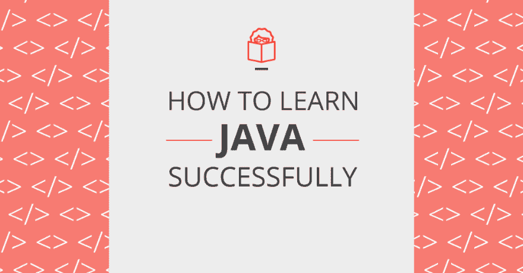
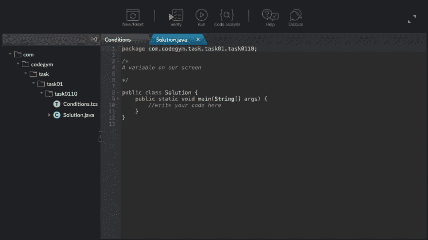
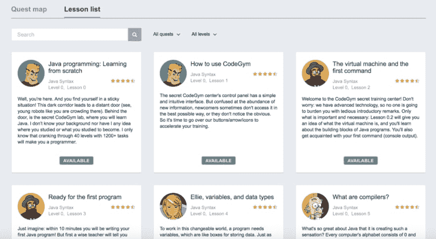
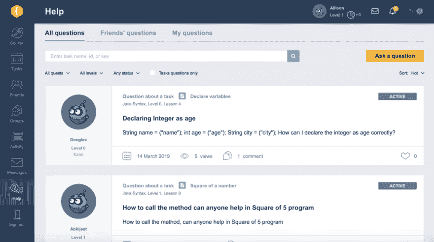

# 学习 Java 编程的最佳方法

> 原文：<https://dev.to/codegym_cc/the-best-way-to-learn-java-programming-2p2c>

 
学习 Java 编码有很多令人信服的理由，即使你是初学者。Java 是一种流行的编程语言，以其可靠性、多功能性和向后兼容性而闻名(这意味着它可以与旧的遗留系统一起工作)。它还可以在几乎每台计算机上运行，而不会改变行为。

但是 Java 难学吗？简单的回答是，是的，这可能很棘手。在学习 Java 编程时，您会遇到一些简单的概念，如变量和函数，但也有一些更抽象、更复杂的概念，如对象，它们带来了难以理解的继承和多态。Java 也定期变化，不时会添加新的特性。

但是，即使有一个学习曲线，当你知道一些如何学习 Java 编码的基本技巧时，学习会更顺利。一旦你掌握了一些基础知识，并在初级水平上变得流利，学习复杂的主题就更容易(也更愉快)了。

在这篇与 [CodeGym](https://codegym.cc/) 合作发起的特别帖子中，你将发现成功学习 Java 的最有效和最好的方法，以及免费学习 Java 的最佳资源之一。如果您不确定如何作为初学者学习 Java，或者在过去从零开始学习 Java 很困难，那么这篇文章是为您准备的。

## 为什么要学 Java？

在我们开始学习 Java 编程的最佳方法之前，有一个更紧迫的问题:首先为什么要学习 Java？

Java 是面向事业的初学者的一个很好的选择，因为这是一项需求量很大的技能([30 亿台设备运行 Java！](https://www.zdnet.com/article/three-billion-devices-run-java-yeah-but-do-they-like-it/))，意味着更多的工作/实习机会。有证据表明，90%的财富 500 强公司使用 Java 来构建应用程序和后端系统。这是一个经济上有利可图的职业选择，Java 开发人员的平均年薪为[102，514 美元](https://www.indeed.com/salaries/Java-Developer-Salaries)。

您可以使用 Java 为不同的设备构建各种平台和应用程序，包括笔记本电脑、计算机、游戏机、汽车导航系统、蓝光播放器、医疗监控设备、彩票终端、停车计时器等。这种多功能性使得这种语言令人兴奋和独特，因为专门化的选择是无穷无尽的。

值得注意的是，Android 应用程序也是使用 Java 构建的，这不仅为 web 和软件开发，也为移动开发带来了机遇。

最后，Java 有一个强大的社区，可以在您学习时提供支持:

*   第二大 StackOverflow 社区
*   第四大 meetup 社区(有超过 1，400 个 Java Meetup 组，全球共有超过 580，000 名成员)
*   GitHub 上标签第二多的语言(GitHub 上有超过 150 万个 Java 项目)

最终，Java 可能不是最容易学的语言，但是有很多理由说明为什么它值得认真对待这项任务。

## 成功学习 Java 的 5 个最佳方法

既然我们已经说服您开始学习 Java(或者重新开始)，您可能想知道成功学习 Java 的最佳方法是什么。我们会保护你的！让我们来看看如何学习用 Java 编程并在困难时坚持下去的五个技巧。在这个过程中，你将了解到 [CodeGym](https://codegym.cc/) ，这是以一种成功的、可持续的方式开始免费学习 Java 的最佳资源之一。

### 1。理论与实践之间的平衡

一些理论有助于建立自己的知识基础，但要避免过多的理论而忽视实践。如果你没有实际编写任何程序，那么阅读大量的 Java 书籍是没有帮助的。不要试图一次理解所有的东西:一次读一点，然后编码，编码，编码！你会边走边学，当你在实践练习中真正使用这些概念时，事情会变得明朗起来。

这也是 code gym 80%专注于实践，20%专注于理论的原因。该课程可以为你的教育理论部分提供复杂的帮助(Java 语法、OOP、结构、多线程等)。)，而不会让你在理论上陷入困境，没有任何东西可以展示出来。

在你解决了 CodeGym 上的 1200 多项任务后，你将获得大约 500 小时的实际编程经验。

### 2。安排你的学习经历，设定里程碑和可实现的目标来保持专注

从一种技能跳到另一种技能通常不是一种有效的学习方式。最好是一次深入钻研一种语言，这样你就不会分心或者把一种语言和另一种语言搞混了。这就像试图同时学习西班牙语和意大利语一样——你最终可能会说某种混合语。

一旦你选择了学习像 Java 这样的语言，通过一周七天学习你选择的课程来保持你的动力。即使每次只有半个小时，每天坚持编码也有助于巩固这个习惯，让它成为你日常生活的一部分。

为了在动力不足时保持专注，提醒自己为什么要学习 Java。你想成为一名全职开发人员吗？打造自己的 app？确定你的目标，并利用它们让你保持在正轨上。

使用时间管理策略也会让你在忙碌的生活中挤出时间来学习的压力小很多。

CodeGym 的课程在这方面很有帮助，因为它为你设定了里程碑。本课程分为一个清晰的路线图和时间表，并为你设定可实现的小目标。

### 3。用游戏化来保持动力

不是每个人都可以仅仅从书本和讲座中成功地学习。游戏化通过使学习体验更加吸引人、有趣和互动来发挥作用。你会期待坐下来完成任务，而不是感到害怕和不知所措。当你沉浸在游戏中时，也很难分心！

这是 CodeGym 对于那些没有编程经验的人来说是理想的选择的主要原因之一——他们的游戏化是正确的:

*   CodeGym 就像一个电子游戏；当你正确地解决了一个问题，你就获得了“暗物质”(开启下一堂课或下一关所需要的点)
*   你扮演一个名为 Amigo 的拟人化机器人，你一级一级地通过课程，收集和花费暗物质
*   课程/游戏以故事为基础，涉及太空旅行、外星生命和机器人
*   它分为 40 个级别(4 个任务，10 个级别)，每个级别包括大约 15-30 个编码任务，10-20 个 Java 讲座和激励文章，让你坚持下去——即使事情变得棘手

通过把它变成一个游戏，你基本上是在欺骗自己去学习编码！

### 4。与其他 Java 学生和开发人员交流+提问

如果你和志同道合的人一起工作，你会学得更有效率。另外，建立联系会提高你的自信，加速你的学习。

当情况变得艰难时，问正确的问题可以帮助你解决棘手的任务，完成复杂的项目，否则你可能会放弃。一定要问具体的问题，而不是“出了问题，你能帮忙吗？”不要因为不知道答案而尴尬。

为自己建立一种社区意识对保持动力也很重要。学习编码很难，但是知道你不是一个人在做这件事会有帮助！

一旦你建立了知识基础，你就可以通过分享你自己的技巧来回馈社区。你甚至不必等到你成为专家，因为教和指导别人实际上可以帮助你更好地保留信息，学得更快。

如果你选择学习 CodeGym，他们在帮助区有一个学生社区。在这里，学生们寻求提示，帮助突破障碍，以及找出他们在代码中做错了什么的建议。

### 5。开始建立一个在线投资组合

正如你所了解的，建立真正的项目并给别人一个看到你作品的机会是非常有价值的。当你准备申请 Java 开发人员的工作或接自由职业者的项目时，你已经准备好向潜在的雇主或客户展示你的作品集了。

开发人员的一个流行选择是创建一个 GitHub 帐户，并在那里发布您的项目。或者，你可以建立自己的投资组合网站。拥有自己的作品集也能让你自豪地回顾你已经完成的工作。

## 结论

现在你已经掌握了帮助你正确学习 Java 的策略和技术。总的来说，学习 Java 的关键是实践和一致性——而且保持它的趣味性也无妨！

我真的推荐你从[注册 CodeGym](https://codegym.cc/login) 开始你的旅程——完成第一个任务是完全免费的，所以你可以在进入下一个任务之前尝试一下。有什么更好的方法让你开始学习 Java 呢？

之前发表在[leantocodewith . me 博客](https://learntocodewith.me/posts/learn-java/)上。