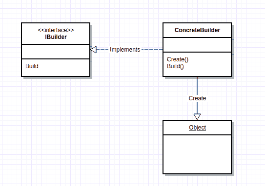

# 构建器模式。网络核心

> 原文：<https://dev.to/gary_woodfine/the-builder-pattern-net-core-49gj>

Builder 模式是一个创造性的四人组(g of)设计模式，在他们的开创性著作[Design Patterns:Elements of Reusable Object-Oriented Software](https://amzn.to/2N22a2H)中定义，在该书中，他们为常见的设计问题提供了一系列简单明了的解决方案。

该模式对于封装和抽象对象的创建非常有用。它与更常见的[工厂模式](https://garywoodfine.com/factory-method-design-pattern/)不同，因为 Builder 模式包含定制对象创建的方法。

每当一个对象可以在多个维度上以多种方式配置时，构建器模式可以简化对象的创建并阐明其意图。

[](https://res.cloudinary.com/practicaldev/image/fetch/s--BqjEvf2a--/c_limit%2Cf_auto%2Cfl_progressive%2Cq_auto%2Cw_880/https://garywoodfine.com/wp-content/uploads/2019/05/builder-pattern-uml.png)

让我们探索一下构建器模式，以及开发人员如何使用它从组件中构造对象。您可能已经看到,[工厂模式](https://garywoodfine.com/factory-method-design-pattern/)返回几个不同子类中的一个，这取决于传递给创建方法的参数中的数据。
我们现在将了解构建器模式根据数据以不同的方式组装许多对象。

### 构建器模式的优势

*   生成器模式使开发人员能够隐藏如何创建对象的细节
*   构建器模式使开发人员能够改变它构建的对象的内部表示。
*   每个特定的构建器都独立于其他构建器和应用程序的其余部分，从而提高了模块性，并简化和支持其他构建器的添加。
*   对对象的创建提供更好的控制。

构建器模式与抽象工厂模式相似，都返回由许多其他方法和对象组成的类。

构建器模式和抽象工厂模式的主要区别在于，抽象工厂模式返回一系列相关的类，而构建器模式根据提供给它的数据一步一步地构建一个复杂的对象。

### 单元测试中的构建器模式

builder 模式是单元测试中使用的一种流行模式，事实上，我最喜欢在单元测试中使用的工具之一是[Nbuilder——一个快速测试对象生成器](https://github.com/nbuilder/nbuilder),如果你阅读源代码，它也提供了一个如何实现 builder 模式的很好的例子。

Gary Maclean Hall 在他的书 [Adaptive Code](https://amzn.to/2VyXJAN) 中陈述了构建器模式对于封装和抽象对象的创建是有用的，并且提供了一个使用构建器模式的例子，通过帮助消除任何不必要的排列代码来帮助阐明单元测试的意图。

### 示例构建器模式

## /[软件-设计-模式](https://github.com/garywoodfine/software-design-patterns)

### C#设计模式教程示例代码

<article class="markdown-body entry-content p-5" itemprop="text">

# C#和。网络核心

在软件开发中，软件设计模式是对经常出现的问题的可重用解决方案。软件设计模式是用于解决问题的描述或模板，可以在许多不同的情况下使用。

1994 年，所谓的四人组(g Of)出版了他们的书[设计模式:可重用面向对象软件的元素](https://amzn.to/2Nx1Iq6)，在书中，他们提出了一个简单明了的解决常见设计问题的目录。

这本书捕获了 23 种模式，使软件架构师能够创建灵活、优雅且最终可重用的设计模式，而不必为自己重新发现或重新发明设计解决方案。

通过一系列关于[garywoodfine.com](https://garywoodfine.com)的博客文章，我将讨论这些模式以及更多关于 C#如何。net 核心开发人员可以跨平台实现这些模式。net 核心软件解决方案。

# 内容

软件设计模式通常分为三类…

</article>

[View on GitHub](https://github.com/garywoodfine/software-design-patterns)

在这个例子中，我们将实现一个非常简单的构建器模式，并使用它来创建一个 Person 类，以包含一些属性来描述一个人

```
 public class Person
    {
        public int Id { get; set; }

        public string Firstname { get; set; }

        public string Lastname { get; set; }

        public DateTime DateOfBirth { get; set; }

        public Gender Gender { get; set; }
    } 
```

您可能会注意到，我们使用了一个枚举来包含性别值。

```
 public enum Gender
    {
        Male,
        Female
    } 
```

这个类没有什么复杂的，它只是一个简单的 POCO 类。我们现在可以开发我们的构建器类了，为了帮助说明这一点，我们还是保持简单。builder 类基本上会以字符串格式返回对象。

```
 public class Person
    {
        public int Id { get; set; }

        public string Firstname { get; set; }

        public string Lastname { get; set; }

        public DateTime DateOfBirth { get; set; }

        public string Occupation { get; set; }

        public Gender Gender { get; set; }

        public override string ToString()
        {
            return  $"Person with id: {Id} with date of birth {DateOfBirth.ToLongDateString()} and name {string.Concat(Firstname, " ",Lastname)} is a {Occupation}";
        }
    } 
```

最简单的 builder 类只是一系列带参数的名称构造函数方法，你会注意到它们总是返回类的一个实例。builder 类的最后一个方法是`Build`方法，它将返回完成的对象。按照惯例，这种方法通常被命名为`Build`或`Create`或类似的名称。

```
public class PersonBuilder
    {
        private readonly Person _person;

         public PersonBuilder()
        {
            _person = new Person();
        }

         public PersonBuilder Id(int id)
        {
            _person.Id = id;
            return this;
        }

         public PersonBuilder Firstname(string firstName)
        {
            _person.Firstname = firstName;
            return this;
        }

         public PersonBuilder Lastname(string lastname)
        {
            _person.Lastname = lastname;
            return this;
        }

         public PersonBuilder DateOfBirth( DateTime dob)
        {
            _person.DateOfBirth = dob;
            return this;
        }

         public PersonBuilder Gender(Gender gender)
        {
            _person.Gender = gender;
            return this;
        }

         public PersonBuilder Occupation(string occupation)
        {
            _person.Occupation = occupation;
            return this;
        }

         public Person Build()
        {
            return _person;
        }
    } 
```

我们现在可以使用我们的生成器来创建一个人，如下所示。

```
 class Program
     {
         static void Main(string[] args)
         {

             var person = new PersonBuilder()
                 .Id(10)
                 .Firstname("Gary")
                 .Lastname("Woodfine")
                 .Gender(Gender.Male)
                 .DateOfBirth(DateTime.Now)
                 .Occupation("Freelance Full-Stack Developer")
                 .Build();

             Console.WriteLine(person.ToString());

             Console.ReadLine();
         }
     } 
```

我们通过实例化 PersonBuilder 来构建对象，然后添加属性，最后我们调用的方法是`Build`方法。然后我们简单地调用`ToString()`方法来写出我们的值。

使用 Builder 模式，我们可以避免使用大型构造函数方法来提供构造对象所需的所有参数。大型构造函数方法导致代码不可读且难以维护。可能并不总是需要在构造函数方法中提供所有的参数，因为很可能并不总是需要它们。

在上面的代码中，我故意引入了代码的味道，在`ToString()`中，你会注意到有很多字符串插值，甚至额外的连接。我主要是因为我想强调。net core 利用了 builder 模式。

我们可以利用 StringBuilder 类，StringBuilder 避免了每次添加字符串时必须重新创建字符串。在 C#中使用 String 类意味着您正在使用一个不可变的对象，但是 StringBuilder 在大多数情况下要快得多，因为它不必在每次向它追加内容时都创建一个新的字符串。

我们现在可以如下重构我们的`ToString()`方法。

```
public override string ToString()=>
         new StringBuilder()
            .Append("Person with id: ")
            .Append(Id.ToString())
            .Append("with date of birth ")
            .Append(DateOfBirth.ToLongDateString())
            .Append(" and name ")
            .Append(Firstname)
            .Append(" ")
            .Append(Lastname)
            .Append(" is a ")
            .Append(Occupation)
            .ToString(); 
```

我们使用 StringBuilder 来创建字符串。你会注意到，尽管我说过按照惯例你可以使用`Build`或`Create`来定义返回你的对象的方法，但是你并不真的需要，相反你可以选择另一个名字，在 StringBuilder 的例子中是`ToString()`

在上面的例子中，我们已经实现了一个简单的构建器模式，然而，要确定为什么这实际上为开发人员提供了任何好处可能并不容易。毕竟，从这个简单的实现中，你可能会想，但我们确实可以简单地使用 C#对象初始化，并得到确切的结果。

```
 var person2 = new Person
             {
                 Id = 10,
                 Firstname = "Gary",
                 Lastname = "Woodfine",
                 DateOfBirth = DateTime.Now,
                 Occupation = "Freelance Full Stack Developer",
                 Gender = Gender.Male
             }; 
```

这种方法的问题在于，它非常类似于向函数传递参数，这无意中增加了理解代码的复杂性。

> 一个函数的理想参数个数是零(幂零)。接下来是一个(一元)，紧接着是两个(二元)。应尽可能避免三个参数(三元组)。三个以上(多角形)需要非常特殊的理由——无论如何都不应该使用。
> 
> [鲍勃叔叔-清洁代码](https://amzn.to/2PTO6ar)

在实例化对象时，总会有这样的情况，您需要调用一个函数来为该对象提供一个值。即生成新的 Id，这可能需要调用函数来获得新创建的 ID 值等。

正是在这种情况下，构建器模式成为一个更可行的选择，正如软件设计哲学中所定义的，我们能够降低复杂性。

> 当开发一个模块时，寻找机会给自己增加一点额外的痛苦，以减少用户的痛苦。
> 约翰·奥斯特豪特- [软件设计哲学](https://amzn.to/2V8AHfC)

### Fluent Builder 模式实现

标准定义构建器模式将复杂对象的构造与其表示分离开来，这样相同的构造过程可以创建不同的表示。

构建器模式提供了复杂对象的逐步创建，因此相同的构建过程可以创建不同的表示，这是构建器模式中的例行程序，也有助于更好地控制构建过程。所有不同的构建器通常继承自抽象构建器类，该类声明了指导者使用的通用函数，以便让构建器创建部分产品。

builder 与[抽象工厂](https://garywoodfine.com/abstract-factory-design-pattern/)有相似的动机，但是，在该模式中，客户端使用抽象工厂类方法来创建自己的对象，而在 Builder 中，客户端指示 Builder 类如何创建对象，然后向它询问结果。如何将类组合在一起取决于构建器类。这是一个微妙的区别。

当创建复杂对象的算法应该独立于组成对象的部件以及它们是如何组装的，并且构造过程必须允许所构造的对象的不同表示时，构建器模式是适用的。

如果我们考虑一个人对象，并考虑所有不同的变化，我们可以期望创建一个人对象。例如，我们如何对待已婚妇女？考虑到在某些情况下，我们可能需要考虑她的娘家姓。

很快就清楚了，在构建一个人物对象时，我们需要考虑各种各样的规则和变化。各种不同的组合方式和额外的属性，我们将需要包括在内。

不容易或不方便合并到对象初始化中的规则。我们还需要有灵活性和适应性，以便在未来的开发中改变或添加额外的方法。

在我们为 Person 类的流畅接口实现的第一个构建器中，我们实现了不带任何附加条件的构建器。我们没有强制执行分配顺序的规则。

代码简单易懂，但它确实让 builder 类容易被误用。我们可以用 C# .NET 中的方法链接来实现基本的表达式生成器。

我们将稍微重构我们的构建器，加入一个新方法`Create`，它将接受`Firstname`和`Lastname`参数，但更重要的是，我们将从构造器
中移除`Person`类的创建，并加入到`Create`方法中。

在创建时为对象提供 Id 也没有多大意义，很有可能在创建对象时就应该创建一个新的 Id。因此，我们还将从生成器中删除 Id 参数。

实现一个流畅的接口是一项相对简单的任务，可以通过使用方法链来完成。方法链只是一组返回自身的赋值方法。每个方法的结果可以调用下一个赋值方法，依此类推。

为了指导用户和执行构造规则(例如，类只能被赋值一次，后面跟着属性)，我们使用了渐进式接口。当方法返回“this”时，我们返回一个接口用于下一步。

```
 public class PersonBuilder
      {
          private Person _person;

         public PersonBuilder Create(string firstName, string lastName)
          {
              _person = new Person();
              _person.Firstname = firstName;
              _person.Lastname = lastName;
              _person.Id = Guid.NewGuid();
              return this;

          }
          public PersonBuilder DateOfBirth( DateTime dob)
          {
              _person.DateOfBirth = dob;
              return this;
          }

          public PersonBuilder Gender(Gender gender)
          {
              _person.Gender = gender;
              return this;
          }

          public PersonBuilder Occupation(string occupation)
          {
              _person.Occupation = occupation;
              return this;
          }

          public Person Build()
          {
              return _person;
          }
      } 
```

我们已经使用方法链实现了 Expression Builder 模式。班级本身为我们构建了一个人。然后我们可以调用任何赋值方法来填充字符类的字段和属性。每个方法返回其自身的副本，允许我们一个接一个地链接赋值方法，从而在 C# .NET 中实现我们的 fluent 接口。然后我们可以最终调用`Build()`方法来获得完整的 Person 类。

### 总结

我们研究了构建器模式，并看到它对于创建复杂对象是多么有用。我们还看了一个例子。net core framework 本身利用生成器模式来提供公共功能字符串生成功能。