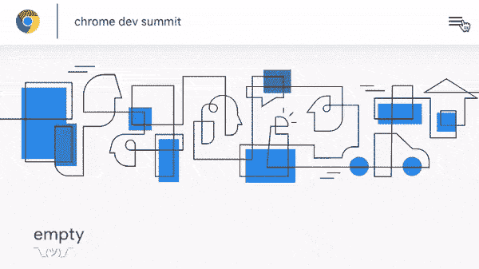

# Chrome 开发峰会网站:案例研究

> 原文：<https://dev.to/chromiumdev/the-chrome-dev-summit-site-case-study-15ng>

自 2013 年以来，谷歌一直在每年 11 月左右举办 Chrome Dev 峰会(CDS)会议。这是一个与 Chrome 工程师和网络人员交流的地方— [点击这里查看录音](https://bit.ly/CDS18-AllSessions)。

而且每个会议都需要[自己的网站](https://developer.chrome.com/devsummit)。在 CDS 的例子中，它是一个包含一些信息和时间表数据的静态站点。预订由另一个系统处理(和 Google 表单的自由应用)。2018 年，我们在之前工作的基础上，按照以下要求重写了网站:

*   很快(显然)
*   渐进式(支持旧浏览器)
*   可转位(对话已搜索引擎优化)

所以让我们来看看我们是如何建造它的。👍

# 基础知识

CDS 站点运行在一个简单的节点上。JS 服务器，为页面及其子页面呈现纯 HTML。每一点内容，无论是 FAQ 还是关于演讲者的信息，都是浏览器可以用真实的 URL 加载的。我们没有使用任何特定的框架——我们只是想要普通的 HTML。

我们很早就决定要支持无 JavaScript 的体验。这对我们来说很重要，包括浏览器的长尾，包括低端设备，如运行 KaiOS 的设备(在引擎盖下，运行 Firefox 48)——见下面的高质量“截图”！😮📸

[](https://res.cloudinary.com/practicaldev/image/fetch/s--kfHW1j37--/c_limit%2Cf_auto%2Cfl_progressive%2Cq_auto%2Cw_880/https://thepracticaldev.s3.amazonaws.com/i/qy5uaamg8581qazerzjm.jpeg)

当然，我们仍然需要 JS:虽然这个网站主要是为了提供*信息*，但是有几个地方也很好。

# 进行性增强

我们的 JS 是用`<script type="module" src="code.js">`发货的。使用“模块”类型很重要，因为它将只针对支持 ES6 模块的浏览器:大约从 2018 年初开始的现代浏览器。

这是一个非常有意的选择:

*   大多数访问 CD 的用户都是在现代浏览器上(CD 的目标是技术受众，他们往往有很高的更新率)

*   这让我们可以使用 ES6 的特性，比如`await`和`Promise`，而不需要额外的代码(阅读更多关于[高水位线](https://medium.com/dev-channel/es6-modules-in-chrome-canary-m60-ba588dfb8ab7)

*   我们只有两个目标:支持模块的现代、常青浏览器，或者无 JS 浏览器。通过减少表面积——没有中间地带——我们可以更积极地测试两个极端。

## 增强体验

因此，如果你现在打开 CDS 网站(我喜欢这个[空白页面](https://developer.chrome.com/devsummit/empty))并点击一个链接，你会看到页面之间的切换会产生一种与会议主题一致的过渡效果。如果没有 JavaScript，链接就是这样:它将加载全新的 HTML。

[](https://res.cloudinary.com/practicaldev/image/fetch/s--QwdnxyB_--/c_limit%2Cf_auto%2Cfl_progressive%2Cq_66%2Cw_880/https://thepracticaldev.s3.amazonaws.com/i/o4zl5vozg6p4wq340r6e.gif)

增强体验的工作原理有点像这样:

a.按住`Promise`，通过`window.fetch`开始加载新页面

b.用 CSS 过渡淡出当前页面，并降低标题图像的饱和度(`filter: grayscale(1)`)

c.`await`获取`Promise`，然后从整个其他页面的`<main>`标签中提取内容——我们在这里没有请求部分内容，所以在重新请求`<head>`等时会有很小的开销

这实际上是将另一个页面的完整 HTML 插入到一个虚拟元素:

```
// just dump the HTML into a tag so we can look for main
const node = document.createElement('div');
node.innerHTML = raw;

const recievedMain = node.querySelector('main');  // main from incoming DOM
realMain.innerHTML = recievedMain.innerHTML; 
```

Enter fullscreen mode Exit fullscreen mode

d.用新的 URL 调用`history.pushState`，用 CSS 淡入新的内容

如果上面的任何一个过程失败了，我们就退回到通过一个巨大的`try/catch`块将浏览器的位置设置为新的 URL。这只是一个例子，但是我们所有的 JS 都使用这种相同的方法逐步地*工作——只和`type="module"`一起运送，并且总是被包在安全块中。*

 *## 构建 JavaScript

我们的 JavaScript 存在于具有单个入口点的几个文件中(因为站点中的所有页面实际上都是相同的 wiki 风格的内容)。如前所述，我们使用 ES 模块，入口点在`src/bundle.js`——在开发中，这继续静态地包括进一步的文件(包括来自我们的`node_modules`文件夹的一些文件)，只是为了让我们的代码有一个好的布局。

⚠️:我们包含了来自`node_modules`的 ES 模块，但是你不能在没有[额外的汇总插件](https://github.com/rollup/rollup-plugin-commonjs)的情况下简单地导入老式的`require()/module.exports`代码，你将需要一个构建步骤*甚至*来进行开发。

为了构建，我们简单地使用 [Rollup](https://rollupjs.org) 将我们所有的源代码连接成一个文件。因此，即使我们的代码需要 es 模块，我们也不会在生产中使用导入或导出。这只是特性的一个高潮，我们的客户端浏览器只需要获取一个文件就可以让网站“运行”。

## 可索引性

在匿名窗口中加载我们的一个会话(重要！).你会注意到在会话弹出窗口的“后面”没有任何东西:这只是一个会话本身。

这个页面实际上是一个 [AMP](https://www.ampproject.org/) ，它工作得非常好:它是一个“叶子节点”，AMP 是为(想一想文章、商店里的物品、会话、演讲者等)而设计的。

如果您现在重新加载该页面，或者从[日程](https://developer.chrome.com/devsummit/schedule)本身导航到该页面，您将看到该会话以弹出窗口的形式出现。这是另一个增强，它有几个部分:

1.  一旦你加载了页面，我们会安装一个服务人员，通过控制所有的网络流量让站点离线加载(注意 Googlebot 不支持服务人员

2.  对于任何像`/devsummit/schedule/session-name`这样的网址，我们只提供常规的日程页面

3.  时间表页面上的 JavaScript 标识新的 URL 路由，并显示会话弹出窗口

这样，我们的会话可以以增强的方式显示，作为带有 JavaScript 的 SPA 的一部分。如果这个流不被支持，我们总是有后备选项:原始(AMP) HTML，几乎每个搜索引擎和浏览器都理解的东西。

## CSS 和设计

我们使用 [Less CSS](http://lesscss.org/) 作为我们的 CSS。在开发中，我们不做任何正在进行的构建过程，而是直接包含源代码及其运行时解析器:

```
<!-- dev less -->
<link rel="stylesheet/less" type="text/css" href="./static/styles/cds.less" />
<script src="//cdnjs.cloudflare.com/ajax/libs/less.js/3.7.1/less.min.js"></script> 
```

Enter fullscreen mode Exit fullscreen mode

在 prod 中，我们发布编译好的 CSS 文件。

# 挑战

为旧浏览器或搜索引擎提供一个无 JS 的解决方案当然很好，但是有些部分传统上很复杂。

## 互动边栏

如果您在小型设备(例如 KaiOS 设备)上加载 CD...或者只是缩小窗口)，您可能会注意到一个非常具有交互性并且是导航所必需的组件——侧栏。

事实上，我们可以完全不需要脚本就能做到这一点。基本上，我们可以利用 CSS' [邻接选择器](https://developer.mozilla.org/en-US/docs/Web/CSS/Adjacent_sibling_combinator)。

这是如何工作的？打开侧边栏的按钮(被称为“汉堡菜单”，☰)实际上是一个`<label>`指向一个透明的(但不是隐藏的)`<input type="checkbox">`。选中时，我们可以添加一个 CSS 规则，将一个相邻的元素带入视图:

```
input#sidebar + .sidebar {
  transform: translate(100%);  /* offscreen if not checked */
  opacity: 0;
}
input#sidebar:checked + .sidebar {
  transform: translate(0);     /* visible if checked */
  opacity: 1;
} 
```

Enter fullscreen mode Exit fullscreen mode

这里有一个更长的演示来说明这是如何工作的:

[https://codepen.io/samthor/embed/daJmdx?height=600&default-tab=result&embed-version=2](https://codepen.io/samthor/embed/daJmdx?height=600&default-tab=result&embed-version=2)

我们实际上做了更多的工作来确保侧边栏不仅仅是在屏幕之外，而且当它被关闭时，也能被正确地从 DOM 中移除。值得注意的是，我们*制作了*属性`visibility`的动画，这样当动画消失时，它被设置为`visibility: hidden`。

这里有什么外卖？每个浏览器都理解表单，所以我们可以让它们为我们工作。👍

## 感慨

虽然 CD 的大部分内容是静态生成的(例如 FAQ 或其他页面)，但会话和演讲者弹出窗口在某种程度上是通过对`querySelector('#foo').textContent = '...';`的 DOM- think 列表的原始调用手动生成的。

我们这样做有两个原因。

1.  我们不使用模板语言——如果我们重新开始，我们将使用`lit-html`作为清除复杂 HTML 子树的简单方法

2.  没有明显的同构模板的方法。例如，`lit-html`(在撰写本文时)不支持在节点中运行。JS 后端——没有本地 DOM 的地方。

# 感谢

我希望你喜欢这篇短文。我错过了什么？

*   谷歌出于不同的原因建立了自己的网站，并根据团队的不同使用了不同的堆栈——我也参与了 I/O 2019 网站，但我们在那里使用了 [Preact](https://preactjs.com/) 。

*   我还没有提到网站的服务人员，但是我们确实有一个，而且这个网站离线工作也很好。值得注意的是，我们*没有*缓存单独的会话 HTML，因为在这种情况下 SPA 风格的弹出窗口可以接管。

*   该网站由 Koa 服务器托管，构建指令是通过 Gulp 指定的，但是我们并不依赖于这两者。

*   你可以在 GitHub 上查看代码[——尽管注意我们是在“dev-summit-18”分支中。](https://github.com/GoogleChrome/devsummit/tree/dev-summit-18)

感谢阅读！🎉如果你有更多的问题，请在 Twitter 上给我打电话。*