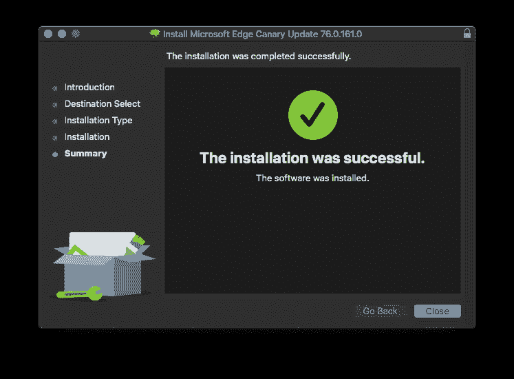
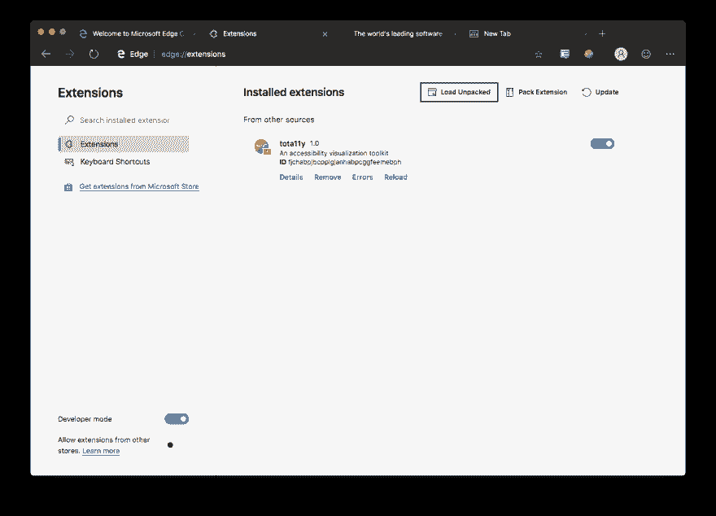
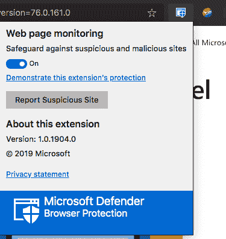

# Chromium 浏览器大战

> 原文：<https://dev.to/nickytonline/the-chromium-browser-wars-51oc>

我特意在这里省略了 Firefox，因为这与 FireFox 无关。它是关于基于 Chromium 的浏览器。没有敲火狐。也很棒。

我想知道的是，如果你是谷歌 Chrome 用户，你会继续使用 Chrome 吗？我都不知道那是不是真的。😆我想那是在 2009 年，Chrome 发布的时候，我正在使用 Mozilla/FireFox(向 [Firebug](https://getfirebug.com) 大喊)。作为一名用户，我试了试 Chrome，再也没有回头。在[勇敢](http://brave.com/) (Chromium 版，不是电子版)出现之前，它是我的首选浏览器。这是我目前在日常生活中使用的。

液体错误:内部

我在 Mac 上，今天宣布 MacOS 有一个[金丝雀频道。所以我当然想开着它转一圈。](https://blogs.windows.com/msedgedev/2019/05/20/microsoft-edge-macos-canary-preview/#fDfwqLCZqc5IWL0F.97)

> 尼克·泰勒[@ Nicky tonline](https://dev.to/nickytonline)乘坐 [@MicrosoftEdge](https://twitter.com/MicrosoftEdge) 在 MacOS 上兜风。很好，我们有分机。2019 年 5 月 21 日上午 03:15

开箱即用，我很高兴他们已经有扩展。

我加载了一个我一直在做的扩展。

 [## 一个 a11y 扩展来到你附近的浏览器

### 尼克·泰勒(他/他)4 月 1 日 192 分钟阅读

#a11y #javascript #browserextension](/nickytonline/an-a11y-extension-coming-to-a-browser-near-you-1mg2)

他们似乎也有一些网页监控。

> [@ Nicky tonline](https://dev.to/nickytonline)新 Edge 似乎内置了一些网页监控，但我不确定它还有什么其他好东西。我需要用它玩一会儿。2019 年 5 月 21 日上午 03:22

现在还为时尚早，但是一旦他们有了官方版本，问题就来了，用户会在乎吗？每种基于 Chromium 的浏览器相比其他浏览器能提供什么附加值来赢得用户？

> [@ Nicky tonline](https://dev.to/nickytonline)[@ Microsoft edge](https://twitter.com/MicrosoftEdge)虽然这只是金丝雀版本，但回避了问题。如果 [@googlechrome](https://twitter.com/googlechrome) 、 [@brave](https://twitter.com/brave) 和 [@MicrosoftEdge](https://twitter.com/MicrosoftEdge) 都是基于 chrome 的，为什么要选择其中一个呢？ATM，我对它很感兴趣，因为我喜欢它所有的安全特性，我甚至在日常的网络开发中使用它。2019 年 5 月 21 日上午 03:22

我认为微软通过在 MacOS 上提供它是一个聪明的举动，而且也有关于 Linux 版本的讨论。

> 微软 Edge Dev@ msedgedev[@ Omega _](https://twitter.com/Omega_)Linux 是我们肯定听说过的，我们肯定会研究一下，看看什么是最有意义的。目前没有新消息。一旦我们有一些，我们一定会分享。2019 年 5 月 20 日下午 19:39

你对另一个 Chromium 浏览器竞争者有什么看法？欢迎在这里或在这个[推文帖子](https://twitter.com/nickytonline/status/1130673501738807296)中发表评论。