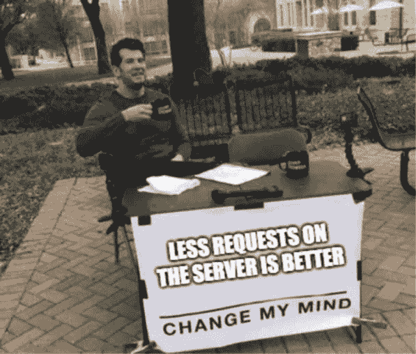
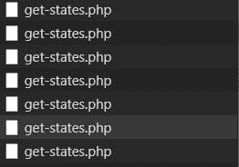
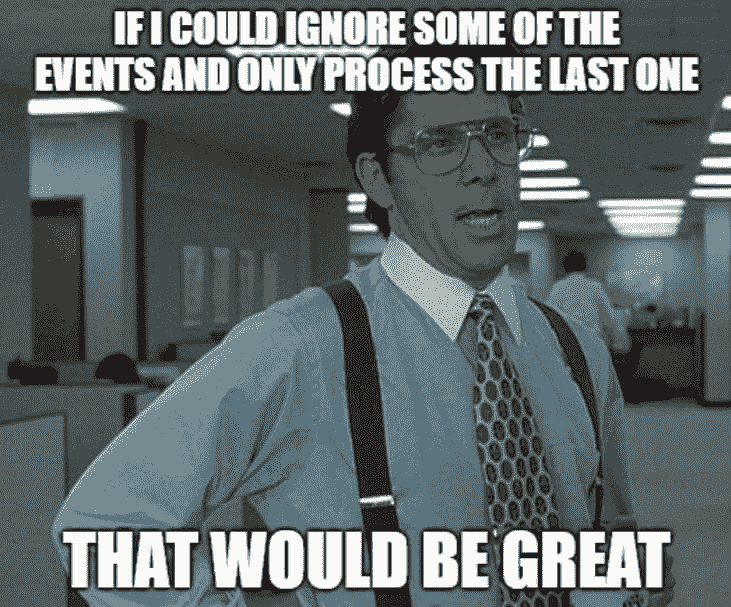

# “去抖”

> 原文：<https://dev.to/costicaaa/the-debounce-48bg>

## 这个为什么

a.现实生活中的问题:用户进入并开始输入一个简单的输入表单。我们希望向他展示准确的结果(通常是向服务器请求新数据)。现实生活中的例子:我们想在一个州列表中搜索，只显示与用户输入(部分)匹配的州。

## 问题

举一个 1.b 的例子，在“按键”、“改变”、“无论如何你都要在这里做”。现在，每次击键都有一个请求。因此，用户按下的每一个键都意味着服务器上的新请求和/或使用我们强大的 JS 的一些数据处理。

这在大多数情况下是没有意义的，最相关的例子是当用户改变主意时，按下空格键，然后退格。

你可能会问，我为什么要在乎？

[](https://res.cloudinary.com/practicaldev/image/fetch/s--FoySWcQp--/c_limit%2Cf_auto%2Cfl_progressive%2Cq_auto%2Cw_880/http://cweb.develop.eiddew.com/debounce/change_my_mind.jpg)

还有，

*   更少的 js 处理意味着更少的功耗(大量流量来自移动，不要再忽视了)
*   大多数页面已经有大量的 js，总是添加额外的 dom 修改和 js 处理，最终会杀死页面

另一个很好的例子是当搜索的人确切地知道他或她在找什么:“阿拉巴马”。现在大多数人写得足够快了(在互联网上找到的一些随机统计数据表明，在排除标点符号的情况下，两次连续击键之间的时间平均为 150 毫秒——对我们来说就是这样！) .因此，考虑这样的情况:对以下每一项提出请求:“a”、“al”、“ala”、“alab”、“alaba”、“alabam”、“alabam”。看一下 XHR 请求，您的网络选项卡如下所示:

[](https://res.cloudinary.com/practicaldev/image/fetch/s--C9meUMs8--/c_limit%2Cf_auto%2Cfl_progressive%2Cq_auto%2Cw_880/http://cweb.develop.eiddew.com/debounce/requests.jpg)

这是针对单个用户的单次搜索。

[](https://res.cloudinary.com/practicaldev/image/fetch/s--9v4Zmu-Q--/c_limit%2Cf_auto%2Cfl_progressive%2Cq_auto%2Cw_880/http://cweb.develop.eiddew.com/debounce/yeah_if_i_could.jpg)

## 概念

如果相同的输入元素在给定的时间内被多次触发，忽略相同的重复事件在 javascript 生态系统中被称为“去抖动”。一个经典的去抖函数有两个参数:要执行的函数和延迟。

它是用 jQuery 实现的。它在 lodash 和下划线中都作为支持函数存在。如果您的项目中已经包含了这样一个库，那么就可以开始了。

但是如果你不这样做呢？仅仅因为您不知道自己编写一个新的依赖项有多容易，您就应该向项目中添加它吗？

跟我来，我会给你一个工作实例和一个关于事物如何工作的例子。

## 该如何如何

假设我们有一个简单的输入，它必须在“keyup”时做一些事情:

```
 <input type="text" @keyup="setFilteredStates()"> 
```

现在让我们将 **setFilteredStates** 包装在去抖函数中。它看起来会像这样:

```
 <input type="text" @keyup="debounce($event.target.value, 250)"> 
```

以及去抖功能:

```
debounce(search, debounceDuration = 300){
    if(this.timeoutId !== null)
    {
        clearTimeout(this.timeoutId);
    }
    this.timeoutId = setTimeout( _ => {
        this.setFilteredStates(search);
    }, debounceDuration);
} 
```

实际上，发生的事情很简单。我们让 javascript 知道我们希望函数在任意毫秒后被调用，在我们的例子中是 250 毫秒。我们可以使用 setTimeout 来实现。到目前为止一切顺利，对吗？

接下来我们要做的是取消前面函数的执行，如果它还没有被调用的话。我们可以很容易地做到这一点，因为 setTimeout 返回一个 ID。因此，我们调用 clearTimeout(ID ),瞧，只有最后一个键事件才会实际触发 **setFilteredStates** ,并且只有在最后一个用户输入之后 300 毫秒过去之后。

这个例子是用 VueJs 编写的，但是同样的概念也适用于普通库或者与任何其他库结合使用。
完整片段可以在这里找到:

[https://codepen.io/costicaaa/embed/xMorgO?height=600&default-tab=result&embed-version=2](https://codepen.io/costicaaa/embed/xMorgO?height=600&default-tab=result&embed-version=2)

为了简单起见，setFilteredStates 实际上并不进行网络调用，只过滤 JS 中硬编码的状态数组。我没有进入关于“this”内部绑定或箭头功能的细节，因为这会变得太长，而且已经有很多其他很棒的教程了。

欢迎建议/反馈。另外，如果我做错了什么，请告诉我。

干杯:)