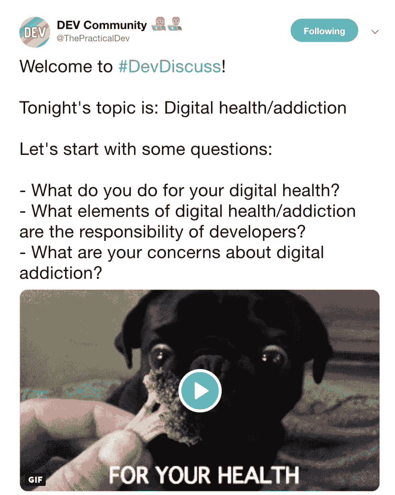

# # DevDiscuss 社区讨论数字健康和成瘾

> 原文：<https://dev.to/maxwell_dev/the-devdiscuss-community-talk-digital-health-and-addiction-139j>

2019 年 5 月 14 日，# DevDiscuss 社区再次聚首。题目？**数字健康与成瘾！**

在一个多小时的时间里，我们分享了我们自己如何处理数字成瘾的故事，我们使用的策略，以及在网上取得健康平衡的故事。分享了许多很棒的信息，多到很难总结成一篇文章。

接受挑战。

如果你不能参加讨论，但仍然想看看写了什么，请继续读下去！

## 认清数字成瘾

解决任何问题的第一步是定义它。作为开发者，我们往往比许多人更熟悉数字成瘾，也同样容易受到伤害。

液体错误:内部

这可能是由于我们的设计知识，更多地接触不同的技术，或者我们自己的工作要求。

液体错误:内部

或者，讽刺的是，我们参与 Twitter 聊天🙃。

液体错误:内部

这暴露了一个更广泛的问题，数字成瘾是开发者的职业危害，我们应该认真对待。

液体错误:内部

即使只是说推特聊天后长时间在线的风险。

液体错误:内部

公平地说，不切实际的笑话视频太搞笑了，不能错过，即使是在晚上 11 点！

[https://www.youtube.com/embed/UiZ9ESfKjkw](https://www.youtube.com/embed/UiZ9ESfKjkw)

## 限额通知

最简单也是最有效的对抗数字成瘾的方法是关闭通知。最令人分心的是电子邮件和社交媒体。那些关掉它们的人很少会后悔。

液体错误:内部
液体错误:内部

第二，尽可能避免自动通知或订阅。任何值得通知的事情都值得手动打开(和关闭)通知。

液体错误:内部

这都属于“拉，不推”的经验法则。通过不把信息硬塞到你的脸上，你只寻找(或“拉”)你需要的信息。

对于您保留的通知，它们应该*在关机和睡眠时全部*静音。不管是什么都可以等到早上。

液体错误:内部

你甚至可以在晚上禁用所有互联网接入，以消除任何可能的干扰。

液体错误:内部

## 管理你的媒体饮食

人们也触及到他们每天消费的媒体。通常是 Twitter 上的内容，但这也适用于像新闻文章这样的媒体。

最好的建议似乎显而易见，但容易忘记，而且可能是破坏性的:**避免激怒他人的内容。**

液体错误:内部
液体错误:内部

(是的，这包括愤怒政治)。

液体错误:内部

但正如一位聪明的推特用户第二天指出的那样，现在是与巨魔交战的战略时机。明智地选择你的战斗。

> 林赛·科帕🐞@ little kope[@ deSolidState](https://twitter.com/deSolidState)[@ laurieontech](https://twitter.com/laurieontech)我们不是在喂巨魔，伙计。
> 
> 我们在集体提出一个观点，这个行业是破碎的。他没那么不寻常。我们在表明我们是团结的。
> 
> 大多数巨魔我们不“喂”，这是战略。2019 年 5 月 15 日下午 13:48

控制媒体饮食的一种方法是将数字内容管理到一个单一的第三方平台。像 Twitter 这样的平台是用来吸引你的。将推文放到一个没有令人上瘾的设计的平台上，比如 RSS 阅读器，可以让你鱼与熊掌兼得。

液体错误:内部

## 建立健康的数字习惯

我们也可以建立更好的整体习惯来阻止数字成瘾。最节省时间的一条:**不要急着回复每一封邮件。**

液体错误:内部

事实上，早上根本不要急着打电话。我把它放在另一个房间，让它整夜充电。这消除了在床上检查和保持大脑清醒的任何风险。

液体错误:内部

我鼓励任何增加睡眠的习惯，这会改善我们生活的方方面面。

液体错误:内部

数字成瘾的一个主要缺点是损害学习新事物的潜在习惯。

液体错误:内部

克服这个(或反习惯)的一个有用的习惯是在社交媒体之外列出一个“学习”清单。这有助于我们不再将社交媒体视为我们的主要信息来源。如果 Twitter 上有什么让你眼前一亮，把它保存到其他地方，避免被卷入其中。

最后，安排额外的时间完全不用手机。

> 达希尔巴克-胡斯[【达什巴克胡斯](https://dev.to/dashbarkhuss)[【the practical dev](https://twitter.com/ThePracticalDev)我们每天晚饭后都有预定的拔插头时间，但我真的想改成只有预定的拔插头时间。2019 年 5 月 15 日上午 01:03

有人提到了一个不太礼貌(但是有用)的方法来执行这个规则...

液体错误:内部

如果你很难远离手机，那就多关注一个非数码项目或爱好。它可以是你觉得满足的任何事情，不涉及你的电脑屏幕。我发现在当地的创客空间制作激光或乙烯基切割机项目非常棒。

液体错误:内部

## 找到健康的数字平衡

这场讨论是关于对抗数字成瘾的。但是我们也不应该忘记数字活动给我们带来的好处。作为开发人员，我们的数字身份是一笔巨大的职业资产。

液体错误:内部

这对建立关系网，寻找新同事，甚至新朋友很有帮助。

液体错误:内部
液体错误:内部

所以记住“健康的数字活动”和“数字成瘾”之间的界限在哪里。

液体错误:内部

因此，如果你需要尽早避开# DevDiscuss，这表明没有人会评判你，也没有理由去感受任何 FOMO。我们都在管理我们的数字习惯和成瘾，并希望每天都做得更好😊。

液体错误:内部

下周二见！

如果有任何你认为应该包含在讨论中的推文，请在下面的评论中发表！

[封面图片由 SafeBooru.org 提供](http://safebooru.org/index.php?page=post&s=view&id=2825943)