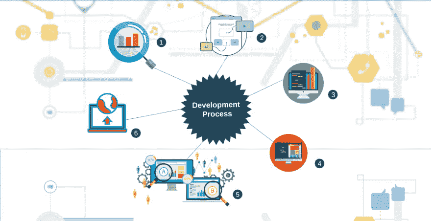

# web 应用程序的开发过程

> 原文：<https://dev.to/decipherzonesoft/the-development-process-of-web-application-development-22hc>

软件开发过程分为 5 个步骤，这样可以消除需求不匹配、返工，提高整体代码质量。Web app (Web 应用程序)开发时间更少，因为整个代码可以由不同的开发人员在后端前端同时开发。

1.  产品管理市场研究必须在 Web 应用程序(Web 应用程序)开发或独立软件应用程序开发之前完成，因为产品属于产品管理。产品经理的工作职责是找到关于市场竞争力战略、路线图、营销和产品发布的原因、时间和内容的答案。

点击这里阅读全文:[web 应用开发的过程](https://www.decipherzone.com/blog-detail/The-process-of-web-application-development)