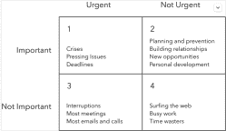
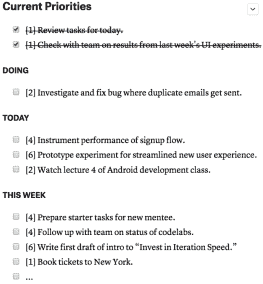

# 有效工程师系列(上)

> 原文：<https://dev.to/itscoderslife/the-effective-engineer-series-part-i-1kp4>

我开始阅读这本伟大的书[《有效的工程师》，作者是 Edmond Lau](https://www.amazon.com/Effective-Engineer-Engineering-Disproportionate-Meaningful/dp/0996128107/ref=sr_1_1?keywords=the+effective+engineer+by+edmond+lau&qid=1554741721&s=gateway&sr=8-1) 。当读完这本书大约 50 页后，我意识到在阅读时记下要点是有好处的，这样它也可以成为我和其他人的一种小抄。我强烈建议买下这本书，至少读一遍。

这本书分为 3 部分，我的想法是写 3 篇博文，每篇一篇。这是这个系列的第一部分。

## **采用正确的心态**

练习:*高杠杆活动*

1.  我如何在更短的时间内完成这项活动？
2.  我如何增加这项活动产生的价值？
3.  杠杆=产生的影响/投入的时间
4.  有没有其他我可以花时间去做的能产生更多价值的事情？"
5.  会议
    1.  会议时间不要超过 30 分钟
    2.  有明确的议程和目标
    3.  提前传阅
    4.  如果不需要面谈，则通过电子邮件进行讨论

———————————————————————————

*优化自己学习*

1.  成长心态与固定心态——不断改进，不断学习，承担责任，拥有自己的故事
2.  投资于你的学习率——复合效应——指数曲线
3.  寻求有利于学习的工作环境
    1.  快速增长
    2.  培养
    3.  公开
    4.  节奏
    5.  人
    6.  自治
4.  在工作中投入时间来发展新技能
    1.  研究由贵公司最好的工程师编写的核心抽象代码
    2.  编写更多代码
    3.  浏览任何内部可用的技术培训材料
    4.  掌握你使用的编程语言
    5.  把你的代码送给最严厉的批评家
    6.  报名参加你需要提高的课程和领域
    7.  参与你感兴趣的项目的设计讨论
    8.  致力于项目的多样性
    9.  确保你所在的团队至少有几名高级工程师
    10.  无畏地投入到你不知道的代码中
5.  不断学习——寻找工作之外的学习机会
    1.  学习新的编程语言和框架
    2.  投资于高需求技能
    3.  多读书
    4.  加入讨论组
    5.  参加会谈和会议
    6.  建立和维护强大的关系网络
    7.  关注教书的博主
    8.  写作教学
    9.  修补副业
    10.  追求你热爱的东西

———————————————————————————

*定期练习优先排序*

1.  只维护一个待办事项列表–在一个简单易用的列表中跟踪待办事项
2.  关注直接产生价值的东西
3.  关注重要但不紧急的事情——这是我应该做的最重要的任务吗？
4.  保护你的制造者的时间表
5.  限制进行中的工作量——上下文切换的成本很高
6.  用如果-那么计划来对抗拖延
7.  制定一个优先排序的常规【4】，【2】，【1】，【6】——是番茄块

如果你是 Gumroad 的用户，那么[这是你的链接](https://gumroad.com/l/effective-engineer)