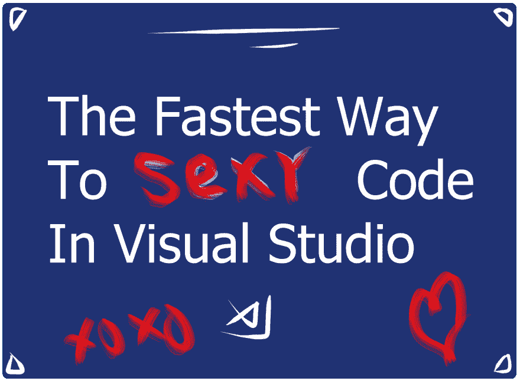
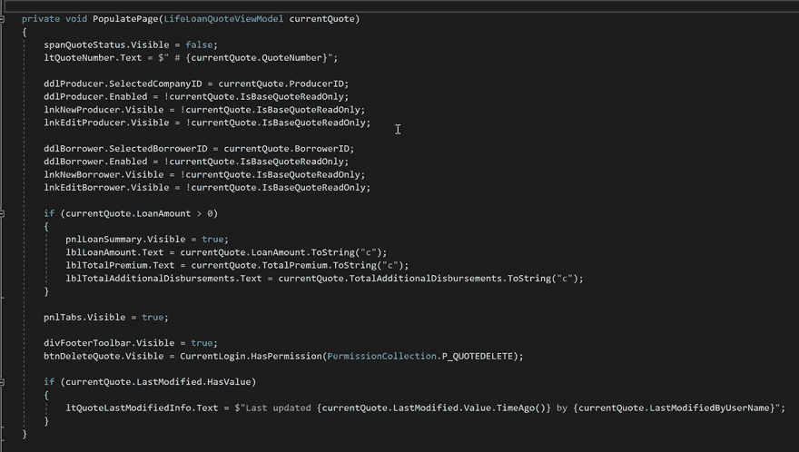
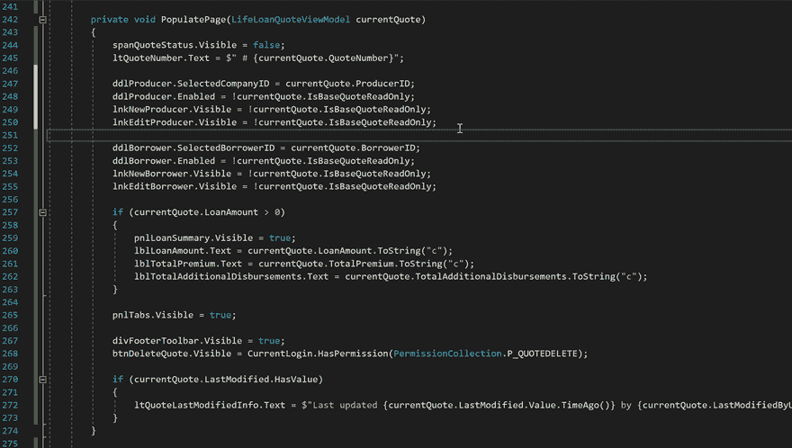
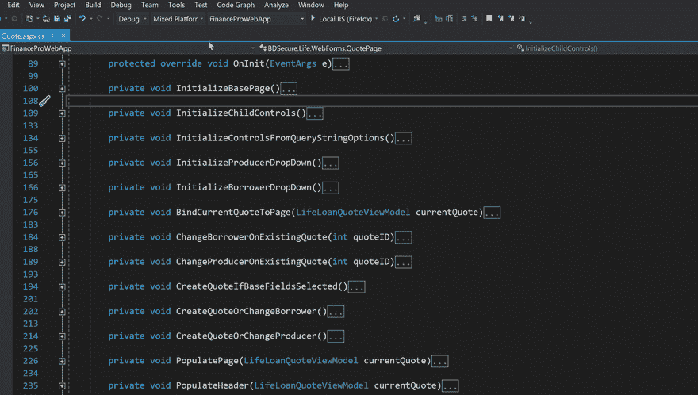
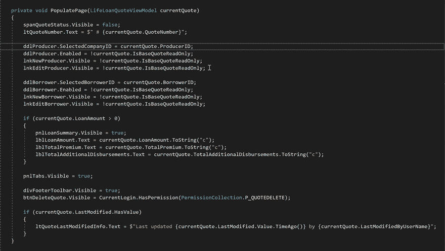

# 使用 Visual Studio 编写性感代码的最快方法

> 原文：<https://dev.to/makingloops/the-fastest-way-to-sexy-code-using-visual-studio-37fo>

[](https://res.cloudinary.com/practicaldev/image/fetch/s--7mkWFNEE--/c_limit%2Cf_auto%2Cfl_progressive%2Cq_auto%2Cw_880/https://thepracticaldev.s3.amazonaws.com/i/wtguz44h6pl1i4zj9wky.png)

它来了。

Visual Studio 的另一个重要的新更新。

然而，它来来去去，我很可能会继续使用我已经习惯了多年的相同的功能子集。

和你一样，对吗？

代码高亮显示，*通过引用查找*，*转到声明*。一个带有增强的文件搜索的美化的文本编辑器。

学习一个新功能需要**时间**和**刻意的努力**，更不用说足够经常地实现它以实现它的真正价值了。

我们没有时间了。

这很糟糕，因为在 Visual Studio 庞大的体积下隐藏着神奇的宝藏，可以改进我们的代码，我们的整个软件，并使我们在这个过程中成为更好的开发人员。

但是有一个特点，不用找太深就能发现。

这将极大地提高你的代码质量。

在这篇文章中，我不仅想与你分享*提取方法*重构特性，还想分享如何以光速执行它*，以及如何最有效地使用它，希望能让你的指尖产生大量清晰的代码，让你的队友和未来的开发人员感激不尽。*

我说服你了吗？

## 可读性:题外话

在我们进入技术层面之前，让我们先回顾一下背景。

代码*可读性*是人为因素。

我们努力使我们的代码尽可能的可读，通常是在所有其他考虑之上，这样下一个开发者(可能是你)就有最好的机会理解**它做什么**和**你想要什么**。

尽管代码是纯逻辑的文字表现形式，但对任何人来说，长时间地放弃代码仍然是一项令人筋疲力尽的努力。

为此，我们编写的代码更像是书中的散文。

理想情况下，它的算法、对象交互和架构可以大声读给高级开发人员、实习生和业务分析师听，组成一种连贯的*无处不在的语言*，正如他们在 DDD 世界中所说的。

考虑到这一点，我相信自由地使用明确命名的方法是提高我们代码库可读性的最简单的方法。

明确命名的方法既可以在开发时添加，也可以在重构时添加。

我经常喜欢先写一个算法*，然后再决定它将如何构成和命名。*

 *这就是*提取方法*重构加入的地方。

## 树懒之道

提取方法重构仅仅意味着将一段代码移动到一个新方法中，然后从原始位置调用该方法。

用方法替换代码。

现在，您可以通过创建一个新方法，突出显示、复制并粘贴代码块到该方法中，然后删除原来的代码块并用方法调用替换它，来手动完成此操作。

光是打字就让人精疲力尽…

下面我们可以看到这个策略在一个特别胖的方法上的应用，这个方法将表示贷款报价的视图模型绑定到 web 页面的字段上。

[](https://res.cloudinary.com/practicaldev/image/fetch/s--nZoK-fHm--/c_limit%2Cf_auto%2Cfl_progressive%2Cq_66%2Cw_880/https://makingloops.com/public/extract-method-slow.gif)

如果你还这样做，不要难过。这是屡试不爽的。在我开发生涯的第一个 **7 年**里，我都是这样做的。

## 略快，鼠标点击策略

当您意识到 Visual Studio 内置了重构工具，使得提取方法*快了很多*时，skillset 的下一个突破点就来了。

您可以通过三种不同的方式找到提取方法快捷方式:首先突出显示一段代码，然后等待黄色小灯泡(或蓝色螺丝刀)图标弹出并单击它，右键单击突出显示的区域并选择“快速操作和重构”，或者单击 CTRL+。手动调用建议。

下面你可以看到我在演示右击策略。

[](https://res.cloudinary.com/practicaldev/image/fetch/s--HdSIOI-k--/c_limit%2Cf_auto%2Cfl_progressive%2Cq_66%2Cw_880/https://makingloops.com/public/extract-method-medium.gif)

是的，快得足以让我演示两个方法提取而不是一个！

现在让我们向精通迈出最后一步。

## 上级开发者之道

将我们带到光速、老板屁股婊子模式的最后一步是将提取方法特性映射到键盘命令，这样您可以在不到一秒钟的时间内用手指轻击可读代码。

要做到这一点，(打开 VS，现在就做)，进入工具->选项->环境->键盘。

[](https://res.cloudinary.com/practicaldev/image/fetch/s--ZU7SbvYs--/c_limit%2Cf_auto%2Cfl_progressive%2Cq_66%2Cw_880/https://makingloops.com/public/set-up-extract-method-shortcut.gif)

通过键入“extract”并选择 *Refactor 来过滤命令。提取方法*命令。

在*下拉菜单中选择“文本编辑器”,使用*下拉菜单中的新快捷方式，以便该命令仅在文本编辑器在上下文中时适用。

最后，输入你想使用的键盘命令，选择*分配*按钮，点击*确定*。

您将希望选择一个便于您快速舒适地键入的命令(以便您记住它并使用它。)我打字用的是 Dvorak 键盘布局，所以 CTRL+；就像在 QWERTY 键盘上按 CTRL+Z 一样，让我的小指和无名指快速滑动。

一旦就位，就试一试吧！然后*练习一下*这样你就不会忘记了。

[](https://res.cloudinary.com/practicaldev/image/fetch/s--Ttk0bwtp--/c_limit%2Cf_auto%2Cfl_progressive%2Cq_66%2Cw_880/https://makingloops.com/public/extract-method-fast.gif)

哎呀，走得太快了，我把制片人拼错了！

现在，我不得不说，走这么快是不明智的，但你明白我的意思。你完成某事的速度越快，你就越有可能使用它。

好了，现在我们玩的是职业水平，但是我们怎样才能最有效地使用这个新技能呢？

## 我说的自由使用是什么意思

最后，我将留给您一些提高代码可读性的技巧。

### 1)别害羞。

我几乎可以说，你不能有太多的方法。可读性>方法计数。

在**场合**，我会把一个方法留得稍微大一点，而不是把它分成几个更小的方法，通常是因为我认为在屏幕上一次看到所有的逻辑会更舒服，并且允许更好的推理，但是这是一个*罕见的*场合。

如果方法的名称比单独的语句更容易理解，您甚至可以大胆地将一行代码转换成一个方法调用。这对于多条件分支语句尤其适用。

比如什么读起来比较好？

这个？

```
if (vehicles.Sum(v => v.Price) < loan.AmountRequested && Settings.IsExcessFundingAllowed)
{
    //fund excess amount...
} 
```

还是这个？

```
if (IsLoanFundingExcessAmount)
{
  //...
} 
```

方法也给你机会用商业语言说话。第二个例子对所有人来说都很容易理解，而第一个例子需要更多的时间来分析和理解，即使是开发人员也是如此。

越容易理解，以后就越容易改变。

### 2)注意空格。

每当我添加一个空格，通常是为了表示一个新的逻辑分组，就像文章中的段落一样。

通常情况下，您可以用一个方法调用来替换该分组，这个方法调用比该分组在原始状态下读起来更好。上面动画 gif 中的例子展示了这个想法的实际应用。

### 3)创造*沉稳的方法*作为第一道防线

注意在上面的例子中，我们如何将一个大方法组合成几个小方法。这被称为*组合方法*重构，这是一种让你更好地理解算法或类的好方法。理解一小堆明确命名的方法比理解一大堆看似随机的语句要容易得多*。*

这有点像修剪一棵树或采摘杂草。只要有意义，就通过将方法组合成更小的方法来防止方法变大。

## 练习，练习，练习

好吧，新技能在你的口袋里，现在你要做的就是使用它几次，直到手指轻弹变成肌肉记忆。

提取方法重构特性是我最喜欢和最常用的三个特性之一，所以我希望它能给你和你的团队带来一些价值。

如果您觉得这很有帮助，我将在接下来的 6 个月中每月创建**一个新的实用 Visual Studio 技巧。**

它将是旧的(隐藏的)工具和崭新的工具的混合，但只有我真正经常使用的东西。如果你想掌握更多像这样的电动工具，请加入我下面的列表，我会在它们出来后通过电子邮件发送给你，同时每月发送两到三封关于相关有用文章和论文的电子邮件。

[跳转到原始文章网站进行注册。](https://makingloops.com/extract-method/#mc_embed_signup)*