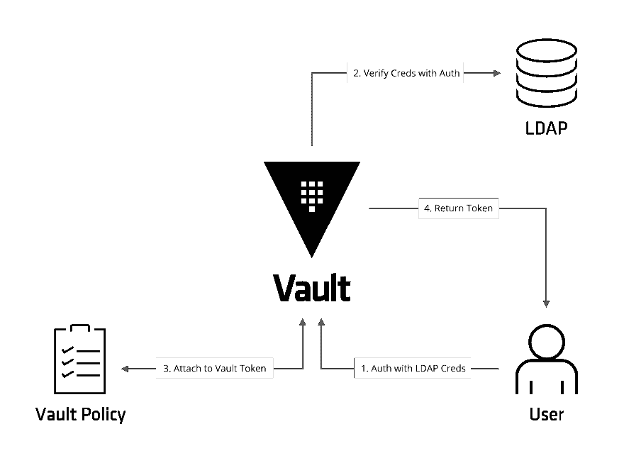

# 当向系统架构师解释 HashiCorp Vault 时，我总是会遇到的第一个聪明的问题是

> 原文：<https://dev.to/v6/the-first-smart-question-i-always-get-when-explaining-hashicorp-vault-to-systems-architects-3j67>

当我为不同的内部客户设置 HashiCorp 保险库时，我必须解释什么是地狱保险库。通常会很顺利。" Lastpass，但是被基础设施和服务器软件使用而不是人类？"“有道理。”

但接下来，我必须解释跳马*是如何工作的*。

“因此，现在，您可以让您的软件向 Vault 进行身份验证以获取凭据，而不是在源代码或配置文件中使用明文凭据...代币...现在我要暂停一下，看看你对这一切的看法。”

我暂停提问，给人们时间思考。总有那么一个人，带着问题。

姑且称这位建筑师为“不信任的麦克斯”。

> “我们不就是在搬问题吗？
> 我的意思是，我知道不必将 DB 凭证放在明文`.properties`文件中，而是可以从 Vault 中动态生成它们。
> 但是我现在必须以明文形式存储一个保险库令牌，任何获得保险库令牌的人都可以从保险库生成 DB 凭证！
> 如果只是多了几个步骤的同一个漏洞，那么 Vault 还有什么意义？”

已经到了这样一个地步，我可以走进一个会议，甚至在他问之前就告诉他将会是谁。称之为本能。

这是保险存储令牌身份验证的高级示意图

无论如何，在一点白板和 Vault 令牌认证的高级演示之后，其他专家和架构师通常有理由怀疑 Vault 令牌如何解决在某个地方有一个硬编码字符串(file、ENV var 等)包含凭证本身的问题。

他会指出，这看起来可疑地像“移动”安全挑战，因为看起来他仍然必须在某个地方保存一个 VAULT_TOKEN，就像他必须在没有 VAULT 的情况下处理凭证一样。

不信任麦克斯是对的！

跳马确实移动了问题。但那是因为用这种方式“移动”问题有好处，而且`(Token != Password)`:

*   InfoSec 现在有了可见性，并且有了一个保护/ACL 机密的地方，因为问题被转移到了一个他们知道的中心位置。这比通常的 1000 个地方有所改进，InfoSec 可能只知道其中的一半。

*   令牌总是临时的，并且仅由具有非令牌凭证的应用程序获得。这些凭证可以根据您的喜好进行配置，并具有不同程度的不可否认性保护，例如，从 IP 地址锁定到签名的实例元数据和客户端证书的组合。

*   因为令牌不存在于源代码中，并且仅在工作负载启动时获得，所以它们永远不必存储在磁盘上或源代码中，从而消除了“硬编码”问题。

*   你只需要在一个地方更新密码，而不是在代码和配置中的任何地方。这与一些人在带外更改密码相反，会导致一些其他应用程序(使用该密码)失败。

*   令牌极大地增加了审计，因为它们对于每个授权的工作负载都是唯一的。

*   撤销特定实例(web 服务器)的保管库令牌，而不影响其他正在运行的实例或更改基础密码

*   令牌可以锁定到特定的 IP 地址，自动过期时间比原始密码短得多，仅存储在类似于 [anjuna](https://www.anjuna.io/) 或 [mlock()](http://man7.org/linux/man-pages/man2/mlock.2.html) 的锁定内存中，交付包装，并且仅允许特定次数的使用。

*   令牌是更紧密集成的起点，如 [Consul-template](https://github.com/hashicorp/consul-template)

我喜欢将保险库令牌比喻为 web 应用程序的会话令牌。

虽然令牌本身在安全性方面可能并不特别，但是用户只能通过执行您为登录设置的任何操作来获得 Vault 令牌。

该令牌是有时间限制的、可审核的、绑定到特定范围的 IP 地址，并且特定于每个客户端。

无论如何，现在当我被问到这个问题时，我有一个可以指向的页面。

**文章链接**:【https://v.gd/Ri6ITH T2】