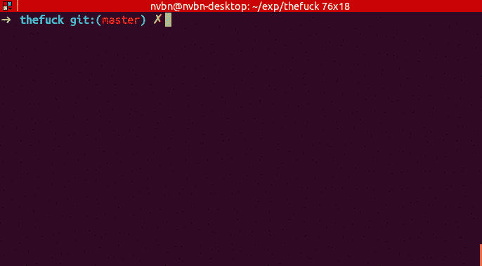

# 南瓜和其他有趣有用的工具

> 原文：<https://dev.to/rgalbo/the-fuck-and-other-funny-useful-cli-4925>

所以最近我被 [@alfcnz](https://twitter.com/alfcnz) 介绍给 [nvbn/thefuck](https://github.com/nvbn/thefuck)

这是一个非常有用的工具，允许你在搞砸一个命令后输入单词`fuck`，它将运行你试图运行的命令(在合理的范围内)。这个工具不仅非常有用，而且它是用一个非常有趣和幽默的编辑器开发的。我非常欣赏那些能够创造东西并且不把自己看得太重的人。做得好的人提醒我们，软件和它的编写方式应该既有趣又有用。有时候这很容易忘记。

因此，我正在寻找其他有用和有趣的工具来添加到我的堆栈中。分享任何你认为做得好的。你最喜欢的是什么？