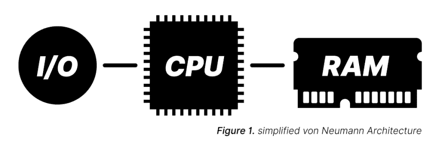
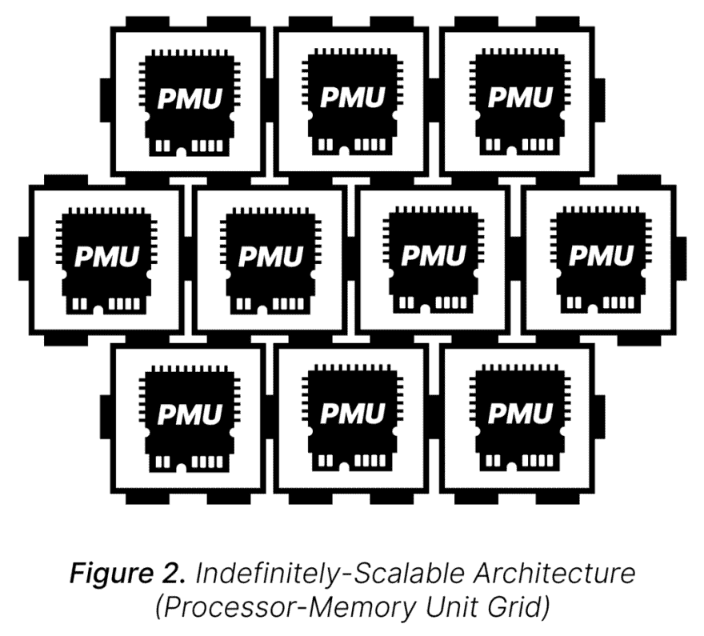
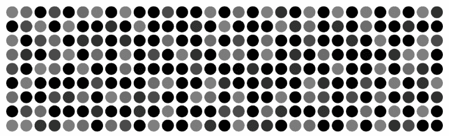

# 计算的未来是稳健的

> 原文：<https://dev.to/walpolea/the-future-of-computation-is-robust-1pp6>

计算机科学技术取得的进步，大部分是建立在正确和高效的平台上的。正确性、硬件和软件确定性；如果我们想生活在一个数字化的世界，硬件不能失败，软件也不能失败。硬件没有问题。句号。当代码中有 bug 时，快速修复它，否则你可能会放弃它。效率；更快，做更多，挤出每一个琐碎的计算周期。我们赞美你，因为你是我们中的精英。

管理和维护正确性所必需的中央处理器；计算只发生在完美的线性执行路径上，我们确保它是高效的。随机存取存储器，通过传送来组织信息的能力——令人难以置信的高效。

但今天，摩尔定律在自身进步的重压下变得不堪重负，硬件被推到了材料科学的极限，使其比以往任何时候都更加脆弱，软件仍然存在缺陷，整个系统的安全影响正在对我们的社会经济世界产生越来越大的破坏性后果。然而，我们仍然希望走得更快，做得更多。

这里的历史丰富而复杂，所以请原谅我没有提及任何表面的东西，但是抓住要点很重要，如果有必要的话，我鼓励以后挖掘细节也不是徒劳的。我，我自己，需要做更多。

这种架构基础是很久以前建立的，它在功能和增长方面都很快。以至于许多人不再质疑它。但是不去质疑它，我们就错过了询问是否有另一种计算方式的机会。确实有。

### 计算机科学有一个未知的世界，我们已经找到了它的大门。

一个不存在集中处理的地方。它被分布式处理所取代，消除了瓶颈，并允许无限的硬件和软件可扩展性。仅此一个概念就开启了一条值得走下去的道路。那是一个没有 RAM 概念的地方。相反，它很像我们自己的物理世界——空间架构——有限(从效率的角度来看)，但重要的是如此。流程执行的集中管理器被分布式的、随机执行的参与者所取代，这些参与者通过因果关系进行计算。如果他们的原因没有影响，也许他们只是再试一次；他们的最大努力行动一起工作，以实现一个局部的计算目标。这是一个错误不断的世界，然而它并没有扼杀进步和执行。硬件可能会崩溃，而系统却能坚持下来。

这是健壮优先和尽力而为计算的世界。一个效率和正确性仍然发挥作用的地方，但不是*的作用。在这个地方，坚固性、耐用性、厚脸皮(随你怎么说)作为一流的概念进入平台，为我们的计算能力带来难以置信的坚固性，并将我们的技术发展到未来，比以往任何时候都更加安全。*

 *当你看到在这里运行的软件时，尽管它今天可能还很初级，但它看起来不像你在大脑中构建的任何软件结构，相反，它看起来像生命。事实上，生命系统原理在你如何让计算在这个系统中稳健地发生中扮演着重要的基础角色。对于任何人工智能爱好者来说，无论你是构建复杂神经网络的专家还是这些概念的粉丝，你可能有一天会希望理解这些概念，这个世界都感觉像是朝着一个新方向迈出的一步，以其简单性，打开了理解我们自己的世界和其中的生命系统的大门。

除此之外还有更多——更多。但是，这篇文章不是一个全面的解释。这几乎不是一个玩笑。事实上，这是最后一点，也许是最重要的一点。你的问题的答案，很多都还不存在。因此，对我们所有人来说，这是一个难以置信的机会，一个难得的机会。进入一个未申报和未记录的计算机科学世界。一个最简单的观察很重要的地方，为了有机会殖民这个新世界，实验是唯一要做的工作。

现在，我们中有一小群人，由在这个新世界呆了最长时间的人领导，他是计算机科学博士和荣誉退休副教授大卫·阿克利。也许和你一样，我们并不是最有智力的人，但是有些事情我们不能停止思考。就像要抓住的冒险，激发我们对可能性的兴奋。请考虑加入我们，请考虑询问加入我们的可能性。如果这些想法中的任何一个引起了你的共鸣或兴趣，你是合格的，你被录用了，我们很乐意雇用你。

那现在怎么办？下面是一个链接转储，可以帮助您了解更多关于健壮优先计算运动的信息。

*   我们聚集在我们的 [Gitter 聊天室](https://gitter.im/t2tile/Lobby)——来打招呼，问问题！
*   [T2 瓷砖项目](https://www.youtube.com/channel/UC1M91QuLZfCzHjBMEKvIc-A)是阿克利博士的每周视频博客，旨在基于健壮第一的理念构建一个无限可扩展的硬件平台。一个长长的，但非常值得一去的兔子洞。
*   T2 瓷砖项目的一个非常著名的视频，被亲切地称为[圣诞咆哮](https://www.youtube.com/watch?v=z_2MHScD9rg)，很好地指出了它是什么，以及为什么这种新型计算从许多角度来看可能*非常*值得。
*   你还可以在他的个人 Youtube 频道上找到许多深入探讨稳健优先生态系统和概念的有用演讲
*   几个值得注意的起点是，[健壮优先计算:超越效率](https://www.youtube.com/watch?v=7hwO8Q_TyCA)和[恶魔部落排序](https://www.youtube.com/watch?v=helScS3coAE)
*   如果你想看看这一切是什么样子。到目前为止，我对这个项目最大的贡献是一个网站， [mfm.rocks](https://mfm.rocks/) ,它是对阿克利博士的可移动宴会机器的粗略模拟。它没有完全遵循所有的规则，但足以向你展示在这个去中心化的、基于角色的世界中，计算是如何发生的。这个项目是开源的，我欢迎[的贡献](https://github.com/walpolea/MFM-JS/)！
*   健壮第一 Wiki 深入到当前软件的构造和这种新架构的一些硬件。它还可以引导您在自己的机器上运行 MFM。
*   你可以在阿克利博士的网站上找到更多的研究和链接

如果你读到这里，感谢你的阅读。如果你有任何想法或问题，我很乐意看到他们出现在评论中！我将向你们展示强大第一计算团队的信条:

* * **