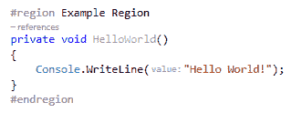
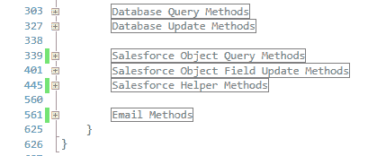
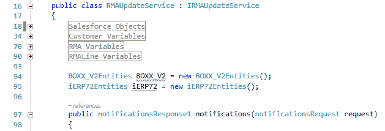

# 伟大的 C#区域辩论

> 原文：<https://dev.to/rachelsoderberg/the-great-c-regions-debate-cb9>

C#区域早在 2003 年就通过 Visual Studio 引入了。NET 作为一种命名和折叠代码块的方法，使用关键字#region 打开区域，使用关键字#endregion 关闭区域。结果类似于:
 可折叠区域的概念出现在可折叠的名称空间、类、方法、if 语句和 for 循环之前，因此它可能是对大部分生成代码或样板代码的一个受欢迎的补充。

在今天的 C#中，我们通常不需要清理屏幕空间和删除我们不想看到的大块代码。生成的代码通常在单独的文件中创建，我们的代码块折叠成整齐的单行，作为优秀的开发人员，我们都在使用“每个方法都有一项工作和一个描述性名称”的规则，对吗？🤓

在我正在构建的 web 服务端点中使用区域让我想到了一个问题“什么是好的区域实践？”因此，写这篇文章是因为有很多文章表达了对地区的仇恨，而只有一些非常简短的(不是很好的)陈述表达了为什么它们可以被用来做好事。

## C#区域是邪恶的

在我的搜索中，最热门的是 Marc Duerst 写的一篇文章，标题很简单: [C#区域是邪恶的](https://marcduerst.com/2016/10/03/c-regions-are-evil/)。他的文章的主要观点是有意义的，并且绝对是你使用区域时要小心的理由。他将区域描述为让下一个必须阅读你的代码的开发人员感到痛苦——他们不得不展开几十个折叠的部分来查看全貌。一些开发人员还养成了在区域中隐藏大代码块的坏习惯，而不是重构它们并考虑如何改进它们的结构。

Duerst 还表示，如果微软有可能完全删除区域，这将是一件好事，但因为它不是，我们应该简单地完全停止使用它们。

## 区域是一种代码气味

我在谷歌搜索中的另一个热门话题是埃里克·迪特里希的《地区是一种代码气味》。这篇文章更多地是从中间立场写的，并没有真正责怪区域本身，他更多的关注点是使用不良实践的开发人员:“区域并没有使您的 800 或 8000 行类比在没有区域的语言中更糟糕、更糟糕。”他更具体地称地区为代码除臭剂或代码古龙水，这与除臭剂或古龙水对有气味的人的作用非常相似——它隐藏了气味！

迪特里希认为移除或反对区域是没有意义的，因为糟糕的开发人员不会仅仅因为你告诉他们停止使用区域就停止做出糟糕的选择。

## C#区域应该小心使用

我在很大程度上同意这两位作者的观点，我会站起来，在屋顶上大声疾呼，我过去曾用区域来作恶。(第一步是承认吧？)我是新手，遵循着在我之前的开发人员的模式，还不知道任何更好的方法。

然而今天是一个不同的故事。今天，我选择只在特定的情况下使用区域，并且不会反对删除它们，因为它们偶尔会在我的代码中为我提供价值，正如 Dietrich 所说，即使我们这样做，也不会阻止开发人员制造糟糕的代码味道。

我在大多数项目中不使用区域，如果我觉得有必要创建一个区域，我会考虑原因。最常见的情况是，我构建了一大块相似的代码，而这些代码与其周围的代码并不相似。这意味着我需要创建一个新的方法或类来存放这段代码和与之相关的其他部分。另一种情况可能是我的类变得太长了——这是另一个很好的机会来考虑如何重构我的代码，看看可以提取出什么来创建一个新的类。一个例子:“在这个销售订单创建类中有许多 Salesforce 方法，为什么我不把它们拿出来并创建一个 Salesforce 助手类型类来包含所有这些功能？”

我目前在工作中构建的 WCF Web 服务应用程序是我选择使用区域的少数情况之一——而且有几个是这样。我会给你一些细节，这样你就能明白为什么我选择使用区域:

*   我被要求遵循应用程序中已经存在的结构。目前有五个监听端点监视各种 Salesforce 出站消息的触发。应用程序的类仅限于具有严格命名标准的接口和服务。这意味着不能为了可读性而将一组相似的方法分解成新的类，不幸的是这会导致一个非常长的侦听器类。
*   侦听器正在读取和更新我们的 Salesforce org 以及我们的 ERP 数据库的许多不同部分，因此将有许多类似变量的大型集合都包含在侦听器类的一个部分中。这通常不被认可，但是能够折叠 15 个客户变量和 10 个员工变量，这样我就可以查看我的 RMA 变量，这是一个救命稻草(并且有助于组织，因此它们不会相互混淆)。
*   这个项目有更严格的时间要求，我的下一个任务将是将这些区域中的许多应用到全新的应用程序中，因为这些方法中的许多在我们整个组织中使用，并且当前需要我们在 2-5 个不同的地方进行代码更新，当需要进行一个更改时。将它们组织起来并分开会使这项工作更容易。

那么，我如何防止这些区域对我的代码除臭呢？最大的步骤是避免使用一个区域，直到我认为将进入它的代码“完成”。这意味着它已经被编写、测试以确保其工作，并被重构为小的、命名良好的方法。我将这些方法提取出来，就像我将它们提取出来放入一个新的类中，并将它们存储在类底部的区域中(请不要让区域随机分布在方法之间！)  在这种情况下，我基本上把我的区域看作是它们自己的类实体，并以此来处理它们。如果你好奇，我的变量在这样的区域: 

我想再次重申，虽然我意识到这些不是最佳实践，但有时作为开发人员，我们受限于要求我们变通一些规则的标准(这些标准本身可能不是最佳实践)。我相信，只要我们有意识地变通这些规则，并根据我们的情况使用可能的最佳实践，我们就可以放心地睡个好觉，知道我们写了我们能写的最好的代码。即使它包含区域。如果你正在考虑将代码分解成一个区域，那么停下来想一想，问问自己为什么，并考虑这是因为需要重构还是为了隐藏你所做的令人讨厌的事情。