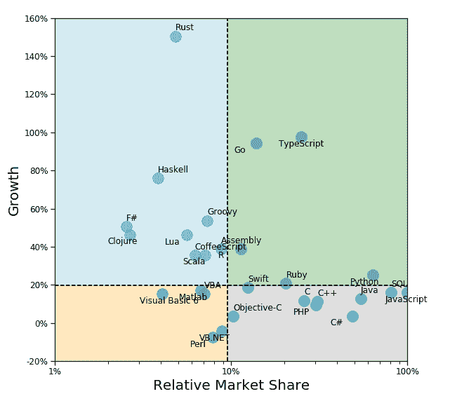
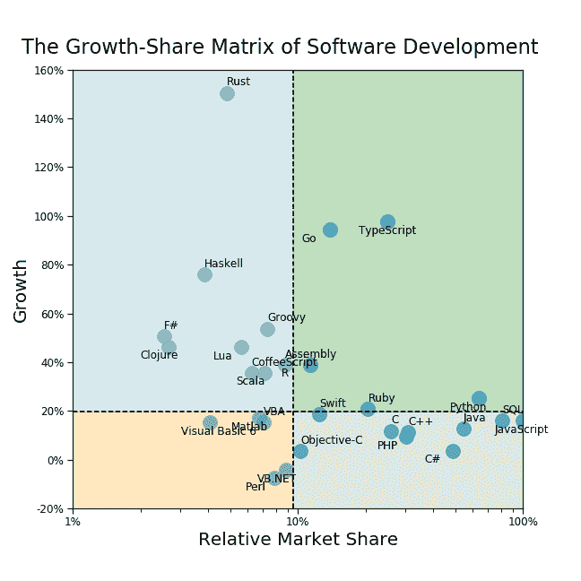

# 软件开发的增长-份额矩阵

> 原文：<https://dev.to/whoisnnamdi/the-growth-share-matrix-of-software-development-f1f>

人力资本是我们最大的资产。

像金融资本一样，[复合增长的全能力量](https://dev.to/whoisnnamdi/you-dont-understand-compound-growth-1019-temp-slug-6549333)意味着技能习得率随时间推移的微小差异会导致职业结果的巨大差异。

因此，选择磨练哪些技能是职业成长和在任何领域取得成功的最重要的关键之一。

在各种形式的人力资本中，**技术能力**正迅速成为**21 世纪知识工作的**关键技能。

然而，人们可以深入研究并试图掌握许多技术，这些技术具有不同的用途和实际适用性。

那么，如何在众多选择中决定“投资”哪里呢？

我发现一个对这项任务有惊人帮助的心智模型是[增长份额矩阵](https://www.economist.com/news/2009/09/11/growth-share-matrix)，这是一个 50 年前由波士顿咨询集团提出的框架。

该框架最初是作为一种工具来帮助高管根据各自的相对市场份额和增长情况对不同的业务部门进行优先排序。这两个维度将市场格局划分为象限，每个象限都具有某些特征:

*   星级(高增长/高份额)
*   现金牛(低增长/高份额)
*   问号(高增长/低份额)
*   狗(低增长/低份额)

波士顿咨询公司建议客户投资明星，利用奶牛的现金流，评估问号的潜力，尽快退出或出售狗。

增长份额矩阵最初是用于产品线或业务单元——一个公司可以拥有的资产。在这方面，你可能会认为这个框架对编程语言的适用性有限，因为没有一个人“拥有”任何给定的语言。

没那么快！

我认为我们每个人都拥有一点编程语言，不是以股权或股票的形式，而是以人力资本(T2)的形式。

通过对有用技能“组合”的精心管理，我们的学习努力获得了回报——对我们时间和努力的回报。

学习一门编程语言是一个很好的例子。

但是是什么让编程语言*变得有用呢*？

任何给定编程语言的价值都是懂这种语言的其他人的数量和使用这种语言开发和销售产品的公司的数量的直接衍生物。

对一些人来说，这可能听起来显而易见，但事实上这完全违背直觉。

在生活的大部分技能中，我们寻求掌握罕见的东西——别人做不到的东西。我们认为，通过独特的才能使自己与众不同，我们将在竞争日益激烈的世界中更加耀眼。这种想法认为，学习稀有的东西会带来有意义的回报。

虽然没错，知道一门很少有人熟悉的晦涩的语言可能会在市场上为你开拓一个很好的位置，为你罕见的才能收取很高的费用，但我认为，对大多数人来说，知道一门其他许多人也知道的语言**实际上比知道一门只有少数人使用过的语言更有价值。**

大多数人认为编程就是你如何与计算机对话。真的，这是你和**其他开发者**说话的方式。

由于网络效应以及软件开发项目和团队不断增长的规模、规模和范围，了解“[通用语](https://en.wikipedia.org/wiki/Lingua_franca)”比成为某种濒危语言的专家更有价值，这种语言很快就会被丢弃到历史桌面上的垃圾桶里。

矛盾的是，在高市场份额中拥有低个人市场份额实际上并不是一件坏事。

## 构建矩阵

为了构建编程语言的增长份额矩阵，我们将利用 StackOverflow 的[年度开发者调查](https://insights.stackoverflow.com/survey/)。对于 [2018 版](https://insights.stackoverflow.com/survey/2018/)，他们调查了全球超过 10 万名开发者，涵盖了从工作满意度到薪酬等广泛的话题。这里我们将关注美国的开发者。

对我们来说，关键问题是:

> “在过去的一年中，您使用以下哪种编程、脚本和标记语言进行了大量的开发工作？”

这个问题的答案应该给我们一个任何给定语言受欢迎程度的粗略代理，由使用过特定语言的开发人员的比例来定义。

对于增长，我们可以比较 2017 年和 2018 年对这个问题的回答，以得出每种语言的增长估计值。我们将增长定义为过去一年中使用该语言的受访者的百分比增长率。因此，一门语言从 10%的覆盖率增长到 13%将被视为增长了 30%(而不是 3 个百分点)。

象限边界将设定在增长率的中间值和相对市场份额。

最后一点——按照增长份额矩阵的惯例，我们将显示相对于市场份额最大的语言的市场份额。因此，轴将在 100%结束(代表最流行的语言)。我们还将在对数尺度上展示这一点，以更好地展示分布情况，相对市场份额低于 10%时，分布情况往往会非常拥挤。

我们现在拥有了构建增长份额矩阵所需的一切！

## 矩阵内部

看一看结果:

一个引人注目的特征立即跳了出来——很少有语言的受欢迎程度出现了净下降。几乎每种语言都在发展，顾名思义，这意味着普通开发人员在他们的工作中使用越来越多的语言。

让我们浏览一下每个象限，并讨论一些亮点。

## 星辰

**Python** - [Python 已经存在了几十年](https://en.wikipedia.org/wiki/Python_(programming_language))，但直到最近才作为数据分析和机器学习用例的首选语言大获成功。Python 被广泛认为是数据驱动分析的最佳语言之一，因为它相对容易使用，并且有大量的开源库来简化和加速分析。与其他语言相比，Python 的语法非常简单。易用性和速度在数据科学中尤为重要，因为数据科学家在确定首选规范之前，通常会反复运行一个模型。像 Jupyter 笔记本这样的交互式和可复制的计算环境越来越受欢迎，这与 Python 在开发人员中的份额激增非常吻合。我个人很高兴看到 Python 如此受欢迎，因为我花了两年时间自学这门语言！

Ruby 在历史上因其在 web 开发中的易用性和强大而闻名。许多 web 开发人员用 Ruby 编写了他们的第一个 web 应用程序。[Ruby on Rails 框架](https://rubyonrails.org/)只是进一步扩展了这种用户友好性，使得 Ruby 在那些希望以一种简洁的方式快速开发和部署功能性 web 应用的开发人员中非常流行。然而，出于几个原因，Ruby 的增长正在放缓，而且已经持续了几年。[不，Ruby 还没有“死亡”](https://www.techrepublic.com/article/the-death-of-ruby-developers-should-learn-these-languages-instead/)，但是随着最初的声势逐渐消退，它很可能会迁移到摇钱树区。Ruby 仍然是一种很好地为开发人员服务的伟大语言。

在开发人员中，Go 简化了编写代码的过程，从而使开发人员更有效率。Go 最初诞生于谷歌，当时技术团队正试图解决工程问题，这些问题在代码库、多核处理器和网络感知应用日益庞大的时代似乎只会越来越多。Go 的构建考虑到了并发性，使得构建多线程应用程序相对容易。在谷歌之外，使用 Go 的主要公司包括优步、网飞、Adobe、IBM、英特尔、Dropbox、CloudFlare 等等。

鉴于 TypeScript 与 JavaScript 有很强的相似性和重叠性，我在这里讨论过将 TypeScript 作为自己的语言，但是有这种语言经验的开发人员似乎是一个值得关注的独特群体。在过去的几年里，这种语言也经历了 T2 式的增长。TypeScript 的基本目标是简化用普通 JavaScript 编写的大型应用程序的开发。相应地，TypeScript 是 JavaScript 的超集，也可以编译成简单的 JavaScript。那么为什么会有这种区别呢？除了强类型、泛型和接口之外，Typescript 还为核心 JavaScript 添加了许多其他语言通用的特性，如类和模块。TypeScript 由微软开发和维护。

这些语言非常受欢迎，并将为任何初露头角的开发人员或产品经理打下坚实的基础。如果你至少对一些明星还没有基本的精通，我恳求你:**学习这些成长的行业工具**。

## 摇钱树

JavaScript - [JavaScript 已经成为现代网络开发的主流语言](https://www.simplytechnologies.net/blog/2018/4/11/why-is-javascript-so-popular)，许多[衍生框架](https://dev.to/raygun/9-popular-javascript-frameworks-used-in-2018-50j4-temp-slug-3320252)利用了它的核心元素。如今，JavaScript 比 Java 更受欢迎，这是因为如今 web 应用程序无处不在，以及移动 SaaS 和其他基于 web 的应用程序消费模型。在这里，JavaScript 处于领先地位，数字反映了这一点。但是，需要注意的是，尽管命名方式相似， [Java 和 JavaScript 并没有紧密的联系](https://www.geeksforgeeks.org/difference-between-java-and-javascript/)(说来话长)。两者都是面向对象的，但相似之处仅此而已。

Java 长期以来一直是跨平台开发的流行语言，这种灵活性随着新平台的出现而延续，比如移动平台。Java 的众多约定之一是“[编写一次，在任何地方运行](https://en.wikipedia.org/wiki/Write_once,_run_anywhere)”的思想，这意味着用 Java 编写的代码可以在任何其他支持 Java 的平台上运行，而无需重新编译。完成后，Java 应用程序被编译成运行在 Java 虚拟机上的[字节码](https://en.wikipedia.org/wiki/Bytecode)。最初由 Sun Microsystems 创建，通过收购，今天它最终在 Oracle 手中。

SQL(结构化查询语言)是一种古老的工具，无需介绍。它已经存在了一段时间，是分析师从关系数据库和数据仓库中查询和提取数据的主要手段。尽管“”和其他非关系框架很受欢迎， [SQL 仍然是王者](https://dev.to/raygun/9-popular-javascript-frameworks-used-in-2018-50j4-temp-slug-3320252)，近年来，许多其他框架都采用了类似 SQL 的接口，以便简化数据提取和转换。随着公司从更大范围的不同来源收集数据并继续将这些信息存储在中央数据库中，SQL 的重要性只会增加。

C 家族——这并不奇怪——C 语言的扩展家族已经在软件开发社区中占据了很强的地位，并继续作为我们今天所知道和喜爱的许多关键应用程序的支柱。此外，C 也找到了进入其他语言的途径。例如，Python 的参考实现 CPython 是用 C 和 Python 编写的，核心 Python 代码库的重要部分实际上是用 C 编写的，因为它是一种编译(而不是解释)语言，因此在运行时具有更快的性能。 [C 语言是一种极具影响力的语言](https://stackify.com/popular-programming-languages-2018/)，不会很快消失。

PHP - PHP 完全属于摇钱树的范畴。PHP 是一种服务器端脚本语言，主要适用于 web 开发，其原意为“个人主页”。[许多流行的网站和网络应用程序都是建立在 PHP](https://en.wikipedia.org/wiki/Programming_languages_used_in_most_popular_websites) 之上的，包括最著名的 WordPress。然而，就受欢迎程度而言，这种语言已经停滞不前，部分原因是由于它的[笨拙](https://eev.ee/blog/2012/04/09/php-a-fractal-of-bad-design/)和安全漏洞，PHP 在历史上遭受了许多严重的攻击(例如: [SQL 注入](https://en.wikipedia.org/wiki/SQL_injection))。也就是说，这是另一种拥有惊人市场份额的语言，将在相当长的一段时间内继续被广泛使用。

**Swift**-Swift 的受欢迎程度直接源于 macOS 和 iOS 设备的潜在受欢迎程度，尽管这些设备在智能手机总出货量中只占少数，但却代表了一个巨大的安装基础，尤其是在更富裕的西方人口中。Swift 于 2014 年推出，起初增长迅猛，[成为历史上增长最快的语言之一](https://9to5mac.com/2018/03/09/swift-ranking-programming-languages/)。Swift 深受另一棵摇钱树 Objective-C 的影响，最近其受欢迎程度超过了 Objective-C。作为苹果的心血结晶，Swift 的生死将取决于苹果自己的成功，所以要做好相应的规划。

这些语言真的很赚钱。如果你已经精通以上任何一种语言，很好，利用节省下来的时间在《明日之星》中学习一些技能。如果你现在还不太了解这些语言，评估它们对于你现在或不久的将来想要从事的特定项目的实用性/必要性。

## 问号

Rust 是一种相对较新的编程语言，最近十年才出现。虽然 Rust 在技术上是一种通用语言，但由于它的低级本质，它最适合用于接近裸机运行的嵌入式系统。Rust 和 C++之间经常进行比较，部分是因为它们的语法相似性。[众所周知，Rust 经常在用户中创造热情的粉丝](https://medium.com/mozilla-tech/why-rust-is-the-most-loved-language-by-developers-666add782563)。虽然远非最受欢迎的语言之一，但它确实受到使用它最多的人的喜爱。Rust 的开发如今相当活跃，这确保了在可预见的未来，这种语言仍将处于前沿。

像 Go 一样，Scala 是一种面向提高开发者生产力的语言。Scala 这个名字是“scalable”和“language”的结合体，暗示了该语言的初衷是为了实现大规模应用程序和用户群的高性能。Scala 构建在 JVM 和 JavaScript 运行时之上，结合了面向对象和函数式编程的元素。由于这些强大的联系，Scala 经常被视为“下一代”Java。Scala 非常适合并行和分布式计算，提供了许多遗留语言所缺乏的面向未来的能力。尽管在某些开发人员中很受欢迎，但相对于像 Go 或 Rust 这样的语言来说，它的增长似乎过早地减缓了。它的支持者希望 Scala 有一天能超越 Java，但这在一段时间内不会发生，如果有可能的话。

R 稍微错过了成为明星的界限，但是考虑到它令人难以置信的 40%的增长率，这种语言明年将会很容易跨越界限。出于与 Python 相同的原因，r 正在迅速流行，尽管[大多数人认为 Python 在速度、易用性和普遍适用性方面相对更胜一筹。R 在数据科学和统计分析方面的历史优势现在正在推动 R 的重大复兴。今年早些时候，R 的爱好者庆祝了](https://www.datacamp.com/community/tutorials/r-or-python-for-data-analysis) [R 的 25 周年纪念日](https://blog.revolutionanalytics.com/2018/08/r-generation.html)，借助数据科学的有益东风，这种语言没有显示出放缓的迹象。

Haskell -功能重于形式，或者对于 Haskell 来说，两者兼而有之。Haskell 是一种[纯函数式](https://en.wikipedia.org/wiki/Purely_functional_programming)编程语言，这意味着该语言专注于将不可变值作为输入并每次都产生完全相同的输出的函数。这也是[的懒惰](https://en.wikipedia.org/wiki/Lazy_evaluation)，简单地说就是直到绝对必要的时候才评估结果。这些和其他特性使 Haskell 成为一种非常强大和高效的语言，但也潜在地限制了它的适用性。哈斯克尔的狂热追随者正在从它的小基数迅速增长，但很难说这种情况会持续多久。

外卖——它们被称为*问号*是有原因的。没有人真正知道这些新兴技术的未来会如何。今天，它们可能不值得在农场上下注，但是它们也是成为前瞻性开发团队中下一个“必须知道”的工具的主要候选。盯着他们。

## 狗

Visual Basic(所有风格)——VB.NET、VBA、VB6——无论你喜欢哪种风格，Visual Basic 的生态系统显然已经失宠了。VB.NET 语是增长份额矩阵中仅有的两种在 2018 年实际失去份额的语言之一。[VB 的大量功能现在存在于 C#中](https://arstechnica.com/information-technology/2017/02/microsofts-developer-strategy-c-for-fancy-features-visual-basic-for-beginners/)，微软对这种语言的立场并不是 100%明确，从最初计划在 2008 年结束对这种语言的支持，到最近宣布 [Windows 10 将在操作系统的生命周期内支持 VB 运行时](https://docs.microsoft.com/en-us/previous-versions/visualstudio/visual-basic-6/visual-basic-6-support-policy)。这对于使用 Visual Basic 构建的遗留应用程序来说是很好的，但是这些应用程序不可避免地需要用现代语言重写或者被终止。

**外卖**——与真正的狗不同，增长份额矩阵内的狗必然会引起争议。开发人员和开发团队需要认真应对这些语言所面临的现状，以及花费大量时间和资源来构建由这些不太流行的语言支持的应用程序是否明智。

## (人力)资本配置

这个故事的寓意是- **批判性地思考把你的时间投资在哪里**。

要明确的是，如果你选择了“错误的”语言，这并不是世界末日。事实上，这里真的没有任何错误的选择，即使是“狗”。使用工作中最好的工具。然而，这无疑有助于避免试图重新定位自己或在以后迎头赶上所固有的过渡成本。

如果有什么不同的话，不要试图重新定位自己*本身*，而是通过至少掌握几种不同的语言来寻求提高你的整体价值和能力的广度。同样，与口语类似，能够用多种有价值的语言交谈的人通常会从他们的学习努力中获得不成比例的价值，这往往会[彼此复合](https://dev.to/whoisnnamdi/you-dont-understand-compound-growth-1019-temp-slug-6549333)，尤其是在学习构成许多方言的基本特征时。

请记住，这个心智模型虽然不完美，但可以说足够灵活，可以容纳许多技能，*而不仅仅是编程*。

我希望这个框架对你有用，当你作为一个精通技术的个人决定在哪里发展你的人力资本时。

*您可以在 Jupyter 笔记本和中找到此分析的完整备份。我的 [GitLab](https://gitlab.com/whoisnnamdi/growth-share-matrix) 或 [GitHub](https://github.com/whoisnnamdi/growth-share-matrix) 的 py 脚本格式。*