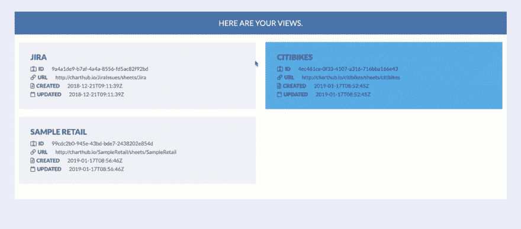

# Tableau 服务器数据的恶意提取

> 原文：<https://dev.to/hackersandslackers/the-hostile-extraction-of-tableau-server-data-2nl0>

[](https://res.cloudinary.com/practicaldev/image/fetch/s--XskJKAfu--/c_limit%2Cf_auto%2Cfl_progressive%2Cq_auto%2Cw_880/https://res-2.cloudinary.com/hackers-and-slackers/image/upload/f_auto%2Cq_auto/img/tableauextraction.jpg)

我尽最大努力不去憎恨画面。正是这款软件的强大和易用性促使我首先购买了许可证。从那以后，我发现了 Tableau 有意锁定用户数据的令人兴奋的新方法。

我最近试了一下 [**Tableau 服务器客户端** Python 库](https://tableau.github.io/server-client-python/docs/)，希望能找到一些有用的东西。我决定(叹气，*再一次*)允许 Tableau 往好处想:在一个月内推了**四次更新**之后，也许事情已经改变了。相反，Tableau 的商业策略很强:成为一堆熊熊燃烧的粪便。一个很好的例子是**视图**对象 Tableau 允许你在你的服务器上与之交互。熟悉的人都知道**视图**是存储在 Tableau 服务器上的*工作簿*的*工作表*的俚语。

通过 Python 连接到 Tableau 实例来检索视图对象是小菜一碟:

```
import tableauserverclient as TSC
tableau_auth = TSC.TableauAuth('username', 'password')
server = TSC.Server('http://servername')

with server.auth.sign_in(tableau_auth):
  all_views, pagination_item = server.views.get()
  print([view.name for view in all_views]) 
```

这个简单的代码片段列出了服务器上的每个视图对象。哇！想想看，我们可以用那些我们辛辛苦苦转换的表格数据做些什么，纠正错误。看看 Tableau 的 Python“视图对象”实际包含了什么:

*   `id`视图项目的标识符。
*   `name`视图的名称。
*   `owner_id`视图所有者的 id。
*   `preview_image`视图的缩略图。
*   `total_views`视图的使用统计。指示视图被访问的总次数。
*   `workbook_id`与视图相关联的工作簿的 id。

摩西停止印刷机，我们可以得到一个*的缩略图我们的数据吗？！感谢慷慨的画面霸主！*

 *注意这里没有提到*实际数据*。

我们要做一个游戏。在我的时间被浪费之后，我感到那种温暖的刺痒感，似乎在说“恶毒地摧毁一个机构的野心！”请允许我提醒您，我们正在讨论的是根据服务器基础设施所使用的 ***个 CPU 对客户许可证进行计费的机构。*** 这是有效地认识到 Tableau server 背后可怕而低效的代码库，并利用这一缺陷进行货币化。是的，你花了更多的钱来鼓励最糟糕的做法。

## 我们来做一个烧瓶 App。一个愤怒的。

在我们的上一篇文章中，我分享了一个小脚本来帮助你开始从你自己的 Tableau 服务器上窃取数据。那不再能挠我的痒了。我要建立一个界面。我想让任何人都尽可能容易地系统性地抢劫 Tableau 服务器的每一分钱。当我们考虑这个等式时，这是一大笔钱:**数据=石油+新的**。

在我让你厌烦之前，这里有一个我们正在构建的 MVP 的快速演示:

[](https://res.cloudinary.com/practicaldev/image/fetch/s--7IP_qk4M--/c_limit%2Cf_auto%2Cfl_progressive%2Cq_66%2Cw_880/https://res-4.cloudinary.com/hackers-and-slackers/image/upload/f_auto%2Cq_auto/img/tableau.gif) 

<figcaption>每个表都是一个从 Tableau 服务器上拉取的视图。</figcaption>

这个 POC 演示了从 Tableau 服务器自动提取 Tableau 视图是非常可能的。*成功*消息表示我们已经成功获取了 Tableau 视图，并且**在外部数据库**中创建了相应的表。我们在 Tableau 中操作的任何数据现在都是我们的了:我们现在可以利用我们在工作簿中应用的转换，在其他应用程序中使用这些数据，并利用提取调度程序来保持数据的到来。我们已经把 BI 工具变成了 ETL 工具。换句话说，你可以友好地拿走那些缩略图预览，然后把它扔掉。

我会开源所有这些，这是我的公民义务。让我们对企业说清楚:剥夺自己数据的自由是一种战争行为。奖励劣质工艺的定价模式是对我们智力的侮辱。对消费者犯下的每一个傲慢的暴行，战争将发动两倍的努力。我可能应该提到这些意见是我自己的。

## 无产阶级反击战

通过必不可少的项目-文件-结构树，感受一下我们的前进方向:

```
tableau-exporter
├── application
│ ├── __init__.py
│ ├── database.py
│ ├── tableau.py
│ ├── routes.py
│ ├── static
│ │ ├── data
│ │ │ └── view.csv
│ │ ├── dist
│ │ │ ├── all.css
│ │ │ ├── packed.js
│ │ ├── img
│ │ │ └── tableaugithub.jpg
│ │ ├── js
│ │ │ └── main.js
│ │ └── scss
│ │ └── main.scss
│ └── templates
│ ├── export.html
│ ├── index.html
│ ├── layout.html
│ └── view.html
├── config.ini
├── config.py
├── app.yaml
├── start.sh
├── wsgi.py
├── Pipfile
├── README.md
└── requirements.txt 
```

像往常一样，我们使用在这里建立的经典 Flask *应用工厂*。

### 首选武器

让我们看看我们的核心武器库:

*   我们正在通过利用 Tableau REST API 中暴露的一些漏洞来实现我们的目标。
*   `pandas`:将处理从提取逗号分隔的数据到 CSV，渲染 HTML 表格，以及输出 SQL 的所有事情。
*   `flask_sqlalchemy`:和*熊猫*一起使用，处理把我们的数据传送到别处。
*   `flask_redis`:处理会话变量。

### 发起我们的申请

以下是我们构建应用程序的方式:

```
from flask import Flask
from flask_sqlalchemy import SQLAlchemy
from flask_redis import FlaskRedis

# Set global entities
db = SQLAlchemy()
r = FlaskRedis()

def create_app():
    """Construct the core application."""
    app = Flask( __name__ , instance_relative_config=False)
    app.config.from_object('config.Config')

    with app.app_context():
        # Initiate globals
        db.init_app(app)
        r.init_app(app, charset="utf-8", decode_responses=True)

        # Set global contexts
        r.set('uri', app.config['SQLALCHEMY_DATABASE_URI'])
        r.set('baseurl', app.config['BASE_URL'])
        r.set('username', app.config['USERNAME'])
        r.set('password', app.config['PASSWORD'])

        # Import our modules
        from . import routes
        from . import tableau
        app.register_blueprint(routes.home_blueprint)

        return app 
```

这一切都应该感觉一切如常。我们应用程序的核心分为处理视图的`routes.py`和处理反建立逻辑的`tableau.py`。先说后者。

## 生命、自由、追求病态的数据管道

我们的好朋友`tableau.py`可能对上次加入我们[的人来说很熟悉](https://dev.to/hackersandslackers/tableaus-rest-api-turning-tableau-into-an-etl-pipeline-gui-4208-temp-slug-8643126)。`tableau.py`从那以后，他一直忙着去健身房，在黄金时间看起来很精神:

```
import requests
import xml.etree.ElementTree as ET
from . import r
import pandas as pd
import io

class ExtractTableauView:
    """Class for working in a Tableau instance."""

    __baseurl = r.get('baseurl')
    __username = r.get('username')
    __password = r.get('password')
    __database = r.get('uri')
    __contenturl = r.get('contenturl')

    @classmethod
    def get_view(cls, site, xml, view, token):
        """Extract contents of a single view."""
        headers = {'X-Tableau-Auth': token,
                   'Content-Type': 'text/csv'
                   }
        req = requests.get(cls.__baseurl + '/api/3.2/sites/' + str(site) +'/views/' + str(view) + '/data', headers=headers, stream=True)
        csv_text = req.text
        view_df = pd.read_csv(io.StringIO(csv_text), header=0)
        return view_df

    @classmethod
    def list_views(cls, site, xml, token):
        """List all views belonging to a Tableau Site."""
        headers = {'X-Tableau-Auth': token}
        req = requests.get(cls.__baseurl + '/api/3.2/sites/' + site + '/views', auth=(cls.__username, cls.__password), headers=headers)
        root = ET.fromstring(req.content)
        views_arr = []
        for child in root.iter('*'):
            if child.tag == '{http://tableau.com/api}views':
                for view in child:
                    view_dict = {
                        'name': view.attrib.get('name'),
                        'id': view.attrib.get('id'),
                        'url': cls.__baseurl + '/' + view.attrib.get('contentUrl'),
                        'created': view.attrib.get('createdAt'),
                        'updated': view.attrib.get('updatedAt')
                    }
                    views_arr.append(view_dict)
        return views_arr

    @classmethod
    def get_token(cls, xml):
        """Receive Auth token to perform API requests."""
        for child in xml.iter('*'):
            if child.tag == '{http://tableau.com/api}credentials':
                token = child.attrib.get('token')
                return token

    @classmethod
    def get_site(cls, xml):
        """Retrieve ID of Tableau 'site' instance."""
        root = xml
        for child in root.iter('*'):
            if child.tag == '{http://tableau.com/api}site':
                site = child.attrib.get('id')
                return site

    @classmethod
    def initialize_tableau_request(cls):
        """Retrieve core XML for interacting with Tableau."""
        headers = {'Content-Type': 'application/xml'}
        body = '<tsRequest><credentials name="' + cls. __username + '" password="' + cls.__ password + '" ><site contentUrl="' + cls.__contenturl + '" /></credentials></tsRequest>'
        req = requests.post(cls.__baseurl + '/api/3.2/auth/signin', auth=(cls.__username, cls.__password), headers=headers, data=body)
        root = ET.fromstring(req.content)
        return root 
```

我希望我能完全相信这门课乍看之下是多么糟糕，但我向你保证我们别无选择。举个例子:我有没有提到 Tableau 的 REST API 返回的 XML 格式非常畸形，以至于破坏了 XML 解析器？在这一点上我分不清无能和恶意。

下面是我们类的方法分类:

*   `initialize_tableau_request()`:处理初始认证，并返回有价值的信息，如站点 ID 和 API 令牌，以便以后使用。
*   `get_site()`:从上面返回的 XML 中提取站点 ID。
*   同样提取我们的令牌。
*   编辑一个 Tableau 站点中所有视图的列表，让我们有机会选择要提取的视图。
*   `get_view()`:选择一个视图并创建一个数据帧，该数据帧将被发送到一个外部数据库。

## 我们的路由逻辑

接下来，我们需要`routes.py`为我们的应用构建视图和相关逻辑:

```
from flask import current_app as app
from flask import render_template, Blueprint, request, Markup
from flask_assets import Bundle, Environment
from . import tableau
from . import database
import pandas as pd

home_blueprint = Blueprint('home', __name__ , template_folder='templates', static_folder='static')

assets = Environment(app)
js = Bundle('js/*.js', filters='jsmin', output='dist/packed.js')
scss = Bundle('scss/*.scss', filters='libsass', output='dist/all.css')
assets.register('scss_all', scss)
assets.register('js_all', js)
scss.build()
js.build()

@home_blueprint.route('/', methods=['GET', 'POST'])
def entry():
    """Homepage which lists all available views."""
    tableau_view_extractor = tableau.ExtractTableauView()
    xml = tableau_view_extractor.initialize_tableau_request()
    token = tableau_view_extractor.get_token(xml)
    site = tableau_view_extractor.get_site(xml)
    views = tableau_view_extractor.list_views(site, xml, token)
    return render_template(
        'index.html',
        title="Here are your views.",
        template="home-template",
        views=views,
        token=token,
        xml=xml,
        site=site
    )

@home_blueprint.route('/view', methods=['GET', 'POST'])
def view():
    """Displays a preview of a selected view."""
    site = request.args.get('site')
    xml = request.args.get('xml')
    view = request.args.get('view')
    token = request.args.get('token')
    tableau_view_extractor = tableau.ExtractTableauView()
    view_df = tableau_view_extractor.get_view(site, xml, view, token)
    view_df.to_csv('application/static/data/view.csv')
    return render_template(
        'view.html',
        title='Your View',
        template="home-template",
        view=view,
        token=token,
        xml=xml,
        site=site,
        view_df=Markup(view_df.to_html(index=False))
    )

@home_blueprint.route('/export', methods=['GET', 'POST'])
def export():
    """Exports view to external database."""
    view_df = pd.read_csv('application/static/data/view.csv')
    view_df.to_sql(name='temp', con=database.engine, if_exists='replace', chunksize=50, index=True)
    return render_template(
        'export.html',
        title='Success!',
        template="success-template",
    ) 
```

我们的申请只有 3 页。它们包括我们的视图列表，单个视图的预览，以及当所述视图被导出时的成功页面。这都是核心烧瓶逻辑。

## 把它陈列出来

我们根据传递给 Jinja 模板的值动态构建页面。主页利用一些嵌套循环来列出我们从`tableau.py`返回的视图，还利用查询字符串将值传递给其他模板。

```



<div class="extended-container {{template}}">
  <div class="container">
    <div class="row">
      <div class="col s12">
        <h1>{{title}}</h1>
      </div>
      <div class="col s12 flex-container">
        
        <div class="download">
          <a href="{{ url_for('home.view') }}?token={{token}}&site={{site}}&view={{view.id}}&xml={{xml}}">
            <ul>
              
              <li><span class="key {{key}}">{{key}}</span> {{ value }}</li>
              
            </ul>
          </a>
        </div>
        
      </div>
    </div>
  </div>
   
```

继续:我们简陋的页面有两个目的:显示选中的视图，并以正义的名义导出它。

```



<div class="extended-container {{template}}">
  <div class="container">
    <div class="row">
      <div class="col s12">
        <h1>{{title}}</h1>
        <a href="{{ url_for('home.export') }}" class="export"><i class="far fa-file-export"></i></a>
        {{view_df}}
      </div>
    </div>
  </div>
   
```

## 战争没有结束

这个知识库对公众开放，可以在这里找到。我们仍然面临着挑战:例如，构建这个接口来通过登录而不是配置文件接受凭证，以及调度视图导出而不是按需导出。

我们何去何从取决于我们人民的决定。据我所知，我可以在这里对着一个空房间大喊大叫(我几乎可以肯定，任何为企业软件付费的人都喜欢睁只眼闭只眼的否认)。如果相反的情况成立，我敢说革命才刚刚开始。*