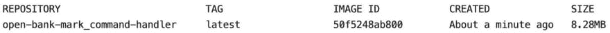

# 开放银行标志人性化的一面

> 原文：<https://dev.to/gklijs/the-human-side-of-open-bank-mark-3o4b>

*TL；DR:我非常愉快地创建了[开放银行标志](https://github.com/openweb-nl/open-bank-mark)，即使你害怕括号，你也可能想检查一下。*

最近我开源了 open bank-mark，一周前在 T2 的 Kafka Meetup Utrecht，这是我第五次谈论它。在演讲后的喝饮料时，我经常会被问到它是如何产生的。把它写下来似乎是个好主意，这也是我现在正在做的。

## 什么是开户行标？

> 杰拉德·克里吉斯[@ gklijs](https://dev.to/gklijs)打开银行标记，使用 [#clojure](https://twitter.com/hashtag/clojure) 和 [#clojure](https://twitter.com/hashtag/clojure) 脚本构建，允许使用 [@confluentinc](https://twitter.com/confluentinc) 模式注册表对 [@apachekafka](https://twitter.com/apachekafka) 应用程序进行端到端测试。其中一个[#微服务](https://twitter.com/hashtag/microservices)也在[# rustlang](https://twitter.com/hashtag/rustlang)[# kotlin](https://twitter.com/hashtag/kotlin)中实现，使用 [#Docker](https://twitter.com/hashtag/Docker) 进行设置。[github.com/openweb-nl/ope…](https://t.co/2btZa0AK55)2019 年 5 月 20 日下午 16:51214

虽然在项目本身中没有明确提到，但项目的名称是“开放式银行”和基准的组合。“开放银行”是我在一个项目中结合一切之前的前端部分的名称。它指的是我的雇主 [Open Web](https://www.openweb.nl/) 但是是一个银行应用程序。它也是开放的，因为代码是公开的，几乎没有安全性。我添加的最后一部分使运行基准测试成为可能。例如，您可以将组件换成另一种语言的等效组件。在某个环境下运行两者后，可以比较不同部分的延迟以及 cpu 和内存的使用情况。

##  [ openweb-nl ](https://github.com/openweb-nl) / [开户行标志](https://github.com/openweb-nl/open-bank-mark)

### 一个主要使用 Clojure 的银行模拟应用，可以用来进行端到端测试，并显示一些图形。

<article class="markdown-body entry-content container-lg" itemprop="text">

积极的开发已经转移到 [kafka-graphql-examples](https://github.com/openweb-nl/kafka-graphql-examples) 上，它更专注于 graphql，并且在某些方面比这个项目更简单。

# 公开银行标志

内容

*   [简介](https://raw.githubusercontent.com/openweb-nl/open-bank-mark/master/#intro)
*   [开发](https://raw.githubusercontent.com/openweb-nl/open-bank-mark/master/#development)
    *   [本地建筑](https://raw.githubusercontent.com/openweb-nl/open-bank-mark/master/#building-locally)
    *   [楼宇遥控](https://raw.githubusercontent.com/openweb-nl/open-bank-mark/master/#building-remote)
    *   [构建其他后端](https://raw.githubusercontent.com/openweb-nl/open-bank-mark/master/#other-backend)
*   [模块](https://raw.githubusercontent.com/openweb-nl/open-bank-mark/master/#modules)
    *   [拓扑](https://raw.githubusercontent.com/openweb-nl/open-bank-mark/master/#topology)
    *   [同步器](https://raw.githubusercontent.com/openweb-nl/open-bank-mark/master/#synchronizer)
    *   [心跳](https://raw.githubusercontent.com/openweb-nl/open-bank-mark/master/#heartbeat)
    *   [命令发生器](https://raw.githubusercontent.com/openweb-nl/open-bank-mark/master/#command-generator)
    *   [命令处理程序](https://raw.githubusercontent.com/openweb-nl/open-bank-mark/master/#command-handler)
    *   [Graphql 端点](https://raw.githubusercontent.com/openweb-nl/open-bank-mark/master/#graphql-endpoint)
    *   [前端](https://raw.githubusercontent.com/openweb-nl/open-bank-mark/master/#frontend)
    *   [测试](https://raw.githubusercontent.com/openweb-nl/open-bank-mark/master/#test)
*   [脚本](https://raw.githubusercontent.com/openweb-nl/open-bank-mark/master/#scripts)
*   [变体](https://raw.githubusercontent.com/openweb-nl/open-bank-mark/master/#variants)
    *   [三家券商](https://raw.githubusercontent.com/openweb-nl/open-bank-mark/master/#three-brokers)
    *   [一个经纪人](https://raw.githubusercontent.com/openweb-nl/open-bank-mark/master/#one-broker)
*   [结果](https://raw.githubusercontent.com/openweb-nl/open-bank-mark/master/#results)

## [简介](https://raw.githubusercontent.com/openweb-nl/open-bank-mark/master/)

这个项目是一个使用 Kafka 的事件源应用程序的例子。前端可以在 [open-bank](https://open-bank.gklijs.tech/) 查看，目前配置为在后台选项卡中的本地主机上运行端点是比较 4 种语言的结果，所有这些语言都在 TravisCi 上运行了 10 次，使用一个代理。它还包含一个端到端测试，使比较不同的实现或配置成为可能。例如，可以在拓扑模块中将`linger.ms`设置为不同的值，这样在 Clojure 上构建的所有东西都将使用该设置

</article>

[View on GitHub](https://github.com/openweb-nl/open-bank-mark)

激情项目在一年半的时间里有机地成长。有时一个月什么都不做，有时一个月几乎每天晚上都在做，以便为下一次聚会取得足够的进展。我使用过类似这些宠物项目的呼叫项目，但从来没有真正喜欢它的声音。感谢这篇文章，[为什么每个开发人员都应该有一个激情项目](https://clubhouse.io/blog/why-every-developer-should-have-a-passion-project)，我现在有了一个更好的名字来称呼这样的项目。

接下来将是一个大致按时间顺序的故事，讲述开放式银行马克发展的不同阶段。

## 荷兰合作银行的卡夫卡平台

这个项目的很大一部分是围绕卡夫卡展开的。它用于分离不同的组件，并使其具有潜在的可伸缩性。卡夫卡是第一个在我所熟悉的开放银行市场中扮演重要角色的技术。

2015 年 11 月，我开始与 Kafka 合作，当时我在 Rabobank 工作，开发后来成为 T2 Axual 平台的 T3。在我开始之前，为了让人们对卡夫卡充满热情，制作了一个演示。这个演示展示了虚构账户的余额，并在满足特定条件时发出通知。这有点类似于开放银行马克。但是交易不是由命令执行的，并且有固定数量的账户。

我在创建客户端库的过程中学到了很多。我学到的一件特别的事情是，用 Java 编写并发代码是很难的。Kafka 消费者对于多线程访问的不安全性使得这变得更加困难。这也是后来我对 Clojure 感兴趣的原因之一。

## Clojure 为勇敢和真实

2016 年夏天，我读了《勇敢和真实的 Clojure》。这本书读起来既有趣又清晰。但是当涉及到实际编程时，我很难像书上说的那样使用 [Emacs](https://www.gnu.org/software/emacs/) 。

仅仅几个月后，我了解到了[草书](https://cursive-ide.com/)，它是我已经熟悉的 IDE 的一个插件， [IntelliJ](https://www.jetbrains.com/idea/) 。这是一种不错的令人耳目一新的语言，最初的一些激情项目是一个前端带有 Clojurescript 的[贪吃蛇游戏](https://github.com/gklijs/snake)。能够对后端和前端使用相同的代码是很好的。甚至游戏本身也可以在浏览器中观看，或者用 Java 使用同一个库。

后来我在贪吃蛇游戏中加入了一些基于规则的人工智能。5 月 4 日，在我们的一次“开放式披萨”会议上，我和一位客户一起展示了贪吃蛇游戏。“开放式披萨”会议就像一次常规聚会，但只针对 Open Web 的员工。

## 卡夫卡工作室

在玩了贪吃蛇游戏大约一年后，是时候在“开放披萨”上做另一个展示了。我想做一个卡夫卡工作室，分享我的一些经验。在我开始准备我的演讲之前，event sourcing 和 GraphQL 都是“打开披萨”的主题。这两个都是用 Java 演示的，所以我想用 Kafka 和 Clojure 做些什么。

所以我从开放银行标志的第一部分开始。由于大部分是在晚上构建的，我很快就对每次都必须设置正确的主题和模式感到恼火。所以这就是为什么我添加了一些工具来基于一些 [edn 文件](https://clojure.org/reference/reader#_extensible_data_notation_edn)设置它们。

事先，我只想建立后端部分。但是当我做好准备后，我忍不住尝试用 Clojurescript 创建一个前端。我很快就开始工作了，使用 [re-graph](https://github.com/oliyh/re-graph) 用于 GraphQL 逻辑，使用[布尔玛](https://github.com/jgthms/bulma)用于 css。我对此非常满意，因为 2 月 14 日的 Clojure meetup 有一个开放的时间段，所以我做了一个演讲来展示我到目前为止的成果。分享这个项目很好，我得到了一些有价值的反馈。

差不多两个月后，2018 年 4 月 5 日，终于到了再次举办公开披萨讲座的时候了。原来我太专注于它是一个工作室。我确实有前端和后端可以改进的想法。但是我对整个项目没有一个合适的介绍来说清楚是什么意思。

就在演讲之前，我还添加了命令处理程序的 Kotlin 变体。我创建它主要是作为一个非 Clojure JVM 例子。但是除了使它整体上更复杂之外，它还导致我的现场演示失败。这是因为在运行 Clojure 时，数据库中的一些值为 null，而 Kotlin 希望它们总是具有基于数据类型的值。我确实分别测试了两种变体，但我之前没有测试切换。另一个重要的教训是，在做现场演示时，确保你只做你以前做过的事情，而不是不同的事情。

由于复杂性和没有适当的介绍，只有少数人真正开始编码。创建一个不同的前端也不是没有问题，因为在使用 Angular 时有一些 CORS 问题，我不能很快解决。

## Rust 2018 版发布会

在听说今年 2 月 7 日会有 [2018 版发布会](https://www.meetup.com/Rust-Gouda/events/254877742/)之前，我已经和 [Rust](https://www.rust-lang.org/) 做了几件事。你可以在[这里](https://www.openweb.nl/nieuws/2019/02/gerard-zijn-ervaring-met-rust.html)了解更多信息。在发布会上，总共会有 6 场演讲和一些演示，所以演讲时间有限。

我已经编写了命令处理程序的 Rust 变体，为了做到这一点，我需要将我从 Kafka 收到的字节和来自模式注册表的模式转换成我可以在 Rust 中使用的类型化数据。尝试了现有库的几种组合后，我让它工作了。我在 Rabobank 的经历也帮了我很大的忙，因为我已经很好地掌握了它在 Java 中的工作方式。尤其是因为我们写了自己的连载包装汇合 Avro 连载。

作为学习 Rust 的一部分，我想把 serialiser 变成一个合适的图书馆，或者一个板条箱，因为在 Rust 中它们就是这么叫的。它目前的版本是 1.0.0，可以在 [crates.io](https://crates.io/crates/schema_registry_converter) 上找到。为了使它成为一个板条箱，我不仅把代码放在一起，而且使它更加通用。我还添加了一些特性，使它等同于做同样事情的 Java 库。我做的另一件事是添加单元和集成测试，并开始使用 [codecov](https://codecov.io/gh/gklijs/schema_registry_converter) 来跟踪代码覆盖率。

[//www.slideshare.net/slideshow/embed_code/key/yO9H5sb5u9gXa6](//www.slideshare.net/slideshow/embed_code/key/yO9H5sb5u9gXa6)

发布会是我第一次 Rust 聚会，也是我第一次需要戴麦克风，这让我有点紧张。我想是因为紧张，我的幻灯片有点太快了。从一些问题来看，我不太清楚我到底做了什么。我也给我看了银行演示，但大多数人都在看同时进行的 web 组装演示，也有一些人因为演示是程序的最后一部分而离开。这是一个很好的设置，一些人展示了在生产中运行的项目，或者几乎在那里。

## 卡夫卡会见乌特勒支

我有时也在推特上发布关于 open-bank-mark 的消息，一位前同事邀请我去参加 Kafka Meetup Utrecht。会谈计划于今年 5 月 28 日举行。因为这是 Kafka meetup，而且 Kafka 经常被使用的原因之一是性能，所以我认为尝试比较命令处理程序的不同实现是一个好主意。

在准备开放式披萨的前一年，我已经开始对前端进行测试，在 chrome 网络驱动中使用了 [etaoin](https://github.com/igrishaev/etaoin) 。因此，为了进行端到端的性能测试，我需要完成测试，并最终找到一种方法来进行事务处理和验证，同时测量所需的时间。

然后，我围绕它创建了一些代码，以便能够进行实际测试。我首先尝试了一个库，它使用进程的 pid 来测量 cpu 使用和内存位，每次都要获得正确的 pid，这是很繁琐的。我也怀疑测量。下一个改进的方法是使用 docker 来设置项目。这样我可以给容器命名，不再需要 pid。我使用[lispyclouds/clj-docker-client](https://github.com/lispyclouds/clj-docker-client)来测量 Docker 容器的 cpu 和内存，在我的 pull 请求被合并以添加该特性之后。使用 Docker 还有其他一些好处，比如更容易切换 JDK。我在笔记本电脑上运行了几个晚上，排除了一些有时会破坏测试程序的错误。

现在，我能够生成大量数据，但还没有办法将其可视化。最后，我结合使用了 [kixi.stats](https://github.com/MastodonC/kixi.stats) 来预处理数据，并使用 [oz](https://github.com/metasoarous/oz) 来生成带有一些 [vega](https://vega.github.io/) 导入来显示数据的 html。可以从[打开库](https://open-bank.gklijs.tech/)的背景选项卡中查看结果。现在我真的很想在前端添加路由，但我最好不要这样做，否则这个项目会一直进行下去。

就在演讲之前，我想我也可以使用另一个 Rust Kafka 库。我第一次忽略了它，因为它似乎没有得到很好的维护。现在仍然不是，但是人们正在使用它并在 github 上制造问题。也是一个天然的锈解决方案，它可以很容易地得到一个微小的 docker 图像。

> Gerard kli js[@ gkli js](https://dev.to/gklijs)[# rust lang](https://twitter.com/hashtag/rustlang)太牛逼了，编译成静态二进制这样一个 docker 镜像就可以从头做起了。生成的图像小于 10mb。Dockerfle 只是 github.com/gklijs/open-ba…的。现在试运行【travis-ci.com/openweb-nl/ope…】[# TravisCI](https://twitter.com/hashtag/TravisCI)。2019 年 5 月 25 日上午 09:4403

尽管那天公共交通罢工，聚会还是进行了，大约有 30 人出席。因为我有很多时间来准备这个演讲，而且大约有 50 个人要来，所以我真的想好好准备一下。但是我也在代码或测试设置中发现了一些小错误。所以我只在演讲的前一天晚上准备好了幻灯片。让我没有时间大声练习。这让我有时会寻找一些词语，但总的来说，我对它的进展很满意。演示文稿中的幻灯片可供使用。

[//www.slideshare.net/slideshow/embed_code/key/bIEQ0qXtIlunJx](//www.slideshare.net/slideshow/embed_code/key/bIEQ0qXtIlunJx)

## 下一步怎么办？

我从开源和共享项目中得到了一些积极的反应。它还作为一个示例项目添加到了 [lacinia docs](https://lacinia.readthedocs.io/en/latest/samples.html) 中。我不怎么使用 twitter，所以很高兴 [scicloj](https://twitter.com/scicloj) 提到我。

> Scicloj@ Scicloj一个用 [#clojure](https://twitter.com/hashtag/clojure) 和 [#clojure](https://twitter.com/hashtag/clojure) 脚本编写的事件源应用程序的现实开源示例，基于[@ confluent Inc](https://twitter.com/confluentinc)-[@ Apache Kafka](https://twitter.com/apachekafka)。它使用组件架构，Lacinia 用于 [#graphql](https://twitter.com/hashtag/graphql) ，Oz 用于 [#datavis](https://twitter.com/hashtag/datavis) ，Next-JDBC 用于数据库访问。
> 感谢分享， [@GKlijs](https://twitter.com/GKlijs) ！[twitter.com/GKlijs/status/…](https://t.co/lP3gxFKQfq)21:51PM-2019 年 5 月 29 日杰拉德·克利 js[@ gklijs](https://dev.to/gklijs)Open bank mark，用#clojure 和#clojurescript 构建允许使用@confluentinc 模式注册表对一个@apachekafka 应用进行端到端测试。其中一个#微服务也在#rustlang #kotlin 中实现，使用#Docker 进行设置。917

open-bank-mark 的最后补充是对文档的一些小的改进。我还认为在主项目中只留下 master 和“one-broker”分支，并将变体移到我自己的分支会更干净。同时，我在自述文件中添加了一个变体部分，可以存放其他变体的链接。我不知道我是否会在这个项目上花更多的时间。我想给症结一个尝试通过。

##  [ juxt ](https://github.com/juxt) / [症结](https://github.com/juxt/crux)

### 具有双时态图查询的文档数据库

<article class="markdown-body entry-content container-lg" itemprop="text">

Crux 是一个具有双时态图查询的开源文档数据库。提供了 Java Clojure 和 HTTP APIs。

Crux 遵循一种*非绑定*架构方法，这意味着它是通过在其设计核心使用半不可变日志由高度解耦的组件组装而成的。对于独立的单节点部署，日志当前可以存储在 LMDB 或 RocksDB 中，或者使用 Kafka 进行集群部署。目前可以使用 LMDB 或 RocksDB 存储索引。

Crux 是为无模式文档的高效双时态索引而构建的，这种简单性为在其上创建分层扩展提供了广泛的可能性，例如添加额外的事务、查询和模式功能。Crux 目前不支持 SQL，但它确实提供了一个基于 EDN 的 [Datalog](https://en.wikipedia.org/wiki/Datalog) 查询接口，可用于表达各种类似 SQL 的连接操作以及递归图遍历。

Crux 从 19 年开始作为*公开 Alpha* 发售…

</article>

[View on GitHub](https://github.com/juxt/crux)

请让我知道你对这个故事和/或这个项目的看法。