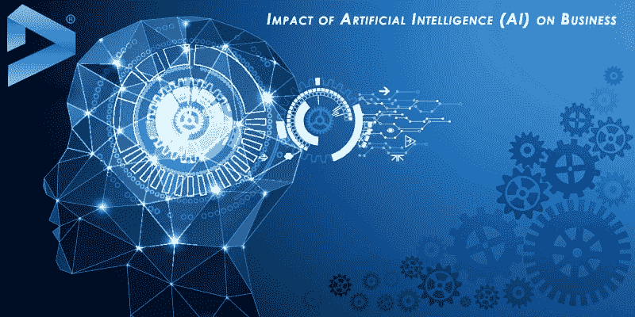

# 人工智能对商业的影响

> 原文：<https://dev.to/decipherzonesoft/the-impact-of-artificial-intelligence-on-business-1lpk>

商业中的人工智能。人工智能对商业的影响。进步的人工智能(AI)方法正在改善从车间到客户入口的商业形式。利用人工智能进一步增强其最大的好运，它可能会改变业务的每个部分:从商店网络和协调到人力资源，甚至到客户服务和过去的展示。

点击此处阅读全文:[https://www . decipherzone . com/blog-detail/The-Impact-of-Artificial-Intelligence-AI-on-Business](https://www.decipherzone.com/blog-detail/The-Impact-of-Artificial-Intelligence--AI--on-Business)

无论如何，这种潜力经常伴随着弯路，而弯路可能会避免对拟议优势的全面认可。在没有首先规划出这些可以想象的障碍的情况下实现 AI 安排的组织可能没有以最理想的方式指定他们的资产。